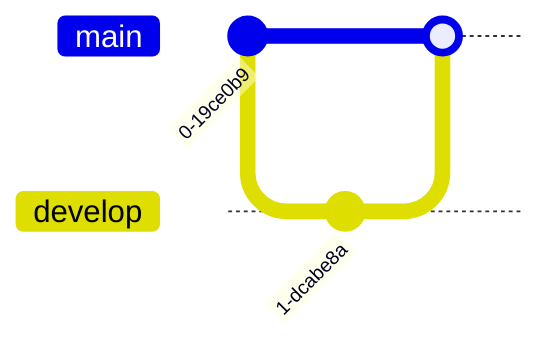

# 📊 文章優化進度追蹤

> 最後更新：2025年12月25日
> 
> 目標：優化技術文章，讓內容更友善、更適合自學者

## 📋 優化標準

每篇文章應包含：
- ✅ **開頭摘要（TL;DR）**：快速了解文章內容
- ✅ **前置知識**：列出需要先了解的概念
- ✅ **主要內容**：清晰的結構與說明
- ✅ **程式碼範例**：實際可執行的程式碼
- ✅ **視覺化元素**：Mermaid 圖表、流程圖
- ✅ **練習題**：2個簡單 + 1個中等（使用 `:::details` 折疊答案）
- ✅ **延伸閱讀**：相關文章連結
- ✅ **常見問題 FAQ**：解答常見疑惑
- ✅ **SEO meta 標籤**：完整的 meta description
- ✅ **文字風格**：語氣輕鬆幽默，避免過於嚴肅，讓技術內容更容易親近
- ✅ **Emoji**：可以使用，但只能是為了讓讀者更容易理解，不可以在標題中使用

---

## 🎯 優先改進主題（共 57 篇）

### 1️⃣ CSS 主題（15 篇）

| 檔案                              | 狀態     | 優先級 | 主要問題               | 改進日期   |
| --------------------------------- | -------- | ------ | ---------------------- | ---------- |
| `css/cubic-bezier.md`             | � 完成   | 🔥 高   | 已補視覺化、實戰練習   | 2025-12-25 |
| `css/色碼.md`                     | ✅ 完成   | 🔥 高   | 已補轉換、視覺化、練習 | 2025-12-25 |
| `css/scroll-snap.md`              | 🔴 待改進 | ⭐ 中   | 缺少練習題             | -          |
| `css/clamp.md`                    | 🔴 待改進 | ⭐ 中   | 缺少視覺化範例         | -          |
| `css/選擇器2.md`                  | 🔴 待改進 | ⭐ 中   | 需要整合到選擇器.md    | -          |
| `css/basic/選擇器.md`             | 🔴 待改進 | ⭐ 中   | 缺少練習題             | -          |
| `css/basic/background.md`         | 🔴 待改進 | ⭐ 中   | 缺少視覺化             | -          |
| `css/basic/display.md`            | 🔴 待改進 | ⭐ 中   | 缺少 Flexbox/Grid 比較 | -          |
| `css/basic/grid.md`               | 🔴 待改進 | ⭐ 中   | 缺少練習題             | -          |
| `css/basic/position.md`           | 🔴 待改進 | ⭐ 中   | 缺少視覺化範例         | -          |
| `css/basic/rwd.md`                | 🔴 待改進 | ⭐ 中   | 缺少實際案例           | -          |
| `css/depth/animation-timeline.md` | 🔴 待改進 | ⭐ 中   | 缺少動畫示範           | -          |
| `css/depth/interpolate-size.md`   | 🔴 待改進 | ⭐ 中   | 缺少練習題             | -          |
| `css/depth/property.md`           | 🔴 待改進 | ⭐ 中   | 缺少實際應用           | -          |
| `css/depth/starting-style.md`     | 🔴 待改進 | ⭐ 中   | 缺少視覺化             | -          |

**CSS 主題進度：2/15 (13%)**

---

### 2️⃣ JavaScript 主題（30 篇）

#### 基礎系列（5 篇）

| 檔案                                | 狀態     | 優先級 | 主要問題             | 改進日期 |
| ----------------------------------- | -------- | ------ | -------------------- | -------- |
| `javascript/basic/asynchronous.md`  | 🟡 需補充 | ⭐ 中   | 缺少錯誤處理、練習題 | -        |
| `javascript/basic/axios.md`         | 🔴 待改進 | ⭐ 中   | 缺少練習題           | -        |
| `javascript/basic/export-import.md` | 🔴 待改進 | ⭐ 中   | 缺少視覺化           | -        |
| `javascript/basic/fetch.md`         | 🔴 待改進 | ⭐ 中   | 缺少錯誤處理說明     | -        |
| `javascript/basic/http-request.md`  | 🔴 待改進 | ⭐ 中   | 缺少實際範例         | -        |

#### 進階系列（8 篇）

| 檔案                                                      | 狀態     | 優先級 | 主要問題               | 改進日期   |
| --------------------------------------------------------- | -------- | ------ | ---------------------- | ---------- |
| `javascript/advanced/currying-guide.md`                   | 🟢 良好   | 低     | 可增加練習題           | -          |
| `javascript/advanced/functional-programming-intro.md`     | 🔴 待改進 | ⭐ 中   | 缺少練習題             | -          |
| `javascript/advanced/functor-guide.md`                    | 🔴 待改進 | ⭐ 中   | 缺少視覺化             | -          |
| `javascript/advanced/monad-guide.md`                      | 🔴 待改進 | ⭐ 中   | 缺少實際應用           | -          |
| `javascript/advanced/OOP.md`                              | 🔴 待改進 | ⭐ 中   | 缺少 UML 類別圖        | -          |
| `javascript/advanced/regex.md`                            | ✅ 完成   | 🔥 高   | 已補語法表、實戰、練習 | 2025-12-25 |
| `javascript/advanced/node-fs.md`                          | 🔴 待改進 | ⭐ 中   | 缺少實際案例           | -          |
| `javascript/advanced/函數式程式設計文檔系列（第五篇）.md` | 🔴 待改進 | 低     | 需要系列整合           | -          |

#### Functions 系列（8 篇）

| 檔案                                      | 狀態     | 優先級 | 主要問題               | 改進日期   |
| ----------------------------------------- | -------- | ------ | ---------------------- | ---------- |
| `javascript/functions/call-apply-bind.md` | ✅ 完成   | 🔥 高   | 已補對照表、實戰、練習 | 2025-12-25 |
| `javascript/functions/Object.assign.md`   | 🔴 待改進 | ⭐ 中   | 缺少深拷貝說明         | -          |
| `javascript/functions/Object.entries.md`  | 🔴 待改進 | ⭐ 中   | 缺少練習題             | -          |
| `javascript/functions/Object.groupBy.md`  | 🔴 待改進 | ⭐ 中   | 缺少實際應用           | -          |
| `javascript/functions/...`                | 🔴 待改進 | ⭐ 中   | 待掃描                 | -          |

#### 網頁操作系列（10 篇）

| 檔案                                          | 狀態     | 優先級 | 主要問題           | 改進日期   |
| --------------------------------------------- | -------- | ------ | ------------------ | ---------- |
| `javascript/網頁操作/終極密碼.md`             | ✅ 完成   | 🔥 高   | 已補流程與練習     | 2025-12-25 |
| `javascript/網頁操作/簡易計數器.md`           | ✅ 完成   | 🔥 高   | 已補完整實作、練習 | 2025-12-25 |
| `javascript/網頁操作/TodoList.md`             | 🔴 待改進 | ⭐ 中   | 缺少進階功能說明   | -          |
| `javascript/網頁操作/購物車.md`               | 🔴 待改進 | ⭐ 中   | 缺少狀態管理說明   | -          |
| `javascript/網頁操作/傳統時鐘製作指南.md`     | 🔴 待改進 | ⭐ 中   | 缺少練習題         | -          |
| `javascript/網頁操作/彈跳視窗.md`             | 🔴 待改進 | ⭐ 中   | 缺少實際應用       | -          |
| `javascript/網頁操作/service-worker-basic.md` | 🔴 待改進 | ⭐ 中   | 缺少 PWA 完整說明  | -          |
| `javascript/網頁操作/web-components-1.md`     | 🔴 待改進 | ⭐ 中   | 缺少練習題         | -          |
| `javascript/網頁操作/web-components-2.md`     | 🔴 待改進 | ⭐ 中   | 需要與第一篇整合   | -          |

**JavaScript 主題進度：4/30 (13%)**

---

### 3️⃣ Git 主題（12 篇）

| 檔案                    | 狀態   | 優先級 | 主要問題                    | 改進日期   |
| ----------------------- | ------ | ------ | --------------------------- | ---------- |
| `git/git-commit.md`     | � 完成 | 🔥 高   | 已補流程、訊息格式          | 2025-12-25 |
| `git/git-branch.md`     | � 完成 | 🔥 高   | 已補分支圖、merge/rebase    | 2025-12-25 |
| `git/git-push.md`       | � 完成 | 🔥 高   | 已補遠端設定、fetch對比     | 2025-12-25 |
| `git/git-clone.md`      | ✅ 完成 | ⭐ 中   | 已補 SSH vs HTTPS、淺層克隆 | 2025-12-25 |
| `git/git-staging.md`    | ✅ 完成 | ⭐ 中   | 已補工作流程圖、stash       | 2025-12-25 |
| `git/git-diff.md`       | ✅ 完成 | ⭐ 中   | 已補視覺化、進階選項        | 2025-12-25 |
| `git/git-log.md`        | ✅ 完成 | ⭐ 中   | 已補進階用法、格式化        | 2025-12-25 |
| `git/git-revert.md`     | � 完成 | 🔥 高   | 已補 reset 對照、決策樹     | 2025-12-25 |
| `git/git-tag.md`        | ✅ 完成 | ⭐ 中   | 已補版本管理、SemVer        | 2025-12-25 |
| `git/git-fork-after.md` | ✅ 完成 | ⭐ 中   | 已補完整流程、PR 指南       | 2025-12-25 |
| `git/初次下載git.md`    | ✅ 完成 | ⭐ 中   | 已補配置、SSH 設定          | 2025-12-25 |
| `git/電腦上移除git.md`  | ✅ 完成 | 低     | 已補各系統移除方法          | 2025-12-25 |

**Git 主題進度：12/12 (100%)** ✅

---

## 📈 整體進度

- **總計文章數**：57 篇
- **已完成**：18 篇 (32%)
- **進行中**：0 篇
- **待改進**：39 篇

### 進度統計

```
CSS:        ▰▰▱▱▱▱▱▱▱▱ 2/15 (13%)
JavaScript: ▰▰▱▱▱▱▱▱▱▱ 4/30 (13%)
Git:        ▰▰▰▰▰▰▰▰▰▰ 12/12 (100%) ✅
```

---

## 🔄 改進流程

每篇文章的改進步驟：

1. ✅ **閱讀原文** - 了解現有內容
2. ✅ **規劃結構** - 決定需要補充的區塊
3. ✅ **補充內容** - 增加說明、範例
4. ✅ **製作視覺化** - 繪製 Mermaid 圖表
5. ✅ **設計練習題** - 2 個簡單 + 1 個中等
6. ✅ **增加延伸閱讀** - 連結相關文章
7. ✅ **檢查 SEO** - 確認 meta 標籤
8. ✅ **標記完成** - 更新此追蹤檔案

---

## 📝 改進記錄

### 2025年12月25日

#### 第一階段：建立系統與高優先級（10 篇）
- 📋 建立進度追蹤系統
- 📄 建立文章優化模板
- 🎯 確定優先改進的 57 篇文章
- ✅ 完成 css/cubic-bezier.md（補視覺化、練習題）
- ✅ 完成 css/色碼.md（補轉換方法、視覺化、練習）
- ✅ 完成 javascript/網頁操作/終極密碼.md（補流程、程式碼、練習）
- ✅ 完成 javascript/網頁操作/簡易計數器.md（補完整實作、練習）
- ✅ 完成 javascript/advanced/regex.md（補語法表、實戰案例、練習）
- ✅ 完成 javascript/functions/call-apply-bind.md（補對照表、實戰、練習）
- ✅ 完成 git/git-commit.md（補流程、訊息格式、練習）
- ✅ 完成 git/git-branch.md（補分支圖、merge/rebase、cherry-pick）
- ✅ 完成 git/git-push.md（補遠端設定、fetch對比、強制推送）
- ✅ 完成 git/git-revert.md（補 reset 對照、決策樹、批量回退）

#### 第二階段：Git 主題完整化（8 篇）
- ✅ 完成 git/git-clone.md（補 SSH vs HTTPS、淺層克隆、練習）
- ✅ 完成 git/git-staging.md（補工作流程圖、stash、練習）
- ✅ 完成 git/git-diff.md（補視覺化、進階選項、練習）
- ✅ 完成 git/git-log.md（補進階用法、格式化、練習）
- ✅ 完成 git/git-tag.md（補版本管理、SemVer、練習）
- ✅ 完成 git/git-fork-after.md（補完整流程、PR 指南、練習）
- ✅ 完成 git/初次下載git.md（補配置、SSH 設定、練習）
- ✅ 完成 git/電腦上移除git.md（補各系統移除方法、練習）

🎉 **Git 主題 100% 完成！**

---

## 🎨 視覺化素材庫

### Mermaid 圖表範例

#### Git 分支流程圖


#### 非同步執行流程


#### 選擇器優先級


---

## 💡 改進建議範本

### 練習題模板

```markdown
## 🎯 實戰練習

### 練習 1：基礎應用（簡單）⭐
> 請完成...

:::details 💡 參考答案
\`\`\`javascript
// 答案程式碼
\`\`\`
:::

### 練習 2：概念驗證（簡單）⭐
> 請說明...

:::details 💡 參考答案
答案說明...
:::

### 練習 3：綜合應用（中等）⭐⭐
> 請設計...

:::details 💡 參考答案與提示
**提示：**
1. 先思考...
2. 再考慮...

**參考答案：**
\`\`\`javascript
// 答案程式碼
\`\`\`
:::
```

### 延伸閱讀模板

```markdown
## 📚 延伸閱讀

### 相關文章
- [文章標題](路徑) - 簡短說明

### 推薦資源
- [MDN: 標題](網址) - 官方文件
- [文章標題](網址) - 深入解析

### 下一步學習
- 學習完本文後，建議閱讀 [進階主題](路徑)
```

---

## ✅ 完成檢查清單

每篇文章改進完成後，請確認：

- [ ] 有開頭摘要（TL;DR）
- [ ] 有前置知識區塊
- [ ] 主要內容結構清晰
- [ ] 至少有 1 個程式碼範例
- [ ] 有視覺化元素（Mermaid 圖表）
- [ ] 有 2 個簡單練習題
- [ ] 有 1 個中等練習題
- [ ] 練習題有答案（使用 :::details）
- [ ] 有延伸閱讀區塊
- [ ] 有常見問題 FAQ
- [ ] 有完整的 SEO meta 標籤
- [ ] 術語有解釋或註解
- [ ] 更新此追蹤檔案的狀態

---

## 📊 品質評分標準

每篇文章評分（滿分 10 分）：

| 項目       | 分數 |
| ---------- | ---- |
| 內容完整性 | 2 分 |
| 視覺化元素 | 2 分 |
| 練習題品質 | 2 分 |
| 延伸閱讀   | 1 分 |
| SEO 優化   | 1 分 |
| 友善度     | 2 分 |

**目標：每篇文章至少達到 8 分**
