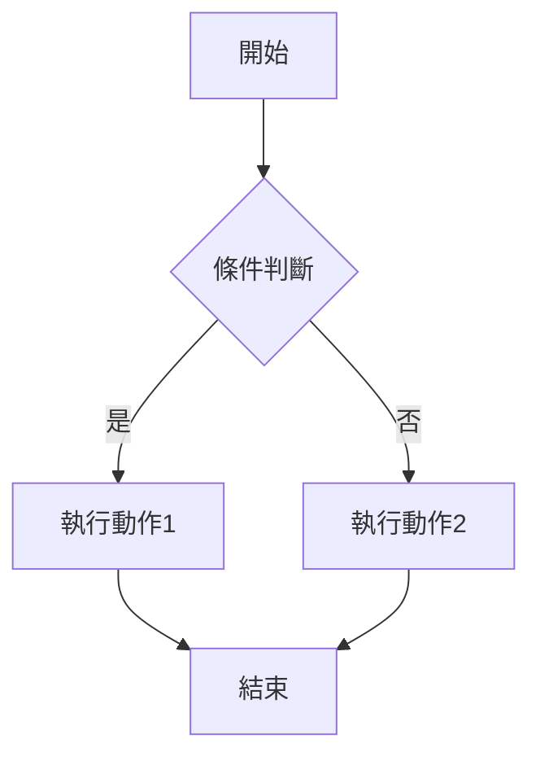
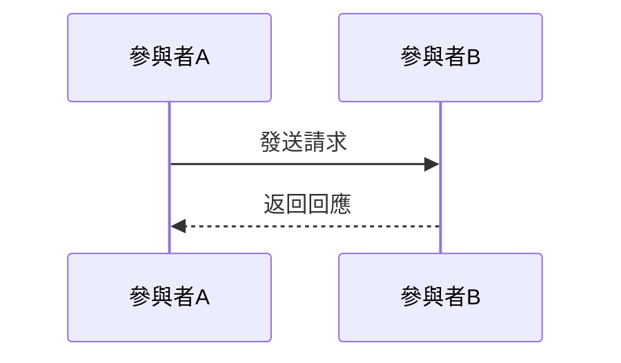

# 文章標題

> 📝 TL;DR 用 2-3 句話總結這篇文章的核心內容，讓讀者快速了解能學到什麼。

## 前置知識

在開始之前，建議你先了解以下概念：

- **知識點 1** - [相關文章連結](路徑) 或簡短說明
- **知識點 2** - [相關文章連結](路徑) 或簡短說明
- **知識點 3** - [相關文章連結](路徑) 或簡短說明

---

## 什麼是 XXX？

### 為什麼需要學習它？

用生活化的比喻或實際情境說明：
- 解決什麼問題？
- 有什麼優勢？
- 什麼時候會用到？

### 核心概念

清楚地解釋核心概念，使用簡單易懂的語言。

:::warning ⚠️ 注意
提醒重要的注意事項或常見錯誤。
:::

---

## 💻 基本語法

### 語法結構

```javascript
// 基本語法範例
// 包含清楚的註解說明每一行的作用
```

### 參數說明

| 參數名稱 | 型別   | 說明     | 預設值 |
| -------- | ------ | -------- | ------ |
| param1   | string | 參數說明 | -      |
| param2   | number | 參數說明 | 0      |

---

## 實際範例

### 範例 1：基礎應用

**情境說明：** 描述這個範例要解決什麼問題。

```javascript
// 完整的程式碼範例
// 確保程式碼可以直接執行

// 輸出結果：
// 預期的輸出或結果
```

**程式碼說明：**
1. 第一步做什麼
2. 第二步做什麼
3. 最後達成什麼效果

### 範例 2：進階應用

**情境說明：** 描述更複雜的使用情境。

```javascript
// 進階範例程式碼
```

---

## 視覺化說明

### 流程圖

使用 Mermaid 繪製流程圖或架構圖：



### 概念圖解



:::tip 視覺化工具
你可以使用 [工具名稱](網址) 來練習或產生類似的圖表。
:::

---

## 實戰練習

### 練習 1：基礎應用（簡單）⭐

**任務：** 請完成以下需求...

**提示：**
- 提示 1
- 提示 2

:::details 參考答案
```javascript
// 答案程式碼
// 包含註解說明

// 輸出結果：
// 預期結果
```

**說明：**
解釋答案的實作邏輯和關鍵點。
:::

### 練習 2：概念驗證（簡單）⭐

**任務：** 請說明或解釋...

**思考方向：**
- 從哪個角度思考
- 需要考慮什麼因素

:::details 參考答案
詳細的答案說明，包含：
1. 重點 1
2. 重點 2
3. 總結
:::

### 練習 3：綜合應用（中等）⭐⭐

**任務：** 請設計並實作...

**需求：**
1. 需求 1
2. 需求 2
3. 需求 3

**提示：**
- 先思考整體架構
- 再逐步實作功能
- 注意邊界條件處理

:::details 參考答案與解題思路

**解題思路：**
1. 分析問題：先確定...
2. 規劃步驟：分為幾個部分...
3. 實作細節：注意...

**參考程式碼：**
```javascript
// 完整的解答程式碼
// 包含註解和錯誤處理

// 測試範例：
// 測試程式碼
```

**延伸思考：**
- 如何優化效能？
- 還有其他實作方式嗎？
- 在實際專案中如何應用？
:::

---

## 常見問題 FAQ

### Q1: 問題 1？

**A:** 詳細的回答...

### Q2: 問題 2？

**A:** 詳細的回答...

### Q3: 與 XXX 的差別是什麼？

**A:** 比較說明...

| 項目  | XXX  | YYY  |
| ----- | ---- | ---- |
| 特點1 | 說明 | 說明 |
| 特點2 | 說明 | 說明 |

---

## 最佳實踐

### ✅ 推薦做法

1. **做法 1** - 說明為什麼推薦
2. **做法 2** - 說明好處

### ❌ 常見錯誤

1. **錯誤 1** - 說明為什麼不好
2. **錯誤 2** - 如何避免

---

## 延伸閱讀

### 相關文章

本站相關主題：
- [文章標題 1](路徑) - 簡短說明
- [文章標題 2](路徑) - 簡短說明
- [文章標題 3](路徑) - 簡短說明

### 推薦資源

外部優質資源：
- [MDN: 主題名稱](網址) - 官方文件，適合查閱詳細規格
- [文章標題](網址) - 深入解析，適合進階學習
- [教學影片](網址) - 視覺化學習

### 下一步學習

- 如果你想深入了解 XXX，建議閱讀 [進階主題](路徑)
- 想要實際應用？試試 [實作專案](路徑)
- 準備好挑戰了嗎？看看 [進階技巧](路徑)

---

## 總結

用 3-5 個重點總結這篇文章：

1. **重點 1** - 核心概念
2. **重點 2** - 關鍵技巧
3. **重點 3** - 實際應用
4. **重點 4** - 注意事項