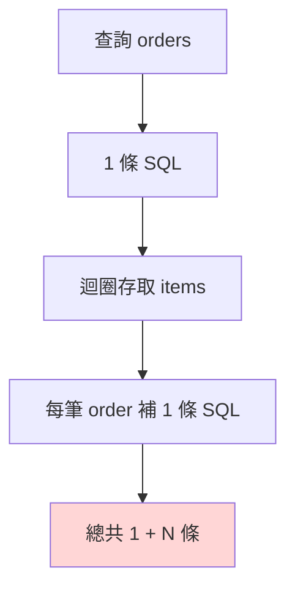
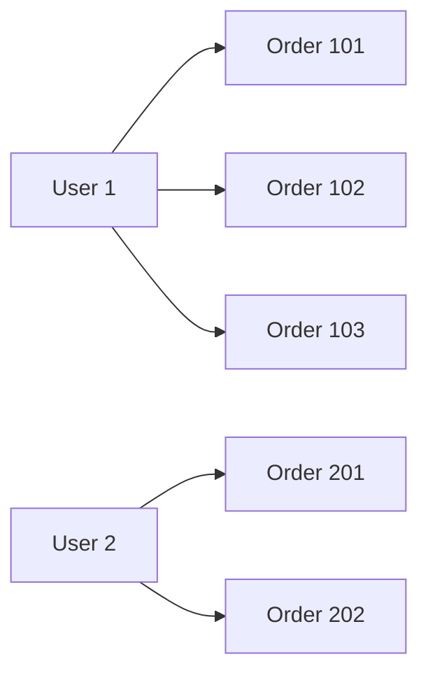

# Spring Boot 分頁與 N+1 問題

> 📝 TL;DR：`Pageable` 很好用，但你一邊 `JOIN FETCH` 一邊分頁，很可能直接踩進 Hibernate 記憶體分頁陷阱。實務上先全 Lazy，再依場景選 `batch_fetch_size`、`EntityGraph`、兩段式查詢，才比較穩。

## 這篇你會學到

這篇重點不是教你把 `Pageable` 背起來，是要讓你知道它什麼時候會背刺你。

1. 分頁查詢在 Spring Data JPA 怎麼進來、怎麼回去。
2. N+1 為什麼會讓查詢次數爆掉。
3. 為什麼 `JOIN FETCH + Pageable` 在 `OneToMany` 場景很危險。
4. `batch_fetch_size` 和兩段式查詢怎麼選。

## 前置知識

先懂這些，你讀起來會比較順：

- [`Lazy vs Eager 載入策略`](/backend/spring-boot/lazy)
- [`@Transactional 事務管理`](/backend/spring-boot/transactional)
- 知道 `@OneToMany`、`@ManyToOne` 是什麼

## 簡報版本

原本這篇內容是從教學簡報整理出來的，你如果想留原始投影片，直接下載 PDF 就好。

<a href="/LucasHsu.dev/slides/spring-boot-performance-slides.pdf" download="spring-boot-performance-slides.pdf">
  下載 Spring Boot 效能優化簡報 PDF
</a>

## 先講 N+1，不然後面都空談

ORM 很方便，這句沒錯。但 ORM 最大的問題就是太方便，方便到你以為自己只查一次，結果 SQL 噴了十幾次。

假設有 `Order` 跟 `Item`：

```java
@Entity
public class Order {

    @Id
    private Long id;

    @OneToMany(mappedBy = "order", fetch = FetchType.LAZY)
    private List<Item> items;
}
```

你查十筆訂單：

```java
List<Order> orders = orderRepository.findAll();
```

然後在迴圈裡碰 `order.getItems()`。恭喜，第一條 SQL 查訂單，後面每一筆再補一次 items。這就是 N+1。



## Eager 不是萬靈丹

很多人第一反應是：那我全改 Eager 不就好了？

不，這很常只是把問題換一種姿勢重演。

- `@ManyToOne`、`@OneToOne` 預設就是 Eager。
- Eager 可能把根本用不到的關聯一起撈進來。
- 查多筆主體時，還是可能出現額外查詢。

所以比較穩的做法通常還是：

1. 關聯預設明確設成 `FetchType.LAZY`
2. 真需要時再決定抓法

## 分頁查詢到底在幹嘛

分頁本質很單純：不要一次把全部資料抓回來。

Spring Data JPA 常見寫法：

```java
@GetMapping("/orders")
public Page<Order> getOrders(
    @PageableDefault(size = 10, sort = "createdAt") Pageable pageable
) {
    return orderRepository.findAll(pageable);
}
```

前端通常會打這種參數：

```text
/api/orders?page=0&size=10&sort=createdAt,desc
```

回傳的 `Page<T>` 會帶這些欄位：

```json
{
  "content": [],
  "totalPages": 5,
  "totalElements": 48,
  "size": 10,
  "number": 0
}
```

這很舒服，對吧。問題通常不是出在 `Pageable` 本身，是你後面怎麼抓關聯。

## 最容易踩雷的地方：JOIN FETCH + Pageable

如果你在 `OneToMany` 關聯上這樣寫：

```java
@Query("""
    select o
    from Order o
    left join fetch o.items
""")
Page<Order> findAllWithItems(Pageable pageable);
```

Hibernate 很可能直接噴這類警告：

```text
HHH000104: firstResult/maxResults specified with collection fetch; applying in memory!
```

這句翻白話就是：

- 你以為在資料庫分頁。
- 實際上 Hibernate 先把一大包資料抓回來。
- 再在 Java 記憶體裡自己切前 10 筆。

這就很尷尬。你開分頁本來是為了省資源，結果它先幫你全抓，再假裝有分頁。and then what? JVM 開始喘。

## 為什麼會這樣

因為 `OneToMany JOIN` 之後，SQL 的列數會膨脹。

一個使用者有 3 筆訂單，JOIN 後不是 1 列，是 3 列。

```sql
SELECT u.id, u.name, o.id, o.amount
FROM users u
LEFT JOIN orders o ON u.id = o.user_id
LIMIT 5;
```

看起來 `LIMIT 5` 很合理，但那 5 列可能只代表 2 個 user。你在資料庫層切的是列，不是完整實體。



所以 Hibernate 很難直接在 SQL 層保證「完整主體的正確分頁」，只好退回記憶體處理。

## 解法 A：`batch_fetch_size`

這招很務實。不要直接 `JOIN FETCH` 集合關聯，先讓主查詢正常分頁，再讓 Hibernate 批次補抓關聯。

### 設定方式

```yaml
spring:
  jpa:
    properties:
      hibernate:
        default_batch_fetch_size: 100
```

Repository 反而保持單純：

```java
Page<Order> findAll(Pageable pageable);
```

### 實際效果

常見會變成兩段 SQL：

1. 先查當頁的 orders
2. 再用 `IN (...)` 一次補查這頁 orders 的 items

```sql
SELECT * FROM orders ORDER BY created_at DESC LIMIT 10 OFFSET 0;
SELECT * FROM items WHERE order_id IN (?, ?, ?, ?, ?, ?, ?, ?, ?, ?);
```

### 什麼時候適合

- 你要保住資料庫分頁。
- 你不想自己拆兩段查詢。
- 關聯資料要抓，但不需要超細緻控制。

## 解法 B：兩段式查詢

如果你對 SQL 乾淨度、可控性、效能更要求一點，兩段式查詢很常是更穩的做法。

### 核心流程

先查 ID，再用這批 ID 查完整資料。

```java
Page<Long> idPage = orderRepository.findPageIds(pageable);
List<Order> orders = orderRepository.findAllWithItemsByIdIn(idPage.getContent());

return new PageImpl<>(
    orders.stream().map(OrderDto::from).toList(),
    pageable,
    idPage.getTotalElements()
);
```

### Repository 寫法

```java
@Query("""
    select o.id
    from Order o
""")
Page<Long> findPageIds(Pageable pageable);

@Query("""
    select distinct o
    from Order o
    left join fetch o.items
    where o.id in :ids
""")
List<Order> findAllWithItemsByIdIn(@Param("ids") List<Long> ids);
```

### 這招的好處

- 資料庫分頁是準的。
- 關聯抓取是準的。
- 你知道每一步在幹嘛，不用猜 Hibernate 心情。

缺點也很明顯：程式碼比較多。但如果是高流量列表頁，這點複雜度通常值得。

## `EntityGraph` 什麼時候用

`@EntityGraph` 適合你想用比較宣告式的方式指定抓哪些關聯，但沒有複雜到要自己手拆兩段查詢的情況。

```java
@EntityGraph(attributePaths = {"member"})
Page<Order> findByStatus(OrderStatus status, Pageable pageable);
```

不過先講清楚，`EntityGraph` 不是魔法。它能改善可讀性，但碰到 `OneToMany + 分頁` 的根本限制，還是要回到上面那兩招思考。

## 實戰練習

來三題，檢查一下你有沒有真的懂。

### 練習 1：哪個最像 N+1（簡單）⭐

**任務：** 判斷哪個情境最符合 N+1。

- A. 查一次主表，再對每筆結果各補一次關聯查詢
- B. 查一次主表加一次 `IN` 查詢補資料
- C. 用 `Pageable` 查 20 筆資料

:::details 參考答案
答案是 **A**。

因為它就是經典的 1 次主查詢，加上每筆各 1 次額外查詢。
:::

### 練習 2：哪個最可能噴 HHH000104（簡單）⭐

**任務：** 下面哪一種寫法最容易踩 Hibernate 記憶體分頁警告？

- A. `Page<Order> findAll(Pageable pageable)`
- B. `Page<Order> findByStatus(Status status, Pageable pageable)`
- C. `Page<Order> findAllWithItems(Pageable pageable)` 並且 `left join fetch o.items`

:::details 參考答案
答案是 **C**。

集合關聯 `fetch join` 再配分頁，是最常見的雷點。
:::

### 練習 3：你會怎麼選（中等）⭐⭐

**任務：** 訂單列表頁每頁 20 筆，要顯示每筆訂單的商品摘要，資料量大、流量高。你會先選哪種策略？

**提示：**

- 你要保住真正的資料庫分頁。
- 又不想 N+1。

:::details 參考答案
優先考慮：

1. `batch_fetch_size`
2. 兩段式查詢

如果頁面結構固定、流量又高，兩段式通常最穩。若想先用較少程式碼換到不錯的效果，先試 `batch_fetch_size` 也很合理。
:::

## FAQ

這幾題很常出現在 review 或面試。

### Q: 把全部關聯改成 Eager 可以嗎？

A: 不建議。你只是把查詢成本往前搬，還可能把記憶體和 SQL 壓力一起拉高。

### Q: `JOIN FETCH` 就一定比 `batch_fetch_size` 好嗎？

A: 不一定。單筆詳情頁很常適合 `JOIN FETCH`，但大列表分頁頁面，`batch_fetch_size` 或兩段式查詢通常更穩。

### Q: 我怎麼知道自己有沒有 N+1？

A: 開 SQL log。不要猜。你不看 log，就只是感覺自己很懂而已。

## 延伸閱讀

這幾篇可以一起看：

- [Lazy vs Eager 載入策略](/backend/spring-boot/lazy)
- [@Transactional 事務管理](/backend/spring-boot/transactional)
- [JPA 持久化上下文](/backend/spring-boot/persistence-context)
