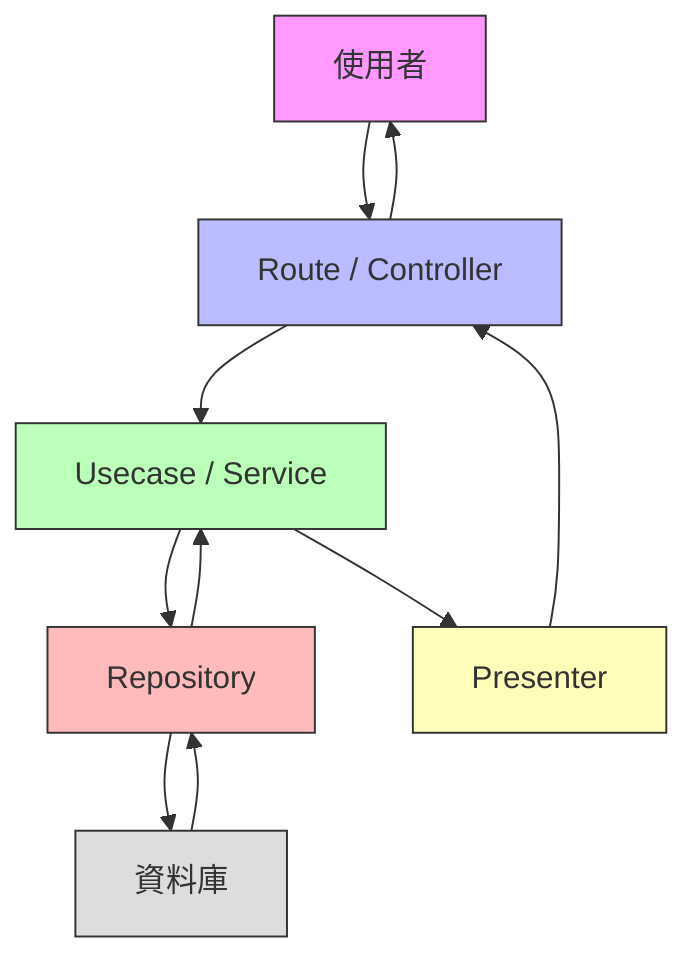

## 什麼是 Clean Architecture？

你有沒有看過那張超經典的圓圈圖？外圈是 UI，中間是 Use Case，最裡面是 Entity，然後箭頭都往內指？

別被唬了。Clean Architecture 不是什麼神學，它只是一個簡單的規則：**資料流只能往內，不能往外**。

想像你是一個餐廳的服務生（Controller）。客人（使用者）點餐（請求），你把訂單傳給廚房（Usecase）。廚房不認識客人，也不會直接去菜市場（資料庫）買菜。他們只會喊：「幫我拿雞蛋！」→ 廚房的倉管（Repository）去拿。拿回來後，廚房做菜（商業邏輯），做好了交給你（Presenter），你再端給客人。

重點是：**廚房不知道菜市場在哪**。你也不知道雞蛋是怎麼來的。大家只管自己的事。

這就是 Clean Architecture：**分層，但不互相認識**。你只跟上一層說話，下層的細節？關你屁事。:D

## 為什麼需要它？

你有沒有寫過這種程式？

```typescript
// 糟糕的寫法：UI 直接連資料庫
app.get('/users', (req, res) => {
  const users = db.query('SELECT * FROM users WHERE active = true');
  res.json(users.map(u => ({
    name: u.name,
    email: u.email,
    createdAt: u.created_at.format('YYYY-MM-DD')
  })));
});
```

然後老闆說：「我們要換成 GraphQL！」→ 你崩潰了。因為你把 UI、資料庫、格式轉換全黏在一起了！

或者：「我們要加個快取！」→ 你得改 10 個地方。

Clean Architecture 就是為了**不讓你崩潰**。當你把商業邏輯（Usecase）和資料存取（Repository）分開，你就能：

- 換資料庫？只改 Repository。
- 換 API 格式？只改 Presenter。
- 換前端框架？只改 Controller。

**你改的是「怎麼做」，不是「做什麼」**。商業邏輯永遠不動。OuO

## 各層職責（用人話）

### Route / Controller：接收請求

你就是門口的接待員。客人來了，你問：「要什麼？」

- 拿到 HTTP 請求（GET /users?id=123）
- 把參數轉成程式能用的格式（把字串轉成數字）
- 呼叫 Usecase，說：「幫我拿使用者資料」
- 把 Usecase 回來的東西，丟給 Presenter

**你不能寫商業邏輯！** 你只負責「傳話」。不然你跟那個寫死 SQL 的 Controller 有什麼不同？

### Usecase / Service：商業邏輯

你就是廚房的主廚。客人要「紅燒雞腿」，你決定：

- 雞腿要先醃多久？
- 火候怎麼控制？
- 要加多少醬油？

這就是商業邏輯！

- 不知道資料庫長怎樣
- 不知道前端要 JSON 還是 XML
- 只知道：「我要使用者資料」→ 呼叫 Repository

**這層是你的核心資產**。就算你換掉整個前端，這層還能用！

### Repository：資料存取

你就是倉管。主廚喊：「幫我拿雞蛋！」

你不管雞蛋是從哪來的（MySQL？MongoDB？還是從 API 拿的？），你只負責：

- `getUser(id)` → 回傳 `User` 物件
- `saveUser(user)` → 把資料存進去

**你只負責「拿」和「放」**。怎麼存？那是你的事，主廚不關心。

### Presenter：輸出格式轉換

你就是打包員。主廚做好菜，你決定：

- 這道菜要裝在「JSON 盒子」裡？
- 還是「XML 盒子」？
- 還是「HTML 餐盤」？

你把 Usecase 回來的 `User` 物件，轉成前端要的格式：

```typescript
// Presenter
const userPresenter = (user) => ({
  id: user.id,
  name: user.name,
  email: user.email,
  created_at: user.createdAt.toISOString() // 轉成標準格式
});
```

**你只管「怎麼呈現」**。不關心資料從哪來，也不關心商業邏輯。

## 請求流程圖（Mermaid）



箭頭方向很重要！**資料只能往內流**。UI → Usecase → Repository → DB。回傳時，DB → Repository → Usecase → Presenter → UI。**永遠不反向**。

## Next.js + watchpack_pool 小技巧

你有沒有發現，用 `yarn dev` 開發時，改了 `usecase` 檔案，瀏覽器卻沒自動重新整理？

**因為 Next.js 的 watchpack 預設只監聽 UI 層**！

解決方法超簡單：

```bash
# 原來這樣（會卡住）
yarn dev

# 改成這樣（自動重載！）
NODE_OPTIONS="--max-old-space-size=4096" watchpack_pool=1 yarn dev
```

`watchpack_pool=1` 會強制 Next.js 監聽所有檔案，不只是 `pages/` 和 `components/`。這樣你改 `usecase/UserService.ts`，瀏覽器就會自動刷新！

不然你每次改商業邏輯都要手動重啟？XD 你當自己是 2005 年的 Java 開發者嗎？

## 實作範例（TypeScript）

假設我們要做「取得使用者」的功能。

### 1. Entity（最內層）

```typescript
// types/User.ts
export interface User {
  id: number;
  name: string;
  email: string;
  createdAt: Date;
}
```

### 2. Repository（資料存取）

```typescript
// repositories/UserRepository.ts
import { User } from '../types/User';

export interface UserRepository {
  getUser(id: number): Promise<User | null>;
}

// 實作：用 MySQL
export class MySQLUserRepository implements UserRepository {
  async getUser(id: number): Promise<User | null> {
    // 這裡寫 SQL 查詢，但 Usecase 完全不知道！
    const result = await db.query('SELECT * FROM users WHERE id = ?', [id]);
    return result.length > 0 ? result[0] : null;
  }
}
```

### 3. Usecase（商業邏輯）

```typescript
// usecases/GetUserUseCase.ts
import { User } from '../types/User';
import { UserRepository } from '../repositories/UserRepository';

export class GetUserUseCase {
  constructor(private userRepository: UserRepository) {}

  async execute(id: number): Promise<User | null> {
    // 商業邏輯：使用者必須是活躍的
    const user = await this.userRepository.getUser(id);
    if (!user) return null;
    
    // 這才是真正的商業邏輯！
    if (user.createdAt < new Date(Date.now() - 30 * 24 * 60 * 60 * 1000)) {
      return null; // 超過 30 天沒登入，視為無效
    }
    
    return user;
  }
}
```

### 4. Presenter（輸出格式）

```typescript
// presenters/UserPresenter.ts
import { User } from '../types/User';

export class UserPresenter {
  static toResponse(user: User | null) {
    if (!user) return { error: 'User not found' };
    
    return {
      id: user.id,
      name: user.name,
      email: user.email,
      created_at: user.createdAt.toISOString()
    };
  }
}
```

### 5. Controller（接收請求）

```typescript
// controllers/UserController.ts
import { Request, Response } from 'express';
import { GetUserUseCase } from '../usecases/GetUserUseCase';
import { UserPresenter } from '../presenters/UserPresenter';

export class UserController {
  constructor(private getUserUseCase: GetUserUseCase) {}

  async getUser(req: Request, res: Response) {
    const id = parseInt(req.params.id);
    
    if (isNaN(id)) {
      return res.status(400).json({ error: 'Invalid ID' });
    }
    
    const user = await this.getUserUseCase.execute(id);
    const response = UserPresenter.toResponse(user);
    
    res.json(response);
  }
}
```

### 6. Route（入口）

```typescript
// routes/user.ts
import { Router } from 'express';
import { UserController } from '../controllers/UserController';
import { MySQLUserRepository } from '../repositories/UserRepository';
import { GetUserUseCase } from '../usecases/GetUserUseCase';

const router = Router();

// 依賴注入：Controller 不知道 Repository 是什麼
const userRepository = new MySQLUserRepository();
const getUserUseCase = new GetUserUseCase(userRepository);
const userController = new UserController(getUserUseCase);

router.get('/users/:id', userController.getUser);

export default router;
```

**看到沒？** Controller 不知道資料庫是 MySQL 還是 MongoDB。Usecase 不知道前端要 JSON 還是 XML。**每層都只跟介面說話**。這就是 Clean Architecture 的魔力。:D

## Queue 和 Stack 跟 Clean Architecture 有什麼關係？

你可能覺得：「這跟 Queue/Stack 有什麼關係？」

**關係大了！**

Clean Architecture 的資料流，本質上就是一個 **Stack（堆疊）**。

- 你呼叫 `getUserUseCase.execute()` → 進到 Usecase
- Usecase 呼叫 `userRepository.getUser()` → 進到 Repository
- Repository 呼叫資料庫 → 進到 DB
- DB 回傳 → 回到 Repository → 回到 Usecase → 回到 Controller → 回到使用者

這就是 **LIFO（後進先出）**！

每層都像一個函式呼叫，一層一層壓進堆疊，然後一層一層彈出來。

**Queue（佇列）** 則是用在「非同步處理」：

- 用戶註冊 → 發送歡迎郵件 → 放進 Queue
- 後台 Worker 從 Queue 取出，慢慢發

這樣你就不會卡住使用者的請求！

所以：

- **Clean Architecture = Stack（同步呼叫鏈）**
- **Event-Driven = Queue（非同步處理）**

兩者不衝突，反而可以一起用！OuO

## 實戰練習

:::details 練習 1：簡單 - 改成用 MongoDB

你現在的 `MySQLUserRepository` 是用 MySQL 寫的。現在老闆說：「我們要換成 MongoDB！」

**請問你要改哪些檔案？**

> 只改 `repositories/UserRepository.ts`，新增 `MongoDBUserRepository` 類別，並在 `routes/user.ts` 裡把 `new MySQLUserRepository()` 換成 `new MongoDBUserRepository()`。其他層完全不用動！

:::

:::details 練習 2：簡單 - 改成輸出 XML

現在前端說：「我們要改用 XML！」

**請問你要改哪些檔案？**

> 只改 `presenters/UserPresenter.ts`，把 `toResponse()` 改成回傳 XML 字串。其他層完全不用動！

:::

:::details 練習 3：中等 - 加快查詢速度

使用者抱怨：「查使用者好慢！」

你發現是因為每次都要查資料庫。你決定加快取（Cache）。

**請問你要怎麼做？**

> 1. 新增 `CacheUserRepository` 類別，實作 `UserRepository` 介面
> 2. 裡面包住 `MySQLUserRepository`
> 3. `getUser()` 先查快取，有就回傳，沒有才去查 DB，並存進快取
> 4. 在 `routes/user.ts` 裡，把 `new MySQLUserRepository()` 換成 `new CacheUserRepository(new MySQLUserRepository())`
> 
> **重點：你完全沒動 Usecase！** 這就是 Clean Architecture 的威力！

:::

## FAQ

**Q：這不就是 MVC 嗎？**

A：MVC 是「你」把資料庫、邏輯、畫面全黏在一起。Clean Architecture 是「你」把「做什麼」和「怎麼做」分開。MVC 是「全家福」，Clean Architecture 是「分家」。:D

**Q：寫這麼多檔案，不累嗎？**

A：你覺得寫 10 個檔案很累？還是改 100 個檔案時崩潰比較累？XD

**Q：我只寫個小工具，需要這樣嗎？**

A：你寫小工具，當然不用。但如果你寫的東西，**你希望它活過 2 年**？那就用。不然你明年就要重寫了。OuO

**Q：Repository 要寫介面嗎？還是直接用類別？**

A：**寫介面！** 你寫介面，是為了讓 Usecase 不知道你用 MySQL 還是 MongoDB。你寫類別，是為了讓你明天能換掉它。你現在偷懶，明天就要哭。:P

**Q：這套架構有沒有什麼缺點？**

A：有啊，**一開始寫起來很慢**。但你寫完一次，以後改起來超快。你現在省的 1 小時，未來會用 100 小時還。你選哪個？

## 總結

Clean Architecture 不是什麼高深學問。

它只是一個簡單的原則：**分層，但不互相認識**。

- UI 只跟 Controller 說話
- Controller 只跟 Usecase 說話
- Usecase 只跟 Repository 說話
- Repository 只跟資料庫說話

**資料流只能往內，不能往外**。

你改資料庫？只動 Repository。

你換前端？只動 Controller 和 Presenter。

你加快取？只包一層 Repository。

**商業邏輯永遠不動**。

這就是 Clean Architecture 的全部。

別再被那張圓圈圖唬了。**你只需要記住：你只跟上一層說話，下層的細節？關你屁事。** :D