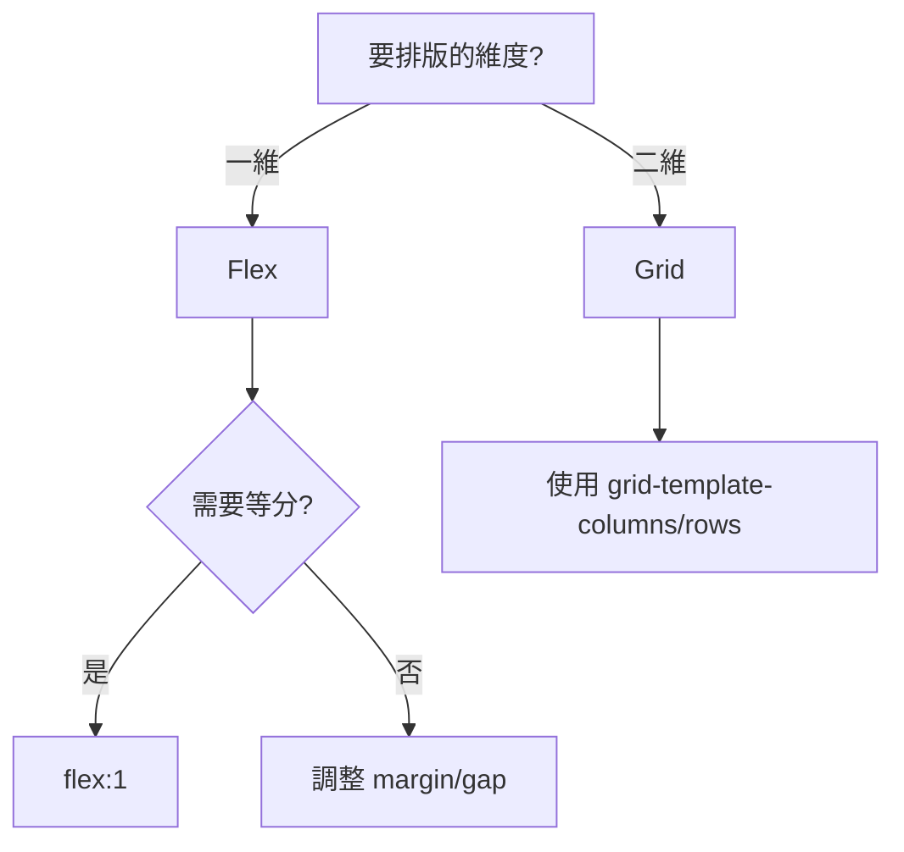

---
head:
  - - meta
    - name: keywords
      content: css,css diaply,css flex
  - - meta
    - name: author
      content: 許恩綸
  - - meta
    - name: description
      content: display 屬性總覽：block/inline/inline-block/none/flex/grid 差異、實例對照、練習題與 FAQ。
  - - meta
    - property: og:title
      content: Css Display 顯示
  - - meta
    - property: og:description
      content: display屬性用於控制HTML元素在網頁上的顯示方式。這個屬性有多個不同的值，每個值都決定了元素的顯示方式。以下是display屬性的一些常見值
  - - meta
    - property: og:type
      content: article
  - - meta
    - property: og:image
      content: https://lucashsu95.github.io/LucasHsu.dev/css/basic/grid
---

# Css Display 顯示

display屬性用於控制HTML元素在網頁上的顯示方式。這個屬性有多個不同的值，每個值都決定了元素的顯示方式。以下是display屬性的一些常見值：

## TL;DR

- `block` 佔滿一行；`inline` 不換行且無法設定寬高；`inline-block` 可並排又能設寬高。
- `flex` 擅長一維（橫/縱）排列；`grid` 擅長二維（列+欄）版面。
- `none` 隱藏且不占空間；需顯示/隱藏可考慮 `visibility` 或 `opacity` 差異。

## 前置知識

- 盒模型（margin/padding/border）對佔位的影響。
- 基礎排版：行內元素、區塊元素的預設行為。
- Flexbox / Grid 的核心概念與支援度。

## block

block是一個**區塊級元素**。
元素將在新的行上開始，佔據父元素的整個寬度，並總是在上下文中顯示為獨立的塊。
常見的block元素包括`<div>`、`<p>`、`<h1>`等。

### 區塊級元素

先介紹什麼是區塊級元素，下方是區塊級元素的特性

1. **佔據整行**：區塊元素會自動擴展至父元素的整個寬度，並在其上下會有空隙。
2. **可包含其他區塊或行內元素**：區塊元素可以包含其他區塊元素和行內元素。
3. **適用於大多數結構性內容**：例如，標題、段落、區段和其他內容整組。
4. **可以設置寬度和高度**：通過 CSS，可以精確控制區塊元素的尺寸。
5. **可以設置外邊距（margin）和內邊距（padding）**：這允許更靈活的佈局控制。

```css
a.button {
  display: block;
  width: 120px;
  height: 40px;
  background-color: #007bff;
  color: #fff;
  text-align: center;
  line-height: 40px;
  text-decoration: none;
}
```
`<a>`不是一個區塊級元素(預設的`display`是`inline`)，所以可以手動用CSS來改變狀態

這個範例將`<a>`元素轉換為區塊級元素，以創建一個具有特定寬度和高度的按鈕。
    
## inline

inline使元素以**行內元素**的方式顯示。
元素不會強制斷行，並只佔據其內容所需的寬度。
常見的inline元素包括`<span>`、`<a>`、`<strong>`等。

## inline-block

inline-block使元素以**行內元素**的方式顯示。
元素不會強制斷行，但可以佔據其內容所需的寬度，同時可以應用塊級元素的樣式，如width和height。
這對於創建水平導航菜單等元素很有用。

1. **不佔據整行**：與行內元素類似，`inline-block` 元素不會強制換行，可以與其他行內或行內塊元素並排顯示。
2. **可包含行內元素**：雖然 `inline-block` 元素可以包含行內元素，但它本身不會佔據整行。
3. **適用於需要行內排列但控制尺寸的情況**：例如導航欄、按鈕或圖文並排顯示。
4. **可以設置寬度和高度**：與塊級元素類似，`inline-block` 元素可以設定寬度和高度。
5. **可以設置外邊距（margin）和內邊距（padding）**：這使得佈局更加靈活。

## none

使用none值，元素將完全不可見，且不佔據空間。
這可用於在不刪除元素的情況下將其隱藏，或根據需要動態顯示/隱藏元素。

## flex

flex使元素成為一個靈活的容器，其子元素將按照一定的比例分佈在容器中。
這可用於創建自適應佈局，並使子元素根據可用空間動態調整位置和大小。

```css
.flex-container {
  display: flex;
  justify-content: space-between;
}
```
這個範例創建一個水平排列的彈性容器，其中子元素之間具有均勻的間距。

## grid 網格布局

- [了解更多](./grid)

`grid`允許創建多行和多列的網格布局，以更精確地控制元素的位置。
這對於複雜的網頁佈局非常有用。

```css
.grid-container {
  display: grid;
  grid-template-columns: repeat(3, 1fr);
  gap: 10px;
}
```
這個範例創建一個網格容器，其中有3列且列之間有10像素的間距

## Flex vs Grid 快速對照

| 場景       | Flex                            | Grid                          |
| ---------- | ------------------------------- | ----------------------------- |
| 一維排列   | ✅ 最適（水平或垂直）            | 可用但非專長                  |
| 二維佈局   | 需巢狀、多容器                  | ✅ 單容器即可控列與欄          |
| 等比例撐開 | `flex: 1`                       | `1fr` 更直覺                  |
| 控制間距   | `gap`（現代瀏覽器支援）         | `gap`（原生支援）             |
| 置中       | `align-items`/`justify-content` | `place-items`/`place-content` |

選擇策略：
- 列表、導覽列、按鈕群 → Flex。
- 卡片瀑布流、儀表板、表格式版面 → Grid。

## 選擇決策圖



## 小遊戲

1. 
    [flex小青蛙](https://flexboxfroggy.com/#zh-tw)
2. 
    [grid花園](https://cssgridgarden.com/#zh-tw)

## 實戰練習

### 練習 1：inline-block 排列（簡單）⭐
> 將三個 `.tag` 水平排列並保留可設定寬高。

:::details 💡 參考答案
```css
.tag { display: inline-block; padding: 4px 8px; }
```
:::

### 練習 2：Flex 置中（簡單）⭐
> 讓 `.hero` 裡的文字水平垂直置中。

:::details 💡 參考答案
```css
.hero {
  display: flex;
  align-items: center;
  justify-content: center;
}
```
:::

### 練習 3：Grid 卡片（中等）⭐⭐
> 三欄卡片在寬度 < 768px 變兩欄，< 480px 變單欄。

:::details 💡 參考答案與提示
**提示：** `grid-template-columns` 搭配媒體查詢。

**參考答案：**
```css
.cards {
  display: grid;
  grid-template-columns: repeat(3, 1fr);
  gap: 16px;
}
@media (max-width: 768px) {
  .cards { grid-template-columns: repeat(2, 1fr); }
}
@media (max-width: 480px) {
  .cards { grid-template-columns: 1fr; }
}
```
:::

## 延伸閱讀

- [MDN: display](https://developer.mozilla.org/en-US/docs/Web/CSS/display)
- [Flexbox Froggy](https://flexboxfroggy.com/#zh-tw)
- [Grid Garden](https://cssgridgarden.com/#zh-tw)

## FAQ

- 為什麼 `inline-block` 之間有空白？
  - HTML 換行會產生字元空白，可移除空白或使用 `font-size:0` 技巧。
- Flex 與 Grid 何時混用？
  - 外層用 Grid 做大版面，內層用 Flex 排列項目是常見組合。
- `display: none` 與 `visibility: hidden` 差異？
  - `none` 不佔空間、無法互動；`visibility: hidden` 佔位但不可見。
