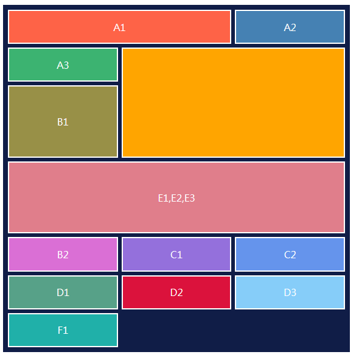

---
head:
  - - meta
    - name: author
      content: 許恩綸
  - - meta
    - name: keywords
      content: CSS, 網格,gird,Grid
  - - meta
    - name: og:title
      content: CSS - Grid 教學
  - - meta
    - name: og:description
      content: 學習CSS - Grid使用方法，有範例和教學影片
  - - meta
    - name: og:type
      content: article
---

# Grid 使用教學

::: tip 題目
試著用`grid`製作下方的表格
:::


## 影片教學連結
- [css grid 教學 - Youtube](https://www.youtube.com/watch?v=jV2maiP0Z7s)

## 方法一
- [程式碼範例](https://github.com/ntub-dp/css-training/tree/main/grid-css)
- 使用`grid-area`寫法

```css
.container {
    width: 550px;
    height: 550px;

    background: #101d47;
    border: 10px solid #101d47;

    display: grid;
    grid-auto-columns: 1fr; /* 指定隱式創建列的大小。每列將佔用可用空間的一部分。 */
    grid-auto-rows: 1fr; /* 指定隱式創建行的大小。每行將佔用可用空間的一部分。 */
    gap: 10px; /* 定義網格項目之間的間隙，包括行和列。 */
    grid-template-areas: /* 定義命名的網格區域佈局。每個字符串代表一行，每個空格分隔的值代表一個區域。 */
        'A3 cat cat'
        'B1 cat cat'
        'B1 cat cat'
        'E123 E123 E123'
        'E123 E123 E123'
        'B2 C1 C2'
        'D1 D2 D3'
        'F1 ZZ ZZ';
}

.container>:not(.ZZ) {
    color: #fff;
    outline: 2px solid #fff;

    display: grid; /* 設置為網格佈局。 */
    place-items: center; /* 將網格項目置於中心位置。 */
}
```

## 方法二

- 使用`grid-column`和`grid-row`

```css
.container {
    width: 550px;
    height: 550px;

    background: #101d47;
    border: 10px solid #101d47;

    display: grid;
    grid-auto-columns: 1fr;
    /* 指定隱式創建列的大小。每列將佔用可用空間的一部分。 */
    grid-auto-rows: 1fr;
    /* 指定隱式創建行的大小。每行將佔用可用空間的一部分。 */
    gap: 10px;
    /* 定義網格項目之間的間隙，包括行和列。 */
}

.container>:not(.ZZ) {
    color: #fff;
    outline: 2px solid #fff;
}

.A1 {
    /* grid:列-開始 / 欄-開始 / 列-結束 / 欄-結束 */
    grid-column: 1 / 3; /* 從第1列跨到第3列 */
    grid-row: 1 / 3; /* 從第1行跨到第3行 */
}

.A2 {
    grid-column: 3 / 4; /* 從第3列跨到第4列 */
    grid-row: 1 / 3; /* 從第1行跨到第3行 */
}

.A3 {
    grid-column: 1 / 2; /* 從第1列跨到第2列 */
    grid-row: 3 / 4; /* 從第3行跨到第4行 */
}

.cat {
    grid-row: 3 / 7; /* 從第3行跨到第7行 */
    grid-column: 2 / 4; /* 從第2列跨到第4列 */
}

.B1 {
    grid-row: 4 / 7; /* 從第4行跨到第7行 */
    grid-column: 1 / 2; /* 從第1列跨到第2列 */
}

.E123 {
    grid-column: 1 / 4; /* 從第1列跨到第4列 */
    grid-row: 7 / 9; /* 從第7行跨到第9行 */
}
```