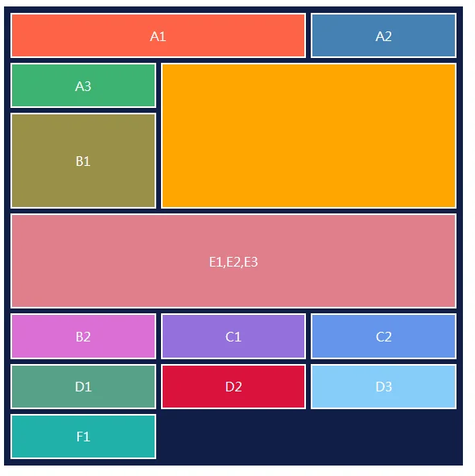

---
head:
  - - meta
    - name: author
      content: 許恩綸
  - - meta
    - name: keywords
      content: CSS, 網格,gird,Grid
  - - meta
    - property: og:title
      content: CSS - Grid 教學
  - - meta
    - property: og:description
      content: 學習CSS - Grid使用方法，有範例和教學影片
  - - meta
    - property: og:type
      content: article
---

# Grid 使用教學

> 📝 TL;DR
- 宣告容器：`display: grid` + `grid-template-columns/rows` 或 `grid-auto-flow`。
- 快速排版：`grid-template-areas` 命名區塊，或用 `grid-column` / `grid-row` 指定跨度。
- 間距：`gap` 一次設定 row/column 間距。

## 速查表
| 想做什麼 | 屬性                    | 範例                          |
| -------- | ----------------------- | ----------------------------- |
| 定寬列   | `grid-template-columns` | `200px 1fr 1fr`               |
| 均分列   | `grid-template-columns` | `repeat(3, 1fr)`              |
| 命名區塊 | `grid-template-areas`   | `'header header' 'side main'` |
| 跨列     | `grid-column`           | `1 / 3` (跨 2 欄)             |
| 跨行     | `grid-row`              | `2 / 4` (跨 2 行)             |

::: tip 題目
試著用`grid`製作下方的表格
:::


## 影片教學連結
- [css grid 教學 - Youtube](https://www.youtube.com/watch?v=jV2maiP0Z7s)

## 方法一
- [程式碼範例](https://github.com/ntub-dp/css-training/tree/main/grid-css)
- 使用`grid-area`寫法

```css
.container {
    width: 550px;
    height: 550px;

    background: #101d47;
    border: 10px solid #101d47;

    display: grid;
    grid-auto-columns: 1fr; /* 指定隱式創建列的大小。每列將佔用可用空間的一部分。 */
    grid-auto-rows: 1fr; /* 指定隱式創建行的大小。每行將佔用可用空間的一部分。 */
    gap: 10px; /* 定義網格項目之間的間隙，包括行和列。 */
    grid-template-areas: /* 定義命名的網格區域佈局。每個字符串代表一行，每個空格分隔的值代表一個區域。 */
        'A3 cat cat'
        'B1 cat cat'
        'B1 cat cat'
        'E123 E123 E123'
        'E123 E123 E123'
        'B2 C1 C2'
        'D1 D2 D3'
        'F1 ZZ ZZ';
}

.container>:not(.ZZ) {
    color: #fff;
    outline: 2px solid #fff;

    display: grid; /* 設置為網格佈局。 */
    place-items: center; /* 將網格項目置於中心位置。 */
}
```

## 方法二

- 使用`grid-column`和`grid-row`

```css
.container {
    width: 550px;
    height: 550px;

    background: #101d47;
    border: 10px solid #101d47;

    display: grid;
    grid-auto-columns: 1fr;
    /* 指定隱式創建列的大小。每列將佔用可用空間的一部分。 */
    grid-auto-rows: 1fr;
    /* 指定隱式創建行的大小。每行將佔用可用空間的一部分。 */
    gap: 10px;
    /* 定義網格項目之間的間隙，包括行和列。 */
}

.container>:not(.ZZ) {
    color: #fff;
    outline: 2px solid #fff;
}

.A1 {
    grid-column: 1 / 3; /* 從第1列跨到第3列 */
    grid-row: 1 / 3; /* 從第1行跨到第3行 */
}

.A2 {
    grid-column: 3 / 4; /* 從第3列跨到第4列 */
    grid-row: 1 / 3; /* 從第1行跨到第3行 */
}

.A3 {
    grid-column: 1 / 2; /* 從第1列跨到第2列 */
    grid-row: 3 / 4; /* 從第3行跨到第4行 */
}

.cat {
    grid-row: 3 / 7; /* 從第3行跨到第7行 */
    grid-column: 2 / 4; /* 從第2列跨到第4列 */
}

.B1 {
    grid-row: 4 / 7; /* 從第4行跨到第7行 */
    grid-column: 1 / 2; /* 從第1列跨到第2列 */
}

.E123 {
    grid-column: 1 / 4; /* 從第1列跨到第4列 */
    grid-row: 7 / 9; /* 從第7行跨到第9行 */
}

## 實戰練習

### 練習 1：三欄等高卡片（簡單）⭐
> 建立 3 欄卡片，欄寬平均，行距 16px。

:::details 💡 參考答案
```css
.cards {
    display: grid;
    grid-template-columns: repeat(3, 1fr);
    gap: 16px;
}
```
:::

### 練習 2：header / main / side / footer 版型（簡單）⭐
> 用 `grid-template-areas` 完成上方題目圖片版型。

:::details 💡 參考答案
```css
.layout {
    display: grid;
    grid-template-columns: 1fr 1fr 1fr;
    grid-template-rows: auto 1fr auto;
    grid-template-areas:
        "A3 cat cat"
        "B1 cat cat"
        "B1 cat cat"
        "E123 E123 E123"
        "E123 E123 E123"
        "B2 C1 C2"
        "D1 D2 D3"
        "F1 ZZ ZZ";
    gap: 10px;
}
```
:::

### 練習 3：自適應卡片（中等）⭐⭐
> 用 `grid-template-columns: repeat(auto-fit, minmax(200px, 1fr))` 做響應式卡片牆。

:::details 💡 參考答案與提示
```css
.gallery {
    display: grid;
    grid-template-columns: repeat(auto-fit, minmax(200px, 1fr));
    gap: 20px;
}
```
**提示**：`auto-fit` 會自動填滿可用空間，minmax 控制最小寬度。
:::

## FAQ
- Q: 要讓項目置中？
    - A: 容器用 `place-items: center;`，單一項目用 `place-self: center;`。
- Q: 舊版瀏覽器不支援 Grid？
    - A: 可用 `@supports (display: grid)` 切換，或 fallback 至 flex。
- Q: gap 支援哪裡？
    - A: Grid/Flex 都支援現代瀏覽器，IE 不支援。
```