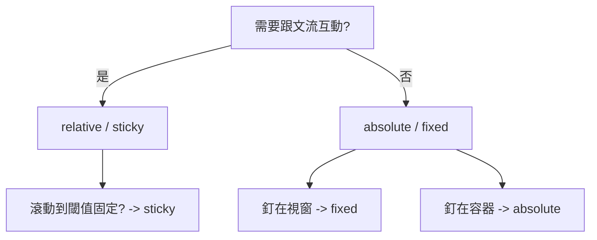

---
head:
  - - meta
    - name: keywords
      content: css,css position,position,css定位
  - - meta
    - name: author
      content: 許恩綸
  - - meta
    - property: og:title
      content: Css Position 定位
  - - meta
    - property: og:description
      content: position屬性用於控制HTML元素在網頁上的位置和布局方式。這個屬性有幾個不同的值，每個值都控制元素的定位方式。以下是position的主要值
  - - meta
    - property: og:type
      content: article
---

# Css Position 定位

> 📝 TL;DR
- `static`：預設，不可移動。
- `relative`：保留原位，視覺位移。
- `absolute`：脫離文流，相對最近定位祖先。
- `fixed`：相對視窗固定。
- `sticky`：滾到臨界點後改為固定。

## 視覺化：何時用哪種定位


position屬性用於控制HTML元素在網頁上的位置和布局方式。這個屬性有幾個不同的值，每個值都控制元素的定位方式。以下是position的主要值：

## static

這是position屬性的默認值。
元素按照它們在文檔中的正常順序佈局，不會受到其他定位屬性的影響。
`top`、`right`、`bottom`和`left`屬性對`static`定位的元素無效。

## relative 相對定位

使用`relative`屬性，您可以相對於元素在正常文檔流中的位置移動元素。
使用`top`、`right`、`bottom`和`left`屬性，您可以指定相對位移的距離。
元素仍然占據原始文檔流中的空間，但在視覺上移動。
```css
.box {
  position: relative;
  top: 20px;
  left: 30px;
}
```
這個範例將具有box類的元素相對於其正常位置向下移動20像素，向左移動30像素。

## absolute 絕對定位

absolute屬性使元素脫離正常文檔流，相對於最近的具有相對或絕對定位的祖先元素定位。
`使用top`、`right`、`bottom`和`left`屬性，您可以指定元素相對於其祖先元素的位置。
當元素使用absolute時，它不再影響其他元素的佈局，因此其他元素可能會佔據它原來的空間。

```css
.container {
  position: relative;
}
.box {
  position: absolute;
  top: 50px;
  left: 100px;
}
```
在這個範例中，`.box`元素相對於具有`container`類的父元素定位，位於其父元素的上方50像素，左側100像素的位置。

## fixed 固定定位

使用fixed屬性，元素相對於視窗定位，而不是相對於文檔。
這意味著元素會固定在瀏覽器視口中的位置，當用戶滾動頁面時也不會移動。
常用於創建固定的導航欄或工具欄。
```css
.navbar {
  position: fixed;
  top: 0;
  left: 0;
  width: 100%;
  background-color: #333;
  color: #fff;
}
```
這個範例創建了一個固定在頁面頂部的導航欄。

## sticky 黏性定位

sticky屬性是一種混合定位，當元素在可見區域內時，它的行為就像`relative`，但當元素滾出視口時，它的行為就像`fixed`，固定在指定位置。
常用於創建在網頁滾動時跟隨的元素，例如頁面上方的導航欄。

## 牛刀小試

試著使用position把下圖做出來吧!


## 實戰練習

### 練習 1：Badge 角落標籤（簡單）⭐
> 在卡片右上角放一個絕對定位 badge。

:::details 💡 參考答案
```css
.card { position: relative; }
.badge {
  position: absolute;
  top: 8px; right: 8px;
  background: #e11; color: #fff;
  padding: 4px 8px; border-radius: 12px;
}
```
:::

### 練習 2：Sticky 導航（簡單）⭐
> 建立頂部黏性導覽列，滾動時吸附頂部。

:::details 💡 參考答案
```css
.nav {
  position: sticky;
  top: 0;
  background: #fff;
  z-index: 10;
}
```
:::

### 練習 3：兩欄重疊卡片（中等）⭐⭐
> 左欄文字，右側浮出小卡片，卡片需相對左欄容器定位。

:::details 💡 參考答案與提示
```css
.wrap { position: relative; }
.floating {
  position: absolute;
  top: 20px;
  right: -40px;
  width: 180px;
  box-shadow: 0 10px 30px rgba(0,0,0,.15);
}
```
**提示**：父層設 `position: relative;` 以建立定位參考。
:::

## FAQ
- Q: 絕對定位找不到參考點？
  - A: 檢查父層是否有 `position: relative/absolute/fixed/sticky`，沒有就會以 viewport 為準。
- Q: sticky 失效？
  - A: 父層 overflow 設定會影響；需要有滾動空間，並設 `top`。
- Q: fixed 元素被覆蓋？
  - A: 調整 `z-index` 並確保 position 已設定。

