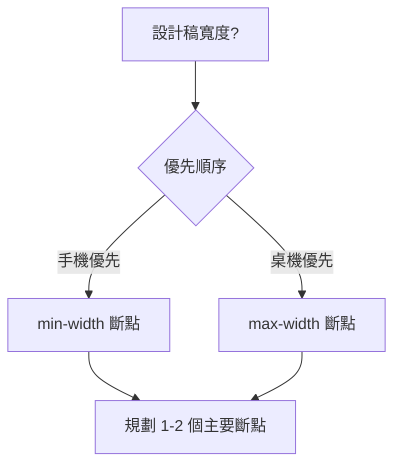

---
head:
  - - meta
    - name: keywords
      content: css,media,rwd,響應式
  - - meta
    - name: author
      content: 許恩綸
  - - meta
    - name: description
      content: RWD 基礎：媒體查詢語法、常用斷點、實際版面案例、練習題與 FAQ。
  - - meta
    - property: og:title
      content: CSS 響應式網頁設計(RWD)
  - - meta
    - property: og:description
      content: 媒體查詢是一種CSS技術，允許開發者根據設備的特徵（如螢幕寬度、高度、解析度等）來應用不同的樣式。這使得網站能夠在各種設備上提供良好的使用者體驗，無論是桌面電腦、平板還是手機。
  - - meta
    - property: og:type
      content: article
  - - meta
    - property: og:image
      content: https://lucashsu95.github.io/LucasHsu.dev/css/basic/grid
---

# CSS 響應式網頁設計(RWD)

> 📝 TL;DR

- RWD 透過媒體查詢在不同螢幕寬度套用不同樣式。
- 常見策略：桌機優先（desktop-first）或手機優先（mobile-first）；推薦 mobile-first 搭配 `min-width` 斷點。
- 先規劃版面與斷點，再寫樣式；善用彈性單位（%, vw, rem）、`flex`/`grid`、`clamp()` 控制尺寸。

## 前置知識

- display/Flex/Grid 基礎。
- 盒模型與圖片等比例縮放 (`max-width: 100%`).
- 單位：`rem`、`%`、`vw`、`clamp()`。

## 媒體查詢的基本概念

媒體查詢是一種CSS技術，允許開發者根據設備的特徵（如螢幕寬度、高度、解析度等）來應用不同的樣式。這使得網站能夠在各種設備上提供良好的使用者體驗，無論是桌面電腦、平板還是手機。

### 媒體類型 media-type

媒體查詢可以針對不同的媒體類型進行設置，常見的類型包括：
- **all**：適用於所有設備。
- **screen**：針對螢幕顯示設備。
- **print**：針對列印輸出。
- **speech**：針對語音合成設備。

## 使用方法

### 基本語法

媒體查詢的基本語法如下：

```css
@media media-type and (condition) {
    /* CSS rules */
}
```

#### 範例

1. **針對螢幕寬度小於600px的樣式：**

```css
@media screen and (max-width: 600px) {
    body {
        background-color: lightblue;
    }
}
```

2. **針對螢幕寬度在321px到768px之間的樣式：**

```css
@media only screen and (min-width: 321px) and (max-width: 768px) {
    .class {
        background: #666;
    }
}
```

### 寫在HTML中

媒體查詢也可以直接寫在HTML文件中：

```html
<link rel="stylesheet" media="screen and (min-width: 400px) and (max-width: 700px)" href="style.css" />
```

## 常見斷點參考（mobile-first）

- 480px：超小手機
- 768px：平板直向
- 1024px：平板橫向 / 小桌機
- 1280px：桌機常見寬度

請依設計實際需要調整，避免盲目套用固定數字。

## 實際案例 1：三欄卡片 → 單欄

```css
.cards {
  display: grid;
  grid-template-columns: repeat(3, 1fr);
  gap: 16px;
}
@media (max-width: 1024px) {
  .cards { grid-template-columns: repeat(2, 1fr); }
}
@media (max-width: 640px) {
  .cards { grid-template-columns: 1fr; }
}
```

## 實際案例 2：導覽列收合

```css
.nav {
  display: flex;
  gap: 12px;
}
@media (max-width: 768px) {
  .nav { flex-direction: column; }
  .nav__toggle { display: block; }
}
```

## 圖片等比例縮放

```css
img { max-width: 100%; height: auto; display: block; }
```

## 斷點決策圖



## 實戰練習

### 練習 1：背景色切換（簡單）⭐
> 寬度 < 640px 時 body 背景變淺灰。

:::details 💡 參考答案
```css
@media (max-width: 640px) {
  body { background: #f5f5f5; }
}
```
:::

### 練習 2：兩欄變單欄（簡單）⭐
> `.layout` 內兩欄並排，在 768px 以下堆疊。

:::details 💡 參考答案
```css
.layout { display: grid; grid-template-columns: 2fr 1fr; gap: 16px; }
@media (max-width: 768px) {
  .layout { grid-template-columns: 1fr; }
}
```
:::

### 練習 3：字級自適應（中等）⭐⭐
> 使用 `clamp()` 讓標題字級在 480px~1280px 間自動調整。

:::details 💡 參考答案與提示
**提示：** `clamp(min, preferred, max)`

**參考答案：**
```css
h1 { font-size: clamp(24px, 3vw, 36px); }
```
:::

## 延伸閱讀

- [MDN: Media Queries](https://developer.mozilla.org/en-US/docs/Web/CSS/Media_Queries)
- [Using clamp()](https://developer.mozilla.org/en-US/docs/Web/CSS/clamp)
- [Flex vs Grid](./display)

## FAQ

- mobile-first 與 desktop-first 差別？
  - mobile-first 用 `min-width` 逐步增強；desktop-first 用 `max-width` 逐步縮減。行為較好預測者建議 mobile-first。
- 斷點一定要跟裝置尺寸一致嗎？
  - 不必，以內容「折行」或版面崩壞點為準。
- 圖片要怎麼在 RWD 下保持比例？
  - 設 `max-width:100%`、`height:auto`，必要時 `object-fit: cover`。