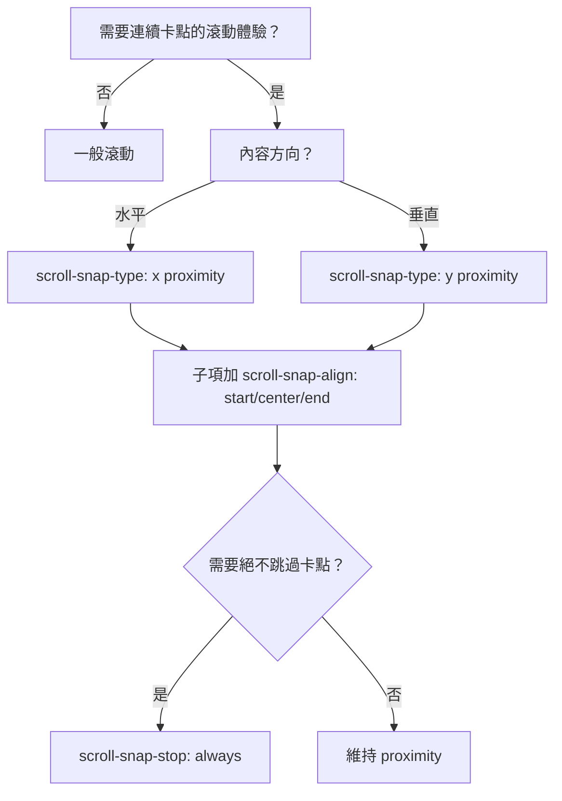

---
head:
  - - meta
    - name: author
      content: 許恩綸
  - - meta
    - name: keywords
      content: css,滾動時間軸,滾動快照,scoll-snap,scroll-snap-type,scroll-snap-stop,scroll-snap-align,scroll-padding
  - - meta
    - property: og:title
      content: CSS scroll-snap
  - - meta
    - property: og:description
      content: 介紹scroll-snap-type、scroll-snap-stop、scroll-snap-align、scroll-padding
  - - meta
    - property: og:type
      content: article
---

# CSS Scroll Snap 屬性介紹

CSS Scroll Snap 是一組用於定義滾動位置快照點的 CSS 屬性,可以提供更好的滾動體驗。

> 📝 TL;DR
- 用在水平/垂直滑動相簿、輪播、逐章閱讀，讓滾動自然「卡」在對齊點。
- 容器: `scroll-snap-type` + (可選) `scroll-padding`，子項: `scroll-snap-align`，避免滑過: `scroll-snap-stop: always`。
- 多用 `proximity` 讓體驗不生硬，`mandatory` 適合精準翻頁。

## 前置知識
- 需理解 `overflow: auto/scroll` 才能觸發快照。
- 行為受滾動方向 (x/y/block/inline/both) 影響。
- 若使用滾動條隱藏，仍需保留可滾動空間。

## 什麼時候用 Scroll Snap？


## `scroll-snap-type`

- 定義滾動容器應該如何"快照"其內容。
- 可以設置為 `x`、`y`、`block`、`inline` 或 `both` 來指定快照的方向。
- 可選的 `mandatory` 或 `proximity` 值控制快照的嚴格性。

## `scroll-snap-stop`

- 控制滾動是否可以"跳過"快照位置。
- `always` 值確保滾動不會跳過任何快照位置。

## `scroll-snap-align`

- 定義元素在其滾動容器內的對齊方式。
- 可以設置為 `none`、`start`、`end` 或 `center`。

## `scroll-padding`

- 在滾動容器的各個方向上添加一些填充。
- 可以單獨設置每個方向,如 `scroll-padding-top`、`scroll-padding-right`、`scroll-padding-bottom` 和 `scroll-padding-left`。

## 使用示例

```css
.scroll-container {
  scroll-snap-type: y mandatory;
  scroll-padding-bottom: 5%;
}

.snap-element {
  scroll-snap-align: center;
}
```

這段代碼對滾動容器啟用垂直方向的強制性滾動快照,並在容器底部添加 5% 的填充。同時,它將子元素對齊到容器中心。

### 更實用的例子：水平卡片滑動

```html
<section class="snap-container">
  <article class="card">卡片 1</article>
  <article class="card">卡片 2</article>
  <article class="card">卡片 3</article>
</section>

<style>
.snap-container {
  display: grid;
  grid-auto-flow: column;
  grid-auto-columns: 80vw;
  gap: 16px;
  overflow-x: auto;
  scroll-snap-type: x proximity;
  scroll-padding: 16px;
}

.card {
  scroll-snap-align: start;
  background: #f5f5f5;
  padding: 24px;
  border-radius: 12px;
}
</style>
```

### 常見坑位排查
- 容器沒滾動: 確保有 `overflow` 且內容超出。
- 子項不對齊: 檢查 `scroll-snap-align` 是否在子項上。
- 卡點太硬/太軟: 改用 `mandatory` 或 `proximity`。
- 需要留邊距: 用 `scroll-padding` 而不是 margin。

## 範例網站

- [範例1](https://lucashsu95.github.io/webDesign/scroll/scroll-snap/scroll-snap.html)
- [範例2](https://lucashsu95.github.io/webDesign/scroll/index.html)

## 實戰練習

### 練習 1：垂直章節（簡單）⭐
> 建立一個垂直文章章節列表，讓每章滑動後停在頂端。

:::details 💡 參考答案
```html
<main class="article">
  <section class="page">第一章</section>
  <section class="page">第二章</section>
  <section class="page">第三章</section>
</main>
<style>
.article {
  height: 100vh;
  overflow-y: auto;
  scroll-snap-type: y mandatory;
}
.page {
  min-height: 100vh;
  scroll-snap-align: start;
}
</style>
```
:::

### 練習 2：水平卡片（簡單）⭐
> 讓 5 張產品卡片橫向滑動並吸附到起點，並保留 24px 內邊距。

:::details 💡 參考答案
```css
.products {
  display: grid;
  grid-auto-flow: column;
  grid-auto-columns: min(320px, 80vw);
  gap: 12px;
  padding: 24px;
  overflow-x: auto;
  scroll-snap-type: x proximity;
  scroll-padding: 24px;
}
.products > article {
  scroll-snap-align: start;
}
```
:::

### 練習 3：不可跳過的輪播（中等）⭐⭐
> 實作一個輪播，要求：
> 1) 卡片不可被快速滑過；2) 內容置中；3) 預留左右 5% 邊界。

:::details 💡 參考答案與提示
**提示：** `scroll-snap-stop: always` + `scroll-snap-align: center` + `scroll-padding`。

```css
.carousel {
  display: flex;
  gap: 16px;
  overflow-x: auto;
  scroll-snap-type: x mandatory;
  scroll-snap-stop: always;
  scroll-padding: 0 5%;
}
.carousel > div {
  flex: 0 0 70vw;
  scroll-snap-align: center;
}
```
:::

## 延伸閱讀
- MDN: [Scroll Snap](https://developer.mozilla.org/en-US/docs/Web/CSS/CSS_scroll_snap/Basic_concepts) - 官方概念與屬性列表
- CSS Tricks: [A Complete Guide to Scroll Snap](https://css-tricks.com/practical-css-scroll-snapping/) - 實務案例合集
- 實戰參考: [scroll-padding vs. padding 差異](https://developer.mozilla.org/en-US/docs/Web/CSS/scroll-padding)

## FAQ
- Q: 同時有慣性滾動與 scroll snap，體驗很怪？
  - A: 行動裝置可改成 `proximity` 或縮短卡片寬度，降低吸附強度。
- Q: 為何子元素的 margin 影響對齊？
  - A: 卡點依據子元素的視覺盒子，若 margin 需要保留，改用 `gap` 或 `scroll-padding`。
- Q: 想和滑鼠滾輪平滑滾動共存？
  - A: 搭配 `scroll-behavior: smooth;` 並使用 `proximity`，避免過度強制。