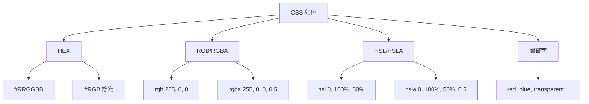

---
head:
  - - meta
    - name: author
      content: 許恩綸
  - - meta
    - name: keywords
      content: CSS,色碼,HEX,RGB,HSL,顏色轉換
  - - meta
    - property: og:title
      content: CSS 色碼完全指南：HEX、RGB、HSL 轉換與應用
  - - meta
    - property: og:description
      content: 詳解 CSS 色碼格式（HEX、RGB、HSL），包含轉換方法、實際應用案例與練習題
  - - meta
    - property: og:type
      content: article
---

# CSS 色碼完全指南

>  TL;DR：CSS 支援多種色碼格式：HEX（#RRGGBB）、RGB、HSL 等。HEX 轉 RGB：每2位十六進制轉十進制（如 #B60023  rgb(182, 0, 35)）。6位數 HEX 可簡化成3位數（除16取整）。實際應用選擇：RGB 易調整、HSL 易配色、HEX 最簡潔。

##  前置知識
- 了解 CSS 基本語法
- 知道十進制與十六進制的概念
- 會使用開發者工具查看顏色

##  CSS 色碼格式總覽



### 常見格式比較

| 格式   | 範例                     | 適用情境     | 優點              |
| ------ | ------------------------ | ------------ | ----------------- |
| HEX    | `#FF5733`                | 設計稿色碼   | 簡潔、設計師常用  |
| RGB    | `rgb(255, 87, 51)`       | 動態調整顏色 | 直觀、易程式控制  |
| RGBA   | `rgba(255, 87, 51, 0.8)` | 需要透明度   | 支援 alpha 通道   |
| HSL    | `hsl(9, 100%, 60%)`      | 主題配色     | 易調整色相/飽和度 |
| 關鍵字 | `crimson`                | 快速原型     | 易讀、快速        |

## HEX 轉 RGB

### 轉換原理

HEX 格式：`#RRGGBB`  
- 每個顏色分量用 2 位十六進制表示（00-FF）
- 對應十進制範圍：0-255

**轉換公式：**
$$
\text{十進制} = (\text{第一位} \times 16) + \text{第二位}
$$

### 手動轉換範例

將 `#B60023` 轉成 RGB：

1. **紅色（R）**：B6 = (11  16) + 6 = **182**
2. **綠色（G）**：00 = (0  16) + 0 = **0**
3. **藍色（B）**：23 = (2  16) + 3 = **35**

結果：`rgb(182, 0, 35)`

### JavaScript 實作

```javascript
function hexToRgb(hex) {
  // 移除 # 符號
  hex = hex.replace(/^#/, '');
  
  // 解析 RGB 分量
  const r = parseInt(hex.substring(0, 2), 16);
  const g = parseInt(hex.substring(2, 4), 16);
  const b = parseInt(hex.substring(4, 6), 16);
  
  return `rgb(${r}, ${g}, ${b})`;
}

console.log(hexToRgb("#B60023")); // rgb(182, 0, 35)
console.log(hexToRgb("#3498db")); // rgb(52, 152, 219)

// 加上透明度
function hexToRgba(hex, alpha = 1) {
  hex = hex.replace(/^#/, '');
  const r = parseInt(hex.substring(0, 2), 16);
  const g = parseInt(hex.substring(2, 4), 16);
  const b = parseInt(hex.substring(4, 6), 16);
  return `rgba(${r}, ${g}, ${b}, ${alpha})`;
}

console.log(hexToRgba("#B60023", 0.5)); // rgba(182, 0, 35, 0.5)
```

## HEX 簡寫（6位  3位）

### 簡化條件
只有當每個顏色分量的兩位數字相同時，才能簡化：
- `#FF0033`  `#F03` ✅
- `#B60023`  無法簡化 ❌

### 簡化算法（近似）

若無法直接簡化，可用「除16取整」近似：

將 `#B60023` 近似簡化：

1. 轉成 RGB：`rgb(182, 0, 35)`
2. 每個值除以 16 並無條件捨去：
   - R: 182  16 = 11.375  11 (B)
   - G: 0  16 = 0  0
   - B: 35  16 = 2.1875  2

3. 結果：`#b02`

:::warning 注意
簡化後顏色會有誤差！`#B60023` 與 `#b02`（實際是 #bb0022）差異明顯。
:::

## 實際應用場景

### 1. 主題配色（推薦用 HSL）

```css
:root {
  /* 主色相 210 度（藍色） */
  --primary: hsl(210, 80%, 50%);
  --primary-light: hsl(210, 80%, 70%); /* 調亮度 */
  --primary-dark: hsl(210, 80%, 30%);  /* 調暗 */
  
  /* 互補色：色相 +180 度 */
  --secondary: hsl(30, 80%, 50%); /* 橙色 */
}
```

### 2. 動態透明度（推薦用 RGBA）

```css
.overlay {
  background: rgba(0, 0, 0, 0.5); /* 半透明黑 */
}

.card:hover {
  background: rgba(52, 152, 219, 0.1); /* 淡藍背景 */
}
```

### 3. 漸層色（混合格式）

```css
.gradient {
  background: linear-gradient(
    135deg,
    #667eea 0%,
    rgba(102, 126, 234, 0.8) 50%,
    hsl(230, 70%, 60%) 100%
  );
}
```

## 實戰練習

### 練習 1（簡單）⭐
將以下 HEX 色碼手動轉換成 RGB 格式：`#1ABC9C`

:::details 參考答案
1. 拆分：1A, BC, 9C
2. 轉換：
   - R: 1A = (116) + 10 = 26
   - G: BC = (1116) + 12 = 188
   - B: 9C = (916) + 12 = 156

結果：`rgb(26, 188, 156)`
:::

### 練習 2（簡單）⭐
判斷以下 HEX 色碼哪些可以簡寫，並寫出簡寫形式：
- `#FF5500`
- `#3498DB`
- `#AABBCC`

:::details 參考答案
- `#FF5500`  `#F50` ✅（每組相同）
- `#3498DB`  無法簡寫 ❌（每組不同）
- `#AABBCC`  `#ABC` ✅（每組相同）
:::

### 練習 3（中等）⭐⭐
寫一個 JavaScript 函數，接受任意 CSS 色碼（HEX、RGB、HSL）並統一轉成 RGBA 格式，預設 alpha 為 1。

:::details 參考答案與思路
```javascript
function toRgba(color, alpha = 1) {
  // 建立臨時元素取得計算後的顏色
  const temp = document.createElement('div');
  temp.style.color = color;
  document.body.appendChild(temp);
  
  // 取得計算後的 RGB 值
  const computed = getComputedStyle(temp).color;
  document.body.removeChild(temp);
  
  // rgb(r, g, b) 或 rgba(r, g, b, a)
  const match = computed.match(/\d+(\.\d+)?/g);
  if (!match) return null;
  
  const [r, g, b, a = alpha] = match;
  return `rgba(${r}, ${g}, ${b}, ${a})`;
}

console.log(toRgba('#FF5733'));      // rgba(255, 87, 51, 1)
console.log(toRgba('rgb(52,152,219)')); // rgba(52, 152, 219, 1)
console.log(toRgba('hsl(204,70%,53%)', 0.5)); // rgba(52, 152, 219, 0.5)
```

**思路：**
- 利用瀏覽器的 `getComputedStyle` 自動轉換
- 解析 RGB 數值並組合成 RGBA
- 處理已有 alpha 的情況
:::

## FAQ

### Q: 哪種色碼格式最好？
- **設計稿色碼**：用 HEX（設計師常用）
- **動態調整**：用 RGB/RGBA（易程式控制）
- **主題配色**：用 HSL（易調整色相）
- **快速開發**：用關鍵字（易讀）

### Q: RGBA 和 opacity 的差異？
- `rgba()`：只影響該元素的顏色透明度
- `opacity`：影響整個元素（含子元素、背景、文字）

### Q: 色碼大小寫有差嗎？
沒差。`#FF5733` 和 `#ff5733` 完全相同，但建議統一用小寫。

## 延伸閱讀
- [W3Schools: CSS 色碼格式](https://www.w3schools.com/cssref/css_colors_legal.asp)
- [MDN: CSS 顏色值](https://developer.mozilla.org/docs/Web/CSS/color_value)
- [Coolors.co](https://coolors.co/) - 配色工具
- [Adobe Color](https://color.adobe.com/) - 色輪工具

## 總結
1. CSS 支援多種色碼：HEX、RGB、HSL 各有優勢。
2. HEX 轉 RGB：每2位十六進制轉十進制（16+個位）。
3. 6位 HEX 簡寫成3位需每組相同，否則會有誤差。
4. 實際應用：RGB 動態、HSL 配色、HEX 簡潔。
5. 善用 CSS 變數統一管理色彩系統。
