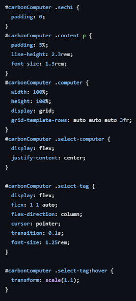
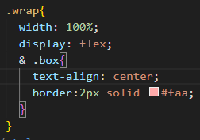
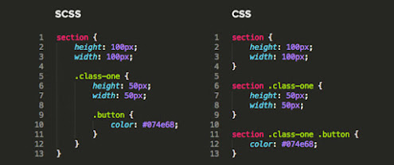
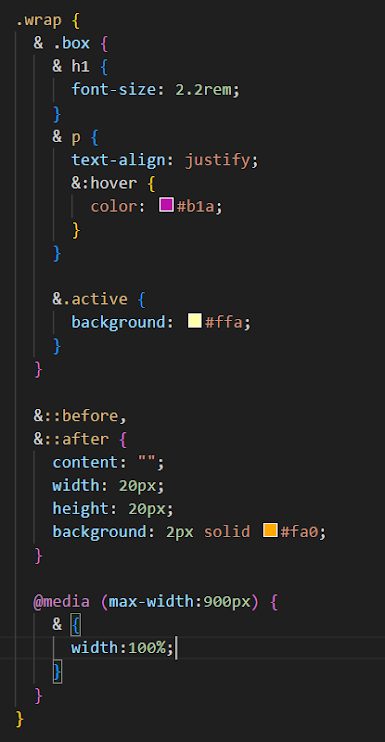

---
head:
  - - meta
    - name: author
      content: 許恩綸
  - - meta
    - name: keywords
      content: CSS, css, 選擇器, 父類選擇器, &符號
  - - meta
    - name: og:title
      content: CSS技巧 - 使用『&』符號進行選擇器簡化
  - - meta
    - name: og:description
      content: 學習如何使用CSS的『&』符號來簡化選擇器的書寫，讓程式碼更乾淨易讀
  - - meta
    - name: og:type
      content: article
---

# CSS 『&』

## 介紹

通常在寫class的時候會把一個大區塊的class加在前面，像這樣我要選到.box就會這麼做。


但程式碼寫久了或是要做一個很複雜的專案，就會成程式碼很多擠的結果...



## 開始使用 &
...好...不管寫的聰不聰明也不管你看不看得懂，反正我今天要安麗你個CSS選擇器

可以讓程式碼變得乾淨?

『&』:上一级選擇器，簡單來說就是省略的寫法，不用再寫一次父類的名字了。



是不是跟Sass很像，但...不一樣的就是Css要加&Sass不用



多種寫法
還有其他的選取方法
```css
.wrap .box{}
.wrap .box h1{}
.wrap .box p:hover{}
.wrap .box.active{}
.wrap::after{}
.wrap::before{}
@media (max-width:1200px){
 .wrap{}
}
```
⬇️




雖然到了最後，程式碼一樣會變得很大包，這是必免不了的，所以可以自己判斷使用~~反正在打程式的時候可以逃掉很多字~~