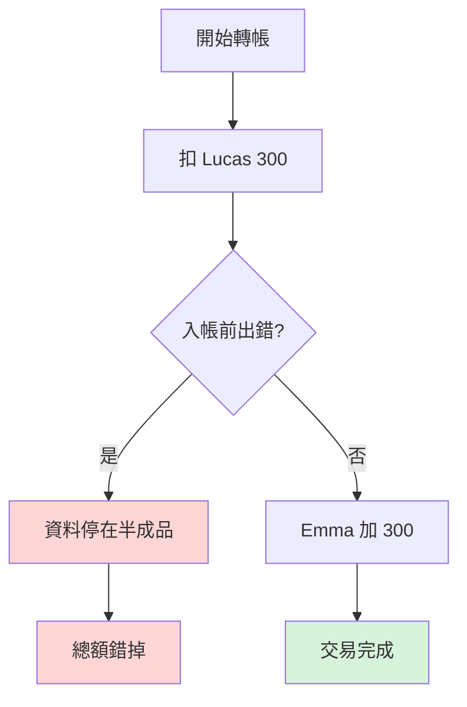
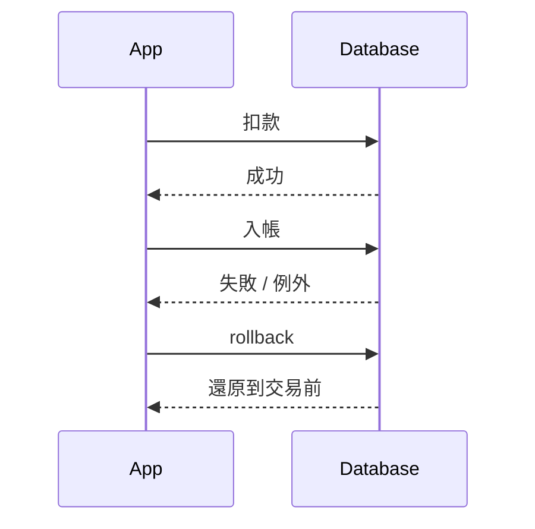
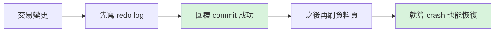

# 資料庫 ACID 是什麼

> 📝 TL;DR：ACID 不是考試背縮寫用的。Atomicity 擋半套寫入，Consistency 擋非法狀態，Isolation 擋併發互踩，Durability 擋 commit 後資料蒸發。你看到轉帳少錢、訂單超賣、重開機後資料不見，八成就在這四個地方出事。

## 這篇你會學到

這篇不是走定義背誦路線，我們直接從事故現場切進去。

1. ACID 各自到底在保護什麼。
2. 為什麼沒有交易邊界，資料會停在半成品。
3. 為什麼併發一多，超賣、髒讀、幻讀就開始冒出來。
4. `@Transactional` 跟 ACID 的關係在哪。

## 前置知識

這篇要懂這些才不會卡住：

- 什麼是資料表、主鍵、外鍵。
- 什麼是 `INSERT`、`UPDATE`、`COMMIT`、`ROLLBACK`。
- 如果你有碰過 Spring Boot，知道 [`@Transactional`](/springboot/transactional) 會更有感。

## 簡報版本

如果你想直接看原本的 HTML 投影片，點這條就會直接進簡報：

- [開啟 ACID HTML 簡報](/slides/acid/index.html#/acid-title)

## 先看沒有 ACID 會怎樣

如果你問我最有感的例子是什麼？轉帳。因為一壞掉就是直接少錢，誰都笑不出來。

假設 Lucas 轉 300 給 Emma，原本：

- Lucas：1000
- Emma：500
- 總額：1500

系統通常會跑兩條 SQL：

```sql
UPDATE account SET balance = balance - 300 WHERE id = 1;
UPDATE account SET balance = balance + 300 WHERE id = 2;
```

如果第一條成功，第二條前 JVM 掛掉，畫面可能顯示「轉帳失敗」，但資料庫其實已經少了 300。這時候不是 bug 有點多，是業障有點重。



這就是 ACID 存在的理由。不是為了帥，是為了把這種事故擋下來。

## A: Atomicity 原子性

Atomicity 在講的只有一句話：這一包操作，要嘛全成功，要嘛全失敗。

### 它在擋什麼

它擋的是「扣款成功、入帳失敗」這種半套狀態。

### 怎麼做到

資料庫會替交易保留回滾能力。以 InnoDB 來說，你可以先把它想成有一份 Undo Log，出錯時能把剛剛做的修改倒回去。



### 程式碼上怎麼看

在 Spring 裡，這通常長這樣：

```java
@Transactional(rollbackFor = Exception.class)
public void transfer(Long fromId, Long toId, BigDecimal amount) throws Exception {
    accountRepository.debit(fromId, amount);

    if (riskService.shouldFail(fromId, toId)) {
        throw new Exception("simulate checked exception");
    }

    accountRepository.credit(toId, amount);
}
```

重點不是 `@Transactional` 這五個字多神，而是你終於把「這幾步是一體的」講清楚了。

## C: Consistency 一致性

Consistency 比較像規則警察。交易開始前資料要合法，結束後也要合法，中間不能把資料弄成不存在於真實世界的鬼樣子。

### 它在擋什麼

- 外鍵指到不存在的資料。
- 欄位應該唯一，結果重複。
- 餘額不可以負數，結果你硬寫進去。
- 活動狀態機只能照規則走，結果你從草稿直接跳成已結束。

### 一個很實際的例子

假設活動報名系統規定：

- `activity_status = OPEN` 才能報名。
- `quota_used` 不可以超過 `quota_total`。

那交易前後都得滿足這些規則，不是你高興怎麼寫就怎麼寫。

```sql
ALTER TABLE registrations
ADD CONSTRAINT fk_registration_activity
FOREIGN KEY (activity_id) REFERENCES activities(id);
```

Consistency 很常跟資料庫 constraint、商業邏輯驗證、狀態機一起出現。反正重點就一句：資料不能亂。

## I: Isolation 隔離性

Isolation 是多人同時操作時的保護罩。沒有它，兩個使用者一起來，系統就會開始互踩。

### 它在擋什麼

最常見就是超賣。

最後一張票還在，A 查到有 1 張，B 也查到有 1 張，兩個人都下單成功。結果庫存看起來沒負數，但訂單已經超過上限。這種最哭。

### 常見併發異常

| 問題 | 白話版 |
| --- | --- |
| Dirty Read | 你讀到別人還沒 commit 的資料 |
| Non-repeatable Read | 同一筆資料你前後讀兩次，結果不同 |
| Phantom Read | 你查一批資料，第二次多出幾筆幽靈資料 |

### 你可以怎麼理解隔離等級

隔離等級不是越高越潮，是在正確性和效能之間做取捨。

- `READ COMMITTED`：常見預設，先擋髒讀。
- `REPEATABLE READ`：同一交易內重讀結果穩很多。
- `SERIALIZABLE`：最硬，但也最慢。

如果你在做報名、庫存、搶票，這塊不懂很容易在壓力一來就爆。

## D: Durability 持久性

Durability 講的是：一旦系統回你 commit 成功，那這筆資料重開機後也要還在。

### 它在擋什麼

它擋的是這種劇情：

1. 畫面顯示成功。
2. 主機下一秒斷電。
3. 重開後資料不見。

如果 commit 不能信，那整個系統的可信度直接歸零。

### 底層通常靠什麼

你可以先記一個關鍵字：Write-Ahead Logging。

意思是資料頁面還沒真的刷回磁碟前，系統先把恢復所需的 log 寫好。這樣就算 crash，重啟也能把資料補回來。



## ACID 跟 Spring 的關係

Spring 不會自己發明 ACID。ACID 是資料庫在扛，Spring 做的是把交易邊界畫好，別讓你程式亂飛。

所以 `@Transactional` 比較像：

- 幫你開交易。
- 幫你決定成功時 commit。
- 幫你決定失敗時 rollback。
- 把多個 repository 操作包成同一件事。

如果你想補這塊，可以接著看：

- [JPA 持久化上下文](/springboot/persistence-context)
- [@Transactional 事務管理](/springboot/transactional)

## 實戰練習

這邊來三題。不要急，程式又不會爆炸。

### 練習 1：哪個屬於 Atomicity 問題（簡單）⭐

**任務：** 判斷下面哪個情境最直接對應 Atomicity。

- A. 查兩次同一筆資料結果不同
- B. 扣款成功但入帳失敗
- C. commit 成功後重開機資料不見

:::details 參考答案
答案是 **B**。

因為它描述的就是交易停在半成品。A 比較像 Isolation，C 比較像 Durability。
:::

### 練習 2：哪個屬於 Durability 問題（簡單）⭐

**任務：** 使用者看到下單成功，但機器重啟後訂單消失。這是哪一塊出事？

**提示：**

- 想一下 commit 之後還保不保得住。

:::details 參考答案
這是 **Durability**。

commit 成功後資料理論上就該撐過重啟和 crash，不然那個成功訊息根本不能信。
:::

### 練習 3：活動報名系統會踩哪幾塊（中等）⭐⭐

**任務：** 假設你在做活動報名系統，同時要處理名額、狀態、取消釋出名額。請說明 ACID 各自在哪裡出手。

**提示：**

- 報名新增與名額扣減是不是要一起成功？
- 名額能不能超過上限？
- 兩個人同時搶最後一個名額怎麼辦？
- commit 後重啟資料能不能丟？

:::details 參考答案
- Atomicity：新增報名紀錄和更新剩餘名額要一起成功。
- Consistency：名額不能小於 0，活動狀態不合法不能報名。
- Isolation：兩個人同時搶最後名額時，不能都成功。
- Durability：報名成功後，系統重啟資料也要還在。
:::

## FAQ

這幾題最常被問。

### Q: ACID 四個特性一定都完全由資料庫保證嗎？

A: 大方向是資料庫在扛，但你的應用程式如果交易邊界亂切、錯誤吞掉、狀態機亂寫，一樣可以把系統搞壞。不是不給，是不能亂搞。

### Q: 開了 `@Transactional` 就不會有效能問題嗎？

A: 當然不是。長交易、亂 fetch、遠端 API 放在交易裡、鎖拿太久，照樣炸。

### Q: Isolation 越高越好嗎？

A: 不一定。越高通常越安全，也越貴。你要根據場景決定，不是看到 `SERIALIZABLE` 就先高潮。

## 延伸閱讀

如果你想把這篇接下去，這幾篇很順：

- [JPA 持久化上下文](/springboot/persistence-context)
- [@Transactional 事務管理](/springboot/transactional)
- [為什麼要資料庫正規化](/database/why-database-normalization)
