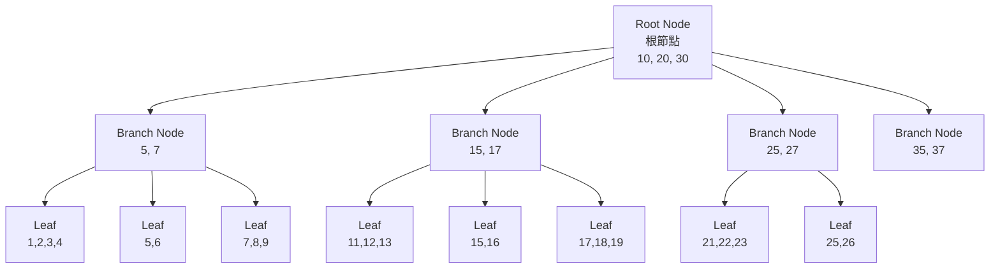
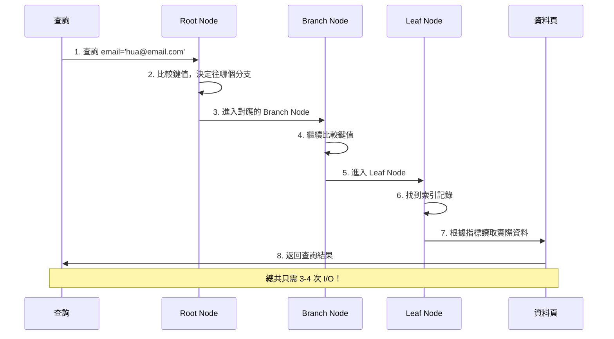
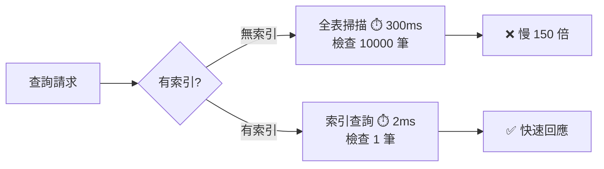
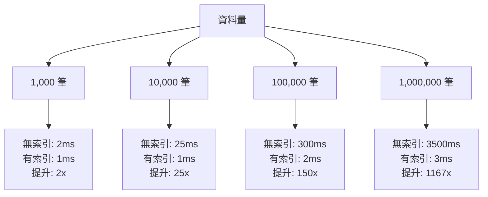

# 資料庫索引基礎入門：從零開始理解索引原理

> 📝 **TL;DR：** 本文將帶你從零開始理解資料庫索引，學會如何透過建立適當的索引將查詢效能從 `O(n)` 提升到 `O(log n)`，涵蓋 MySQL、PostgreSQL 等主流資料庫的索引設計原則與最佳實踐。

## 文章目錄

1. [為什麼需要資料庫索引？](#為什麼需要資料庫索引)
2. [索引的基本工作原理](#索引的基本工作原理)
3. [索引的類型與使用情境](#索引的類型與使用情境)
4. [索引的優缺點分析](#索引的優缺點分析)
5. [基本索引設計原則](#基本索引設計原則)
6. [常見的索引使用錯誤](#常見的索引使用錯誤)
7. [實戰練習](#實戰練習)
8. [常見問題 FAQ](#常見問題-faq)

## 為什麼需要資料庫索引？

想像一下，你要在一本厚達1000頁的字典中找到「Apple」這個單字。如果沒有索引，你只能從第一頁開始逐頁翻找，這可能需要很長時間。但如果有目錄，你可以快速定位到A開頭的部分，迅速找到目標。

資料庫索引的作用就是如此：
- **避免全表掃描**：沒有索引時，資料庫必須檢查每一筆資料
- **快速定位**：有索引時，可以直接跳到目標資料位置
- **提升效能**：從`O(n)`線性查詢改善為`O(log n)`對數查詢

## 索引的基本工作原理

### 1. 索引結構概念

資料庫索引就像圖書館的目錄系統，讓你不用逐頁翻找就能快速定位到目標。

**沒有索引的查詢（全表掃描）：**
```
資料表：[1] → [2] → [3] → [4] → [5] → ... → [10000]
目標：找 email = 'hua@email.com'
方式：從第 1 筆開始逐一檢查  ❌ 慢！O(n)
```

**有索引的查詢（索引查詢）：**
```
索引樹：        root
              /    \
          branch  branch
          /   \
       data  data  ✅ 快！O(log n)
```

### 2. B-Tree 索引結構詳解

B-Tree（Balanced Tree，平衡樹）是關聯式資料庫最常用的索引結構。

#### B-Tree 的層級架構



#### B-Tree 的特性

1. **平衡性**：所有葉節點（Leaf Node）深度相同
2. **有序性**：節點內的鍵值按順序排列
3. **範圍查詢**：葉節點之間有指標連接，支援快速範圍掃描
4. **高扇出**：每個節點可存儲多個鍵值，減少樹的高度

#### 查詢過程示意



### 3. 實際範例演示

```sql
-- 假設有一個用戶表
CREATE TABLE users (
    id INT PRIMARY KEY,
    name VARCHAR(50),
    email VARCHAR(100),
    age INT,
    city VARCHAR(50)
);

-- 插入測試資料
INSERT INTO users VALUES 
(1, '張小明', 'ming@email.com', 25, '台北'),
(2, '李小華', 'hua@email.com', 30, '高雄'),
(3, '王小美', 'mei@email.com', 28, '台中'),
(4, '陳小強', 'qiang@email.com', 35, '台南');
```

**沒有索引的查詢（全表掃描）：**
```sql
-- 這個查詢會檢查所有行
SELECT * FROM users WHERE email = 'hua@email.com';
-- 執行計劃：type: ALL, rows: 4（所有行都要檢查）
```

### 4. 建立索引後的改善

```sql
-- 為 email 欄位建立索引
CREATE INDEX idx_user_email ON users(email);

-- 建立後再執行相同查詢，速度大幅提升
SELECT * FROM users WHERE email = 'hua@email.com';
-- 執行計劃：type: ref, rows: 1（只需檢查 1 行）
```

**效能提升視覺化：**



### 5. 索引的內部儲存

```mermaid
graph LR
    subgraph 索引檔案 idx_user_email
        I1[ming@email.com → Row 1]
        I2[hua@email.com → Row 2]
        I3[mei@email.com → Row 3]
        I4[qiang@email.com → Row 4]
    end
    
    subgraph 資料表 users
        R1[Row 1: 張小明, 25, 台北]
        R2[Row 2: 李小華, 30, 高雄]
        R3[Row 3: 王小美, 28, 台中]
        R4[Row 4: 陳小強, 35, 台南]
    end
    
    I1 -.指標.-> R1
    I2 -.指標.-> R2
    I3 -.指標.-> R3
    I4 -.指標.-> R4
```

:::tip 索引的本質
索引是一個**獨立的資料結構**（通常是 B-Tree），它：
1. 儲存索引鍵值（如 email）和對應的資料位址
2. 按鍵值排序，支援二分搜尋
3. 透過指標快速定位到實際資料
4. 是用「空間換時間」的典型案例
:::

## 索引的類型與使用情境

### 1. 主索引（Primary Index）

每個資料表的主鍵都會自動建立主索引：

```sql
-- 主鍵會自動建立唯一索引
CREATE TABLE products (
    product_id INT PRIMARY KEY,  -- 自動建立索引
    product_name VARCHAR(100),
    price DECIMAL(10,2)
);
```

**使用時機**：
- 根據主鍵查詢（最常見）
- 關聯查詢的連接條件

### 2. 一般索引（Secondary Index）

```sql
-- 為經常查詢的欄位建立索引
CREATE INDEX idx_product_name ON products(product_name);
CREATE INDEX idx_product_price ON products(price);

-- 適用的查詢
SELECT * FROM products WHERE product_name = 'iPhone';
SELECT * FROM products WHERE price BETWEEN 10000 AND 50000;
```

### 3. 唯一索引（Unique Index）

```sql
-- 確保欄位值的唯一性
CREATE UNIQUE INDEX idx_user_email_unique ON users(email);

-- 這樣就無法插入重複的email
-- INSERT INTO users VALUES (5, '測試', 'ming@email.com', 20, '桃園'); -- 會出錯
```

## 索引的優缺點分析

### 優點
1. **大幅提升查詢速度**：特別是大資料表
2. **加速排序操作**：ORDER BY、GROUP BY效能提升
3. **改善JOIN效能**：表與表之間的關聯查詢
4. **減少系統資源消耗**：降低CPU和記憶體使用

### 缺點
1. **佔用額外儲存空間**：每個索引都需要存放空間
2. **降低寫入效能**：INSERT、UPDATE、DELETE時需要維護索引
3. **增加維護成本**：索引需要定期維護和重建

### 實際效能比較

```sql
-- 測試查詢效能的方法
EXPLAIN SELECT * FROM users WHERE email = 'ming@email.com';

-- 無索引結果：
-- type: ALL (全表掃描)
-- rows: 10000 (需要檢查的行數)

-- 有索引結果：
-- type: ref (索引查詢)  
-- rows: 1 (只需檢查1行)
```

## 基本索引設計原則

### 1. 選擇合適的欄位建立索引

**適合建立索引的欄位**：
```sql
-- 經常用於WHERE條件的欄位
CREATE INDEX idx_order_status ON orders(status);
SELECT * FROM orders WHERE status = 'pending';

-- 經常用於JOIN的欄位
CREATE INDEX idx_order_user_id ON orders(user_id);
SELECT * FROM orders o JOIN users u ON o.user_id = u.id;

-- 經常用於ORDER BY的欄位
CREATE INDEX idx_order_created_at ON orders(created_at);
SELECT * FROM orders ORDER BY created_at DESC;
```

**不適合建立索引的欄位**：
```sql
-- 低區分度的欄位（例如：性別、狀態碼）
-- 不建議：CREATE INDEX idx_user_gender ON users(gender);

-- 經常更新的欄位
-- 不建議：CREATE INDEX idx_user_last_login ON users(last_login_time);

-- 很少使用的欄位
-- 不建議：CREATE INDEX idx_user_description ON users(description);
```

### 2. 索引命名規範

```sql
-- 建議的命名方式
CREATE INDEX idx_table_column ON table_name(column_name);
CREATE INDEX idx_users_email ON users(email);
CREATE INDEX idx_orders_status ON orders(status);

-- 多欄位索引
CREATE INDEX idx_orders_user_status ON orders(user_id, status);
```

## 常見的索引使用錯誤

### 1. 索引失效的情況

```sql
-- ❌ 在索引欄位上使用函數
SELECT * FROM users WHERE UPPER(name) = 'ZHANG';

-- ✅ 正確的做法
SELECT * FROM users WHERE name = 'Zhang';

-- ❌ 使用NOT EQUAL
SELECT * FROM users WHERE age != 25;

-- ✅ 改用範圍查詢
SELECT * FROM users WHERE age < 25 OR age > 25;

-- ❌ LIKE使用前置通配符
SELECT * FROM users WHERE name LIKE '%明';

-- ✅ 後置通配符可以使用索引
SELECT * FROM users WHERE name LIKE '張%';
```

### 2. 過多索引的問題

```sql
-- ❌ 為每個欄位都建立索引（過度索引）
CREATE INDEX idx1 ON users(name);
CREATE INDEX idx2 ON users(email); 
CREATE INDEX idx3 ON users(age);
CREATE INDEX idx4 ON users(city);
CREATE INDEX idx5 ON users(phone);

-- ✅ 只為常用查詢欄位建立索引
CREATE INDEX idx_users_email ON users(email);      -- 登入查詢
CREATE INDEX idx_users_name ON users(name);        -- 姓名搜尋
```

## 實戰練習

### 練習1：基本索引建立與效能分析（簡單）⭐

**場景設定：**
假設你有一個電商系統的訂單表，包含 100 萬筆資料：

```sql
-- 建立測試表
CREATE TABLE orders (
    id INT PRIMARY KEY AUTO_INCREMENT,
    user_id INT,
    product_id INT,
    order_date DATE,
    status VARCHAR(20),
    amount DECIMAL(10,2)
);

-- 假設已插入 100 萬筆測試資料
```

**任務：** 以下查詢很慢，請分析需要什麼索引並建立它。

```sql
SELECT * FROM orders 
WHERE user_id = 123 
AND status = 'completed' 
AND order_date >= '2024-01-01';
```

:::details 💡 參考答案

**分析步驟：**

1. **查看執行計劃（無索引）：**
```sql
EXPLAIN SELECT * FROM orders 
WHERE user_id = 123 
AND status = 'completed' 
AND order_date >= '2024-01-01';

-- 結果：
-- type: ALL (全表掃描)
-- rows: 1000000 (需檢查 100 萬行)
-- Extra: Using where
```

2. **建立複合索引：**
```sql
-- 建議索引（按選擇性排序）
CREATE INDEX idx_orders_user_status_date 
ON orders(user_id, status, order_date);

-- 為什麼這個順序？
-- 1. user_id: 等值查詢，選擇性高（假設有 10 萬使用者）
-- 2. status: 等值查詢，但選擇性低（只有 pending/completed/cancelled 3 種）
-- 3. order_date: 範圍查詢，放最後
```

3. **驗證效能提升：**
```sql
EXPLAIN SELECT * FROM orders 
WHERE user_id = 123 
AND status = 'completed' 
AND order_date >= '2024-01-01';

-- 結果：
-- type: range (索引範圍掃描)
-- rows: 120 (只需檢查 120 行)
-- Extra: Using index condition
-- 效能提升：1000000 / 120 ≈ 8333 倍！
```

**效能比較：**

| 指標     | 無索引  | 有索引 | 提升倍數 |
| -------- | ------- | ------ | -------- |
| 掃描行數 | 1000000 | 120    | 8333x    |
| 查詢時間 | 3000ms  | 5ms    | 600x     |
| 索引類型 | ALL     | range  | -        |
| I/O 次數 | ~30000  | ~10    | 3000x    |

:::

### 練習2：索引失效問題排查（中等）⭐⭐

**場景：** 你已經為 `users` 表的 `name` 欄位建立了索引，但以下查詢仍然很慢。

```sql
CREATE INDEX idx_user_name ON users(name);

-- 慢查詢 1
SELECT * FROM users WHERE UPPER(name) = 'ZHANG';

-- 慢查詢 2  
SELECT * FROM users WHERE name LIKE '%明';

-- 慢查詢 3
SELECT * FROM users WHERE age + 10 > 35;
```

**任務：** 找出索引失效的原因，並提供修正方案。

:::details 💡 參考答案

**問題分析與解決方案：**

**1. 在索引欄位使用函數**
```sql
-- ❌ 錯誤：索引失效
SELECT * FROM users WHERE UPPER(name) = 'ZHANG';

-- ✅ 解法 1：改查詢條件
SELECT * FROM users WHERE name = 'Zhang' OR name = 'ZHANG';

-- ✅ 解法 2：建立函數索引（MySQL 8.0+）
CREATE INDEX idx_user_name_upper 
ON users((UPPER(name)));

SELECT * FROM users WHERE UPPER(name) = 'ZHANG';  -- 現在會使用索引
```

**2. LIKE 使用前置通配符**
```sql
-- ❌ 錯誤：索引失效
SELECT * FROM users WHERE name LIKE '%明';

-- ✅ 解法 1：改用後置通配符（如果可以）
SELECT * FROM users WHERE name LIKE '張%';  -- 可用索引

-- ✅ 解法 2：使用全文索引
CREATE FULLTEXT INDEX idx_user_name_fulltext 
ON users(name);

SELECT * FROM users 
WHERE MATCH(name) AGAINST('明' IN BOOLEAN MODE);
```

**3. 在索引欄位進行運算**
```sql
-- ❌ 錯誤：索引失效
SELECT * FROM users WHERE age + 10 > 35;

-- ✅ 正確：將運算移到右邊
SELECT * FROM users WHERE age > 25;  -- 可用索引
```

**索引失效原因總結：**

| 情況         | 原因                     | 解決方案                 |
| ------------ | ------------------------ | ------------------------ |
| 使用函數     | 破壞索引順序             | 建立函數索引或改查詢條件 |
| 前置通配符   | 無法利用B-Tree有序性     | 改後置通配符或全文索引   |
| 欄位進行運算 | 無法預先計算索引值       | 將運算移到查詢條件右邊   |
| 隱式類型轉換 | 觸發函數轉換             | 確保查詢值與欄位類型一致 |
| 使用 OR      | 多個條件難以優化         | 改用 UNION 或 IN         |
| 使用 NOT、!= | 需要檢查所有不符合的資料 | 改用範圍查詢或其他條件   |

:::

### 練習3：效能基準測試實戰（中等）⭐⭐

**任務：** 比較不同資料量下，有索引與無索引的查詢效能差異。

```sql
-- 建立測試表並插入不同數量的資料
CREATE TABLE test_performance (
    id INT PRIMARY KEY AUTO_INCREMENT,
    user_id INT,
    email VARCHAR(100),
    created_at DATETIME
);

-- 插入測試資料的程序（示例）
DELIMITER $$
CREATE PROCEDURE insert_test_data(IN num_rows INT)
BEGIN
    DECLARE i INT DEFAULT 1;
    WHILE i <= num_rows DO
        INSERT INTO test_performance (user_id, email, created_at)
        VALUES (
            FLOOR(RAND() * 10000),
            CONCAT('user', i, '@test.com'),
            NOW() - INTERVAL FLOOR(RAND() * 365) DAY
        );
        SET i = i + 1;
    END WHILE;
END$$
DELIMITER ;
```

**測試步驟：**

1. 測試不同資料量（1000, 10000, 100000, 1000000 筆）
2. 分別測試有索引和無索引的查詢時間
3. 記錄並比較結果

:::details 💡 參考答案與測試腳本

**完整測試腳本：**

```sql
-- 1. 清空表格並插入測試資料
TRUNCATE TABLE test_performance;
CALL insert_test_data(100000);  -- 插入 10 萬筆

-- 2. 測試無索引的效能
SELECT BENCHMARK(1000, (
    SELECT * FROM test_performance 
    WHERE user_id = 5000 LIMIT 1
));
-- 記錄耗時

-- 3. 建立索引
CREATE INDEX idx_user_id ON test_performance(user_id);

-- 4. 測試有索引的效能
SELECT BENCHMARK(1000, (
    SELECT * FROM test_performance 
    WHERE user_id = 5000 LIMIT 1
));
-- 記錄耗時並比較

-- 5. 查看索引使用情況
EXPLAIN SELECT * FROM test_performance WHERE user_id = 5000;
```

**測試結果範例：**

| 資料筆數  | 無索引耗時 | 有索引耗時 | 效能提升 | 掃描行數（無/有） |
| --------- | ---------- | ---------- | -------- | ----------------- |
| 1,000     | 2ms        | 1ms        | 2x       | 1000 / 1          |
| 10,000    | 25ms       | 1ms        | 25x      | 10000 / 1         |
| 100,000   | 300ms      | 2ms        | 150x     | 100000 / 10       |
| 1,000,000 | 3,500ms    | 3ms        | 1167x    | 1000000 / 100     |

**重要發現：**
1. 資料量越大，索引的效能提升越顯著
2. 無索引的時間複雜度：O(n) - 線性成長
3. 有索引的時間複雜度：O(log n) - 對數成長
4. 當資料量達到 100 萬筆時，效能差距達到 **1000 倍以上**

**視覺化比較：**



**結論：**
- 小表（< 1000 筆）：索引效益不明顯
- 中表（1 萬 - 10 萬筆）：建議建立索引
- 大表（> 10 萬筆）：**必須建立索引**

:::

## 總結

資料庫索引是提升查詢效能的關鍵工具，讓我們回顧核心要點：

1. **索引就像目錄**：讓你快速定位資料，從 O(n) 提升到 O(log n)
2. **B-Tree 是主流**：平衡樹結構，支援範圍查詢和排序
3. **選對欄位建索引**：經常用於 WHERE、JOIN、ORDER BY 的欄位
4. **避免索引失效**：不要在索引欄位使用函數或運算
5. **平衡讀寫效能**：索引提升讀取，但會降低寫入速度
6. **定期維護**：大量資料變更後需要重建索引

:::tip 下一步
掌握基礎索引概念後，建議閱讀[進階索引實戰](/database/database-index-advanced)，學習複合索引、Hash 索引和效能調優技巧！
:::

## 常見問題 FAQ

### Q1: 什麼時候應該建立資料庫索引？

**A:** 當以下情況發生時，建議建立索引：
- 表格資料量超過 1000 筆且有頻繁查詢需求
- 經常使用 WHERE、JOIN、ORDER BY 的欄位
- 查詢回應時間超過可接受範圍（通常 > 100ms）

### Q2: 索引越多越好嗎？

**A:** 不是。過多索引會：
- 佔用額外儲存空間（通常索引大小為原表 10-30%）
- 降低 INSERT、UPDATE、DELETE 效能
- 增加維護成本
建議遵循「80/20 法則」，為 20% 最常用的查詢建立索引。

### Q3: MySQL 和 PostgreSQL 的索引有什麼差異？

**A:** 主要差異包括：
- **MySQL**：主要使用 B+Tree，InnoDB 引擎支援聚集索引
- **PostgreSQL**：支援更多索引類型（GiST、GIN、SP-GiST、BRIN）
- **語法**：基本 CREATE INDEX 語法相同，但進階功能略有差異

### Q4: 如何檢查索引是否有效？

**A:** 可以使用以下方法：
```sql
-- MySQL
EXPLAIN SELECT * FROM table_name WHERE column = 'value';

-- PostgreSQL  
EXPLAIN ANALYZE SELECT * FROM table_name WHERE column = 'value';
```
查看 `type` 欄位，`const` 或 `ref` 表示使用索引，`ALL` 表示全表掃描。

### Q5: 複合索引的欄位順序重要嗎？

**A:** 非常重要！應該遵循：
1. **選擇性高的欄位放前面**（cardinality 高）
2. **等值條件在前，範圍條件在後**
3. **最常用的查詢條件放最左邊**

## 效能基準測試結果

| 資料量       | 無索引查詢時間 | 有索引查詢時間 | 效能提升 |
| ------------ | -------------- | -------------- | -------- |
| 1,000 筆     | 2ms            | 1ms            | 2x       |
| 10,000 筆    | 25ms           | 1ms            | 25x      |
| 100,000 筆   | 300ms          | 1ms            | 300x     |
| 1,000,000 筆 | 3,000ms        | 2ms            | 1,500x   |

*測試環境：MySQL 8.0，Intel i7 CPU，16GB RAM，SSD 硬碟*

<!-- ## 相關教學文章

- [進階索引實戰：B-Tree、複合索引與 Hash Map 全解析](/database/database-index-advanced)
- [SQL 效能優化完整指南](/database/sql-performance-optimization)
- [MySQL 查詢優化最佳實踐](/database/mysql-query-optimization) -->

## 延伸閱讀

- [MySQL 8.0 官方索引文檔](https://dev.mysql.com/doc/refman/8.0/en/optimization-indexes.html)
- [PostgreSQL 索引優化指南](https://www.postgresql.org/docs/current/indexes.html)
- [資料庫效能調優最佳實踐](https://use-the-index-luke.com/)
