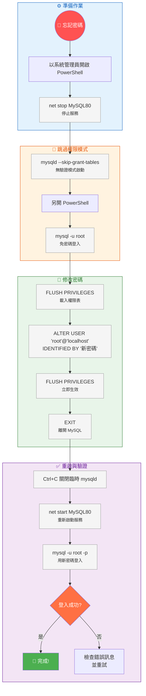
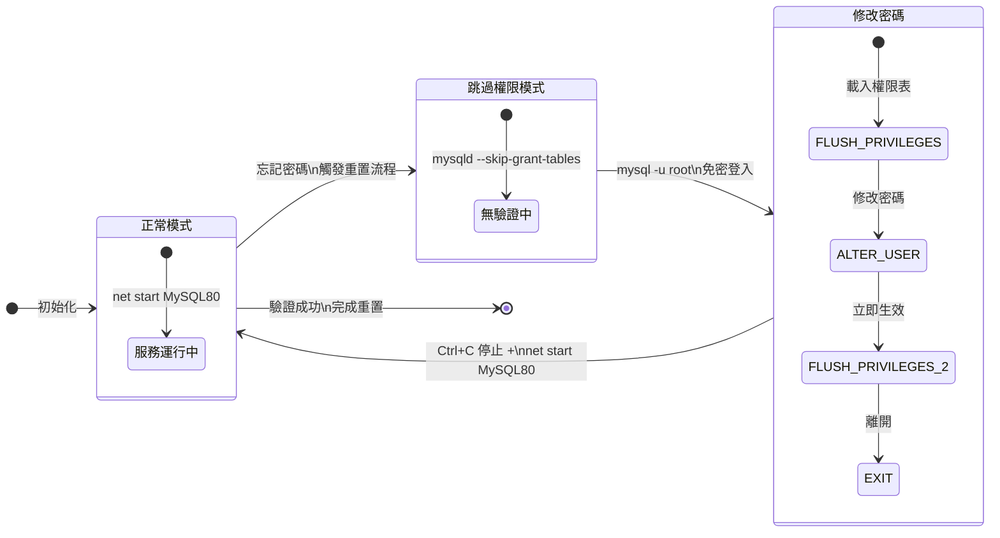

# 重設 MySQL Root 密碼（Windows）

> 📝 TL;DR 當你忘記 MySQL root 密碼時，可以在 Windows 上透過 `--skip-grant-tables` 跳過權限驗證，直接登入資料庫修改密碼。本文提供完整的 6 步驟操作指南，包含服務停止、免密登入、密碼修改、服務重啟與驗證。

## 前置知識

在開始之前，建議你先了解以下概念：

- **MySQL 服務管理** - 知道如何用 `net stop/start` 控制 MySQL 服務
- **PowerShell 基礎操作** - 需要以系統管理員身分執行指令
- **MySQL 權限系統** - 理解 grant tables 的作用與 `--skip-grant-tables` 的風險

## 什麼時候需要重設 Root 密碼？

### 為什麼會需要這個操作？

常見情境：
- **遺忘密碼** - 最常見的原因，長時間未登入導致忘記 root 密碼
- **接手舊系統** - 取得專案但無人知道資料庫密碼
- **安全性審計** - 定期輪換密碼，但舊密碼未留存

### 核心原理

MySQL 的權限資訊儲存在 `mysql` 系統資料庫的 grant tables（如 `user`、`db`、`tables_priv` 等）中。啟動 MySQL 時加上 `--skip-grant-tables` 參數，會**跳過這些權限表的載入與驗證**，讓任何使用者無需密碼即可連線並擁有所有權限。

:::warning ⚠️ 安全性警告
`--skip-grant-tables` 會**完全關閉權限驗證**，任何人都能無密碼登入並擁有最高權限。請務必：
1. 僅在本機、受信任環境操作
2. 操作完成後**立即重新啟動正常模式**
3. 考慮加上 `--skip-networking` 禁止遠端連線（Windows 上用 `--shared-memory` 達成類似效果）
:::

## 💻 完整操作步驟

### 步驟 1：停止 MySQL 服務

以**系統管理員**開啟 PowerShell：

```powershell
net stop MySQL80
```

> **注意**：服務名稱可能因安裝版本不同而有所差異（如 `MySQL`、`MySQL57`、`MySQL80`、`MySQL84`）。可用 `services.msc` 或 `sc query state= all | findstr MySQL` 確認正確服務名稱。

---

### 步驟 2：用 `--skip-grant-tables` 啟動 MySQL

在同一個 PowerShell 視窗執行：

```powershell
& "C:\Program Files\MySQL\MySQL Server 8.0\bin\mysqld.exe" --defaults-file="C:\ProgramData\MySQL\MySQL Server 8.0\my.ini" --skip-grant-tables --shared-memory
```

**參數說明：**

| 參數 | 作用 |
|------|------|
| `--defaults-file` | 指定設定檔路徑（確保讀取正確的 port、datadir 等設定） |
| `--skip-grant-tables` | **核心參數**：跳過權限表驗證，允許無密碼登入 |
| `--shared-memory` | Windows 專用：啟用共享記憶體協定，避免 TCP/IP 連線問題 |

> **路徑可能不同**：若你的 MySQL 安裝在其他位置，請調整 `mysqld.exe` 與 `my.ini` 的實際路徑。可用 `where mysqld` 尋找執行檔位置。

> 此指令會**佔用該 PowerShell 視窗**，MySQL 在前景執行。請**另開新視窗**進行下一步。

---

### 步驟 3：另開 PowerShell，免密登入

開啟**新的** PowerShell 視窗（不需系統管理員權限），執行：

```powershell
& "C:\Program Files\MySQL\MySQL Server 8.0\bin\mysql.exe" -u root
```

成功時會直接進入 MySQL 互動模式（`mysql>` 提示字元），無需輸入密碼。

---

### 步驟 4：修改 Root 密碼

在 MySQL 互動模式中依序執行：

```sql
FLUSH PRIVILEGES;

ALTER USER 'root'@'localhost' IDENTIFIED BY '你的新密碼';

FLUSH PRIVILEGES;

EXIT;
```

**關鍵點解析：**

| SQL 指令 | 用途 |
|----------|------|
| `FLUSH PRIVILEGES;` | **必須先執行**：在 skip-grant-tables 模式下，權限表未載入記憶體，需手動重載才能讓 `ALTER USER` 生效 |
| `ALTER USER ... IDENTIFIED BY` | MySQL 8.0 修改密碼的標準語法 |
| `FLUSH PRIVILEGES;` | 再次重載，確保新密碼立即生效 |
| `EXIT;` | 離開 MySQL 客戶端 |

> **MySQL 5.7 舊版語法**：`SET PASSWORD FOR 'root'@'localhost' = PASSWORD('新密碼');`

---

### 步驟 5：關閉臨時 mysqld，重新正常啟動

回到**步驟 2 的 PowerShell 視窗**，按 `Ctrl+C` 終止前景執行的 `mysqld.exe`。

然後啟動正常服務：

```powershell
net start MySQL80
```

---

### 步驟 6：驗證新密碼

```powershell
& "C:\Program Files\MySQL\MySQL Server 8.0\bin\mysql.exe" -u root -p
```

輸入剛設定的新密碼，能成功登入即代表重設完成。

## 視覺化說明

### 操作流程圖



---

### 服務模式切換概念圖



:::tip 視覺化工具
你可以使用 [Mermaid Live Editor](https://mermaid.live/) 來練習或修改上述圖表。
:::

## 常見問題 FAQ

### Q1: 執行 `net stop MySQL80` 顯示「服務名稱無效」怎麼辦？

**A:** MySQL 服務名稱取決於安裝時的設定。查詢正確名稱：

```powershell
# 方法 1：用 sc query 找出所有 MySQL 相關服務
sc query state= all | findstr -i mysql

# 方法 2：用 Get-Service 列出
Get-Service -Name *mysql*
```

常見服務名稱：`MySQL80`、`MySQL57`、`MySQL`、`MySQL84`。

---

### Q2: 連線時出現 `ERROR 2003 (HY000): Can't connect to MySQL server`？

**A:** 常見原因與解法：

| 原因 | 解決方式 |
|------|----------|
| mysqld 未啟動或已掛掉 | 確認步驟 2 的 PowerShell 視窗仍在執行 mysqld |
| Port 被佔用 / 衝突 | 檢查 `my.ini` 中的 `port` 設定，預設 3306 |
| `--shared-memory` 衝突 | 嘗試移除 `--shared-memory` 參數，改用 TCP/IP 連線 |
| 防火牆阻擋 | 臨時關閉防火牆測試，或允許 3306 port |

---

### Q3: 執行 `ALTER USER` 出現 `ERROR 1290 (HY000): The MySQL server is running with the --skip-grant-tables option so it cannot execute this statement`？

**A:** **漏掉第一個 `FLUSH PRIVILEGES;`**。在 skip-grant-tables 模式下，權限表未載入記憶體，必須先手動 `FLUSH PRIVILEGES` 才能執行 `ALTER USER`。

---

### Q4: 密碼包含特殊字元（如 `@`、`#`、`$`、`!`）怎麼辦？

**A:** 在 SQL 中用單引號包裹，並在 PowerShell 中用雙引號包裹整個指令：

```powershell
& "C:\Program Files\MySQL\MySQL Server 8.0\bin\mysql.exe" -u root -e "ALTER USER 'root'@'localhost' IDENTIFIED BY 'P@ssw0rd#123'; FLUSH PRIVILEGES;"
```

或是在 MySQL 互動模式中直接輸入（推薦，避免轉義問題）。

---

### Q5: 有多個 root 帳號（如 `root@%`、`root@127.0.0.1`）要一起改嗎？

**A:** 建議**全部修改**，避免日後連線方式不同導致無法登入：

```sql
FLUSH PRIVILEGES;

ALTER USER 'root'@'localhost' IDENTIFIED BY '新密碼';
ALTER USER 'root'@'127.0.0.1' IDENTIFIED BY '新密碼';
ALTER USER 'root'@'%' IDENTIFIED BY '新密碼';

FLUSH PRIVILEGES;
```

查詢現有 root 帳號：
```sql
SELECT User, Host FROM mysql.user WHERE User = 'root';
```

---

### Q6: MySQL 8.0.4 以上版本支援 `caching_sha2_password`，密碼修改後無法用舊客戶端連線？

**A:** 若舊版客戶端（如老版 Navicat、舊版 JDBC）無法連線，可指定使用 `mysql_native_password`：

```sql
ALTER USER 'root'@'localhost' IDENTIFIED WITH mysql_native_password BY '新密碼';
```

但建議**升級客戶端**而非降低安全性。

---

### Q7: 重設完密碼後，應用程式連不上資料庫？

**A:** 檢查應用程式的連線字串/設定檔，更新密碼。常見位置：
- `.env`、`config.json`、`application.yml`、`web.config`
- Docker 環境變數 `MYSQL_ROOT_PASSWORD`
- Kubernetes Secret

---

## 最佳實踐

### ✅ 推薦做法

1. **使用密碼管理器** - 避免再次遺忘，建議使用 Bitwarden、1Password、KeePass 等工具
2. **建立專用管理帳號** - 不直接用 root 給應用程式連線，建立權限最小化的帳號
3. **定期備份與輪換** - 設定提醒每 90-180 天輪換一次密碼
4. **記錄操作日誌** - 重設密碼時記錄時間、操作人、原因，方便審計追蹤

### ❌ 常見錯誤

| 錯誤 | 後果 | 如何避免 |
|------|------|----------|
| 忘記執行第一個 `FLUSH PRIVILEGES` | `ALTER USER` 失敗，無法修改密碼 | 腦中建立「skip-grant-tables 必須先 FLUSH」的肌肉記憶 |
| 沒加 `--shared-memory` | Windows 上無法連線、報錯 | 照著指令完整複製貼上，不要省略參數 |
| 修改密碼後忘記 `net start MySQL80` | 服務仍在 skip-grant-tables 模式，極度不安全 | 設定檢查清單，驗證步驟 6 成功才算結束 |
| 只改 `root@localhost` | 遠端或 127.0.0.1 連線仍用舊密碼 | 統一修改所有 root 帳號，或確認應用程式連線方式 |

---

## 延伸閱讀

### 相關文章

本站相關主題：
- [MySQL 基礎操作指南](/docs/database/) - 待補充
- [資料庫索引優化](/docs/database/database-index-basic.md) - 理解索引如何加速查詢
- [ACID 交易特性](/docs/database/acid-transactions.md) - 交易的四大特性與隔離等級

### 推薦資源

外部優質資源：
- [MySQL 官方文件：Resetting the Root Password](https://dev.mysql.com/doc/refman/8.0/en/resetting-permissions.html) - 官方標準流程，含 Linux/macOS/Windows
- [MySQL 8.0 參考手冊：ALTER USER](https://dev.mysql.com/doc/refman/8.0/en/alter-user.html) - 完整語法與選項說明
- [MySQL 權限系統深度解析](https://dev.mysql.com/doc/refman/8.0/en/grant.html) - 理解 grant tables 與權限架構

### 下一步學習

- 如果你想深入了解 MySQL 權限管理，建議閱讀 [MySQL 官方文件：Access Control](https://dev.mysql.com/doc/refman/8.0/en/access-control.html)
- 想要實際應用？試試建立**唯讀帳號**、**開發帳號**、**備份帳號**並實踐最小權限原則
- 準備好挑戰了嗎？看看 [MySQL 複寫架構](https://dev.mysql.com/doc/refman/8.0/en/replication.html) 實作高可用部署

## 總結

用 5 個重點總結這篇文章：

1. **核心機制** - `--skip-grant-tables` 跳過權限驗證，允許無密碼以 root 身分登入
2. **關鍵步驟** - 停止服務 → 免驗證啟動 → 免密登入 → `FLUSH PRIVILEGES` → `ALTER USER` → 重啟服務 → 驗證
3. **必須注意** - MySQL 8.0 **必須先 `FLUSH PRIVILEGES`** 才能執行 `ALTER USER`
4. **安全第一** - 操作期間資料庫處於無保護狀態，**務必最快速度完成並重啟正常模式**
5. **驗證不可少** - 最後一定要用新密碼登入確認，並更新所有應用程式設定

---

> 這篇文章幫助到你了嗎？如果有發現錯誤或想補充內容，歡迎提出 Issue 或 PR！ 🙌