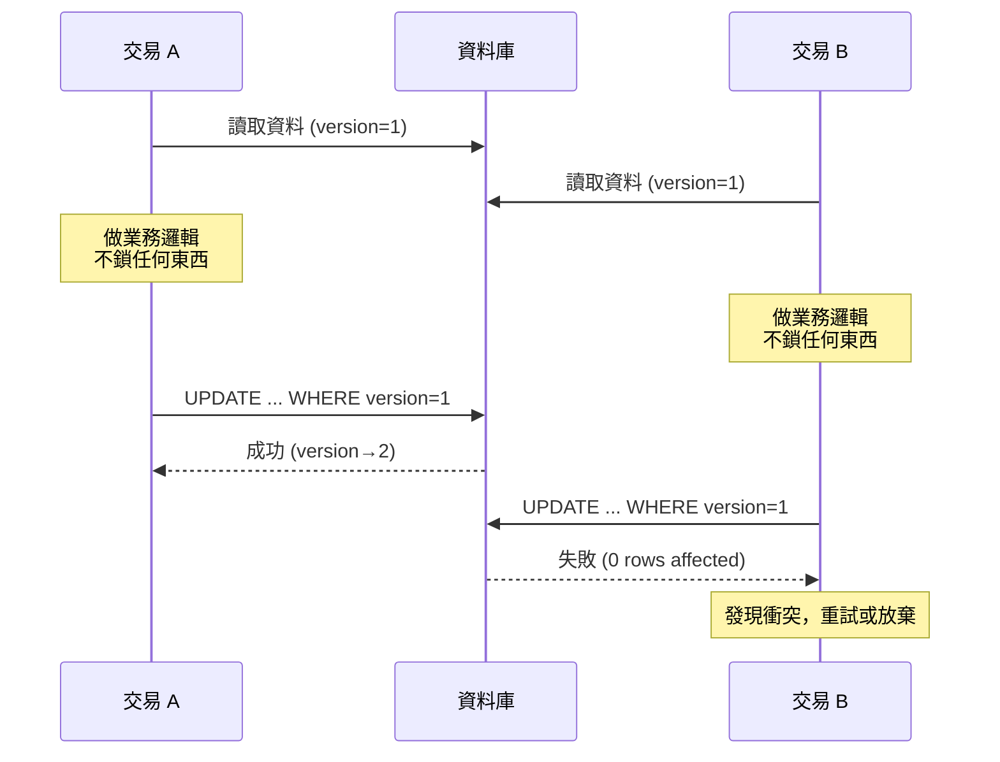
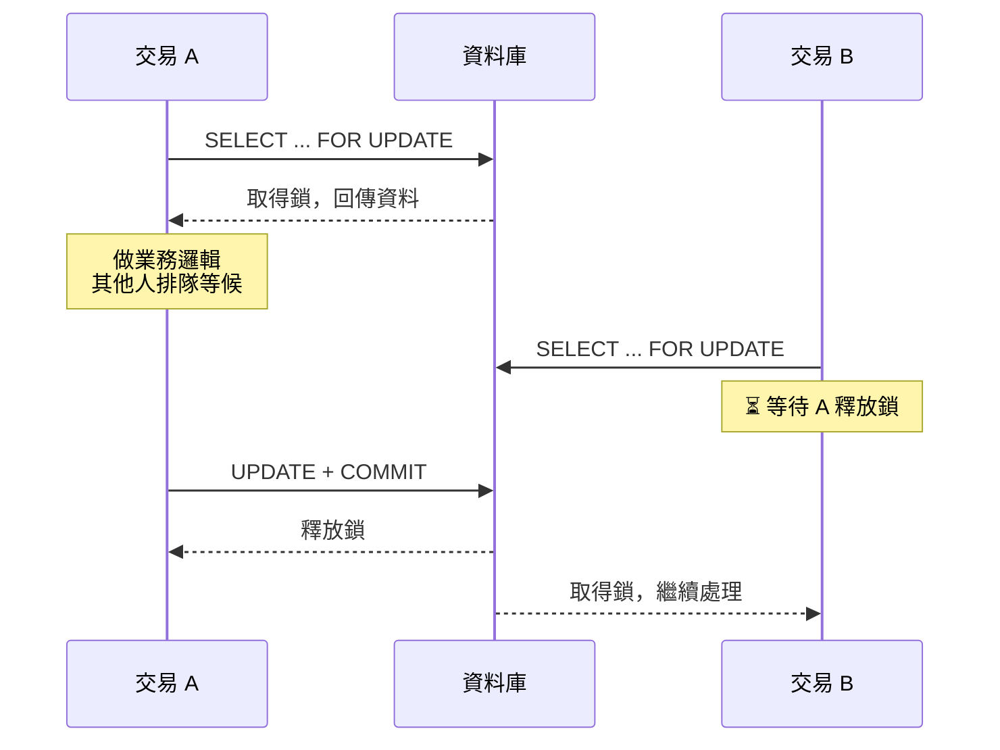
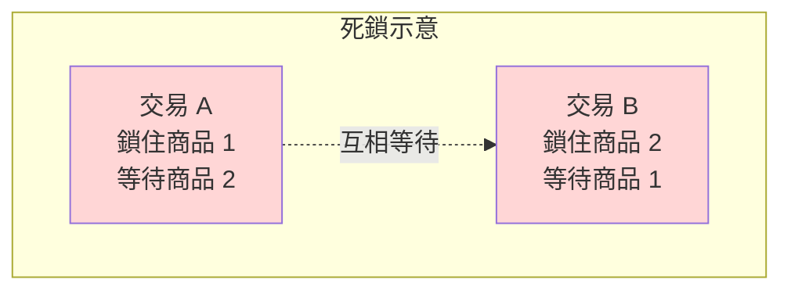

# 資料庫樂觀鎖與悲觀鎖｜概念說明

> 📝 TL;DR：樂觀鎖和悲觀鎖是兩種對付資料庫併發衝突的策略。樂觀鎖假設衝突很少發生，先做操作，提交時才檢查版本號有沒有被改過；悲觀鎖假設衝突一定會發生，操作前就先鎖住資料。選哪個取決於場景是讀多寫少還是寫多衝突高。

這一篇會學到的

1. 樂觀鎖跟悲觀鎖的核心差別在哪
2. 版本號機制是什麼
3. SELECT ... FOR UPDATE 在做什麼
4. 什麼場景用哪一種

## 為什麼需要鎖？

多人同時操作同一筆資料，一定會撞車。

庫存只剩 1 件，兩個使用者同時下單：

```
使用者 A: 查庫存 → 看到 1 → 下單 → 扣庫存
使用者 B: 查庫存 → 看到 1 → 下單 → 扣庫存
```

沒鎖的話，兩人都看到庫存 1，都覺得可以買，最後庫存變 -1，訂單開兩筆。

鎖就是來管這件事的。管的方式有兩種：一種是「先鎖再做事」（悲觀），一種是「做完再檢查有沒有被改過」（樂觀）。

## 樂觀鎖（Optimistic Locking）

> 樂觀的人說：不會有人跟我搶啦，先做再說

樂觀鎖假設衝突很少發生。不鎖資料，等到要寫入才檢查有沒有被別人改過。



### 版本號機制

每一筆資料多一個 `version` 欄位：

1. 讀取時把 `version` 記下來
2. 更新時下這個 SQL：

```sql
UPDATE products
SET stock = stock - 1, version = version + 1
WHERE id = 100 AND version = 1;
```

3. 如果影響行數是 0，代表 version 已經被改掉，要嘛重試要嘛放棄

也可以用時間戳，但實務上版本號比較穩。

:::tip
樂觀鎖是應用層面的機制，不是資料庫內建功能。資料庫不會幫你維護 version，你得自己在程式裡處理重試邏輯。
:::

### 適合場景

- **讀取多、寫入少**：大部份時候讀了不改，衝突機率低
- **衝突很少發生**：像是個人資料設定，很少人同時改
- **交易時間長**：交易裡要網路呼叫或複雜計算，悲觀鎖會卡很久，樂觀鎖沒這問題

### 潛在問題

寫入衝突高的時候 abort 率飆升。使用者一直看到「操作失敗，請重試」，體驗很差。重試邏輯寫不好還可能活鎖（livelock）——兩個交易互相讓對方失敗，永遠做不完。

## 悲觀鎖（Pessimistic Locking）

> 悲觀的人說：一定有人會來搶，我先鎖起來

悲觀鎖假設衝突一定會發生，操作資料前先鎖住，不讓別人碰。做完才解鎖。



### SELECT ... FOR UPDATE

SQL 長這樣：

```sql
BEGIN;

SELECT stock FROM products WHERE id = 100 FOR UPDATE;

-- 檢查庫存、做業務判斷

UPDATE products SET stock = stock - 1 WHERE id = 100;

COMMIT;
```

當某個交易下了 `FOR UPDATE`，其他交易：
- 也下 `FOR UPDATE`：被 blocking，等前面 commit 或 rollback
- 只做普通 `SELECT`：不受影響（InnoDB 一般讀取走 MVCC）

:::warning
`SELECT ... FOR UPDATE` 只在交易內有效。沒有 `BEGIN` / `START TRANSACTION` 的話，執行完就直接 auto-commit，鎖等於沒下。
:::

### 鎖的層級

| 鎖層級 | 說明 | 代價 |
|--------|------|------|
| Row Lock（行鎖） | 只鎖特定資料 | 小，併發度較高 |
| Table Lock（表鎖） | 鎖整張表 | 很大，OLTP 不該用 |
| Gap Lock / Next-Key Lock | 鎖一個範圍，防止幻讀 | InnoDB RR 隔離等級下出現 |

`FOR UPDATE` 預設是 row lock——前提是 WHERE 條件有走到索引，否則會升階成 table lock。

### 適合場景

- **寫入多、衝突高**：搶票、秒殺、庫存扣減
- **不容許失敗**：金流、帳務系統，不太想讓使用者看到「請重試」
- **操作時間短**：悲觀鎖不適合在鎖裡做 HTTP 呼叫，不然其他人卡死

### 潛在問題

最大的敵人是死鎖（deadlock）。



InnoDB 會自動偵測，選一個 rollback，讓另一個繼續。你的程式會收到 `Deadlock found when trying to get lock; try restarting transaction`。

:::danger
不要指望死鎖不會發生。高併發場景下死鎖是一定會出現的。你的程式必須要有重試機制來處理死鎖回滾。
:::

## 樂觀鎖 vs 悲觀鎖：一張表看清楚

| 比較維度 | 樂觀鎖 | 悲觀鎖 |
|----------|--------|--------|
| 基本假設 | 衝突很少發生 | 衝突一定會發生 |
| 鎖的時機 | 提交時檢查 | 讀取時就鎖 |
| 鎖的類型 | 版本號 / CAS（應用層） | 資料庫 row lock / table lock |
| 交易持有鎖時間 | 極短（只在 commit 瞬間） | 從 SELECT FOR UPDATE 到 COMMIT |
| 併發度 | 高（不阻塞讀取） | 低（其他寫入要排隊） |
| 衝突代價 | 整個交易重做 | 排在後面等 |
| 適合場景 | 讀多寫少、衝突低 | 寫入頻繁、衝突高 |
| 實作難度 | 要自己寫重試邏輯 | 資料庫內建，但要注意死鎖 |
| 常見問題 | 活鎖、abort 率過高 | 死鎖、鎖等待超時 |

## 死鎖自動偵測

InnoDB 內建死鎖偵測。發現兩個以上交易互相等對方釋放鎖時：

1. 選一個 rollback 代價較小的當犧牲者（通常是影響行數最少的）
2. rollback 該交易，釋放所有鎖
3. 讓其他交易繼續

用 `SHOW ENGINE INNODB STATUS` 可以看最近一次死鎖資訊，告訴你哪兩條 SQL 互卡。

:::tip
死鎖不一定是 bug。在高併發系統中，死鎖是正常現象，重點是你的應用程式有沒有處理 `DeadlockException` 並進行重試。
:::

## FAQ

### Q: 樂觀鎖是資料庫功能嗎？

A: 不是。樂觀鎖是應用層自己實作的 pattern，資料庫只負責執行你的 `WHERE version = ?` 跟回傳影響行數。重試邏輯得自己寫。

### Q: 悲觀鎖會讓效能變差嗎？

A: 看場景。衝突高的時候悲觀鎖反而有效率，大家排隊等就好不用一直重試。衝突低的時候鎖開銷就是多餘的。

### Q: `FOR UPDATE` 和 `LOCK IN SHARE MODE` 差在哪？

A: `FOR UPDATE` 是獨占鎖（X lock），不能讀也不能寫；`LOCK IN SHARE MODE` 是共享鎖（S lock），可以讀但不能寫。要準備更新的話通常用 `FOR UPDATE`。

### Q: 版本號機制會影響效能嗎？

A: 多一個欄位的寫入開銷極小，真正的成本是衝突發生時的重試。abort 率超過 10% 就該考慮悲觀鎖了。

### Q: 可以混合使用嗎？

A: 可以。同一個系統不同模組可以不同策略。庫存扣減用悲觀鎖，個人資料更新用樂觀鎖，完全合理。

## 延伸閱讀

- [Spring Boot 實作樂觀鎖與悲觀鎖](/springboot/optimistic-pessimistic-locking) — 看完概念後實際寫一支程式操作看看
- [資料庫 ACID 是什麼](/database/acid-transactions) — 鎖跟 Isolation 高度相關
- [資料庫索引基礎入門](/database/database-index-basic) — `FOR UPDATE` 有沒有走索引決定是 row lock 還是 table lock
