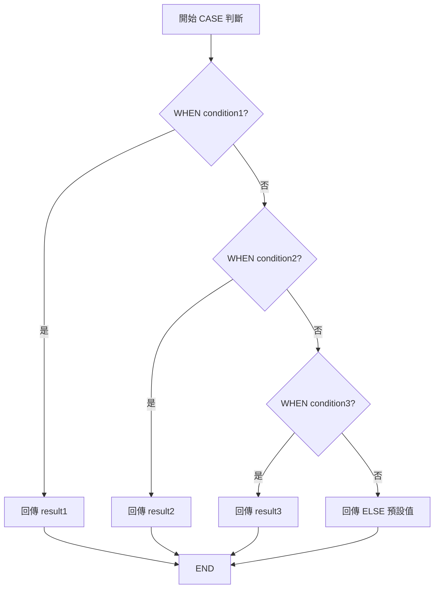

# SQL CASE...WHEN...THEN

> 📝 TL;DR：CASE 是 SQL 的條件運算器，可在 SELECT、ORDER BY、UPDATE 中根據條件回傳不同值，支援巢狀、條件聚合與客製排序，是實現複雜業務邏輯的核心工具。

## 前置知識

在開始之前，建議你先了解以下概念：

- **基本 SQL 語法** - SELECT、WHERE、GROUP BY 的基礎使用
- **布林邏輯** - AND、OR、NOT 的運算規則
- **聚合函式** - COUNT、SUM、AVG 等函式的基本用法

## 什麼是 CASE？

### 為什麼需要學習它？

CASE 表達式就像程式語言中的 if-else，但它運作在 SQL 查詢內部：

- **解決什麼問題？** 需要根據不同條件顯示不同結果、進行條件計算或自訂排序
- **有什麼優勢？** 一次查詢即可完成複雜的條件邏輯，無需多次查詢或應用層處理
- **什麼時候會用到？** 資料分類標籤、條件聚合統計、客製化排序、批次更新等場景

### 核心概念

CASE 是一種**條件表達式**，會依序檢查每個 WHEN 條件，回傳第一個符合條件的 THEN 結果，若都不符合則回傳 ELSE 的預設值。

:::warning ⚠️ 注意
- CASE 會回傳**第一個**符合的條件結果，之後的條件不再檢查
- 所有 THEN 和 ELSE 回傳的資料型別應該一致
- 處理 NULL 值時需使用 `IS NULL` 而非 `= NULL`
:::

## 💻 基本語法

### 語法結構

```sql
-- Searched CASE（條件判斷型）
CASE
    WHEN condition1 THEN result1
    WHEN condition2 THEN result2
    WHEN condition3 THEN result3
    ELSE default_result
END

-- Simple CASE（值比對型）
CASE expression
    WHEN value1 THEN result1
    WHEN value2 THEN result2
    ELSE default_result
END
```

### 參數說明

| 元素       | 說明                                       | 必填 |
| ---------- | ------------------------------------------ | ---- |
| WHEN       | 條件判斷式，可使用任何布林運算             | 是   |
| THEN       | 條件成立時回傳的結果                       | 是   |
| ELSE       | 所有條件都不成立時的預設值                 | 否   |
| END        | 結束 CASE 表達式                           | 是   |
| expression | Simple CASE 中要比對的欄位或表達式（選用） | 否   |

## 視覺化說明：CASE 決策樹



## 實際範例

### 範例 1：基礎應用 - 薪資分級

**情境說明：** 我們有一個員工表，需要根據薪資範圍為員工貼上等級標籤。

```sql
SELECT 
    employee_id,
    salary,
    CASE 
        WHEN salary < 30000 THEN '初級'
        WHEN salary BETWEEN 30000 AND 50000 THEN '中級'
        WHEN salary > 50000 THEN '高級'
        ELSE '未分類'
    END AS salary_grade
FROM 
    employees;

-- 輸出結果：
-- employee_id | salary | salary_grade
-- ------------|--------|-------------
-- 1           | 25000  | 初級
-- 2           | 45000  | 中級
-- 3           | 60000  | 高級
```

**程式碼說明：**
1. 依序檢查每個 WHEN 條件
2. salary < 30000 為真時，立即回傳「初級」並結束判斷
3. 若都不符合，回傳 ELSE 的「未分類」

### 範例 2：條件聚合統計

**情境說明：** 統計各部門男女員工的平均薪資，一次查詢完成。

```sql
SELECT 
    department,
    AVG(CASE WHEN gender = 'Male' THEN salary END) AS avg_male_salary,
    AVG(CASE WHEN gender = 'Female' THEN salary END) AS avg_female_salary,
    COUNT(CASE WHEN gender = 'Male' THEN 1 END) AS male_count
FROM 
    employees
GROUP BY 
    department;

-- 輸出結果：
-- department | avg_male_salary | avg_female_salary | male_count
-- -----------|-----------------|-------------------|------------
-- IT         | 55000           | 52000             | 15
-- Sales      | 48000           | 46000             | 20
```

**程式碼說明：**
1. 在聚合函式內使用 CASE，只計算符合條件的值
2. 不符合條件時回傳 NULL，不影響 AVG 計算
3. COUNT 搭配 CASE 可統計特定條件的筆數

### 範例 3：自訂排序邏輯

**情境說明：** 訂單列表需要優先顯示「緊急」訂單，再來是「處理中」，最後是「已完成」。

```sql
SELECT 
    order_id, 
    status, 
    created_at
FROM 
    orders
ORDER BY
    CASE 
        WHEN status = 'urgent' THEN 1
        WHEN status = 'processing' THEN 2
        WHEN status = 'completed' THEN 3
        ELSE 4
    END,
    created_at DESC;
```

**程式碼說明：**
1. ORDER BY 中使用 CASE 指定每個狀態的排序權重
2. 數字越小排序越前面
3. 同狀態內再依 created_at 降冪排序

### 範例 4：批次調整薪資

**情境說明：** 根據績效評等批次調整員工獎金。

```sql
UPDATE employees
SET bonus = 
    CASE 
        WHEN performance_rating = 'Excellent' THEN salary * 0.1
        WHEN performance_rating = 'Good' THEN salary * 0.05
        WHEN performance_rating = 'Average' THEN salary * 0.02
        ELSE 0
    END;
```

**程式碼說明：**
1. UPDATE 搭配 CASE 可一次性依不同條件更新
2. 避免多次 UPDATE 語句，提升效能
3. ELSE 0 確保沒有評等的員工獎金為 0

### 範例 5：巢狀 CASE（複雜判斷）

**情境說明：** 業務部門需要更細緻的績效分級。

```sql
SELECT 
    employee_id,
    department,
    CASE 
        WHEN department = 'Sales' THEN
            CASE
                WHEN sales_amount > 100000 THEN 'S級業務'
                WHEN sales_amount > 50000 THEN 'A級業務'
                WHEN sales_amount > 30000 THEN 'B級業務'
                ELSE 'C級業務'
            END
        WHEN department = 'IT' THEN 'IT人員'
        ELSE '一般員工'
    END AS performance_level
FROM 
    employees;
```

## 實戰練習

### 練習 1：基礎應用（簡單）⭐

**任務：** 請為學生成績表建立及格/不及格標籤。

資料表 `students` 有欄位：`student_id`, `name`, `score`

**提示：**
- 60 分以上為「及格」
- 60 分以下為「不及格」

:::details 參考答案
```sql
SELECT 
    student_id,
    name,
    score,
    CASE 
        WHEN score >= 60 THEN '及格'
        ELSE '不及格'
    END AS pass_status
FROM 
    students;

-- 輸出結果：
-- student_id | name  | score | pass_status
-- -----------|-------|-------|-------------
-- 1          | 小明  | 75    | 及格
-- 2          | 小華  | 45    | 不及格
```

**說明：**
使用簡單的 CASE 判斷，score >= 60 時回傳「及格」，否則回傳「不及格」。
:::

### 練習 2：條件計數（簡單）⭐

**任務：** 統計各部門「高薪」（>50000）和「一般薪資」（<=50000）的員工人數。

**思考方向：**
- 使用 COUNT + CASE 組合
- 在 GROUP BY department 後分組統計

:::details 參考答案
```sql
SELECT 
    department,
    COUNT(CASE WHEN salary > 50000 THEN 1 END) AS high_salary_count,
    COUNT(CASE WHEN salary <= 50000 THEN 1 END) AS normal_salary_count
FROM 
    employees
GROUP BY 
    department;
```

**說明：**
1. COUNT 只計算非 NULL 值
2. CASE 符合條件時回傳 1，否則回傳 NULL
3. 這樣可以在一次查詢中同時統計兩種條件
:::

### 練習 3：綜合應用（中等）⭐⭐

**任務：** 建立一個複雜的客戶等級系統。

**需求：**
1. VIP 客戶（總消費 > 100000）給予「鑽石會員」
2. 一般客戶（總消費 50000-100000）且訂單數 > 10 給予「金牌會員」
3. 一般客戶（總消費 50000-100000）且訂單數 <= 10 給予「銀牌會員」
4. 其餘給予「一般會員」

**提示：**
- 需要 JOIN customers 和 orders 表
- 使用 SUM 和 COUNT 計算總消費和訂單數
- 巢狀 CASE 處理複雜條件

:::details 參考答案與解題思路

**解題思路：**
1. 先用子查詢或 CTE 計算每個客戶的總消費和訂單數
2. 外層查詢使用巢狀 CASE 判斷等級
3. 注意條件的優先順序

**參考程式碼：**
```sql
WITH customer_stats AS (
    SELECT 
        c.customer_id,
        c.name,
        SUM(o.amount) AS total_spent,
        COUNT(o.order_id) AS order_count
    FROM 
        customers c
        LEFT JOIN orders o ON c.customer_id = o.customer_id
    GROUP BY 
        c.customer_id, c.name
)
SELECT 
    customer_id,
    name,
    total_spent,
    order_count,
    CASE 
        WHEN total_spent > 100000 THEN '鑽石會員'
        WHEN total_spent BETWEEN 50000 AND 100000 THEN
            CASE 
                WHEN order_count > 10 THEN '金牌會員'
                ELSE '銀牌會員'
            END
        ELSE '一般會員'
    END AS membership_level
FROM 
    customer_stats
ORDER BY 
    total_spent DESC;
```

**延伸思考：**
- 如何優化此查詢效能？（考慮索引）
- 如果要加入「最近一年消費」條件該如何修改？
- 實際專案中可能需要定期更新會員等級，如何實作自動化？
:::

## 常見問題 FAQ

### Q1: CASE 可以在 WHERE 子句中使用嗎？

**A:** 可以，但通常不建議。WHERE 中的 CASE 會讓查詢優化器難以使用索引。

```sql
-- ❌ 不推薦（無法使用索引）
WHERE CASE WHEN status = 'active' THEN 1 ELSE 0 END = 1

-- ✅ 推薦（可使用索引）
WHERE status = 'active'
```

### Q2: CASE 與 IF/DECODE 的差別是什麼？

**A:** 比較說明：

| 項目       | CASE                   | IF               | DECODE         |
| ---------- | ---------------------- | ---------------- | -------------- |
| 標準       | SQL 標準，跨資料庫通用 | MySQL 專用       | Oracle 專用    |
| 可讀性     | 高，結構清晰           | 中等             | 較低           |
| 巢狀支援   | 佳，可多層巢狀         | 可巢狀但較難閱讀 | 有限           |
| 條件複雜度 | 支援複雜布林條件       | 支援             | 僅支援等值比對 |

**建議：** 優先使用 CASE，因為它是 SQL 標準且可讀性最佳。

### Q3: CASE 中如何處理 NULL 值？

**A:** 必須使用 `IS NULL` 或 `IS NOT NULL`，不能用 `= NULL`。

```sql
-- ✅ 正確
CASE 
    WHEN column IS NULL THEN '無資料'
    ELSE column
END

-- ❌ 錯誤（永遠不會成立）
CASE 
    WHEN column = NULL THEN '無資料'
    ELSE column
END
```

### Q4: CASE 會影響查詢效能嗎？

**A:** CASE 本身運算輕量，但要注意：
- 在大量資料上避免在 WHERE 中使用 CASE（破壞索引）
- SELECT 中的 CASE 對效能影響很小
- 複雜巢狀 CASE 可能影響可讀性，但對效能影響有限
- 
## 最佳實踐

### ✅ 推薦做法

1. **使用明確的 ELSE** - 即使邏輯上不需要，也建議加上 ELSE，提高可讀性
2. **條件順序優化** - 把最常見的條件放在最前面，減少判斷次數
3. **避免過度巢狀** - 超過 2 層巢狀建議改用 JOIN 或子查詢
4. **統一資料型別** - 確保所有 THEN 和 ELSE 回傳相同型別

### ❌ 常見錯誤

1. **忘記 END** - CASE 必須用 END 結尾
2. **型別不一致** - 不同分支回傳不同型別可能導致錯誤
3. **NULL 判斷錯誤** - 使用 `= NULL` 而非 `IS NULL`
4. **在 WHERE 濫用** - 破壞索引效能

## 延伸閱讀

### 相關文章

本站相關主題：
- [SQL JOIN 完整指南](/database/sql/sql-join) - 了解多表關聯查詢
- [資料庫索引基礎](/database/database-index-basic) - 優化查詢效能

### 推薦資源

外部優質資源：
- [PostgreSQL CASE 官方文件](https://www.postgresql.org/docs/current/functions-conditional.html)
- [MySQL CASE 語法參考](https://dev.mysql.com/doc/refman/8.0/en/flow-control-functions.html#operator_case)

## 總結

用 4 個重點總結這篇文章：

1. **條件邏輯** - CASE 是 SQL 的 if-else，依序判斷條件並回傳結果
2. **應用場景** - 可用於 SELECT（分類標籤）、ORDER BY（自訂排序）、聚合函式（條件統計）、UPDATE（批次更新）
3. **最佳實踐** - 使用明確 ELSE、避免過度巢狀、注意型別一致性
4. **效能考量** - 避免在 WHERE 使用 CASE，SELECT 中使用對效能影響小

## 進階語法（保留舊內容）

### 1. 在 GROUP BY 中使用 CASE:

### 1. 在 GROUP BY 中使用 CASE:

假設我們想按照薪資等級對員工進行分組統計:

```sql
SELECT 
    CASE 
        WHEN salary < 30000 THEN '初級'
        WHEN salary BETWEEN 30000 AND 50000 THEN '中級'
        WHEN salary > 50000 THEN '高級'
        ELSE '未分類'
    END AS salary_grade,
    COUNT(*) AS employee_count
FROM 
    employees
GROUP BY 
    CASE 
        WHEN salary < 30000 THEN '初級'
        WHEN salary BETWEEN 30000 AND 50000 THEN '中級'
        WHEN salary > 50000 THEN '高級'
        ELSE '未分類'
    END;
```

### 2. 在 ORDER BY 中使用 CASE:

我們可以使用 CASE 來自定義排序邏輯:

```sql
SELECT 
    employee_id, 
    department, 
    salary
FROM 
    employees
ORDER BY
    CASE 
        WHEN department = 'IT' THEN 1
        WHEN department = 'Sales' THEN 2
        WHEN department = 'HR' THEN 3
        ELSE 4
    END,
    salary DESC;
```

### 3. 使用 CASE 進行條件聚合:

```sql
SELECT 
    department,
    AVG(CASE WHEN gender = 'Male' THEN salary END) AS avg_male_salary,
    AVG(CASE WHEN gender = 'Female' THEN salary END) AS avg_female_salary
FROM 
    employees
GROUP BY 
    department;
```

### 4. 在 UPDATE 語句中使用 CASE:

```sql
UPDATE employees
SET bonus = 
    CASE 
        WHEN performance_rating = 'Excellent' THEN salary * 0.1
        WHEN performance_rating = 'Good' THEN salary * 0.05
        ELSE 0
    END;
```

### 5. 巢狀 CASE 語句:

```sql
SELECT 
    employee_id,
    CASE 
        WHEN department = 'Sales' THEN
            CASE
                WHEN sales_amount > 50000 THEN 'Top Performer'
                WHEN sales_amount > 30000 THEN 'Good Performer'
                ELSE 'Average Performer'
            END
        ELSE 'N/A'
    END AS sales_performance
FROM 
    employees;
```

這些舊版範例展示了 CASE 語句的多樣性和靈活性。它不僅可以用於簡單的條件邏輯，還可以在複雜的查詢、分組、排序和更新操作中發揮重要作用。