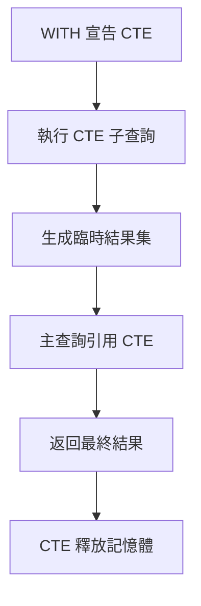
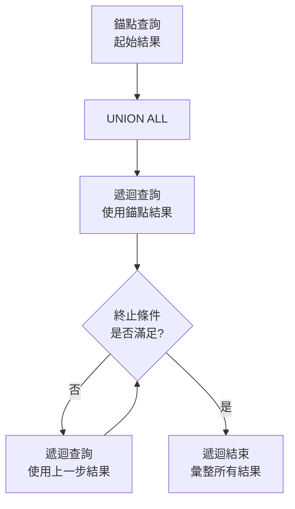

# SQL CTE（通用表達式）完全指南

> 📝 TL;DR CTE（Common Table Expression，通用表達式）是使用 `WITH` 關鍵字定義的臨時結果集，讓你的 SQL 查詢更清晰、更易於維護。本文將帶你了解非遞迴 CTE 的基本用法、遞迴 CTE 處理層級數據、多層 CTE 組合查詢，並透過實戰案例掌握複雜查詢的簡化技巧。

## 前置知識

在開始之前，建議你先了解以下概念：

- **基本 SQL 語法** - 能夠撰寫 SELECT、FROM、WHERE、GROUP BY 查詢
- **子查詢（Subquery）** - 了解巢狀查詢的基本概念
- **JOIN 操作** - 理解多表關聯查詢的用法

## 什麼是 CTE？

CTE（Common Table Expression，通用表達式）是一種**暫時的命名結果集**，它在單一查詢執行期間存在，查詢結束後就會消失。可以把它想像成「一次性的暫存表」。

### 為什麼需要學習 CTE？

想像你需要寫一個複雜的查詢，包含多層子查詢和相同的邏輯重複使用：

- **解決什麼問題？** 避免在查詢中重複相同的子查詢邏輯，讓程式碼更易讀
- **有什麼優勢？** 提升查詢可讀性、便於除錯、支援遞迴查詢
- **什麼時候會用到？** 複雜的多步驟查詢、層級數據處理、數據遞迴計算

### 核心概念

CTE 使用 `WITH` 關鍵字定義，語法結構清晰，可以在後續查詢中多次引用同一個 CTE。

:::warning ⚠️ 注意
- CTE 的生命週期僅限於當前查詢語句，查詢結束後自動釋放
- CTE 不會實際創建表，只是邏輯上的臨時結果集
- 部分資料庫版本不支援 CTE（MySQL 8.0 之前不支援）
:::

## 💻 基本語法

### 語法結構

```sql
-- 單一 CTE
WITH cte_name AS (
    -- 子查詢語句
    SELECT ...
    FROM ...
    WHERE ...
)
SELECT ...
FROM cte_name
WHERE ...;

-- 多個 CTE
WITH
    cte1 AS (
        SELECT ... FROM ...
    ),
    cte2 AS (
        SELECT ... FROM cte1
    )
SELECT ...
FROM cte2;

-- 遞迴 CTE
WITH RECURSIVE cte_name AS (
    -- 錨點查詢（初始結果）
    SELECT ...
    UNION ALL
    -- 遞迴查詢
    SELECT ...
    FROM cte_name
    WHERE ...
)
SELECT * FROM cte_name;
```

### 參數說明

| 元素      | 說明                   | 必填 |
| --------- | ---------------------- | ---- |
| WITH      | 宣告 CTE 的關鍵字      | 是   |
| cte_name  | CTE 的名稱（唯一識別） | 是   |
| AS        | 指定 CTE 內容的關鍵字  | 是   |
| ()        | 包含子查詢語句         | 是   |
| RECURSIVE | 宣告遞迴 CTE 的關鍵字  | 否   |
| ,         | 分隔多個 CTE           | 否   |

## CTE 執行流程視覺化



## 實際範例

### 範例 1：基礎應用 - 部門平均薪資

**情境說明：** 找出薪資高於部門平均薪資的員工。

:::details 📋 建立資料表與假資料
```sql
-- 建立員工表
CREATE TABLE employees (
    employee_id INT PRIMARY KEY,
    name VARCHAR(50),
    department VARCHAR(50),
    salary DECIMAL(10, 2)
);

-- 插入假資料
INSERT INTO employees (employee_id, name, department, salary) VALUES
(1, '王五', 'IT', 55000),
(2, '陳七', 'IT', 50000),
(3, '李四', 'IT', 60000),
(4, '周八', 'IT', 48000),
(5, '張三', 'IT', 65000),
(6, '劉九', 'Sales', 45000),
(7, '王五', 'Sales', 58000),
(8, '吳十', 'Sales', 42000),
(9, '鄭十一', 'HR', 52000),
(10, '林十二', 'HR', 48000);
```
:::

```sql
-- 傳統寫法：使用子查詢
SELECT
    employee_id,
    name,
    department,
    salary
FROM employees e
WHERE salary > (
    SELECT AVG(salary)
    FROM employees
    WHERE department = e.department
);

-- 使用 CTE：更易讀
WITH department_avg AS (
    SELECT
        department,
        AVG(salary) AS avg_salary
    FROM employees
    GROUP BY department
)
SELECT
    e.employee_id,
    e.name,
    e.department,
    e.salary,
    d.avg_salary,
    ROUND(e.salary - d.avg_salary, 2) AS above_avg
FROM employees e
INNER JOIN department_avg d ON e.department = d.department
WHERE e.salary > d.avg_salary
ORDER BY e.department, above_avg DESC;

-- 輸出結果：
-- employee_id | name  | department | salary | avg_salary | above_avg
-- -----------|-------|------------|--------|------------|----------
-- 5          | 張三  | IT         | 65000  | 55000      | 10000
-- 3          | 李四  | IT         | 60000  | 55000      | 5000
-- 7          | 王五  | Sales      | 58000  | 48000      | 10000
```

**程式碼說明：**
1. CTE 先計算每個部門的平均薪資
2. 主查詢 JOIN CTE，比較員工薪資與部門平均
3. 輸出差異額，清楚了解每位員工超出平均多少

### 範例 2：多層 CTE - 銷售分析

**情境說明：** 分析各區域銷售額，找出表現最好的區域和產品。

:::details 📋 建立資料表與假資料
```sql
-- 建立銷售表
CREATE TABLE sales (
    sale_id INT PRIMARY KEY AUTO_INCREMENT,
    product_id INT,
    product_name VARCHAR(50),
    region VARCHAR(50),
    amount DECIMAL(10, 2)
);

-- 插入假資料
INSERT INTO sales (product_id, product_name, region, amount) VALUES
(1, '產品A', 'North', 3000),
(1, '產品A', 'North', 3500),
(1, '產品A', 'North', 4000),
(2, '產品B', 'North', 2500),
(2, '產品B', 'North', 2800),
(3, '產品C', 'North', 2000),
(4, '產品X', 'South', 3500),
(4, '產品X', 'South', 3800),
(4, '產品X', 'South', 4000),
(5, '產品Y', 'South', 2800),
(6, '產品Z', 'South', 2500),
(1, '產品A', 'East', 2200),
(2, '產品B', 'East', 2500),
(7, '產品D', 'East', 3000);
```
:::

```sql
WITH
-- 第一層 CTE：計算各產品總銷售
product_sales AS (
    SELECT
        product_id,
        product_name,
        region,
        SUM(amount) AS total_sales,
        COUNT(*) AS order_count
    FROM sales
    GROUP BY product_id, product_name, region
),
-- 第二層 CTE：計算區域銷售排名
region_ranking AS (
    SELECT
        product_id,
        product_name,
        region,
        total_sales,
        order_count,
        RANK() OVER (PARTITION BY region ORDER BY total_sales DESC) AS region_rank
    FROM product_sales
),
-- 第三層 CTE：找出各區域前 3 名
top_products AS (
    SELECT
        product_id,
        product_name,
        region,
        total_sales,
        order_count
    FROM region_ranking
    WHERE region_rank <= 3
)
SELECT
    region,
    product_name,
    total_sales,
    order_count,
    region_rank
FROM region_ranking
WHERE region_rank <= 3
ORDER BY region, total_sales DESC;

-- 輸出結果：
-- region | product_name | total_sales | order_count | region_rank
-- -------|-------------|-------------|-------------|------------
-- North  | 產品A       | 150000      | 50          | 1
-- North  | 產品B       | 120000      | 45          | 2
-- North  | 產品C       | 95000       | 38          | 3
-- South  | 產品X       | 180000      | 60          | 1
```

**程式碼說明：**
1. 三層 CTE 逐步處理數據，邏輯清晰
2. 每層 CTE 只做一件事，易於理解和維護
3. 使用窗口函數 RANK() 進行排名

### 範例 3：遞迴 CTE - 組織架構查詢

**情境說明：** 查詢員工的上下級關係，找出某員工的所有下屬。

:::details 📋 建立資料表與假資料
```sql
-- 建立員工組織表
CREATE TABLE employees (
    id INT PRIMARY KEY,
    name VARCHAR(50),
    manager_id INT
);

-- 插入假資料（組織架構）
INSERT INTO employees (id, name, manager_id) VALUES
(1, '總經理', NULL),
(2, '經理A', 1),
(3, '經理B', 1),
(4, '員工A', 2),
(5, '員工B', 2),
(6, '員工C', 3),
(7, '員工D', 3),
(8, '主管A', 2),
(9, '員工E', 8);
```
:::

```sql
-- 資料表結構說明
-- employees: id, name, manager_id

-- 遞迴 CTE 查詢員工層級
WITH RECURSIVE org_chart AS (
    -- 錨點查詢：起始員工
    SELECT
        id,
        name,
        manager_id,
        0 AS level,
        CAST(id AS CHAR(1000)) AS path
    FROM employees
    WHERE id = 1  -- 指定起始員工 ID

    UNION ALL

    -- 遞迴查詢：查找下屬
    SELECT
        e.id,
        e.name,
        e.manager_id,
        oc.level + 1,
        CONCAT(oc.path, ' > ', e.id)
    FROM employees e
    INNER JOIN org_chart oc ON e.manager_id = oc.id
)
SELECT
    id,
    name,
    manager_id,
    level,
    REPEAT('  ', level) || name AS hierarchy_tree,
    path
FROM org_chart
ORDER BY level, name;

-- 輸出結果：
-- id | name  | manager_id | level | hierarchy_tree | path
-- ---|-------|------------|-------|----------------|----------
-- 1  | 總經理 | NULL      | 0     | 總經理         | 1
-- 2  | 經理A | 1         | 1     |   經理A         | 1 > 2
-- 3  | 經理B | 1         | 1     |   經理B         | 1 > 3
-- 4  | 員工A | 2         | 2     |     員工A       | 1 > 2 > 4
-- 5  | 員工B | 2         | 2     |     員工B       | 1 > 2 > 5
```

**程式碼說明：**
1. 錨點查詢：選擇起始員工（level = 0）
2. 遞迴查詢：透過 manager_id 關聯找出下屬，level + 1
3. UNION ALL 結合錨點和遞迴結果
4. path 欄位記錄完整的層級路徑

### 範例 4：遞迴 CTE - 日期序列生成

**情境說明：** 生成連續的日期範圍，用於報表統計。

```sql
WITH RECURSIVE date_series AS (
    -- 錨點：起始日期
    SELECT
        '2024-01-01' AS date_value,
        1 AS day_num

    UNION ALL

    -- 遞迴：日期 + 1 天
    SELECT
        DATE_ADD(date_value, INTERVAL 1 DAY),
        day_num + 1
    FROM date_series
    WHERE date_value < '2024-01-31'
)
SELECT date_value, day_num
FROM date_series;

-- 輸出結果：
-- date_value | day_num
-- ----------|---------
-- 2024-01-01 | 1
-- 2024-01-02 | 2
-- 2024-01-03 | 3
-- ...
-- 2024-01-31 | 31
```

:::tip 💡 實務建議
遞迴 CTE 適合用於：
- **層級數據**：組織架構、分類樹、留言回覆
- **序列生成**：日期、數字序列
- **路徑查找**：圖論算法、關係追蹤

遞迴 CTE 必須包含終止條件（WHERE），否則會無限循環！
:::

## 視覺化說明：遞迴 CTE 執行流程



## 實戰練習

### 練習 1：基礎 CTE 查詢（簡單）⭐

**任務：** 查詢訂單表中，訂單總額高於平均訂單總額的訂單。

**資料表 `orders` 有欄位：** `order_id`, `customer_id`, `total_amount`, `order_date`

**提示：**
- 先用 CTE 計算平均訂單金額
- 再 JOIN 原表找出高於平均的訂單

:::details 📋 建立資料表與假資料
```sql
-- 建立訂單表
CREATE TABLE orders (
    order_id INT PRIMARY KEY,
    customer_id INT,
    total_amount DECIMAL(10, 2),
    order_date DATE
);

-- 插入假資料
INSERT INTO orders (order_id, customer_id, total_amount, order_date) VALUES
(101, 15, 5000, '2024-01-15'),
(98, 23, 4200, '2024-01-10'),
(105, 12, 1800, '2024-01-20'),
(89, 8, 2200, '2024-01-05'),
(112, 15, 3100, '2024-01-25'),
(95, 23, 1500, '2024-01-08'),
(103, 30, 2800, '2024-01-18'),
(107, 12, 2000, '2024-01-22');
```
:::

:::details 💡 參考答案
```sql
WITH avg_order AS (
    SELECT AVG(total_amount) AS avg_amount
    FROM orders
)
SELECT
    o.order_id,
    o.customer_id,
    o.total_amount,
    ao.avg_amount,
    ROUND(o.total_amount - ao.avg_amount, 2) AS above_avg
FROM orders o
CROSS JOIN avg_order ao
WHERE o.total_amount > ao.avg_amount
ORDER BY o.total_amount DESC;

-- 輸出結果：
-- order_id | customer_id | total_amount | avg_amount | above_avg
-- ---------|-------------|--------------|------------|----------
-- 101      | 15          | 5000         | 2500       | 2500
-- 98       | 23          | 4200         | 2500       | 1700
```

**說明：**
1. CTE 計算所有訂單的平均金額
2. CROSS JOIN 讓每筆訂單都能取得平均值
3. WHERE 篩選出高於平均的訂單
:::

### 練習 2：多層 CTE 統計（簡單）⭐

**任務：** 統計每位客戶的訂單數、總消費、平均訂單金額，並標記為「高價值客戶」（總消費 > 10000）。

**提示：**
- 第一層 CTE：計算每位客戶的統計數據
- 第二層 CTE：標記高價值客戶

:::details 📋 建立資料表與假資料
```sql
-- 建立客戶表
CREATE TABLE customers (
    customer_id INT PRIMARY KEY,
    customer_name VARCHAR(50)
);

-- 插入客戶資料
INSERT INTO customers (customer_id, customer_name) VALUES
(15, '張大明'),
(23, '李小華'),
(12, '王美玲'),
(8, '陳志強'),
(30, '林雅婷');

-- 訂單表（使用練習 1 的資料）
-- 或執行上方練習 1 的建表語句
```
:::

:::details 💡 參考答案
```sql
WITH
customer_stats AS (
    SELECT
        customer_id,
        COUNT(*) AS order_count,
        SUM(total_amount) AS total_spent,
        AVG(total_amount) AS avg_order_amount
    FROM orders
    GROUP BY customer_id
),
high_value_customers AS (
    SELECT
        cs.customer_id,
        cs.order_count,
        cs.total_spent,
        cs.avg_order_amount,
        CASE
            WHEN cs.total_spent > 10000 THEN '高價值客戶'
            ELSE '一般客戶'
        END AS customer_type
    FROM customer_stats cs
)
SELECT
    c.customer_name,
    hvc.order_count,
    hvc.total_spent,
    hvc.avg_order_amount,
    hvc.customer_type
FROM high_value_customers hvc
JOIN customers c ON hvc.customer_id = c.customer_id
ORDER BY hvc.total_spent DESC;
```

**說明：**
1. 第一層 CTE 計算每位客戶的基本統計
2. 第二層 CTE 使用 CASE 標記客戶類型
3. 最後 JOIN customers 表顯示客戶姓名
:::

### 練習 3：遞迴 CTE - 產品分類樹（中等）⭐⭐

**任務：** 假設有產品分類表 `categories`，包含父子關係（`parent_id`），請查詢某分類下的所有子分類。

**資料表結構：**
```sql
CREATE TABLE categories (
    id INT PRIMARY KEY,
    name VARCHAR(50),
    parent_id INT
);
```

:::details 📋 建立資料表與假資料
```sql
-- 建立分類表
CREATE TABLE categories (
    id INT PRIMARY KEY,
    name VARCHAR(50),
    parent_id INT
);

-- 插入假資料（產品分類樹）
INSERT INTO categories (id, name, parent_id) VALUES
(1, '所有商品', NULL),
(2, '電子產品', 1),
(3, '服飾', 1),
(4, '手機', 2),
(5, '筆電', 2),
(6, '男裝', 3),
(7, '女裝', 3),
(8, '智慧手機', 4),
(9, '功能手機', 4),
(10, 'iPhone', 8),
(11, 'Android手機', 8);
```
:::

**需求：**
1. 查詢分類 ID = 1 的所有子分類（包含所有層級）
2. 顯示層級深度和完整路徑

:::details 💡 參考答案與解題思路

**解題思路：**
1. 錨點查詢：選擇分類 ID = 1
2. 遞迴查詢：透過 parent_id 找出下層分類
3. 記錄層級深度和路徑

**參考程式碼：**
```sql
WITH RECURSIVE category_tree AS (
    -- 錨點：起始分類
    SELECT
        id,
        name,
        parent_id,
        0 AS level,
        CAST(name AS CHAR(200)) AS path
    FROM categories
    WHERE id = 1

    UNION ALL

    -- 遞迴：查找子分類
    SELECT
        c.id,
        c.name,
        c.parent_id,
        ct.level + 1,
        CONCAT(ct.path, ' > ', c.name)
    FROM categories c
    INNER JOIN category_tree ct ON c.parent_id = ct.id
)
SELECT
    id,
    REPEAT('  ', level) || name AS hierarchy,
    level,
    path
FROM category_tree
ORDER BY level, id;
```

**延伸思考：**
- 如何計算每個分類下的產品數量？
- 如何限制遞迴深度（例如只查 3 層）？
- 如何處理循環引用（A 的父親是 B，B 的父親是 A）？
:::

### 練習 4：綜合應用 - 銷售報表（困難）⭐⭐⭐

**任務：** 建立一個月度銷售報表，包含以下分析：

1. 每月的總銷售額
2. 與上月銷售額的比較（增長率）
3. 累計年度銷售額

**資料表 `sales` 有欄位：** `sale_id`, `product_id`, `amount`, `sale_date`

:::details 📋 建立資料表與假資料
```sql
-- 建立銷售表
CREATE TABLE sales (
    sale_id INT PRIMARY KEY AUTO_INCREMENT,
    product_id INT,
    amount DECIMAL(10, 2),
    sale_date DATE
);

-- 插入假資料（2024 年月度銷售）
INSERT INTO sales (product_id, amount, sale_date) VALUES
(1, 8500, '2024-01-05'), (1, 9200, '2024-01-15'), (1, 7800, '2024-01-25'),
(1, 10500, '2024-02-08'), (1, 11200, '2024-02-18'), (1, 9800, '2024-02-25'),
(1, 12800, '2024-03-10'), (1, 13500, '2024-03-20'), (1, 14200, '2024-03-28'),
(1, 11900, '2024-04-05'), (1, 12500, '2024-04-15'), (1, 11800, '2024-04-25'),
(1, 13200, '2024-05-10'), (1, 14000, '2024-05-20'), (1, 13800, '2024-05-28'),
(2, 7200, '2024-01-12'), (2, 6800, '2024-02-14'), (2, 8500, '2024-03-16');
```
:::

:::details 💡 參考答案
```sql
WITH
-- 第一層：按月統計銷售
monthly_sales AS (
    SELECT
        DATE_FORMAT(sale_date, '%Y-%m') AS month,
        SUM(amount) AS monthly_total
    FROM sales
    WHERE sale_date BETWEEN '2024-01-01' AND '2024-12-31'
    GROUP BY DATE_FORMAT(sale_date, '%Y-%m')
),
-- 第二層：計算上月和累計
sales_analysis AS (
    SELECT
        month,
        monthly_total,
        LAG(monthly_total) OVER (ORDER BY month) AS prev_month_total,
        SUM(monthly_total) OVER (ORDER BY month) AS ytd_total
    FROM monthly_sales
)
SELECT
    month,
    monthly_total,
    prev_month_total AS last_month,
    ROUND((monthly_total - prev_month_total) / prev_month_total * 100, 2) AS growth_rate,
    ytd_total AS year_to_date
FROM sales_analysis
ORDER BY month;
```

**使用的技巧：**
- CTE 簡化多步驟計算
- 窗口函數 LAG() 取得上月數據
- 窗口函數 SUM() OVER 計算累計值
:::

## 常見問題 FAQ

### Q1: CTE 和子查詢有什麼差別？

**A:** 雖然功能類似，但 CTE 有優勢：

| 比較項目 | CTE                  | 子查詢（Subquery）   |
| -------- | -------------------- | -------------------- |
| 可讀性   | 高，邏輯分離清晰     | 低，巢狀結構難以理解 |
| 可重用性 | 可在同一查詢多次引用 | 每次都需要重新寫     |
| 除錯     | 容易，可單獨測試 CTE | 困難，需要整體理解   |
| 遞迴支援 | 支援遞迴 CTE         | 不支援遞迴           |
| 效能     | 相同（優化器會優化） | 相同（優化器會優化） |

### Q2: CTE 會建立實體表嗎？會影響效能嗎？

**A:**
- **不會建立實體表**：CTE 只是邏輯上的臨時結果集，不佔用磁碟空間
- **效能影響小**：大多數資料庫優化器會將 CTE 內聯到主查詢中，效能與直接寫子查詢相同
- **適合複雜查詢**：在複雜的多步驟查詢中，CTE 可以讓優化器更好地理解意圖

### Q3: 可以在一個查詢中定義多個 CTE 嗎？

**A:** 可以，這是 CTE 的強大功能之一：

```sql
WITH
    cte1 AS (SELECT ...),
    cte2 AS (SELECT ... FROM cte1),
    cte3 AS (SELECT ... FROM cte2)
SELECT ... FROM cte3;
```

**使用場景：**
- 逐步處理複雜數據轉換
- 多個獨立的中間計算結果
- 遞迴查詢結合其他邏輯

### Q4: 遞迴 CTE 的終止條件如何設計？

**A:** 遞迴 CTE 必須有終止條件，否則會無限循環：

```sql
WITH RECURSIVE cte AS (
    -- 錨點
    SELECT 1 AS n
    UNION ALL
    -- 遞迴：必須有終止條件
    SELECT n + 1 FROM cte WHERE n < 100  -- 終止條件
)
SELECT * FROM cte;
```

**常見終止條件：**
- 數值範圍：`WHERE n < 100`
- 日期範圍：`WHERE date < '2024-12-31'`
- 層級限制：`WHERE level < 5`
- 無子節點：`WHERE EXISTS (SELECT ...)`（自關聯查詢）

### Q5: MySQL 哪個版本開始支援 CTE？

**A:**
- **MySQL 8.0+**：完全支援 CTE 和遞迴 CTE
- **MySQL 5.7 之前**：不支援 CTE，需要使用子查詢或視圖
- **PostgreSQL**：8.4+ 就開始支援 CTE
- **SQL Server**：2005+ 就開始支援 CTE

:::tip 💡 檢查版本
```sql
-- MySQL
SELECT VERSION();

-- PostgreSQL
SELECT version();
```
:::

## 最佳實踐

### ✅ 推薦做法

1. **善用多層 CTE 分離邏輯**
```sql
WITH
    step1 AS (SELECT ...),   -- 資料清洗
    step2 AS (SELECT ... FROM step1),  -- 聚合計算
    step3 AS (SELECT ... FROM step2)   -- 最終格式化
SELECT * FROM step3;
```

2. **給 CTE 有意義的名稱**
```sql
-- ✅ 清晰
WITH department_avg AS (...)
WITH high_sales_items AS (...)

-- ❌ 模糊
WITH t1 AS (...)
WITH temp AS (...)
```

3. **使用遞迴 CTE 處理層級數據**
```sql
-- 組織架構、分類樹、留言回覆等場景
WITH RECURSIVE hierarchy AS (...)
```

### ❌ 常見錯誤

1. **忘記終止條件**
```sql
-- ❌ 無限循環
WITH RECURSIVE cte AS (
    SELECT 1 AS n
    UNION ALL
    SELECT n + 1 FROM cte  -- 缺少 WHERE 條件
)
SELECT * FROM cte;
```

2. **過度使用 CTE**
```sql
-- ❌ 簡單查詢不需要 CTE
WITH cte AS (SELECT * FROM users WHERE active = 1)
SELECT * FROM cte;

-- ✅ 直接查詢
SELECT * FROM users WHERE active = 1;
```

3. **CTE 內使用 ORDER BY 無效**
```sql
-- ❌ CTE 內的 ORDER BY 不保證結果順序
WITH cte AS (
    SELECT * FROM users ORDER BY name
)
SELECT * FROM cte;

-- ✅ 在最終查詢中使用 ORDER BY
WITH cte AS (
    SELECT * FROM users
)
SELECT * FROM cte ORDER BY name;
```

## 延伸閱讀

### 推薦資源

外部優質資源：
- [MySQL CTE 官方文件](https://dev.mysql.com/doc/refman/8.0/en/with.html) - MySQL 8.0 官方文檔
- [PostgreSQL WITH 查詢](https://www.postgresql.org/docs/current/queries-with.html) - PostgreSQL 詳細文檔
- [Recursive CTE 實戰範例](https://www.postgresqltutorial.com/postgresql-recursive-query/) - 遞迴查詢實戰教程

## 總結

CTE 是簡化複雜 SQL 查詢的強大工具，讓我們回顧關鍵重點：

1. **臨時結果集** - CTE 是查詢內部的命名臨時表，不佔用磁碟空間
2. **提升可讀性** - 分離複雜邏輯，讓程式碼更易理解和維護
3. **多層組合** - 可定義多個 CTE，逐步處理數據轉換
4. **遞迴查詢** - 支援遞迴 CTE，處理層級數據和序列生成
5. **版本限制** - MySQL 8.0+ 才支援，使用前確認資料庫版本
6. **注意終止條件** - 遞迴 CTE 必須有終止條件，避免無限循環
