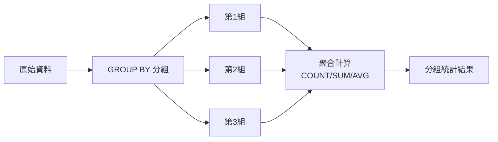
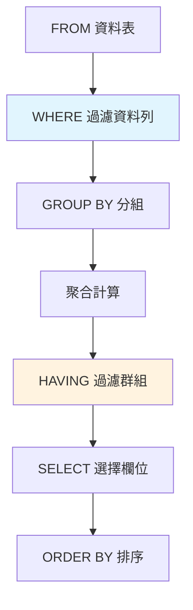
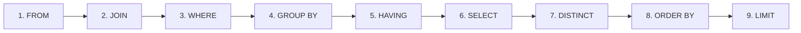

# SQL GROUP BY 與 HAVING 完全指南

> 📝 **TL;DR（太長不看版）**
> GROUP BY 把資料「分組」，讓你可以對每組進行統計（如計算每個部門的平均薪資）。HAVING 則是用來過濾「分組後的結果」——這是很多人容易跟 WHERE 搞混的地方。本文將帶你理解分組統計的邏輯、聚合函數的搭配、WHERE 與 HAVING 的關鍵差異，並透過視覺化圖表和實戰案例，讓你輕鬆掌握資料分組查詢的技巧。

## 前置知識

在開始之前，建議你先了解以下概念：

- **基本 SQL 語法** - 能夠撰寫 SELECT、FROM、WHERE 查詢
- **聚合函數** - 了解 COUNT、SUM、AVG、MAX、MIN 的基本用法
- **資料表結構** - 理解欄位與資料列的概念

## 什麼是 GROUP BY？

想像你有一張「訂單表」，裡面記錄了每筆交易的客戶、金額、日期。如果你想知道「每個客戶的總消費金額」，就需要把同一個客戶的所有訂單「分組」在一起，然後計算總和——這就是 GROUP BY 的作用。

GROUP BY 就像是**把資料按照某個欄位的值「歸類」**，然後對每一類進行統計計算。

### 為什麼需要學習 GROUP BY？

- **解決什麼問題？** 需要對資料進行分組統計，如「每個部門的平均薪資」「每個月分的銷售總額」
- **有什麼優勢？** 一次查詢就能完成分組與統計，不需要多次查詢或應用層處理
- **什麼時候會用到？** 報表統計、資料分析、客戶分群、銷售分析等場景

### 核心概念

GROUP BY 會將資料依照指定欄位的值分成若干組，然後對每一組使用聚合函數（COUNT、SUM、AVG、MAX、MIN）進行計算。

:::warning ⚠️ 注意
- SELECT 中出現的非聚合欄位，必須出現在 GROUP BY 子句中
- GROUP BY 不保證結果的排序順序，如需排序請使用 ORDER BY
- NULL 值會被歸為同一組
:::

## 💻 基本語法

### 語法結構

```sql
-- 基礎 GROUP BY
SELECT 欄位1, 聚合函數(欄位2)
FROM 資料表
GROUP BY 欄位1;

-- GROUP BY + HAVING
SELECT 欄位1, 聚合函數(欄位2)
FROM 資料表
WHERE 條件
GROUP BY 欄位1
HAVING 聚合條件
ORDER BY 欄位;
```

### 參數說明

| 元素 | 說明 | 必填 |
| ---------- | -------------------------- | ---- |
| GROUP BY | 指定分組的欄位 | 是 |
| HAVING | 過濾分組後的結果 | 否 |
| 聚合函數 | COUNT、SUM、AVG、MAX、MIN | 否 |

## GROUP BY 視覺化圖解



上圖展示了 GROUP BY 的運作流程：先依照指定欄位分組，再對每一組進行聚合計算。

## 實際範例

### 範例 1：基礎分組統計

**情境說明：** 計算每個部門的員工數量和平均薪資。

:::details 📋 建立資料表與假資料
```sql
-- 建立員工表
CREATE TABLE employees (
    employee_id INT PRIMARY KEY,
    name VARCHAR(50),
    department VARCHAR(50),
    salary DECIMAL(10, 2)
);

-- 插入假資料
INSERT INTO employees (employee_id, name, department, salary) VALUES
(1, '王小明', 'IT', 55000),
(2, '李大同', 'IT', 60000),
(3, '張小華', 'IT', 48000),
(4, '陳美玲', 'Sales', 45000),
(5, '林志強', 'Sales', 52000),
(6, '王美玉', 'HR', 42000),
(7, '許文豪', 'HR', 48000),
(8, '張雅婷', 'HR', 51000),
(9, '李宗翰', 'Marketing', 46000),
(10, '黃淑芬', 'Marketing', 49000);
```
:::

```sql
SELECT 
    department,
    COUNT(*) AS employee_count,
    AVG(salary) AS avg_salary,
    MAX(salary) AS max_salary
FROM employees
GROUP BY department
ORDER BY avg_salary DESC;

-- 輸出結果：
-- department  | employee_count | avg_salary | max_salary
-- ------------|----------------|------------|------------
-- IT          | 3              | 54333.33   | 60000
-- Sales       | 2              | 48500.00   | 52000
-- HR          | 3              | 47000.00   | 51000
-- Marketing   | 2              | 47500.00   | 49000
```

**程式碼說明：**
1. GROUP BY department 將員工依照部門分組
2. COUNT(*) 計算每組的員工數量
3. AVG(salary) 計算每組的平均薪資
4. MAX(salary) 找出每組的最高薪資
5. ORDER BY avg_salary DESC 依平均薪資降冪排序

### 範例 2：多欄位分組

**情境說明：** 計算每個部門中，每個職位的員工數量和總薪資。

```sql
SELECT 
    department,
    position,
    COUNT(*) AS employee_count,
    SUM(salary) AS total_salary
FROM employees
GROUP BY department, position
ORDER BY department, total_salary DESC;
```

**程式碼說明：**
1. GROUP BY 使用多個欄位時，會先依第一個欄位分組，再依第二個欄位細分
2. 每個 (department, position) 組合形成一個獨立的群組
3. 這樣可以看到更細緻的統計結果

### 範例 3：使用訂單表進行分組統計

**情境說明：** 統計每個客戶的訂單數量、總消費金額和平均訂單金額。

:::details 📋 建立資料表與假資料
```sql
-- 建立訂單表
CREATE TABLE orders (
    order_id INT PRIMARY KEY,
    customer_id INT,
    customer_name VARCHAR(50),
    amount DECIMAL(10, 2),
    order_date DATE
);

-- 插入假資料
INSERT INTO orders (order_id, customer_id, customer_name, amount, order_date) VALUES
(101, 1, '王小明', 1500, '2024-01-15'),
(102, 1, '王小明', 2300, '2024-01-20'),
(103, 2, '李大同', 800, '2024-01-18'),
(104, 3, '張小華', 3500, '2024-01-22'),
(105, 3, '張小華', 1200, '2024-01-25'),
(106, 3, '張小華', 2800, '2024-02-01'),
(107, 4, '陳美玲', 950, '2024-01-28'),
(108, 1, '王小明', 1800, '2024-02-05'),
(109, 2, '李大同', 2100, '2024-02-10'),
(110, 5, '林志強', 4500, '2024-02-12');
```
:::

```sql
SELECT 
    customer_id,
    customer_name,
    COUNT(*) AS order_count,
    SUM(amount) AS total_amount,
    ROUND(AVG(amount), 2) AS avg_amount,
    MAX(amount) AS max_order
FROM orders
GROUP BY customer_id, customer_name
ORDER BY total_amount DESC;

-- 輸出結果：
-- customer_id | customer_name | order_count | total_amount | avg_amount | max_order
-- ------------|---------------|-------------|--------------|------------|----------
-- 3           | 張小華        | 3           | 7500         | 2500.00    | 3500
-- 1           | 王小明        | 3           | 5600         | 1866.67    | 2300
-- 5           | 林志強        | 1           | 4500         | 4500.00    | 4500
-- 2           | 李大同        | 2           | 2900         | 1450.00    | 2100
-- 4           | 陳美玲        | 1           | 950          | 950.00     | 950
```

**程式碼說明：**
1. GROUP BY customer_id, customer_name 確保相同客戶的訂單被分在同一組
2. COUNT(*) 計算每個客戶的訂單數量
3. SUM(amount) 計算總消費金額
4. ROUND(AVG(amount), 2) 計算平均訂單金額並四捨五入到小數點後兩位
5. MAX(amount) 找出最大單筆訂單金額

## HAVING：過濾分組後的結果

很多人會把 HAVING 和 WHERE 搞混，但它們的作用時機完全不同：

- **WHERE**：在分組**之前**過濾資料列
- **HAVING**：在分組**之後**過濾群組

### 視覺化說明：WHERE vs HAVING



### 範例 4：找出「訂單數超過 3 筆的客戶」

**情境說明：** 從訂單表中找出活躍客戶（訂單數 > 2）。

```sql
SELECT 
    customer_id,
    customer_name,
    COUNT(*) AS order_count,
    SUM(amount) AS total_amount
FROM orders
GROUP BY customer_id, customer_name
HAVING COUNT(*) > 2
ORDER BY order_count DESC;

-- 輸出結果：
-- customer_id | customer_name | order_count | total_amount
-- ------------|---------------|-------------|-------------
-- 3           | 張小華        | 3           | 7500
-- 1           | 王小明        | 3           | 5600
```

**程式碼說明：**
1. 先用 GROUP BY 將訂單依照客戶分組
2. COUNT(*) > 2 在 HAVING 中過濾掉訂單數不超過 2 的群組
3. 注意：這裡不能用 WHERE COUNT(*) > 2，因為 WHERE 無法使用聚合函數

### 範例 5：WHERE 與 HAVING 混合使用

**情境說明：** 找出「2024年1月份」訂單數超過 1 筆的客戶。

```sql
SELECT 
    customer_id,
    customer_name,
    COUNT(*) AS order_count,
    SUM(amount) AS total_amount
FROM orders
WHERE order_date BETWEEN '2024-01-01' AND '2024-01-31'
GROUP BY customer_id, customer_name
HAVING COUNT(*) > 1
ORDER BY total_amount DESC;

-- 輸出結果：
-- customer_id | customer_name | order_count | total_amount
-- ------------|---------------|-------------|-------------
-- 1           | 王小明        | 2           | 3800
-- 3           | 張小華        | 2           | 4700
```

**程式碼說明：**
1. WHERE 先過濾出 2024 年 1 月的訂單（分組前）
2. GROUP BY 將過濾後的資料依照客戶分組
3. HAVING 再過濾出訂單數 > 1 的群組（分組後）
4. 這個例子清楚展示了 WHERE 和 HAVING 的作用時機

## SQL 執行順序詳解

理解 SQL 的執行順序對於正確使用 WHERE 和 HAVING 至關重要：



### 執行順序說明

| 順序 | 子句 | 說明 |
| ---- | ---- | ---- |
| 1 | FROM | 選擇資料表 |
| 2 | JOIN | 關聯其他表 |
| 3 | WHERE | 過濾資料列（分組前） |
| 4 | GROUP BY | 分組 |
| 5 | HAVING | 過濾群組（分組後） |
| 6 | SELECT | 選擇欄位 |
| 7 | DISTINCT | 去除重複 |
| 8 | ORDER BY | 排序 |
| 9 | LIMIT | 限制筆數 |

**為什麼這很重要？**

因為 WHERE 在 GROUP BY 之前執行，所以：
- WHERE 可以過濾單一資料列的條件
- WHERE **不能**使用聚合函數（因為還沒分組）
- HAVING 在 GROUP BY 之後執行，所以可以使用聚合函數

```sql
-- ❌ 錯誤：WHERE 不能使用聚合函數
SELECT customer_id, COUNT(*) as cnt
FROM orders
WHERE COUNT(*) > 2 -- 錯誤！
GROUP BY customer_id;

-- ✅ 正確：使用 HAVING
SELECT customer_id, COUNT(*) as cnt
FROM orders
GROUP BY customer_id
HAVING COUNT(*) > 2;
```

## 聚合函數詳解

GROUP BY 通常會搭配聚合函數使用，以下是常用的聚合函數：

| 函數 | 說明 | 範例 |
| ---- | ---- | ---- |
| COUNT(*) | 計算群組內的資料列數 | `COUNT(*)` |
| COUNT(欄位) | 計算非 NULL 值的數量 | `COUNT(customer_id)` |
| SUM(欄位) | 計算總和 | `SUM(amount)` |
| AVG(欄位) | 計算平均值 | `AVG(salary)` |
| MAX(欄位) | 找出最大值 | `MAX(score)` |
| MIN(欄位) | 找出最小值 | `MIN(price)` |

### COUNT(*) vs COUNT(欄位)

```sql
-- COUNT(*) 計算所有資料列，包含 NULL
SELECT department, COUNT(*) as total_rows
FROM employees
GROUP BY department;

-- COUNT(欄位) 只計算非 NULL 值
SELECT department, COUNT(manager_id) as managers
FROM employees
GROUP BY department;
```

## 🔥 實戰練習

### 練習 1：基礎分組統計（簡單）⭐

**任務：** 計算每個部門的薪資統計，包含員工數、總薪資、平均薪資、最高薪資、最低薪資。

**要求：**
- 顯示欄位：department、employee_count、total_salary、avg_salary、max_salary、min_salary
- 依平均薪資降冪排序

**期望輸出：**
| department | employee_count | total_salary | avg_salary | max_salary | min_salary |
| ---------- | -------------- | ------------ | ---------- | ---------- | ---------- |
| IT         | 3              | 163000       | 54333.33   | 60000      | 48000      |
| Sales      | 2              | 97000        | 48500.00   | 52000      | 45000      |
| HR         | 3              | 141000       | 47000.00   | 51000      | 42000      |

:::details 💡 參考答案
```sql
SELECT 
    department,
    COUNT(*) AS employee_count,
    SUM(salary) AS total_salary,
    ROUND(AVG(salary), 2) AS avg_salary,
    MAX(salary) AS max_salary,
    MIN(salary) AS min_salary
FROM employees
GROUP BY department
ORDER BY avg_salary DESC;
```

**程式碼說明：**
1. 使用多個聚合函數同時計算不同的統計值
2. ROUND() 函數將平均值四捨五入到小數點後兩位
3. GROUP BY 將資料依照部門分組
:::

### 練習 2：HAVING 過濾（簡單）⭐

**任務：** 找出「員工數超過 2 人」的部門。

**提示：**
- 使用 HAVING 過濾分組後的結果
- 不要忘記 GROUP BY

:::details 💡 參考答案
```sql
SELECT 
    department,
    COUNT(*) AS employee_count
FROM employees
GROUP BY department
HAVING COUNT(*) > 2
ORDER BY employee_count DESC;
```

**解題技巧：**
- GROUP BY 先將員工依照部門分組
- HAVING COUNT(*) > 2 過濾出員工數超過 2 的群組
- 注意不能用 WHERE COUNT(*) > 2
:::

### 練習 3：綜合應用（中等）⭐⭐

**任務：** 找出「平均薪資高於 50000」的部門，並顯示其員工數和平均薪資。

**提示：**
- 使用 AVG 計算平均薪資
- 使用 HAVING 過濾平均薪資 > 50000 的群組

:::details 💡 參考答案
```sql
SELECT 
    department,
    COUNT(*) AS employee_count,
    ROUND(AVG(salary), 2) AS avg_salary
FROM employees
GROUP BY department
HAVING AVG(salary) > 50000
ORDER BY avg_salary DESC;

-- 輸出結果：
-- department | employee_count | avg_salary
-- -----------|----------------|------------
-- IT         | 3              | 54333.33
```

**程式碼說明：**
1. GROUP BY 將員工依照部門分組
2. AVG(salary) 計算每組的平均薪資
3. HAVING AVG(salary) > 50000 過濾平均薪資高於 50000 的群組
:::

### 練習 4：多條件過濾（中等）⭐⭐

**任務：** 找出「訂單數 >= 2 且總消費 > 3000」的客戶。

:::details 💡 參考答案
```sql
SELECT 
    customer_id,
    customer_name,
    COUNT(*) AS order_count,
    SUM(amount) AS total_amount
FROM orders
GROUP BY customer_id, customer_name
HAVING COUNT(*) >= 2 AND SUM(amount) > 3000
ORDER BY total_amount DESC;

-- 輸出結果：
-- customer_id | customer_name | order_count | total_amount
-- ------------|---------------|-------------|-------------
-- 3           | 張小華        | 3           | 7500
-- 1           | 王小明        | 3           | 5600
-- 2           | 李大同        | 2           | 2900（不符合，被過濾）
```

**說明：**
- HAVING 可以使用 AND、OR 組合多個條件
- 注意：2900 <= 3000，所以客戶 2 被過濾掉
:::

### 練習 5：綜合挑戰（困難）⭐⭐⭐

**任務：** 找出「總消費金額高於所有客戶平均消費金額」的客戶。

**提示：**
- 需要計算「所有客戶的平均消費金額」
- 可以使用子查詢或 CTE

:::details 💡 參考答案
```sql
-- 方法一：使用子查詢
SELECT 
    customer_id,
    customer_name,
    SUM(amount) AS total_amount
FROM orders
GROUP BY customer_id, customer_name
HAVING SUM(amount) > (
    SELECT AVG(total_amount)
    FROM (
        SELECT SUM(amount) AS total_amount
        FROM orders
        GROUP BY customer_id
    ) AS customer_totals
)
ORDER BY total_amount DESC;

-- 方法二：使用 CTE（更易讀）
WITH customer_totals AS (
    SELECT 
        customer_id,
        customer_name,
        SUM(amount) AS total_amount
    FROM orders
    GROUP BY customer_id, customer_name
)
SELECT 
    customer_id,
    customer_name,
    total_amount,
    (SELECT ROUND(AVG(total_amount), 2) FROM customer_totals) AS avg_total
FROM customer_totals
WHERE total_amount > (SELECT AVG(total_amount) FROM customer_totals)
ORDER BY total_amount DESC;

-- 輸出結果：
-- customer_id | customer_name | total_amount | avg_total
-- ------------|---------------|--------------|----------
-- 3           | 張小華        | 7500         | 4290.00
-- 1           | 王小明        | 5600         | 4290.00
-- 5           | 林志強        | 4500         | 4290.00
```

**使用的技巧：**
- CTE 讓複雜查詢更容易理解
- 子查詢可以在 HAVING 中使用
- 平均消費金額 = (5600 + 2900 + 7500 + 950 + 4500) / 5 = 4290
:::

## 常見問題 FAQ

### Q1: GROUP BY 和 DISTINCT 有什麼差別？

**A:** 兩者用途不同：

| 比較項目 | GROUP BY | DISTINCT |
| -------- | -------- | -------- |
| 用途 | 分組統計 | 去除重複值 |
| 聚合函數 | 必須搭配使用 | 不能搭配 |
| 效能 | 統計時使用 | 去重時使用 |

```sql
-- GROUP BY：統計每個部門的員工數
SELECT department, COUNT(*)
FROM employees
GROUP BY department;

-- DISTINCT：列出所有不重複的部門
SELECT DISTINCT department
FROM employees;
```

### Q2: 為什麼 SELECT 中的非聚合欄位要放在 GROUP BY 中？

**A:** 這是 SQL 標準的要求，確保結果的確定性：

```sql
-- ❌ 錯誤：name 沒有在 GROUP BY 中
SELECT department, name, COUNT(*)
FROM employees
GROUP BY department;

-- ✅ 正確：name 在 GROUP BY 中
SELECT department, name, COUNT(*)
FROM employees
GROUP BY department, name;

-- ✅ 正確：name 使用聚合函數
SELECT department, MAX(name) as some_name, COUNT(*)
FROM employees
GROUP BY department;
```

:::warning ⚠️ MySQL 的特殊行為
MySQL 預設允許 SELECT 中的非聚合欄位不在 GROUP BY 中（只會取第一個值），但這是不標準的行為，建議關閉這個功能：

```sql
-- 關閉 MySQL 的寬鬆模式
SET sql_mode = 'ONLY_FULL_GROUP_BY';
```
:::

### Q3: 可以在 GROUP BY 中使用運算式嗎？

**A:** 可以，GROUP BY 支援運算式：

```sql
-- 依照訂單金額區間分組
SELECT 
    CASE 
        WHEN amount < 1000 THEN '小額'
        WHEN amount < 5000 THEN '中額'
        ELSE '大額'
    END AS amount_range,
    COUNT(*) as order_count
FROM orders
GROUP BY 
    CASE 
        WHEN amount < 1000 THEN '小額'
        WHEN amount < 5000 THEN '中額'
        ELSE '大額'
    END;

-- 或使用 alias（部分資料庫支援）
SELECT 
    CASE 
        WHEN amount < 1000 THEN '小額'
        WHEN amount < 5000 THEN '中額'
        ELSE '大額'
    END AS amount_range,
    COUNT(*) as order_count
FROM orders
GROUP BY amount_range;
```

### Q4: NULL 值在 GROUP BY 中如何處理？

**A:** NULL 值會被歸為同一組：

```sql
-- 假設有些員工沒有部門（department 為 NULL）
SELECT department, COUNT(*)
FROM employees
GROUP BY department;

-- 輸出：
-- department | COUNT(*)
-- -----------|---------
-- NULL       | 2  -- 所有 NULL 值歸為一組
-- IT         | 3
-- Sales      | 2
-- HR         | 3
```

### Q5: HAVING 可以使用別名嗎？

**A:** 這取決於資料庫：

```sql
-- ❌ 標準 SQL：HAVING 不能使用別名
SELECT department, COUNT(*) as cnt
FROM employees
GROUP BY department
HAVING cnt > 2; -- 可能錯誤

-- ✅ 正確：使用完整運算式
SELECT department, COUNT(*) as cnt
FROM employees
GROUP BY department
HAVING COUNT(*) > 2;

-- ✅ MySQL/PostgreSQL：支援使用別名
SELECT department, COUNT(*) as cnt
FROM employees
GROUP BY department
HAVING cnt > 2; -- 在這些資料庫中可行
```

## 最佳實踐

### ✅ 推薦做法

1. **給聚合結果取有意義的別名**
```sql
-- ✅ 清晰
SELECT 
    department,
    COUNT(*) AS employee_count,
    AVG(salary) AS avg_salary

-- ❌ 模糊
SELECT 
    department,
    COUNT(*),
    AVG(salary)
```

2. **使用 WHERE 先過濾資料**
```sql
-- ✅ 效能較好：先過濾再分組
SELECT customer_id, COUNT(*)
FROM orders
WHERE order_date >= '2024-01-01'
GROUP BY customer_id;

-- ❌ 效能較差：全部分組再過濾
SELECT customer_id, COUNT(*)
FROM orders
GROUP BY customer_id
HAVING MIN(order_date) >= '2024-01-01';
```

3. **使用 ORDER BY 排序結果**
```sql
-- GROUP BY 不保證排序，需要明確使用 ORDER BY
SELECT department, COUNT(*) as cnt
FROM employees
GROUP BY department
ORDER BY cnt DESC;
```

### ❌ 常見錯誤

1. **在 WHERE 中使用聚合函數**
```sql
-- ❌ 錯誤
SELECT department, COUNT(*)
FROM employees
WHERE COUNT(*) > 2
GROUP BY department;

-- ✅ 正確
SELECT department, COUNT(*)
FROM employees
GROUP BY department
HAVING COUNT(*) > 2;
```

2. **忘記 GROUP BY**
```sql
-- ❌ 錯誤：使用聚合函數但沒有 GROUP BY
SELECT department, COUNT(*)
FROM employees;

-- ✅ 正確：所有非聚合欄位都在 GROUP BY 中
SELECT department, COUNT(*)
FROM employees
GROUP BY department;
```

3. **混淆 WHERE 和 HAVING 的使用時機**
```sql
-- ❌ 錯誤：應該用 WHERE 過濾單一資料列
SELECT department, COUNT(*)
FROM employees
GROUP BY department
HAVING department = 'IT';

-- ✅ 正確：用 WHERE 過濾單一資料列
SELECT department, COUNT(*)
FROM employees
WHERE department = 'IT'
GROUP BY department;
```

## 延伸閱讀

### 相關文章

本站相關主題：
- [SQL JOIN 完全指南](/database/sql/sql-join) - 學習多表關聯查詢
- [SQL CTE 完全指南](/database/sql/sql-cte) - 簡化複雜查詢
- [SQL CASE WHEN THEN 條件運算](/database/sql/sql-case-when-then) - 條件邏輯處理

### 推薦資源

外部優質資源：
- [MySQL GROUP BY 官方文件](https://dev.mysql.com/doc/refman/8.0/en/group-by-handling.html) - 官方文件，詳細規格說明
- [PostgreSQL Aggregate Functions](https://www.postgresql.org/docs/current/functions-aggregate.html) - PostgreSQL 聚合函數文檔
- [SQL GROUP BY 視覺化教學](https://sqlbolt.com/lesson/select_queries_with_aggregates) - 互動式學習 GROUP BY

## 📝 總結

SQL GROUP BY 與 HAVING 是資料分析的核心技能，讓我們回顧關鍵重點：

1. **GROUP BY 分組統計** - 將資料依照指定欄位分組，再對每一組進行聚合計算
2. **聚合函數搭配** - COUNT、SUM、AVG、MAX、MIN 是 GROUP BY 的最佳拍檔
3. **HAVING 過濾群組** - HAVING 用於過濾分組後的結果，WHERE 用於過濾分組前的資料列
4. **執行順序很重要** - FROM → WHERE → GROUP BY → HAVING → SELECT → ORDER BY
5. **非聚合欄位規則** - SELECT 中的非聚合欄位必須出現在 GROUP BY 中
