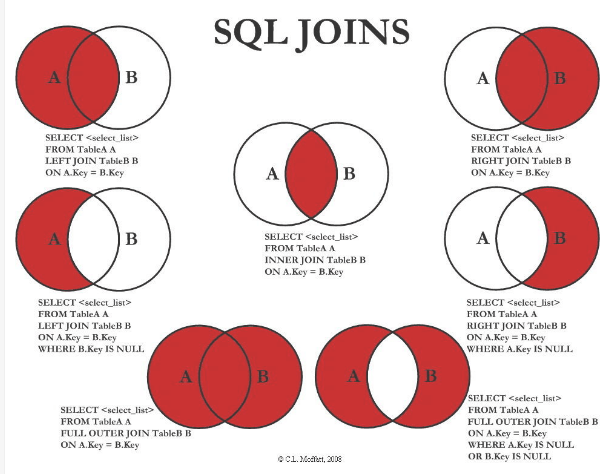
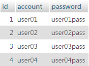
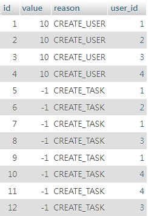

---
head:
  - - meta
    - name: author
      content: 許恩綸
  - - meta
    - name: keywords
      content: SQL, SQL JOIN, Inner Join, Left Join
  - - meta
    - name: og:title
      content: SQL JOIN 教學
  - - meta
    - name: og:description
      content: SQL JOIN 教學和範例，包括 Inner Join 和 Left Join 的使用方法
  - - meta
    - name: og:type
      content: article
  - - meta
    - name: og:image
      content: https://lucashsu95.github.io/LucasHsu.dev/assets/sql-join/image.png
---


# SQL JOIN

## 關聯式 JOIN



以下為SQL中Left Join與Inner Join的簡單說明。

## **Inner Join (內連接)**

* **作用：** 只返回兩個表格中符合連接條件的資料。
* **比喻：** 想像兩個表格是兩個班級的學生名單，Inner Join就像是在找兩個班級中都有的學生。
* **範例：**
  ```sql
  SELECT * 
  FROM students AS s
  INNER JOIN courses AS c ON s.student_id = c.student_id;
  ```
  這會找出同時存在於students和courses表格中的學生資訊。

## **Left Join (左外連接)**

* **作用：** 返回左邊表格的所有資料，並根據連接條件在右邊表格中尋找匹配的資料。如果右邊表格中沒有匹配的資料，則在對應的位置填入NULL。
* **比喻：** 繼續用班級的例子，Left Join就像是在左邊班級的所有學生中，去右邊班級找有沒有對應的學生。如果沒有，就保留左邊班級的學生，在右邊班級的欄位填入空值。
* **範例：**
  ```sql
  SELECT * 
  FROM students AS s
  LEFT JOIN courses AS c ON s.student_id = c.student_id;
  ```
  這會找出所有students表格中的學生資訊，即使他們在courses表格中沒有選修任何課程。

## **簡單總結**

* **Inner Join:** 只找兩個表格的共同部分。
* **Left Join:** 保留左邊表格的所有資料，並在右邊表格中尋找匹配。
* **視覺化：** 想像兩個表格是兩個圓圈，重疊的部分就是Inner Join的結果。Left Join則會包含整個左邊圓圈。

## **何時使用**

* **Inner Join:** 當你只想找出兩個表格中都有的資料時。
* **Left Join:** 當你想要保留左邊表格的所有資料，同時了解這些資料在右邊表格中是否有對應的資料時。

## **常見問題**

* **什麼是右外連接 (Right Join)?** 右外連接與左外連接類似，只是保留的是右邊表格的所有資料。
* **什麼是全外連接 (Full Outer Join)?** 全外連接會保留兩個表格的所有資料，無論是否有匹配。


## 練習題

有兩個資料表，一對多，users 和 user_quotas 的表

**users 資料表**


**user_quotas 資料表**


::: tip 練習題
請列出每位使用者的總配額，並且按照總配額的大到小排序!

<a href='../assets/sql-join/test.sql' download='test.sql'>下載`test.sql`檔</a>
:::


::: warning 要輸出的結果
|id | account | total_value
|---|---|---|
|2|	user02|	9|
|3|	user03|	8|
|4|	user04|	8|
|1|	user01|	7|
:::

::: details 看答案
```sql
SELECT u.id, u.account, SUM(q.value) AS total_quota
FROM users u
LEFT JOIN user_quotas q ON u.id = q.user_id
GROUP BY u.id,u.account
ORDER BY total_quota DESC;
```
:::

**其它關建字**：Right Join (右外連接)、Full Outer Join (全外連接)、Cross Join (交叉連接)、Natural Join (自然連接)、Natural Left Join (自然左外連接)、Natural Right Join (自然右外連接)、Natural Full Join (自然全外連接)、Natural Cross Join (自然交叉連接)、Subquery Join (子查詢連接)