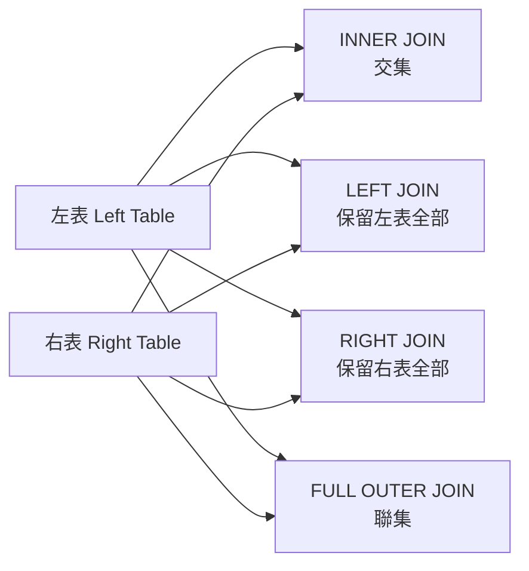
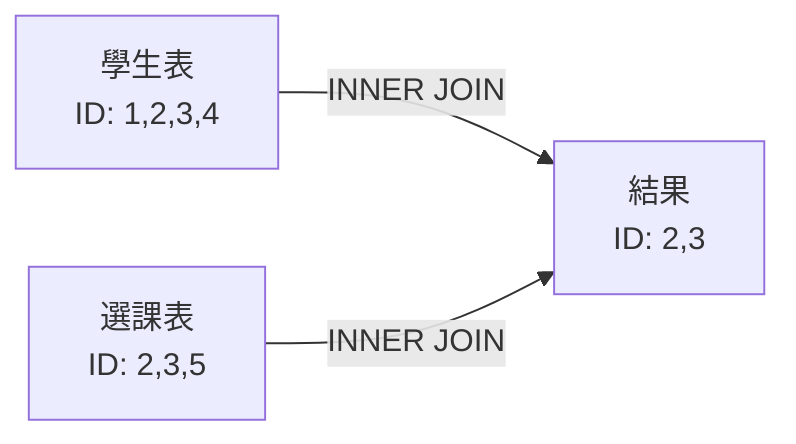
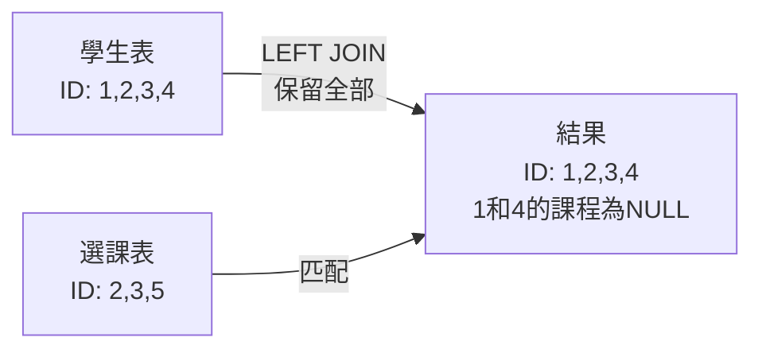
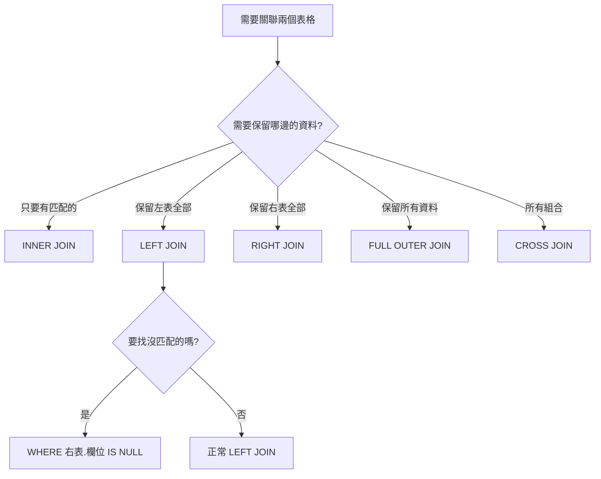

# SQL JOIN 完全指南：從基礎到實戰

> 📝 **TL;DR（太長不看版）**  
> SQL JOIN 是關聯式資料庫中組合多個資料表的關鍵技術。本文將帶你理解 INNER JOIN（交集）、LEFT JOIN（保留左表）、RIGHT JOIN（保留右表）、FULL OUTER JOIN（聯集）的差異，並透過視覺化圖表和實戰案例，讓你輕鬆掌握資料表關聯查詢的技巧。

## 前置知識

在開始之前，建議你先了解以下概念：

- **基本 SQL 語法** - 能夠撰寫簡單的 SELECT、FROM、WHERE 查詢
- **資料表結構** - 理解主鍵（Primary Key）和外鍵（Foreign Key）的概念
- **關聯式資料庫** - 了解資料表之間的關係（一對一、一對多、多對多）

## 什麼是 SQL JOIN？

想像你有兩個資料表：一個記錄「學生資訊」，另一個記錄「選課記錄」。如果你想知道「每位學生選了哪些課」，就需要使用 JOIN 來關聯這兩個資料表。

JOIN 就像是**把兩張表格橫向拼接起來**，根據共同的欄位（如學生 ID）將相關的資料組合在一起。這是關聯式資料庫最強大的功能之一！

### JOIN 的視覺化圖解


上圖展示了不同 JOIN 類型如何組合兩個資料表的資料。讓我們用更直觀的方式理解：



## JOIN 類型詳解

### 1. INNER JOIN（內連接）- 找交集

**作用：** 只返回兩個資料表中**同時符合條件**的資料列，就像數學的「交集」。

**生活比喻：** 想像你有兩份名單：「已註冊的學生」和「已選課的學生」。INNER JOIN 會找出「既註冊又選課」的學生，沒選課的學生不會出現在結果中。

**基本語法：**
```sql
SELECT 欄位列表
FROM 左表
INNER JOIN 右表 ON 左表.關聯欄位 = 右表.關聯欄位;
```

**實際範例：**
```sql
-- 查詢已選課的學生資訊
SELECT 
    s.student_id,
    s.name AS student_name,
    c.course_name,
    c.credits
FROM students AS s
INNER JOIN courses AS c ON s.student_id = c.student_id;
```

**查詢結果說明：**
- ✅ 顯示：有選課的學生資訊
- ❌ 不顯示：沒有選課的學生
- ❌ 不顯示：沒有學生選修的課程



### 2. LEFT JOIN（左外連接）- 保留左表全部

**作用：** 返回**左表的所有資料**，並嘗試匹配右表的資料。如果右表沒有符合的資料，則以 `NULL` 填充。

**生活比喻：** 班級老師要統計「所有學生的選課狀況」，即使某些學生還沒選課，也要列在名單上（選課欄位顯示為空）。

**基本語法：**
```sql
SELECT 欄位列表
FROM 左表
LEFT JOIN 右表 ON 左表.關聯欄位 = 右表.關聯欄位;
```

**實際範例：**
```sql
-- 列出所有學生，顯示其選課狀況（包含未選課的學生）
SELECT 
    s.student_id,
    s.name AS student_name,
    c.course_name,
    CASE 
        WHEN c.course_name IS NULL THEN '未選課'
        ELSE '已選課'
    END AS enrollment_status
FROM students AS s
LEFT JOIN courses AS c ON s.student_id = c.student_id;
```

**查詢結果說明：**
- ✅ 顯示：左表（students）的所有學生
- ✅ 顯示：有選課的學生會匹配到課程資訊
- ✅ 顯示：沒選課的學生，課程欄位顯示 `NULL`

**常見應用場景：**
1. **找出缺失資料**：查詢沒有訂單的客戶
```sql
SELECT c.customer_name
FROM customers c
LEFT JOIN orders o ON c.customer_id = o.customer_id
WHERE o.order_id IS NULL;  -- 沒有訂單的客戶
```

2. **統計關聯數量**：計算每位學生的選課數量
```sql
SELECT 
    s.name,
    COUNT(c.course_id) AS course_count
FROM students s
LEFT JOIN courses c ON s.student_id = c.student_id
GROUP BY s.student_id, s.name;
```



### 3. RIGHT JOIN（右外連接）- 保留右表全部

**作用：** 與 LEFT JOIN 相反，返回**右表的所有資料**，並嘗試匹配左表。實務上較少使用，因為可以用 LEFT JOIN 替代。

**基本語法：**
```sql
SELECT 欄位列表
FROM 左表
RIGHT JOIN 右表 ON 左表.關聯欄位 = 右表.關聯欄位;
```

**實際範例：**
```sql
-- 列出所有課程，顯示選修的學生（包含無人選修的課程）
SELECT 
    c.course_name,
    s.name AS student_name
FROM students AS s
RIGHT JOIN courses AS c ON s.student_id = c.student_id;
```

:::tip 💡 實務建議
`RIGHT JOIN` 和 `LEFT JOIN` 效果一樣，只是表格位置對調：
```sql
-- 這兩個查詢結果相同
A LEFT JOIN B   -- 保留 A 的全部
B RIGHT JOIN A  -- 保留 A 的全部
```
建議統一使用 `LEFT JOIN`，程式碼更容易閱讀！
:::

### 4. FULL OUTER JOIN（全外連接）- 保留所有

**作用：** 返回**兩個表格的所有資料**，無論是否有匹配。沒有匹配的部分以 `NULL` 填充。

**基本語法：**
```sql
SELECT 欄位列表
FROM 左表
FULL OUTER JOIN 右表 ON 左表.關聯欄位 = 右表.關聯欄位;
```

**實際範例：**
```sql
-- 列出所有學生和所有課程的完整配對狀況
SELECT 
    COALESCE(s.name, '無學生') AS student_name,
    COALESCE(c.course_name, '無課程') AS course_name
FROM students AS s
FULL OUTER JOIN courses AS c ON s.student_id = c.student_id;
```

:::warning ⚠️ MySQL 不支援
MySQL 不支援 `FULL OUTER JOIN`，可以用 `UNION` 模擬：
```sql
SELECT * FROM students s LEFT JOIN courses c ON s.student_id = c.student_id
UNION
SELECT * FROM students s RIGHT JOIN courses c ON s.student_id = c.student_id;
```
:::

### 5. CROSS JOIN（交叉連接）- 笛卡爾積

**作用：** 返回兩個表格的**所有可能組合**（笛卡爾積）。如果左表有 3 筆資料，右表有 4 筆，結果會有 3 × 4 = 12 筆。

**基本語法：**
```sql
SELECT 欄位列表
FROM 左表
CROSS JOIN 右表;
```

**實際應用：**
```sql
-- 產生所有「尺寸 × 顏色」的組合
SELECT 
    s.size,
    c.color
FROM sizes AS s
CROSS JOIN colors AS c;
```

## JOIN 類型比較表

| JOIN 類型  | 左表資料 | 右表資料 | 無匹配時        | MySQL | PostgreSQL | 使用頻率 |
| ---------- | -------- | -------- | --------------- | ----- | ---------- | -------- |
| INNER JOIN | 有匹配的 | 有匹配的 | 不顯示          | ✅     | ✅          | ⭐⭐⭐⭐⭐    |
| LEFT JOIN  | 全部     | 有匹配的 | 右表顯示 NULL   | ✅     | ✅          | ⭐⭐⭐⭐⭐    |
| RIGHT JOIN | 有匹配的 | 全部     | 左表顯示 NULL   | ✅     | ✅          | ⭐⭐       |
| FULL OUTER | 全部     | 全部     | 另一表顯示 NULL | ❌     | ✅          | ⭐⭐       |
| CROSS JOIN | 全部     | 全部     | 產生所有組合    | ✅     | ✅          | ⭐        |
| SELF JOIN  | 全部     | -        | 表格與自己 JOIN | ✅     | ✅          | ⭐⭐⭐      |

## JOIN 選擇決策樹




## 🔥 實戰練習

### 練習資料準備

有兩個資料表，一對多關係：**users（使用者）** 和 **user_quotas（使用者配額）**

**users 資料表**


**user_quotas 資料表**


<a href='../assets/sql-join/test.sql' download='test.sql'>📥 下載完整測試資料檔 `test.sql`</a>

### 練習 1：基礎 JOIN 查詢（簡單）⭐

**任務：** 請列出每位使用者的總配額，並且按照總配額由大到小排序。

**要求：**
- 顯示欄位：`id`、`account`、`total_value`（總配額）
- 使用 `SUM()` 函數計算總配額
- 按總配額降序排列

**期望輸出：**
| id  | account | total_value |
| --- | ------- | ----------- |
| 2   | user02  | 9           |
| 3   | user03  | 8           |
| 4   | user04  | 8           |
| 1   | user01  | 7           |

:::details 💡 參考答案
```sql
SELECT 
    u.id, 
    u.account, 
    SUM(q.value) AS total_value
FROM users u
LEFT JOIN user_quotas q ON u.id = q.user_id
GROUP BY u.id, u.account
ORDER BY total_value DESC;
```

**程式碼說明：**
1. 使用 `LEFT JOIN` 確保所有使用者都被列出（即使沒有配額記錄）
2. `SUM(q.value)` 計算每位使用者的總配額
3. `GROUP BY u.id, u.account` 依使用者分組
4. `ORDER BY total_value DESC` 由大到小排序

**為什麼用 LEFT JOIN 而非 INNER JOIN？**
- 如果有使用者沒有配額記錄，`INNER JOIN` 會把他們排除
- `LEFT JOIN` 能顯示所有使用者，配額總和為 0 或 NULL
:::

### 練習 2：找出特定資料（簡單）⭐

**任務：** 找出**沒有任何配額記錄**的使用者。

**提示：**
- 使用 `LEFT JOIN` 找出沒有對應配額的使用者
- 利用 `WHERE ... IS NULL` 篩選條件

:::details 💡 參考答案
```sql
SELECT 
    u.id, 
    u.account
FROM users u
LEFT JOIN user_quotas q ON u.id = q.user_id
WHERE q.user_id IS NULL;
```

**解題技巧：**
- `LEFT JOIN` 會保留所有 users，沒有配額的使用者在 `user_quotas` 欄位會是 `NULL`
- `WHERE q.user_id IS NULL` 篩選出右表沒有匹配的資料
:::

### 練習 3：多表關聯與統計（中等）⭐⭐

**任務：** 假設新增一個 **quota_types**（配額類型）表，請完成以下複雜查詢：

```sql
-- 假設有配額類型表
CREATE TABLE quota_types (
    type_id INT PRIMARY KEY,
    type_name VARCHAR(50),
    max_value INT
);

-- user_quotas 新增 type_id 欄位
ALTER TABLE user_quotas ADD COLUMN type_id INT;
```

**要求：**
1. 列出每位使用者的「每種配額類型」的總和
2. 顯示欄位：`account`、`type_name`、`total_by_type`
3. 只顯示總配額 > 3 的記錄
4. 按使用者和配額類型排序

:::details 💡 參考答案與解題思路

**解題思路：**
1. 需要關聯三個表：`users` ← `user_quotas` ← `quota_types`
2. 先做 JOIN 建立完整資料集
3. 按使用者和配額類型分組統計
4. 使用 HAVING 過濾總和 > 3 的資料

**參考程式碼：**
```sql
SELECT 
    u.account,
    qt.type_name,
    SUM(uq.value) AS total_by_type
FROM users u
LEFT JOIN user_quotas uq ON u.id = uq.user_id
LEFT JOIN quota_types qt ON uq.type_id = qt.type_id
GROUP BY u.id, u.account, qt.type_id, qt.type_name
HAVING SUM(uq.value) > 3
ORDER BY u.account, qt.type_name;
```

**進階技巧：**
- 使用多個 `LEFT JOIN` 串聯三個表
- `GROUP BY` 需包含 SELECT 中的非聚合欄位
- `HAVING` 用於過濾聚合結果（`WHERE` 無法使用聚合函數）

**延伸思考：**
- 如何找出「所有配額類型總和 < 5」的使用者？
- 如何顯示「每位使用者最常使用的配額類型」？
:::

### 練習 4：自我挑戰（困難）⭐⭐⭐

**任務：** 列出「配額總和高於平均值」的使用者，並顯示其超出平均值的百分比。

:::details 💡 參考答案
```sql
WITH user_totals AS (
    SELECT 
        u.id,
        u.account,
        COALESCE(SUM(q.value), 0) AS total_value
    FROM users u
    LEFT JOIN user_quotas q ON u.id = q.user_id
    GROUP BY u.id, u.account
),
avg_total AS (
    SELECT AVG(total_value) AS avg_value
    FROM user_totals
)
SELECT 
    ut.account,
    ut.total_value,
    at.avg_value,
    ROUND((ut.total_value - at.avg_value) / at.avg_value * 100, 2) AS exceed_percentage
FROM user_totals ut
CROSS JOIN avg_total at
WHERE ut.total_value > at.avg_value
ORDER BY exceed_percentage DESC;
```

**使用的進階技巧：**
- CTE（Common Table Expression）簡化複雜查詢
- CROSS JOIN 讓每筆資料都能取得平均值
- 百分比計算公式：`(個別值 - 平均值) / 平均值 × 100`
:::

## 常見問題 FAQ

### Q1: INNER JOIN 和 WHERE 條件有什麼差別？

**A:** 雖然結果可能相同，但意義不同：

```sql
-- 方法 1：使用 INNER JOIN（推薦）
SELECT * FROM students s
INNER JOIN courses c ON s.student_id = c.student_id;

-- 方法 2：使用 WHERE（舊式寫法）
SELECT * FROM students s, courses c
WHERE s.student_id = c.student_id;
```

**建議使用 JOIN 的原因：**
- ✅ 語意更清晰：JOIN 條件與篩選條件分離
- ✅ 支援 OUTER JOIN：WHERE 無法做到 LEFT/RIGHT JOIN
- ✅ 易於維護：複雜查詢時更容易閱讀

### Q2: 什麼時候用 INNER JOIN，什麼時候用 LEFT JOIN？

**A:** 決策依據：

| 情況                         | 使用                | 原因                 |
| ---------------------------- | ------------------- | -------------------- |
| 只需要有關聯的資料           | INNER JOIN          | 效能更好，資料更精確 |
| 需要顯示所有主表資料         | LEFT JOIN           | 避免遺漏未關聯的資料 |
| 需要找出「沒有關聯」的資料   | LEFT JOIN + IS NULL | 用於檢查資料完整性   |
| 查詢訂單及其客戶（都有資料） | INNER JOIN          | 訂單一定有客戶       |
| 查詢客戶及其訂單（可能無單） | LEFT JOIN           | 有些客戶可能還沒下單 |

**快速判斷法：**
```
問自己：「如果右表沒有匹配資料，我還要顯示左表的資料嗎？」
→ 要 = LEFT JOIN
→ 不要 = INNER JOIN
```

### Q3: 為什麼我的 JOIN 查詢很慢？

**A:** 可能原因與解決方法：

1. **缺少索引**
```sql
-- 檢查關聯欄位是否有索引
SHOW INDEX FROM students;
SHOW INDEX FROM courses;

-- 為關聯欄位建立索引
CREATE INDEX idx_student_id ON courses(student_id);
```

2. **笛卡爾積問題**
```sql
-- ❌ 忘記寫 ON 條件，產生笛卡爾積
SELECT * FROM students, courses;  -- 結果數 = students 數 × courses 數

-- ✅ 正確寫法
SELECT * FROM students s
INNER JOIN courses c ON s.student_id = c.student_id;
```

3. **過多的 JOIN**
```sql
-- 如果需要 JOIN 超過 5 個表，考慮：
-- 1. 是否能用子查詢減少 JOIN 數量
-- 2. 是否能建立視圖（VIEW）簡化查詢
-- 3. 資料表設計是否需要調整
```

### Q4: JOIN 多個表格的順序重要嗎？

**A:** 對於結果正確性不重要，但對效能有影響：

```sql
-- 查詢優化器會自動調整順序，但你可以引導它
SELECT *
FROM orders o                          -- 100 萬筆
INNER JOIN customers c                 -- 10 萬筆
    ON o.customer_id = c.id
INNER JOIN products p                  -- 1 千筆
    ON o.product_id = p.id
WHERE p.category = 'Electronics';      -- 篩選後剩 100 筆
```

**優化建議：**
- 先 JOIN 小表或有強篩選條件的表
- 使用 `EXPLAIN` 分析查詢計劃
- 考慮建立覆蓋索引（Covering Index）

### Q5: LEFT JOIN 後使用 WHERE 條件會失效嗎？

**A:** 不會失效，但要注意條件位置：

```sql
-- ❌ 錯誤：WHERE 會過濾掉 NULL，變成 INNER JOIN 效果
SELECT *
FROM students s
LEFT JOIN courses c ON s.student_id = c.student_id
WHERE c.course_name = 'Math';  -- 只顯示有修 Math 的學生

-- ✅ 正確：把條件放在 ON 子句
SELECT *
FROM students s
LEFT JOIN courses c 
    ON s.student_id = c.student_id 
    AND c.course_name = 'Math';  -- 顯示所有學生，Math 欄位可能為 NULL

-- ✅ 正確：要找「沒有修課的學生」
SELECT *
FROM students s
LEFT JOIN courses c ON s.student_id = c.student_id
WHERE c.student_id IS NULL;  -- 用 IS NULL 檢查
```

**關鍵差異：**
- `ON` 條件：在 JOIN 階段過濾
- `WHERE` 條件：在 JOIN 完成後過濾

### Q6: 多對多關係如何 JOIN？

**A:** 透過中介表（Junction Table）：

```sql
-- 學生選課系統：多對多關係
-- students ← enrollments → courses

-- 查詢每位學生選修的課程
SELECT 
    s.name AS student_name,
    c.course_name,
    e.enrollment_date
FROM students s
INNER JOIN enrollments e ON s.student_id = e.student_id
INNER JOIN courses c ON e.course_id = c.course_id
ORDER BY s.name, c.course_name;
```

**中介表設計要點：**
```sql
CREATE TABLE enrollments (
    id INT PRIMARY KEY AUTO_INCREMENT,
    student_id INT NOT NULL,
    course_id INT NOT NULL,
    enrollment_date DATE,
    grade VARCHAR(2),
    -- 複合主鍵或唯一索引
    UNIQUE KEY uk_student_course (student_id, course_id),
    FOREIGN KEY (student_id) REFERENCES students(id),
    FOREIGN KEY (course_id) REFERENCES courses(id)
);
```

## 最佳實踐

### ✅ 推薦做法

1. **使用表格別名**
```sql
-- ✅ 清晰易讀
SELECT s.name, c.course_name
FROM students AS s
INNER JOIN courses AS c ON s.student_id = c.student_id;

-- ❌ 冗長難讀
SELECT students.name, courses.course_name
FROM students
INNER JOIN courses ON students.student_id = courses.student_id;
```

2. **明確指定欄位**
```sql
-- ✅ 只選擇需要的欄位
SELECT s.id, s.name, c.course_name
FROM students s
INNER JOIN courses c ON s.student_id = c.student_id;

-- ❌ 避免使用 SELECT *
SELECT *  -- 可能包含重複的欄位，浪費資源
FROM students s
INNER JOIN courses c ON s.student_id = c.student_id;
```

3. **為關聯欄位建立索引**
```sql
CREATE INDEX idx_courses_student_id ON courses(student_id);
CREATE INDEX idx_orders_customer_id ON orders(customer_id);
```

### ❌ 常見錯誤

1. **忘記寫 ON 條件**
```sql
-- ❌ 產生笛卡爾積
SELECT * FROM students s
INNER JOIN courses c;  -- 缺少 ON 條件

-- ✅ 正確寫法
SELECT * FROM students s
INNER JOIN courses c ON s.student_id = c.student_id;
```

2. **混淆 JOIN 類型**
```sql
-- 需求：列出所有學生，包含未選課的
-- ❌ 錯誤：只顯示有選課的學生
SELECT * FROM students s
INNER JOIN courses c ON s.student_id = c.student_id;

-- ✅ 正確：使用 LEFT JOIN
SELECT * FROM students s
LEFT JOIN courses c ON s.student_id = c.student_id;
```

3. **在 ON 和 WHERE 中混淆條件**
```sql
-- 需求：列出所有學生，標註是否有修 Math
-- ❌ 錯誤：只顯示有修 Math 的學生
SELECT * FROM students s
LEFT JOIN courses c ON s.student_id = c.student_id
WHERE c.course_name = 'Math';

-- ✅ 正確：Math 條件放在 ON
SELECT * FROM students s
LEFT JOIN courses c 
    ON s.student_id = c.student_id 
    AND c.course_name = 'Math';
```

## 延伸閱讀

<!-- ### 相關文章

本站相關主題：
- [資料庫索引基礎入門](/database/database-index-basic) - 學習如何優化 JOIN 查詢效能
- [SQL 效能優化技巧](/database/sql-performance) - 深入了解查詢優化策略
- [關聯式資料庫設計原則](/database/database-design) - 正確設計表格關聯 -->

### 推薦資源

外部優質資源：
- [MySQL 8.0 JOIN 官方文件](https://dev.mysql.com/doc/refman/8.0/en/join.html) - 官方文件，詳細規格說明
- [PostgreSQL JOIN 文件](https://www.postgresql.org/docs/current/tutorial-join.html) - PostgreSQL 的 JOIN 教學
- [SQL JOIN 視覺化工具](https://sql-joins.leopard.in.ua/) - 互動式學習 JOIN 類型

<!-- ### 下一步學習 -->

<!-- - 掌握 JOIN 後，建議學習 [子查詢與 CTE](/database/sql-subquery-cte)
- 想提升效能？試試 [索引優化實戰](/database/database-index-advanced)
- 準備進階？看看 [視窗函數 Window Functions](/database/sql-window-functions) -->

## 📝 總結

SQL JOIN 是資料庫查詢的核心技能，讓我們回顧關鍵重點：

1. **INNER JOIN** - 只取交集，效能最好，適合需要完整資料的場景
2. **LEFT JOIN** - 保留左表全部，最常用，適合「主表 + 補充資料」的查詢
3. **RIGHT JOIN** - 保留右表全部，較少使用，可用 LEFT JOIN 替代
4. **FULL OUTER JOIN** - 保留所有資料，用於資料整合分析
5. **索引是關鍵** - 為關聯欄位建立索引能大幅提升效能
6. **注意條件位置** - ON 和 WHERE 的差異會影響 LEFT JOIN 結果