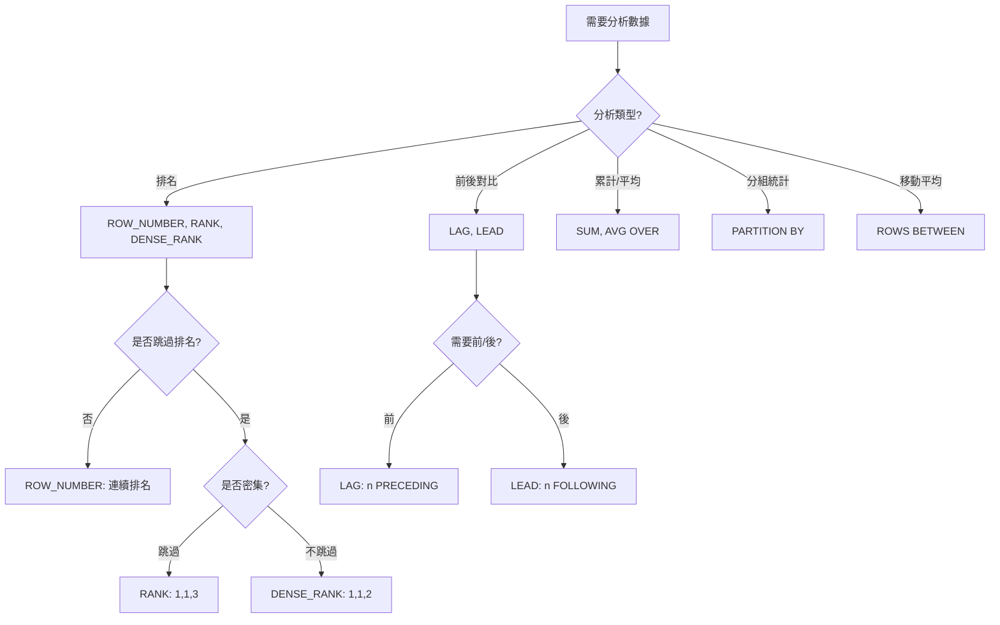

# SQL 視窗函數實戰範例與練習

> 📝 透過實際範例與練習，掌握視窗函數在真實場景中的應用：部門排名、累計銷售分析、移動平均、同比環比計算。

## 前言

前面我們了解了排名函數、偏移函數和聚合函數的語法與原理。現在讓我們通過實際範例來鞏固所學，然後通過練習題來測試自己的理解。

:::details 🔗 想看函數介紹？
- [SQL 視窗函數完全指南](/database/sql/sql-window-functions) — 基本概念與語法
- [排名函數（ROW_NUMBER、RANK）](/database/sql/sql-window-functions-ranking)
- [偏移函數（LAG、LEAD）](/database/sql/sql-window-functions-offset)
- [聚合函數與視窗框](/database/sql/sql-window-functions-aggregate)
:::

## 實際範例

### 範例 1：部門內薪資排名

**情境說明：** 找出每個部門薪資最高的前 3 名員工。

:::details 📋 建立資料表與假資料
```sql
-- 建立員工表
CREATE TABLE employees (
    employee_id INT PRIMARY KEY,
    name VARCHAR(50),
    department VARCHAR(50),
    salary DECIMAL(10, 2)
);

-- 插入假資料
INSERT INTO employees (employee_id, name, department, salary) VALUES
(1, '王五', 'IT', 55000),
(2, '陳七', 'IT', 50000),
(3, '李四', 'IT', 60000),
(4, '周八', 'IT', 48000),
(5, '張三', 'IT', 65000),
(6, '劉九', 'Sales', 45000),
(7, '趙六', 'Sales', 58000),
(8, '吳十', 'Sales', 42000),
(9, '鄭十一', 'HR', 52000),
(10, '林十二', 'HR', 48000);
```
:::

```sql
WITH ranked_employees AS (
    SELECT
        employee_id,
        name,
        department,
        salary,
        RANK() OVER (PARTITION BY department ORDER BY salary DESC) AS salary_rank
    FROM employees
)
SELECT
    employee_id,
    name,
    department,
    salary,
    salary_rank
FROM ranked_employees
WHERE salary_rank <= 3
ORDER BY department, salary_rank;

-- 輸出結果：
-- employee_id | name  | department | salary | salary_rank
-- -----------|-------|------------|--------|------------
-- 5          | 張三  | IT         | 65000  | 1
-- 3          | 李四  | IT         | 60000  | 2
-- 1          | 王五  | IT         | 55000  | 3
-- 7          | 趙六  | Sales      | 58000  | 1
```

**程式碼說明：**
1. 使用 CTE 將視窗函數結果命名，便於後續過濾
2. `PARTITION BY department`：每個部門獨立排名
3. `ORDER BY salary DESC`：薪資由高到低排名
4. 外層查詢 `WHERE salary_rank <= 3`：只取前 3 名

### 範例 2：計算累計銷售額與增長率

**情境說明：** 分析每月銷售額的累計趨勢和增長率。

:::details 📋 建立資料表與假資料
```sql
-- 建立月度銷售表（如已建立可跳過）
CREATE TABLE monthly_sales (
    month DATE PRIMARY KEY,
    sales_amount DECIMAL(10, 2)
);

-- 插入假資料
INSERT INTO monthly_sales (month, sales_amount) VALUES
('2024-01-01', 100000),
('2024-02-01', 120000),
('2024-03-01', 150000),
('2024-04-01', 140000),
('2024-05-01', 165000),
('2024-06-01', 180000),
('2024-07-01', 175000),
('2024-08-01', 195000);
```
:::

```sql
SELECT
    month,
    sales_amount,
    -- 累計銷售額
    SUM(sales_amount) OVER (ORDER BY month) AS cumulative_sales,
    -- 上月銷售額
    LAG(sales_amount, 1) OVER (ORDER BY month) AS prev_month_sales,
    -- 環比增長率
    ROUND(
        CASE
            WHEN LAG(sales_amount, 1) OVER (ORDER BY month) = 0 THEN NULL
            ELSE (sales_amount - LAG(sales_amount, 1) OVER (ORDER BY month)) /
                 LAG(sales_amount, 1) OVER (ORDER BY month) * 100
        END, 2
    ) AS growth_rate
FROM monthly_sales
ORDER BY month;

-- 輸出結果：
-- month     | sales_amount | cumulative_sales | prev_month_sales | growth_rate
-- ----------|--------------|-----------------|-----------------|------------
-- 2024-01   | 100000       | 100000          | NULL            | NULL
-- 2024-02   | 120000       | 220000          | 100000          | 20.00
-- 2024-03   | 150000       | 370000          | 120000          | 25.00
-- 2024-04   | 140000       | 510000          | 150000          | -6.67
```

**程式碼說明：**
1. `SUM(...) OVER (ORDER BY month)`：按月份順序累計
2. `LAG(..., 1)`：獲取前 1 行數據（上月銷售額）
3. CASE 避免除以零錯誤

### 範例 3：移動平均計算

**情境說明：** 計算 7 天移動平均，平滑波動趨勢。

:::details 📋 建立資料表與假資料
```sql
-- 建立每日銷售表
CREATE TABLE daily_sales (
    sale_date DATE PRIMARY KEY,
    amount DECIMAL(10, 2)
);

-- 插入假資料（30 天）
INSERT INTO daily_sales (sale_date, amount) VALUES
('2024-01-01', 1000), ('2024-01-02', 1200), ('2024-01-03', 1100),
('2024-01-04', 1300), ('2024-01-05', 1250), ('2024-01-06', 1400),
('2024-01-07', 1500), ('2024-01-08', 1350), ('2024-01-09', 1450),
('2024-01-10', 1600), ('2024-01-11', 1550), ('2024-01-12', 1700),
('2024-01-13', 1650), ('2024-01-14', 1800), ('2024-01-15', 1750),
('2024-01-16', 1900), ('2024-01-17', 1850), ('2024-01-18', 2000),
('2024-01-19', 1950), ('2024-01-20', 2100), ('2024-01-21', 2050),
('2024-01-22', 2200), ('2024-01-23', 2150), ('2024-01-24', 2300),
('2024-01-25', 2250), ('2024-01-26', 2400), ('2024-01-27', 2350),
('2024-01-28', 2500), ('2024-01-29', 2450), ('2024-01-30', 2600);
```
:::

```sql
SELECT
    sale_date,
    amount,
    -- 7 天移動平均
    AVG(amount) OVER (
        ORDER BY sale_date
        ROWS BETWEEN 6 PRECEDING AND CURRENT ROW
    ) AS moving_avg_7,
    -- 30 天移動平均
    AVG(amount) OVER (
        ORDER BY sale_date
        ROWS BETWEEN 29 PRECEDING AND CURRENT ROW
    ) AS moving_avg_30
FROM daily_sales
ORDER BY sale_date;

-- 輸出結果：
-- sale_date  | amount | moving_avg_7 | moving_avg_30
-- ----------|--------|--------------|--------------
-- 2024-01-01| 1000   | 1000         | 1000
-- 2024-01-02| 1200   | 1100         | 1100
-- ...
-- 2024-01-07| 1500   | 1285.71      | 1200
```

**程式碼說明：**
- `ROWS BETWEEN 6 PRECEDING AND CURRENT ROW`：當前行 + 前 6 行 = 共 7 行
- 移動平均可以平滑短期波動，顯示長期趨勢

### 範例 4：同比與環比分析

**情境說明：** 比較今年與去年同期的銷售額。

:::details 📋 建立資料表與假資料
```sql
-- 建立月度銷售表（跨年度）
CREATE TABLE monthly_sales (
    month DATE PRIMARY KEY,
    sales_amount DECIMAL(10, 2)
);

-- 插入假資料（2023-2024 兩年）
INSERT INTO monthly_sales (month, sales_amount) VALUES
-- 2023 年
('2023-01-01', 80000), ('2023-02-01', 85000), ('2023-03-01', 90000),
('2023-04-01', 88000), ('2023-05-01', 92000), ('2023-06-01', 95000),
('2023-07-01', 93000), ('2023-08-01', 98000), ('2023-09-01', 100000),
('2023-10-01', 105000), ('2023-11-01', 110000), ('2023-12-01', 115000),
-- 2024 年
('2024-01-01', 100000), ('2024-02-01', 120000), ('2024-03-01', 150000),
('2024-04-01', 140000), ('2024-05-01', 165000), ('2024-06-01', 180000),
('2024-07-01', 175000), ('2024-08-01', 195000), ('2024-09-01', 200000),
('2024-10-01', 210000), ('2024-11-01', 220000), ('2024-12-01', 230000);
```
:::

```sql
SELECT
    month,
    sales_amount AS current_year_sales,
    -- 去年同期（前 12 個月）
    LAG(sales_amount, 12) OVER (ORDER BY month) AS last_year_sales,
    -- 同比增長率
    ROUND(
        CASE
            WHEN LAG(sales_amount, 12) OVER (ORDER BY month) IS NULL THEN NULL
            ELSE (sales_amount - LAG(sales_amount, 12) OVER (ORDER BY month)) /
                 LAG(sales_amount, 12) OVER (ORDER BY month) * 100
        END, 2
    ) AS yoy_growth_rate
FROM monthly_sales
ORDER BY month;
```

## 視窗函數決策樹



## 實戰練習

### 練習 1：基礎排名（簡單）⭐

**任務：** 查詢學生成績表，顯示每位學生的成績排名。

**資料表 `students` 有欄位：** `student_id`, `name`, `score`

**提示：**
- 使用 `ROW_NUMBER()` 進行連續排名
- 按成績降序排列

:::details 📋 建立資料表與假資料
```sql
-- 建立學生表（如已建立可跳過）
CREATE TABLE students (
    student_id INT PRIMARY KEY,
    name VARCHAR(50),
    score INT
);

-- 插入假資料
INSERT INTO students (student_id, name, score) VALUES
(1, '張三', 95),
(2, '李四', 95),
(3, '王五', 90),
(4, '趙六', 85),
(5, '孫七', 85),
(6, '周八', 80),
(7, '吳九', 75),
(8, '鄭十', 70);
```
:::

:::details 💡 參考答案
```sql
SELECT
    student_id,
    name,
    score,
    ROW_NUMBER() OVER (ORDER BY score DESC) AS rank,
    RANK() OVER (ORDER BY score DESC) AS rank_with_skip,
    DENSE_RANK() OVER (ORDER BY score DESC) AS dense_rank
FROM students
ORDER BY score DESC;

-- 輸出結果：
-- student_id | name  | score | rank | rank_with_skip | dense_rank
-- -----------|-------|-------|------|---------------|------------
-- 1          | 張三  | 95    | 1     | 1             | 1
-- 2          | 李四  | 95    | 2     | 1             | 1
-- 3          | 王五  | 90    | 3     | 3             | 2
-- 4          | 趙六  | 85    | 4     | 4             | 3
```

**說明：**
- `ROW_NUMBER`：即使分數相同也有不同排名
- `RANK`：相同分數排名相同，跳過後續排名
- `DENSE_RANK`：相同分數排名相同，不跳過排名
:::

### 練習 2：累計銷售額（簡單）⭐

**任務：** 計算每日銷售額的累計總和。

**資料表 `daily_sales` 有欄位：** `sale_date`, `amount`

**提示：**
- 使用 `SUM() OVER (ORDER BY sale_date)` 計算累計
- 按日期排序

:::details 📋 建立資料表與假資料
```sql
-- 建立每日銷售表（如已建立可跳過）
CREATE TABLE daily_sales (
    sale_date DATE PRIMARY KEY,
    amount DECIMAL(10, 2)
);

-- 插入假資料
INSERT INTO daily_sales (sale_date, amount) VALUES
('2024-01-01', 1000),
('2024-01-02', 1200),
('2024-01-03', 1500),
('2024-01-04', 1300),
('2024-01-05', 1600),
('2024-01-06', 1400),
('2024-01-07', 1800);
```
:::

:::details 💡 參考答案
```sql
SELECT
    sale_date,
    amount,
    SUM(amount) OVER (ORDER BY sale_date) AS cumulative_sales
FROM daily_sales
ORDER BY sale_date;

-- 輸出結果：
-- sale_date  | amount | cumulative_sales
-- ----------|--------|-----------------
-- 2024-01-01| 1000   | 1000
-- 2024-01-02| 1200   | 2200
-- 2024-01-03| 1500   | 3700
-- 2024-01-04| 1300   | 5000
```

**說明：**
- `OVER (ORDER BY sale_date)` 按日期順序計算累計
- 每行的 `cumulative_sales` 是從開始到當前日期的總和
:::

### 練習 3：部門內排名與前後薪資比較（中等）⭐⭐

**任務：** 查詢每位員工在部門內的薪資排名，並顯示該部門內薪資最高和最低的員工姓名。

**資料表 `employees` 有欄位：** `employee_id`, `name`, `department`, `salary`

**需求：**
1. 部門內薪資排名（使用 DENSE_RANK）
2. 部門內最高薪資員工姓名
3. 部門內最低薪資員工姓名

**提示：**
- 使用 `PARTITION BY department` 分組
- 使用 `FIRST_VALUE()` 和 `LAST_VALUE()` 或嵌套查詢

:::details 📋 建立資料表與假資料
```sql
-- 建立員工表（如已建立可跳過）
CREATE TABLE employees (
    employee_id INT PRIMARY KEY,
    name VARCHAR(50),
    department VARCHAR(50),
    salary DECIMAL(10, 2)
);

-- 插入假資料
INSERT INTO employees (employee_id, name, department, salary) VALUES
(1, '王五', 'IT', 55000),
(2, '陳七', 'IT', 50000),
(3, '李四', 'IT', 60000),
(4, '周八', 'IT', 48000),
(5, '張三', 'IT', 65000),
(6, '劉九', 'Sales', 45000),
(7, '趙六', 'Sales', 58000),
(8, '吳十', 'Sales', 42000),
(9, '鄭十一', 'Sales', 52000),
(10, '林十二', 'HR', 48000),
(11, '黃十三', 'HR', 55000),
(12, '楊十四', 'HR', 50000);
```
:::

:::details 💡 參考答案與解題思路

**解題思路：**
1. 使用 `PARTITION BY department` 讓每個部門獨立排名
2. `FIRST_VALUE() OVER (PARTITION BY department ORDER BY salary DESC)` 獲取最高薪資員工
3. 使用 `RANGE BETWEEN UNBOUNDED PRECEDING AND UNBOUNDED FOLLOWING` 確保覆蓋整個部門

**參考程式碼：**
```sql
SELECT
    employee_id,
    name,
    department,
    salary,
    DENSE_RANK() OVER (PARTITION BY department ORDER BY salary DESC) AS dept_rank,
    FIRST_VALUE(name) OVER (
        PARTITION BY department
        ORDER BY salary DESC
        ROWS BETWEEN UNBOUNDED PRECEDING AND UNBOUNDED FOLLOWING
    ) AS highest_paid_name,
    FIRST_VALUE(name) OVER (
        PARTITION BY department
        ORDER BY salary ASC
        ROWS BETWEEN UNBOUNDED PRECEDING AND UNBOUNDED FOLLOWING
    ) AS lowest_paid_name
FROM employees
ORDER BY department, salary DESC;
```

**延伸思考：**
- 如何找出每個部門薪資中位數？
- 如何計算每位員工薪資佔部門總薪資的比例？
- 如果要找出薪資高於部門平均的員工，該如何查詢？
:::

### 練習 4：移動平均與趨勢分析（困難）⭐⭐⭐

**任務：** 分析股價數據，計算多個移動平均線，判斷買入賣出訊號。

**資料表 `stock_prices` 有欄位：** `date`, `close_price`

**需求：**
1. 5 日移動平均（MA5）
2. 20 日移動平均（MA20）
3. 60 日移動平均（MA60）
4. 判斷金叉（MA5 上穿 MA20）和死叉（MA5 下穿 MA20）

**提示：**
- 使用多個 `AVG() OVER (ROWS BETWEEN ...)` 計算移動平均
- 使用 `LAG()` 比較前一日數據，判斷交叉

:::details 📋 建立資料表與假資料
```sql
-- 建立股價表
CREATE TABLE stock_prices (
    date DATE PRIMARY KEY,
    close_price DECIMAL(10, 2)
);

-- 插入假資料（模擬 90 天股價）
INSERT INTO stock_prices (date, close_price) VALUES
('2024-01-01', 100.50), ('2024-01-02', 102.30), ('2024-01-03', 101.80),
('2024-01-04', 103.50), ('2024-01-05', 105.20), ('2024-01-06', 104.80),
('2024-01-07', 106.50), ('2024-01-08', 108.30), ('2024-01-09', 107.90),
('2024-01-10', 109.50), ('2024-01-11', 111.20), ('2024-01-12', 110.80),
('2024-01-13', 112.50), ('2024-01-14', 114.30), ('2024-01-15', 113.90),
('2024-01-16', 115.50), ('2024-01-17', 117.20), ('2024-01-18', 116.80),
('2024-01-19', 118.50), ('2024-01-20', 120.30), ('2024-01-21', 119.90),
('2024-01-22', 121.50), ('2024-01-23', 120.20), ('2024-01-24', 118.80),
('2024-01-25', 117.50), ('2024-01-26', 116.30), ('2024-01-27', 115.90),
('2024-01-28', 114.50), ('2024-01-29', 113.20), ('2024-01-30', 112.80),
('2024-01-31', 111.50), ('2024-02-01', 110.30), ('2024-02-02', 109.90),
('2024-02-03', 108.50), ('2024-02-04', 107.20), ('2024-02-05', 108.80),
('2024-02-06', 110.50), ('2024-02-07', 112.30), ('2024-02-08', 113.90),
('2024-02-09', 115.50), ('2024-02-10', 117.20), ('2024-02-11', 118.80),
('2024-02-12', 120.50), ('2024-02-13', 122.30), ('2024-02-14', 123.90),
('2024-02-15', 125.50), ('2024-02-16', 127.20), ('2024-02-17', 128.80),
('2024-02-18', 130.50), ('2024-02-19', 132.30), ('2024-02-20', 133.90),
('2024-02-21', 135.50), ('2024-02-22', 137.20), ('2024-02-23', 138.80),
('2024-02-24', 140.50), ('2024-02-25', 142.30), ('2024-02-26', 143.90),
('2024-02-27', 145.50), ('2024-02-28', 147.20), ('2024-02-29', 148.80),
('2024-03-01', 150.50), ('2024-03-02', 152.30), ('2024-03-03', 153.90),
('2024-03-04', 155.50), ('2024-03-05', 154.20), ('2024-03-06', 152.80),
('2024-03-07', 151.50), ('2024-03-08', 150.30), ('2024-03-09', 148.90),
('2024-03-10', 147.50), ('2024-03-11', 146.20), ('2024-03-12', 144.80),
('2024-03-13', 143.50), ('2024-03-14', 142.30), ('2024-03-15', 140.90),
('2024-03-16', 139.50), ('2024-03-17', 138.20), ('2024-03-18', 136.80),
('2024-03-19', 135.50), ('2024-03-20', 134.30), ('2024-03-21', 132.90),
('2024-03-22', 131.50), ('2024-03-23', 130.20), ('2024-03-24', 128.80),
('2024-03-25', 127.50), ('2024-03-26', 126.30), ('2024-03-27', 124.90),
('2024-03-28', 123.50), ('2024-03-29', 122.20), ('2024-03-30', 120.80);
```
:::

:::details 💡 參考答案
```sql
WITH moving_averages AS (
    SELECT
        date,
        close_price,
        -- 5 日移動平均
        AVG(close_price) OVER (
            ORDER BY date
            ROWS BETWEEN 4 PRECEDING AND CURRENT ROW
        ) AS ma5,
        -- 20 日移動平均
        AVG(close_price) OVER (
            ORDER BY date
            ROWS BETWEEN 19 PRECEDING AND CURRENT ROW
        ) AS ma20,
        -- 60 日移動平均
        AVG(close_price) OVER (
            ORDER BY date
            ROWS BETWEEN 59 PRECEDING AND CURRENT ROW
        ) AS ma60
    FROM stock_prices
),
cross_signals AS (
    SELECT
        date,
        close_price,
        ma5,
        ma20,
        ma60,
        -- 前一日移動平均
        LAG(ma5) OVER (ORDER BY date) AS prev_ma5,
        LAG(ma20) OVER (ORDER BY date) AS prev_ma20,
        -- 判斷金叉（MA5 上穿 MA20）
        CASE
            WHEN ma5 > ma20 AND prev_ma5 <= prev_ma20 THEN '金叉（買入）'
            WHEN ma5 < ma20 AND prev_ma5 >= prev_ma20 THEN '死叉（賣出）'
            ELSE NULL
        END AS signal
    FROM moving_averages
)
SELECT *
FROM cross_signals
WHERE signal IS NOT NULL
ORDER BY date;
```

**使用的技巧：**
- 計算多個移動平均線
- 使用 LAG 比較前一日數據
- CASE 判斷交叉訊號
:::
