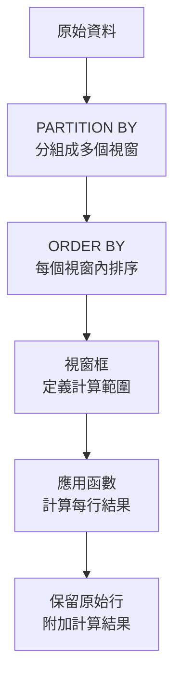
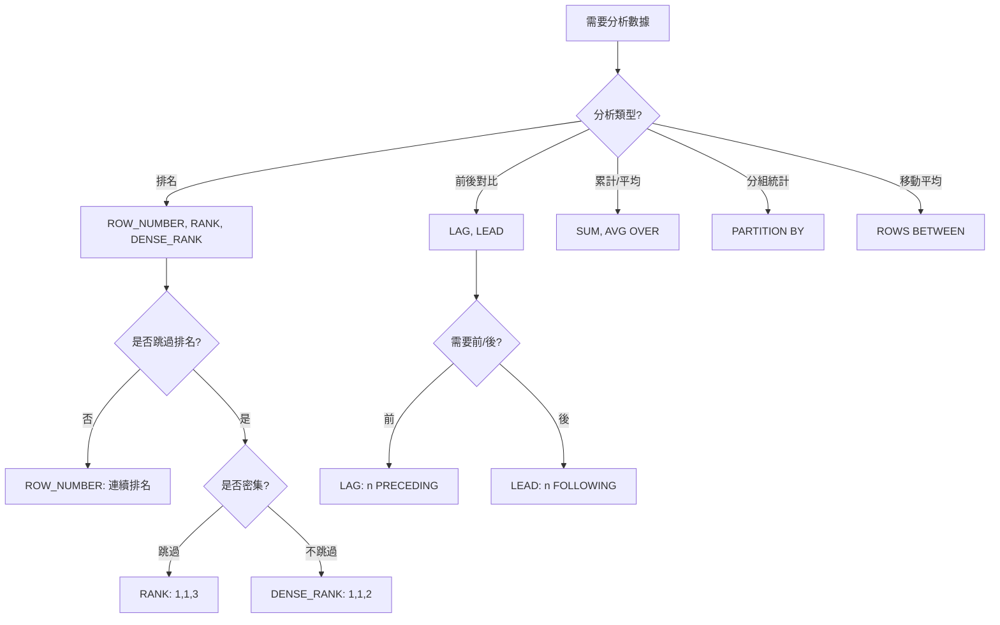

# SQL 視窗函數（Window Functions）完全指南

> 📝 TL;DR 視窗函數（Window Functions）是 SQL 的強大分析工具，可以在不使用 GROUP BY 的情況下進行排名、計算累計值、比較行與行之間的差異。本文將帶你了解 OVER 子句、PARTITION BY、ORDER BY，以及 ROW_NUMBER、RANK、LAG、LEAD 等核心函數的實際應用。

## 前置知識

在開始之前，建議你先了解以下概念：

- **基本 SQL 語法** - SELECT、FROM、WHERE、ORDER BY 的基礎使用
- **聚合函數** - SUM、AVG、COUNT、MAX、MIN 的基本概念
- **GROUP BY 語法** - 了解分組統計的基本用法

## 什麼是視窗函數？

視窗函數是一種**在查詢結果集上執行計算**的特殊函數。與普通聚合函數不同，視窗函數不會將多行合併成一行，而是**保留每一行的原始資料**，同時附加計算結果。

### 為什麼需要學習視窗函數？

想像你需要查詢「每位員工的薪資排名」或「每月的累計銷售額」：

- **解決什麼問題？** 不使用 GROUP BY 也能進行分組計算，保留原始行數據
- **有什麼優勢？** 一次查詢完成複雜的分析計算，避免多次自關聯
- **什麼時候會用到？** 排名分析、累計統計、同比環比計算、移動平均

### 核心概念

視窗函數由三個部分組成：
1. **函數** - 要執行的計算（如 ROW_NUMBER、SUM、LAG）
2. **OVER 子句** - 定義視窗範圍（如 PARTITION BY、ORDER BY）
3. **視窗框** - 精確定義計算範圍（如 ROWS BETWEEN）

:::warning ⚠️ 注意
- 視窗函數只能在 SELECT 和 ORDER BY 子句中使用
- 不能在 WHERE、GROUP BY、HAVING 中直接使用視窗函數
- 視窗函數計算結果是基於當前查詢結果集，不支援過濾
:::

## 💻 基本語法

### 語法結構

```sql
-- 基本語法
function_name(expression) OVER (
    [PARTITION BY column1, column2, ...]
    [ORDER BY column1 [ASC|DESC], ...]
    [frame_clause]
)

-- 完整範例
SELECT
    employee_id,
    name,
    department,
    salary,
    ROW_NUMBER() OVER (PARTITION BY department ORDER BY salary DESC) AS rank_in_dept
FROM employees;
```

### 參數說明

| 元素         | 說明                                                 | 必填 |
| ------------ | ---------------------------------------------------- | ---- |
| 函數名稱     | 執行的計算函數，如 ROW_NUMBER、RANK、SUM、LAG 等     | 是   |
| OVER         | 宣告視窗函數的關鍵字                                 | 是   |
| PARTITION BY | 將結果集分成多個視窗（類似 GROUP BY，但不合併行）    | 否   |
| ORDER BY     | 在視窗內排序                                         | 否   |
| frame_clause | 進一步限制視窗範圍（如 ROWS BETWEEN、RANGE BETWEEN） | 否   |

## 視窗函數執行流程視覺化



## 視窗函數分類

### 1. 排名函數

用於為行分配排名，適合用於競賽排名、成績分析等場景。

| 函數         | 說明                         | 特點                                         |
| ------------ | ---------------------------- | -------------------------------------------- |
| ROW_NUMBER() | 連續編號，無論值是否相同     | 即使值相同也分配不同編號（1,2,3,4...）       |
| RANK()       | 跳躍排名，相同值使用相同排名 | 相同值排名相同，跳過後續排名（1,1,3,4...）   |
| DENSE_RANK() | 密集排名，相同值使用相同排名 | 相同值排名相同，不跳過後續排名（1,1,2,3...） |
| NTILE(n)     | 將行分配到 n 個等分組        | 將結果集分成 n 組，每組分配組別編號          |

#### 排名函數比較範例

:::details 📋 建立資料表與假資料
```sql
-- 建立學生表
CREATE TABLE students (
    student_id INT PRIMARY KEY,
    name VARCHAR(50),
    score INT
);

-- 插入假資料
INSERT INTO students (student_id, name, score) VALUES
(1, '張三', 95),
(2, '李四', 95),
(3, '王五', 90),
(4, '趙六', 85),
(5, '孫七', 85),
(6, '周八', 80),
(7, '吳九', 75);
```
:::

```sql
SELECT
    name,
    score,
    ROW_NUMBER() OVER (ORDER BY score DESC) AS row_num,
    RANK() OVER (ORDER BY score DESC) AS rank_num,
    DENSE_RANK() OVER (ORDER BY score DESC) AS dense_rank
FROM students;

-- 輸出結果：
-- name  | score | row_num | rank_num | dense_rank
-- ------|-------|----------|----------|------------
-- 張三  | 95    | 1        | 1        | 1
-- 李四  | 95    | 2        | 1        | 1
-- 王五  | 90    | 3        | 3        | 2
-- 趙六  | 85    | 4        | 4        | 3
```

**程式碼說明：**
- `ROW_NUMBER`：即使分數相同，也有不同編號
- `RANK`：相同分數排名相同，跳過下一個排名
- `DENSE_RANK`：相同分數排名相同，不跳過排名

### 2. 偏移函數

用於訪問視窗內其他行的值，適合計算同比環比、移動平均等場景。

| 函數          | 說明                        | 語法                            |
| ------------- | --------------------------- | ------------------------------- |
| LAG(expr, n)  | 獲取當前行**前**第 n 行的值 | LAG(salary, 1) OVER (...)       |
| LEAD(expr, n) | 獲取當前行**後**第 n 行的值 | LEAD(salary, 1) OVER (...)      |
| FIRST_VALUE() | 獲取視窗內**第一**行的值    | FIRST_VALUE(salary) OVER (...)  |
| LAST_VALUE()  | 獲取視窗內**最後**一行的值  | LAST_VALUE(salary) OVER (...)   |
| NTH_VALUE(n)  | 獲取視窗內第 n 行的值       | NTH_VALUE(salary, 2) OVER (...) |

#### LAG/LEAD 範例：月度銷售對比

:::details 📋 建立資料表與假資料
```sql
-- 建立月度銷售表
CREATE TABLE monthly_sales (
    month DATE PRIMARY KEY,
    sales_amount DECIMAL(10, 2)
);

-- 插入假資料
INSERT INTO monthly_sales (month, sales_amount) VALUES
('2024-01-01', 100000),
('2024-02-01', 120000),
('2024-03-01', 150000),
('2024-04-01', 140000),
('2024-05-01', 165000),
('2024-06-01', 180000);
```
:::

```sql
SELECT
    month,
    sales_amount,
    LAG(sales_amount, 1, 0) OVER (ORDER BY month) AS prev_month_sales,
    LEAD(sales_amount, 1, 0) OVER (ORDER BY month) AS next_month_sales,
    ROUND(
        (sales_amount - LAG(sales_amount, 1) OVER (ORDER BY month)) /
        LAG(sales_amount, 1) OVER (ORDER BY month) * 100, 2
    ) AS growth_rate
FROM monthly_sales
ORDER BY month;

-- 輸出結果：
-- month     | sales_amount | prev_month_sales | next_month_sales | growth_rate
-- ----------|--------------|-----------------|-----------------|------------
-- 2024-01   | 100000       | 0               | 120000          | NULL
-- 2024-02   | 120000       | 100000          | 150000          | 20.00
-- 2024-03   | 150000       | 120000          | 140000          | 25.00
-- 2024-04   | 140000       | 150000          | 0               | -6.67
```

**程式碼說明：**
- `LAG(sales_amount, 1, 0)`：獲取前 1 行的值，如果沒有前 1 行則返回 0
- 計算增長率公式：（本月 - 上月）/ 上月 × 100
- 第一行沒有前一個月，增長率為 NULL

### 3. 聚合函數（OVER 子句）

將 SUM、AVG、COUNT 等聚合函數與 OVER 子句結合，計算累計值、移動平均等。

:::details 📋 建立資料表與假資料
```sql
-- 建立銷售表
CREATE TABLE sales (
    sale_id INT PRIMARY KEY AUTO_INCREMENT,
    sale_date DATE,
    product_id INT,
    amount DECIMAL(10, 2)
);

-- 插入假資料
INSERT INTO sales (sale_date, product_id, amount) VALUES
('2024-01-01', 1, 100),
('2024-01-02', 1, 150),
('2024-01-03', 1, 200),
('2024-01-04', 1, 180),
('2024-01-05', 2, 300),
('2024-01-06', 2, 250),
('2024-01-07', 1, 220),
('2024-01-08', 1, 190);
```
:::

```sql
SELECT
    sale_date,
    product_id,
    amount,
    SUM(amount) OVER (ORDER BY sale_date) AS cumulative_sum,
    AVG(amount) OVER (ORDER BY sale_date ROWS BETWEEN 2 PRECEDING AND CURRENT ROW) AS moving_avg_3,
    COUNT(*) OVER (PARTITION BY product_id) AS product_count
FROM sales
ORDER BY sale_date;

-- 輸出結果：
-- sale_date  | product_id | amount | cumulative_sum | moving_avg_3 | product_count
-- ----------|-----------|--------|----------------|-------------|---------------
-- 2024-01-01| 1         | 100    | 100            | 100         | 4
-- 2024-01-02| 1         | 150    | 250            | 125         | 4
-- 2024-01-03| 1         | 200    | 450            | 150         | 4
-- 2024-01-04| 1         | 180    | 630            | 176.67      | 4
-- 2024-01-05| 2         | 300    | 930            | 226.67      | 2
```

**程式碼說明：**
- `SUM(amount) OVER (ORDER BY sale_date)`：累計總和
- `AVG(... ROWS BETWEEN 2 PRECEDING AND CURRENT ROW)`：3 天移動平均
- `COUNT(*) OVER (PARTITION BY product_id)`：每個產品的銷售次數

## 視窗框（Window Frame）詳解

視窗框精確定義計算範圍，必須配合 ORDER BY 使用。

### 語法結構

```sql
function_name(expr) OVER (
    ORDER BY column
    ROWS BETWEEN {start_frame} AND {end_frame}
)

-- 或

function_name(expr) OVER (
    ORDER BY column
    RANGE BETWEEN {start_frame} AND {end_frame}
)
```

### Frame 選項

| 語法                | 說明                     | 範例                                       |
| ------------------- | ------------------------ | ------------------------------------------ |
| UNBOUNDED PRECEDING | 視窗的第一行（無上限）   | `ROWS BETWEEN UNBOUNDED PRECEDING`         |
| n PRECEDING         | 前 n 行                  | `ROWS BETWEEN 2 PRECEDING`                 |
| CURRENT ROW         | 當前行                   | `ROWS BETWEEN ... AND CURRENT ROW`         |
| n FOLLOWING         | 後 n 行                  | `ROWS BETWEEN ... AND 1 FOLLOWING`         |
| UNBOUNDED FOLLOWING | 視窗的最後一行（無下限） | `ROWS BETWEEN ... AND UNBOUNDED FOLLOWING` |

### 視窗框範例

```sql
SELECT
    sale_date,
    amount,
    -- 累計從開始到當前
    SUM(amount) OVER (
        ORDER BY sale_date
        ROWS BETWEEN UNBOUNDED PRECEDING AND CURRENT ROW
    ) AS cumulative_sum,
    -- 3 天移動平均
    AVG(amount) OVER (
        ORDER BY sale_date
        ROWS BETWEEN 2 PRECEDING AND CURRENT ROW
    ) AS moving_avg_3,
    -- 計算當前與前後各 1 行的平均
    AVG(amount) OVER (
        ORDER BY sale_date
        ROWS BETWEEN 1 PRECEDING AND 1 FOLLOWING
    ) AS centered_avg_3
FROM sales;
```

:::tip 💡 ROWS vs RANGE
- **ROWS**：基於物理行數（第幾行）
- **RANGE**：基於值範圍（如日期區間、數值區間）
- 例如：`RANGE BETWEEN INTERVAL '7' DAY PRECEDING AND CURRENT ROW` 表示過去 7 天內的數據，不管實際有幾行
:::

## 實際範例

### 範例 1：部門內薪資排名

**情境說明：** 找出每個部門薪資最高的前 3 名員工。

:::details 📋 建立資料表與假資料
```sql
-- 建立員工表
CREATE TABLE employees (
    employee_id INT PRIMARY KEY,
    name VARCHAR(50),
    department VARCHAR(50),
    salary DECIMAL(10, 2)
);

-- 插入假資料
INSERT INTO employees (employee_id, name, department, salary) VALUES
(1, '王五', 'IT', 55000),
(2, '陳七', 'IT', 50000),
(3, '李四', 'IT', 60000),
(4, '周八', 'IT', 48000),
(5, '張三', 'IT', 65000),
(6, '劉九', 'Sales', 45000),
(7, '趙六', 'Sales', 58000),
(8, '吳十', 'Sales', 42000),
(9, '鄭十一', 'HR', 52000),
(10, '林十二', 'HR', 48000);
```
:::

```sql
WITH ranked_employees AS (
    SELECT
        employee_id,
        name,
        department,
        salary,
        RANK() OVER (PARTITION BY department ORDER BY salary DESC) AS salary_rank
    FROM employees
)
SELECT
    employee_id,
    name,
    department,
    salary,
    salary_rank
FROM ranked_employees
WHERE salary_rank <= 3
ORDER BY department, salary_rank;

-- 輸出結果：
-- employee_id | name  | department | salary | salary_rank
-- -----------|-------|------------|--------|------------
-- 5          | 張三  | IT         | 65000  | 1
-- 3          | 李四  | IT         | 60000  | 2
-- 1          | 王五  | IT         | 55000  | 3
-- 7          | 趙六  | Sales      | 58000  | 1
```

**程式碼說明：**
1. 使用 CTE 將視窗函數結果命名，便於後續過濾
2. `PARTITION BY department`：每個部門獨立排名
3. `ORDER BY salary DESC`：薪資由高到低排名
4. 外層查詢 `WHERE salary_rank <= 3`：只取前 3 名

### 範例 2：計算累計銷售額與增長率

**情境說明：** 分析每月銷售額的累計趨勢和增長率。

:::details 📋 建立資料表與假資料
```sql
-- 建立月度銷售表（如已建立可跳過）
CREATE TABLE monthly_sales (
    month DATE PRIMARY KEY,
    sales_amount DECIMAL(10, 2)
);

-- 插入假資料
INSERT INTO monthly_sales (month, sales_amount) VALUES
('2024-01-01', 100000),
('2024-02-01', 120000),
('2024-03-01', 150000),
('2024-04-01', 140000),
('2024-05-01', 165000),
('2024-06-01', 180000),
('2024-07-01', 175000),
('2024-08-01', 195000);
```
:::

```sql
SELECT
    month,
    sales_amount,
    -- 累計銷售額
    SUM(sales_amount) OVER (ORDER BY month) AS cumulative_sales,
    -- 上月銷售額
    LAG(sales_amount, 1) OVER (ORDER BY month) AS prev_month_sales,
    -- 環比增長率
    ROUND(
        CASE
            WHEN LAG(sales_amount, 1) OVER (ORDER BY month) = 0 THEN NULL
            ELSE (sales_amount - LAG(sales_amount, 1) OVER (ORDER BY month)) /
                 LAG(sales_amount, 1) OVER (ORDER BY month) * 100
        END, 2
    ) AS growth_rate
FROM monthly_sales
ORDER BY month;

-- 輸出結果：
-- month     | sales_amount | cumulative_sales | prev_month_sales | growth_rate
-- ----------|--------------|-----------------|-----------------|------------
-- 2024-01   | 100000       | 100000          | NULL            | NULL
-- 2024-02   | 120000       | 220000          | 100000          | 20.00
-- 2024-03   | 150000       | 370000          | 120000          | 25.00
-- 2024-04   | 140000       | 510000          | 150000          | -6.67
```

**程式碼說明：**
1. `SUM(...) OVER (ORDER BY month)`：按月份順序累計
2. `LAG(..., 1)`：獲取前 1 行數據（上月銷售額）
3. CASE 避免除以零錯誤

### 範例 3：移動平均計算

**情境說明：** 計算 7 天移動平均，平滑波動趨勢。

:::details 📋 建立資料表與假資料
```sql
-- 建立每日銷售表
CREATE TABLE daily_sales (
    sale_date DATE PRIMARY KEY,
    amount DECIMAL(10, 2)
);

-- 插入假資料（30 天）
INSERT INTO daily_sales (sale_date, amount) VALUES
('2024-01-01', 1000), ('2024-01-02', 1200), ('2024-01-03', 1100),
('2024-01-04', 1300), ('2024-01-05', 1250), ('2024-01-06', 1400),
('2024-01-07', 1500), ('2024-01-08', 1350), ('2024-01-09', 1450),
('2024-01-10', 1600), ('2024-01-11', 1550), ('2024-01-12', 1700),
('2024-01-13', 1650), ('2024-01-14', 1800), ('2024-01-15', 1750),
('2024-01-16', 1900), ('2024-01-17', 1850), ('2024-01-18', 2000),
('2024-01-19', 1950), ('2024-01-20', 2100), ('2024-01-21', 2050),
('2024-01-22', 2200), ('2024-01-23', 2150), ('2024-01-24', 2300),
('2024-01-25', 2250), ('2024-01-26', 2400), ('2024-01-27', 2350),
('2024-01-28', 2500), ('2024-01-29', 2450), ('2024-01-30', 2600);
```
:::

```sql
SELECT
    sale_date,
    amount,
    -- 7 天移動平均
    AVG(amount) OVER (
        ORDER BY sale_date
        ROWS BETWEEN 6 PRECEDING AND CURRENT ROW
    ) AS moving_avg_7,
    -- 30 天移動平均
    AVG(amount) OVER (
        ORDER BY sale_date
        ROWS BETWEEN 29 PRECEDING AND CURRENT ROW
    ) AS moving_avg_30
FROM daily_sales
ORDER BY sale_date;

-- 輸出結果：
-- sale_date  | amount | moving_avg_7 | moving_avg_30
-- ----------|--------|--------------|--------------
-- 2024-01-01| 1000   | 1000         | 1000
-- 2024-01-02| 1200   | 1100         | 1100
-- ...
-- 2024-01-07| 1500   | 1285.71      | 1200
```

**程式碼說明：**
- `ROWS BETWEEN 6 PRECEDING AND CURRENT ROW`：當前行 + 前 6 行 = 共 7 行
- 移動平均可以平滑短期波動，顯示長期趨勢

### 範例 4：同比與環比分析

**情境說明：** 比較今年與去年同期的銷售額。

:::details 📋 建立資料表與假資料
```sql
-- 建立月度銷售表（跨年度）
CREATE TABLE monthly_sales (
    month DATE PRIMARY KEY,
    sales_amount DECIMAL(10, 2)
);

-- 插入假資料（2023-2024 兩年）
INSERT INTO monthly_sales (month, sales_amount) VALUES
-- 2023 年
('2023-01-01', 80000), ('2023-02-01', 85000), ('2023-03-01', 90000),
('2023-04-01', 88000), ('2023-05-01', 92000), ('2023-06-01', 95000),
('2023-07-01', 93000), ('2023-08-01', 98000), ('2023-09-01', 100000),
('2023-10-01', 105000), ('2023-11-01', 110000), ('2023-12-01', 115000),
-- 2024 年
('2024-01-01', 100000), ('2024-02-01', 120000), ('2024-03-01', 150000),
('2024-04-01', 140000), ('2024-05-01', 165000), ('2024-06-01', 180000),
('2024-07-01', 175000), ('2024-08-01', 195000), ('2024-09-01', 200000),
('2024-10-01', 210000), ('2024-11-01', 220000), ('2024-12-01', 230000);
```
:::

```sql
SELECT
    month,
    sales_amount AS current_year_sales,
    -- 去年同期（前 12 個月）
    LAG(sales_amount, 12) OVER (ORDER BY month) AS last_year_sales,
    -- 同比增長率
    ROUND(
        CASE
            WHEN LAG(sales_amount, 12) OVER (ORDER BY month) IS NULL THEN NULL
            ELSE (sales_amount - LAG(sales_amount, 12) OVER (ORDER BY month)) /
                 LAG(sales_amount, 12) OVER (ORDER BY month) * 100
        END, 2
    ) AS yoy_growth_rate
FROM monthly_sales
ORDER BY month;
```

## 視窗函數決策樹



## 實戰練習

### 練習 1：基礎排名（簡單）⭐

**任務：** 查詢學生成績表，顯示每位學生的成績排名。

**資料表 `students` 有欄位：** `student_id`, `name`, `score`

**提示：**
- 使用 `ROW_NUMBER()` 進行連續排名
- 按成績降序排列

:::details 📋 建立資料表與假資料
```sql
-- 建立學生表（如已建立可跳過）
CREATE TABLE students (
    student_id INT PRIMARY KEY,
    name VARCHAR(50),
    score INT
);

-- 插入假資料
INSERT INTO students (student_id, name, score) VALUES
(1, '張三', 95),
(2, '李四', 95),
(3, '王五', 90),
(4, '趙六', 85),
(5, '孫七', 85),
(6, '周八', 80),
(7, '吳九', 75),
(8, '鄭十', 70);
```
:::

:::details �💡 參考答案
```sql
SELECT
    student_id,
    name,
    score,
    ROW_NUMBER() OVER (ORDER BY score DESC) AS rank,
    RANK() OVER (ORDER BY score DESC) AS rank_with_skip,
    DENSE_RANK() OVER (ORDER BY score DESC) AS dense_rank
FROM students
ORDER BY score DESC;

-- 輸出結果：
-- student_id | name  | score | rank | rank_with_skip | dense_rank
-- -----------|-------|-------|------|---------------|------------
-- 1          | 張三  | 95    | 1     | 1             | 1
-- 2          | 李四  | 95    | 2     | 1             | 1
-- 3          | 王五  | 90    | 3     | 3             | 2
-- 4          | 趙六  | 85    | 4     | 4             | 3
```

**說明：**
- `ROW_NUMBER`：即使分數相同也有不同排名
- `RANK`：相同分數排名相同，跳過後續排名
- `DENSE_RANK`：相同分數排名相同，不跳過排名
:::

### 練習 2：累計銷售額（簡單）⭐

**任務：** 計算每日銷售額的累計總和。

**資料表 `daily_sales` 有欄位：** `sale_date`, `amount`

**提示：**
- 使用 `SUM() OVER (ORDER BY sale_date)` 計算累計
- 按日期排序

:::details 📋 建立資料表與假資料
```sql
-- 建立每日銷售表（如已建立可跳過）
CREATE TABLE daily_sales (
    sale_date DATE PRIMARY KEY,
    amount DECIMAL(10, 2)
);

-- 插入假資料
INSERT INTO daily_sales (sale_date, amount) VALUES
('2024-01-01', 1000),
('2024-01-02', 1200),
('2024-01-03', 1500),
('2024-01-04', 1300),
('2024-01-05', 1600),
('2024-01-06', 1400),
('2024-01-07', 1800);
```
:::

:::details �💡 參考答案
```sql
SELECT
    sale_date,
    amount,
    SUM(amount) OVER (ORDER BY sale_date) AS cumulative_sales
FROM daily_sales
ORDER BY sale_date;

-- 輸出結果：
-- sale_date  | amount | cumulative_sales
-- ----------|--------|-----------------
-- 2024-01-01| 1000   | 1000
-- 2024-01-02| 1200   | 2200
-- 2024-01-03| 1500   | 3700
-- 2024-01-04| 1300   | 5000
```

**說明：**
- `OVER (ORDER BY sale_date)` 按日期順序計算累計
- 每行的 `cumulative_sales` 是從開始到當前日期的總和
:::

### 練習 3：部門內排名與前後薪資比較（中等）⭐⭐

**任務：** 查詢每位員工在部門內的薪資排名，並顯示該部門內薪資最高和最低的員工姓名。

**資料表 `employees` 有欄位：** `employee_id`, `name`, `department`, `salary`

**需求：**
1. 部門內薪資排名（使用 DENSE_RANK）
2. 部門內最高薪資員工姓名
3. 部門內最低薪資員工姓名

**提示：**
- 使用 `PARTITION BY department` 分組
- 使用 `FIRST_VALUE()` 和 `LAST_VALUE()` 或嵌套查詢

:::details 📋 建立資料表與假資料
```sql
-- 建立員工表（如已建立可跳過）
CREATE TABLE employees (
    employee_id INT PRIMARY KEY,
    name VARCHAR(50),
    department VARCHAR(50),
    salary DECIMAL(10, 2)
);

-- 插入假資料
INSERT INTO employees (employee_id, name, department, salary) VALUES
(1, '王五', 'IT', 55000),
(2, '陳七', 'IT', 50000),
(3, '李四', 'IT', 60000),
(4, '周八', 'IT', 48000),
(5, '張三', 'IT', 65000),
(6, '劉九', 'Sales', 45000),
(7, '趙六', 'Sales', 58000),
(8, '吳十', 'Sales', 42000),
(9, '鄭十一', 'Sales', 52000),
(10, '林十二', 'HR', 48000),
(11, '黃十三', 'HR', 55000),
(12, '楊十四', 'HR', 50000);
```
:::

:::details 💡 參考答案與解題思路

**解題思路：**
1. 使用 `PARTITION BY department` 讓每個部門獨立排名
2. `FIRST_VALUE() OVER (PARTITION BY department ORDER BY salary DESC)` 獲取最高薪資員工
3. 使用 `RANGE BETWEEN UNBOUNDED PRECEDING AND UNBOUNDED FOLLOWING` 確保覆蓋整個部門

**參考程式碼：**
```sql
SELECT
    employee_id,
    name,
    department,
    salary,
    DENSE_RANK() OVER (PARTITION BY department ORDER BY salary DESC) AS dept_rank,
    FIRST_VALUE(name) OVER (
        PARTITION BY department
        ORDER BY salary DESC
        ROWS BETWEEN UNBOUNDED PRECEDING AND UNBOUNDED FOLLOWING
    ) AS highest_paid_name,
    FIRST_VALUE(name) OVER (
        PARTITION BY department
        ORDER BY salary ASC
        ROWS BETWEEN UNBOUNDED PRECEDING AND UNBOUNDED FOLLOWING
    ) AS lowest_paid_name
FROM employees
ORDER BY department, salary DESC;
```

**延伸思考：**
- 如何找出每個部門薪資中位數？
- 如何計算每位員工薪資佔部門總薪資的比例？
- 如果要找出薪資高於部門平均的員工，該如何查詢？
:::

### 練習 4：移動平均與趨勢分析（困難）⭐⭐⭐

**任務：** 分析股價數據，計算多個移動平均線，判斷買入賣出訊號。

**資料表 `stock_prices` 有欄位：** `date`, `close_price`

**需求：**
1. 5 日移動平均（MA5）
2. 20 日移動平均（MA20）
3. 60 日移動平均（MA60）
4. 判斷金叉（MA5 上穿 MA20）和死叉（MA5 下穿 MA20）

**提示：**
- 使用多個 `AVG() OVER (ROWS BETWEEN ...)` 計算移動平均
- 使用 `LAG()` 比較前一日數據，判斷交叉

:::details 📋 建立資料表與假資料
```sql
-- 建立股價表
CREATE TABLE stock_prices (
    date DATE PRIMARY KEY,
    close_price DECIMAL(10, 2)
);

-- 插入假資料（模擬 90 天股價）
INSERT INTO stock_prices (date, close_price) VALUES
('2024-01-01', 100.50), ('2024-01-02', 102.30), ('2024-01-03', 101.80),
('2024-01-04', 103.50), ('2024-01-05', 105.20), ('2024-01-06', 104.80),
('2024-01-07', 106.50), ('2024-01-08', 108.30), ('2024-01-09', 107.90),
('2024-01-10', 109.50), ('2024-01-11', 111.20), ('2024-01-12', 110.80),
('2024-01-13', 112.50), ('2024-01-14', 114.30), ('2024-01-15', 113.90),
('2024-01-16', 115.50), ('2024-01-17', 117.20), ('2024-01-18', 116.80),
('2024-01-19', 118.50), ('2024-01-20', 120.30), ('2024-01-21', 119.90),
('2024-01-22', 121.50), ('2024-01-23', 120.20), ('2024-01-24', 118.80),
('2024-01-25', 117.50), ('2024-01-26', 116.30), ('2024-01-27', 115.90),
('2024-01-28', 114.50), ('2024-01-29', 113.20), ('2024-01-30', 112.80),
('2024-01-31', 111.50), ('2024-02-01', 110.30), ('2024-02-02', 109.90),
('2024-02-03', 108.50), ('2024-02-04', 107.20), ('2024-02-05', 108.80),
('2024-02-06', 110.50), ('2024-02-07', 112.30), ('2024-02-08', 113.90),
('2024-02-09', 115.50), ('2024-02-10', 117.20), ('2024-02-11', 118.80),
('2024-02-12', 120.50), ('2024-02-13', 122.30), ('2024-02-14', 123.90),
('2024-02-15', 125.50), ('2024-02-16', 127.20), ('2024-02-17', 128.80),
('2024-02-18', 130.50), ('2024-02-19', 132.30), ('2024-02-20', 133.90),
('2024-02-21', 135.50), ('2024-02-22', 137.20), ('2024-02-23', 138.80),
('2024-02-24', 140.50), ('2024-02-25', 142.30), ('2024-02-26', 143.90),
('2024-02-27', 145.50), ('2024-02-28', 147.20), ('2024-02-29', 148.80),
('2024-03-01', 150.50), ('2024-03-02', 152.30), ('2024-03-03', 153.90),
('2024-03-04', 155.50), ('2024-03-05', 154.20), ('2024-03-06', 152.80),
('2024-03-07', 151.50), ('2024-03-08', 150.30), ('2024-03-09', 148.90),
('2024-03-10', 147.50), ('2024-03-11', 146.20), ('2024-03-12', 144.80),
('2024-03-13', 143.50), ('2024-03-14', 142.30), ('2024-03-15', 140.90),
('2024-03-16', 139.50), ('2024-03-17', 138.20), ('2024-03-18', 136.80),
('2024-03-19', 135.50), ('2024-03-20', 134.30), ('2024-03-21', 132.90),
('2024-03-22', 131.50), ('2024-03-23', 130.20), ('2024-03-24', 128.80),
('2024-03-25', 127.50), ('2024-03-26', 126.30), ('2024-03-27', 124.90),
('2024-03-28', 123.50), ('2024-03-29', 122.20), ('2024-03-30', 120.80);
```
:::

:::details �💡 參考答案
```sql
WITH moving_averages AS (
    SELECT
        date,
        close_price,
        -- 5 日移動平均
        AVG(close_price) OVER (
            ORDER BY date
            ROWS BETWEEN 4 PRECEDING AND CURRENT ROW
        ) AS ma5,
        -- 20 日移動平均
        AVG(close_price) OVER (
            ORDER BY date
            ROWS BETWEEN 19 PRECEDING AND CURRENT ROW
        ) AS ma20,
        -- 60 日移動平均
        AVG(close_price) OVER (
            ORDER BY date
            ROWS BETWEEN 59 PRECEDING AND CURRENT ROW
        ) AS ma60
    FROM stock_prices
),
cross_signals AS (
    SELECT
        date,
        close_price,
        ma5,
        ma20,
        ma60,
        -- 前一日移動平均
        LAG(ma5) OVER (ORDER BY date) AS prev_ma5,
        LAG(ma20) OVER (ORDER BY date) AS prev_ma20,
        -- 判斷金叉（MA5 上穿 MA20）
        CASE
            WHEN ma5 > ma20 AND prev_ma5 <= prev_ma20 THEN '金叉（買入）'
            WHEN ma5 < ma20 AND prev_ma5 >= prev_ma20 THEN '死叉（賣出）'
            ELSE NULL
        END AS signal
    FROM moving_averages
)
SELECT *
FROM cross_signals
WHERE signal IS NOT NULL
ORDER BY date;
```

**使用的技巧：**
- 計算多個移動平均線
- 使用 LAG 比較前一日數據
- CASE 判斷交叉訊號
:::

## 常見問題 FAQ

### Q1: 視窗函數和 GROUP BY 有什麼差別？

**A:** 核心差異在於是否合併行：

| 比較項目 | GROUP BY                 | 視窗函數                      |
| -------- | ------------------------ | ----------------------------- |
| 行數變化 | 合併多行為一行           | 保留原始行數                  |
| 使用場景 | 分組統計                 | 排名、累計、行間對比          |
| GROUP BY | 必須使用                 | 不需要使用                    |
| 結果包含 | 只包含分組欄位和聚合結果 | 包含原始欄位和計算結果        |
| 適合函數 | SUM、AVG、COUNT          | 加上 ROW_NUMBER、RANK、LAG 等 |

```sql
-- GROUP BY：合併行
SELECT department, AVG(salary) FROM employees GROUP BY department;

-- 視窗函數：保留行
SELECT name, department, salary, AVG(salary) OVER (PARTITION BY department) FROM employees;
```

### Q2: 為什麼不能在 WHERE 中使用視窗函數？

**A:** SQL 執行順序導致視窗函數無法在 WHERE 中使用：

```
執行順序：
1. FROM / JOIN
2. WHERE     ← 視窗函數還沒計算！
3. GROUP BY
4. 聚合函數
5. HAVING
6. 視窗函數 ← 視窗函數在這裡計算
7. SELECT
8. ORDER BY
9. LIMIT
```

**解決方法：使用子查詢或 CTE**
```sql
-- ❌ 錯誤
SELECT * FROM sales WHERE amount > AVG(amount) OVER ();

-- ✅ 正確
SELECT * FROM (
    SELECT *, AVG(amount) OVER () AS avg_amount FROM sales
) t WHERE amount > avg_amount;
```

### Q3: ROW_NUMBER、RANK、DENSE_RANK 該選哪一個？

**A:** 根據業務需求選擇：

| 函數       | 適用場景                   | 範例         |
| ---------- | -------------------------- | ------------ |
| ROW_NUMBER | 需要唯一連續編號           | 分頁查詢     |
| RANK       | 相同排名可跳過（競賽排名） | 考試成績排名 |
| DENSE_RANK | 相同排名不跳過（密集排名） | 薪資等級分類 |

**實例：**
```sql
-- 分頁查詢（需要連續編號）
SELECT * FROM (SELECT *, ROW_NUMBER() OVER (ORDER BY id) AS rn FROM users) t
WHERE rn BETWEEN 11 AND 20;

-- 競賽排名（可以跳過）
SELECT name, score, RANK() OVER (ORDER BY score DESC) AS rank
FROM contestants;

-- 薪資等級（不跳過）
SELECT name, salary,
       DENSE_RANK() OVER (ORDER BY salary DESC) AS salary_grade
FROM employees;
```

### Q4: PARTITION BY 和 GROUP BY 的差別是什麼？

**A:** `PARTITION BY` 是視窗函數的分組方式，`GROUP BY` 是聚合函數的分組方式：

```sql
-- GROUP BY：合併成一行
SELECT department, AVG(salary) FROM employees GROUP BY department;

-- PARTITION BY：保留行，在每個分組內計算
SELECT name, department, salary,
       AVG(salary) OVER (PARTITION BY department) AS dept_avg
FROM employees;
```

| 特性              | GROUP BY | PARTITION BY |
| ----------------- | -------- | ------------ |
| 結果行數          | 每組一行 | 原始行數不變 |
| 是否合併          | 是       | 否           |
| 配合函數          | 聚合函數 | 視窗函數     |
| 可以搭配 ORDER BY | 不可以   | 可以         |

### Q5: 視窗函數會影響效能嗎？

**A:** 視窗函數的效能取決於：

1. **數據量**：大數據集會較慢
2. **ORDER BY**：排序操作耗時
3. **視窗框大小**：`ROWS BETWEEN` 大小影響效能
4. **PARTITION BY**：分組數量越多，計算越複雜

**優化建議：**
```sql
-- ✅ 為 ORDER BY 和 PARTITION BY 欄位建立索引
CREATE INDEX idx_sales_date ON sales(sale_date);
CREATE INDEX idx_emp_dept_salary ON employees(department, salary);

-- ✅ 合理使用視窗框，避免過大
AVG(amount) OVER (ORDER BY sale_date ROWS BETWEEN 9 PRECEDING AND CURRENT ROW)

-- ❌ 避免複雜嵌套
SELECT * FROM (SELECT *, ROW_NUMBER() OVER (...) FROM (SELECT * FROM t) t2) t3
```

## 最佳實踐

### ✅ 推薦做法

1. **合理命名視窗函數結果**
```sql
-- ✅ 清晰
ROW_NUMBER() OVER (PARTITION BY department ORDER BY salary DESC) AS salary_rank

-- ❌ 模糊
ROW_NUMBER() OVER (PARTITION BY department ORDER BY salary DESC) AS r
```

2. **使用 CTE 簡化複雜視窗查詢**
```sql
WITH employee_rankings AS (
    SELECT
        employee_id,
        name,
        department,
        salary,
        ROW_NUMBER() OVER (PARTITION BY department ORDER BY salary DESC) AS rank
    FROM employees
)
SELECT * FROM employee_rankings WHERE rank <= 3;
```

3. **注意視窗框範圍**
```sql
-- ✅ 明確指定視窗框
SUM(amount) OVER (ORDER BY sale_date ROWS BETWEEN UNBOUNDED PRECEDING AND CURRENT ROW)

-- ✅ 使用簡寫（等效於上面）
SUM(amount) OVER (ORDER BY sale_date)
```

### ❌ 常見錯誤

1. **在 WHERE 中使用視窗函數**
```sql
-- ❌ 錯誤
SELECT * FROM sales WHERE amount > AVG(amount) OVER ();

-- ✅ 正確
SELECT * FROM (
    SELECT *, AVG(amount) OVER () AS avg_amount FROM sales
) t WHERE amount > avg_amount;
```

2. **忘記 ORDER BY 導致不可預期的結果**
```sql
-- ❌ 結果不確定
SUM(amount) OVER (PARTITION BY product_id)

-- ✅ 明確排序
SUM(amount) OVER (PARTITION BY product_id ORDER BY sale_date)
```

3. **混淆 RANK 和 DENSE_RANK**
```sql
-- 如果需要連續編號，應該用 DENSE_RANK
SELECT name, score, RANK() OVER (ORDER BY score DESC) FROM students;

-- 結果：1, 1, 3（跳過 2）
-- 應改用 DENSE_RANK
```

## 延伸閱讀

### 推薦資源

外部優質資源：
- [PostgreSQL 視窗函數文檔](https://www.postgresql.org/docs/current/tutorial-window.html) - PostgreSQL 官方詳細文檔
- [MySQL 視窗函數參考](https://dev.mysql.com/doc/refman/8.0/en/window-functions.html) - MySQL 8.0 視窗函數文檔
- [Modern SQL: Window Functions](https://modern-sql.com/concept/window-functions) - 現代 SQL 視窗函數指南

## 總結

視窗函數是 SQL 數據分析的強大工具，讓我們回顧關鍵重點：

1. **不使用 GROUP BY** - 視窗函數保留原始行，附加計算結果
2. **OVER 子句** - 使用 `PARTITION BY` 分組、`ORDER BY` 排序定義視窗
3. **排名函數** - `ROW_NUMBER`、`RANK`、`DENSE_RANK` 滿足不同排名需求
4. **偏移函數** - `LAG`、`LEAD` 訪問前後行數據，用於同比環比分析
5. **聚合函數 OVER** - `SUM`、`AVG` 配合視窗框計算累計值和移動平均
6. **注意執行順序** - 視窗函數在 WHERE 後、SELECT 前計算，無法在 WHERE 中使用
