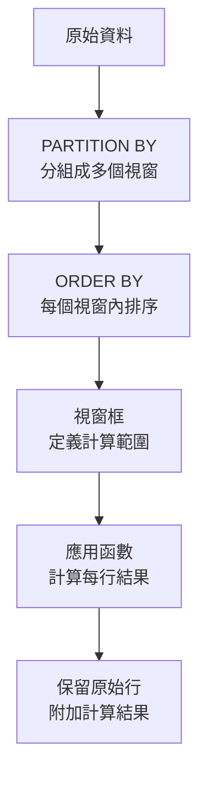

# SQL 視窗函數（Window Functions）完全指南

> 📝 TL;DR 視窗函數（Window Functions）是 SQL 的強大分析工具，可以在不使用 GROUP BY 的情況下進行排名、計算累計值、比較行與行之間的差異。本文將帶你了解 OVER 子句、PARTITION BY、ORDER BY，以及 ROW_NUMBER、RANK、LAG、LEAD 等核心函數的實際應用。

## 前置知識

在開始之前，建議你先了解以下概念：

- **基本 SQL 語法** - SELECT、FROM、WHERE、ORDER BY 的基礎使用
- **聚合函數** - SUM、AVG、COUNT、MAX、MIN 的基本概念
- **GROUP BY 語法** - 了解分組統計的基本用法

## 什麼是視窗函數？

視窗函數是一種**在查詢結果集上執行計算**的特殊函數。與普通聚合函數不同，視窗函數不會將多行合併成一行，而是**保留每一行的原始資料**，同時附加計算結果。

### 為什麼需要學習視窗函數？

想像你需要查詢「每位員工的薪資排名」或「每月的累計銷售額」：

- **解決什麼問題？** 不使用 GROUP BY 也能進行分組計算，保留原始行數據
- **有什麼優勢？** 一次查詢完成複雜的分析計算，避免多次自關聯
- **什麼時候會用到？** 排名分析、累計統計、同比環比計算、移動平均

### 核心概念

視窗函數由三個部分組成：
1. **函數** - 要執行的計算（如 ROW_NUMBER、SUM、LAG）
2. **OVER 子句** - 定義視窗範圍（如 PARTITION BY、ORDER BY）
3. **視窗框** - 精確定義計算範圍（如 ROWS BETWEEN）

:::warning ⚠️ 注意
- 視窗函數只能在 SELECT 和 ORDER BY 子句中使用
- 不能在 WHERE、GROUP BY、HAVING 中直接使用視窗函數
- 視窗函數計算結果是基於當前查詢結果集，不支援過濾
:::

## 💻 基本語法

### 語法結構

```sql
-- 基本語法
function_name(expression) OVER (
    [PARTITION BY column1, column2, ...]
    [ORDER BY column1 [ASC|DESC], ...]
    [frame_clause]
)

-- 完整範例
SELECT
    employee_id,
    name,
    department,
    salary,
    ROW_NUMBER() OVER (PARTITION BY department ORDER BY salary DESC) AS rank_in_dept
FROM employees;
```

### 參數說明

| 元素         | 說明                                                 | 必填 |
| ------------ | ---------------------------------------------------- | ---- |
| 函數名稱     | 執行的計算函數，如 ROW_NUMBER、RANK、SUM、LAG 等     | 是   |
| OVER         | 宣告視窗函數的關鍵字                                 | 是   |
| PARTITION BY | 將結果集分成多個視窗（類似 GROUP BY，但不合併行）    | 否   |
| ORDER BY     | 在視窗內排序                                         | 否   |
| frame_clause | 進一步限制視窗範圍（如 ROWS BETWEEN、RANGE BETWEEN） | 否   |

## 視窗函數執行流程視覺化


```mermaid
graph TD
    A[原始資料] --> B[PARTITION BY<br/>分組成多個視窗]
    B --> C[ORDER BY<br/>每個視窗內排序]
    C --> D[視窗框<br/>定義計算範圍]
    D --> E[應用函數<br/>計算每行結果]
    E --> F[保留原始行<br/>附加計算結果]
```

## 📑 本指南內容導覽

| 主題 | 說明 |
|------|------|
| [排名函數（ROW_NUMBER、RANK、DENSE_RANK、NTILE）](/database/sql/sql-window-functions-ranking) | 為行分配排名，包含各種排名策略的比較 |
| [偏移函數（LAG、LEAD、FIRST_VALUE、LAST_VALUE）](/database/sql/sql-window-functions-offset) | 訪問前後行數據，計算同比環比與增長率 |
| [聚合函數 OVER 與視窗框](/database/sql/sql-window-functions-aggregate) | 累計總和、移動平均，ROW/S 與 RANGE 視窗框詳解 |
| [實際範例與練習](/database/sql/sql-window-functions-examples) | 綜合應用範例與 4 道練習題（簡單到困難） |

## 常見問題 FAQ

### Q1: 視窗函數和 GROUP BY 有什麼差別？

**A:** 核心差異在於是否合併行：

| 比較項目 | GROUP BY                 | 視窗函數                      |
| -------- | ------------------------ | ----------------------------- |
| 行數變化 | 合併多行為一行           | 保留原始行數                  |
| 使用場景 | 分組統計                 | 排名、累計、行間對比          |
| GROUP BY | 必須使用                 | 不需要使用                    |
| 結果包含 | 只包含分組欄位和聚合結果 | 包含原始欄位和計算結果        |
| 適合函數 | SUM、AVG、COUNT          | 加上 ROW_NUMBER、RANK、LAG 等 |

```sql
-- GROUP BY：合併行
SELECT department, AVG(salary) FROM employees GROUP BY department;

-- 視窗函數：保留行
SELECT name, department, salary, AVG(salary) OVER (PARTITION BY department) FROM employees;
```

### Q2: 為什麼不能在 WHERE 中使用視窗函數？

**A:** SQL 執行順序導致視窗函數無法在 WHERE 中使用：

```
執行順序：
1. FROM / JOIN
2. WHERE     ← 視窗函數還沒計算！
3. GROUP BY
4. 聚合函數
5. HAVING
6. 視窗函數 ← 視窗函數在這裡計算
7. SELECT
8. ORDER BY
9. LIMIT
```

**解決方法：使用子查詢或 CTE**
```sql
-- ❌ 錯誤
SELECT * FROM sales WHERE amount > AVG(amount) OVER ();

-- ✅ 正確
SELECT * FROM (
    SELECT *, AVG(amount) OVER () AS avg_amount FROM sales
) t WHERE amount > avg_amount;
```

### Q3: ROW_NUMBER、RANK、DENSE_RANK 該選哪一個？

**A:** 根據業務需求選擇：

| 函數       | 適用場景                   | 範例         |
| ---------- | -------------------------- | ------------ |
| ROW_NUMBER | 需要唯一連續編號           | 分頁查詢     |
| RANK       | 相同排名可跳過（競賽排名） | 考試成績排名 |
| DENSE_RANK | 相同排名不跳過（密集排名） | 薪資等級分類 |

**實例：**
```sql
-- 分頁查詢（需要連續編號）
SELECT * FROM (SELECT *, ROW_NUMBER() OVER (ORDER BY id) AS rn FROM users) t
WHERE rn BETWEEN 11 AND 20;

-- 競賽排名（可以跳過）
SELECT name, score, RANK() OVER (ORDER BY score DESC) AS rank
FROM contestants;

-- 薪資等級（不跳過）
SELECT name, salary,
       DENSE_RANK() OVER (ORDER BY salary DESC) AS salary_grade
FROM employees;
```

### Q4: PARTITION BY 和 GROUP BY 的差別是什麼？

**A:** `PARTITION BY` 是視窗函數的分組方式，`GROUP BY` 是聚合函數的分組方式：

```sql
-- GROUP BY：合併成一行
SELECT department, AVG(salary) FROM employees GROUP BY department;

-- PARTITION BY：保留行，在每個分組內計算
SELECT name, department, salary,
       AVG(salary) OVER (PARTITION BY department) AS dept_avg
FROM employees;
```

| 特性              | GROUP BY | PARTITION BY |
| ----------------- | -------- | ------------ |
| 結果行數          | 每組一行 | 原始行數不變 |
| 是否合併          | 是       | 否           |
| 配合函數          | 聚合函數 | 視窗函數     |
| 可以搭配 ORDER BY | 不可以   | 可以         |

### Q5: 視窗函數會影響效能嗎？

**A:** 視窗函數的效能取決於：

1. **數據量**：大數據集會較慢
2. **ORDER BY**：排序操作耗時
3. **視窗框大小**：`ROWS BETWEEN` 大小影響效能
4. **PARTITION BY**：分組數量越多，計算越複雜

**優化建議：**
```sql
-- ✅ 為 ORDER BY 和 PARTITION BY 欄位建立索引
CREATE INDEX idx_sales_date ON sales(sale_date);
CREATE INDEX idx_emp_dept_salary ON employees(department, salary);

-- ✅ 合理使用視窗框，避免過大
AVG(amount) OVER (ORDER BY sale_date ROWS BETWEEN 9 PRECEDING AND CURRENT ROW)

-- ❌ 避免複雜嵌套
SELECT * FROM (SELECT *, ROW_NUMBER() OVER (...) FROM (SELECT * FROM t) t2) t3
```

## 最佳實踐

### ✅ 推薦做法

1. **合理命名視窗函數結果**
```sql
-- ✅ 清晰
ROW_NUMBER() OVER (PARTITION BY department ORDER BY salary DESC) AS salary_rank

-- ❌ 模糊
ROW_NUMBER() OVER (PARTITION BY department ORDER BY salary DESC) AS r
```

2. **使用 CTE 簡化複雜視窗查詢**
```sql
WITH employee_rankings AS (
    SELECT
        employee_id,
        name,
        department,
        salary,
        ROW_NUMBER() OVER (PARTITION BY department ORDER BY salary DESC) AS rank
    FROM employees
)
SELECT * FROM employee_rankings WHERE rank <= 3;
```

3. **注意視窗框範圍**
```sql
-- ✅ 明確指定視窗框
SUM(amount) OVER (ORDER BY sale_date ROWS BETWEEN UNBOUNDED PRECEDING AND CURRENT ROW)

-- ✅ 使用簡寫（等效於上面）
SUM(amount) OVER (ORDER BY sale_date)
```

### ❌ 常見錯誤

1. **在 WHERE 中使用視窗函數**
```sql
-- ❌ 錯誤
SELECT * FROM sales WHERE amount > AVG(amount) OVER ();

-- ✅ 正確
SELECT * FROM (
    SELECT *, AVG(amount) OVER () AS avg_amount FROM sales
) t WHERE amount > avg_amount;
```

2. **忘記 ORDER BY 導致不可預期的結果**
```sql
-- ❌ 結果不確定
SUM(amount) OVER (PARTITION BY product_id)

-- ✅ 明確排序
SUM(amount) OVER (PARTITION BY product_id ORDER BY sale_date)
```

3. **混淆 RANK 和 DENSE_RANK**
```sql
-- 如果需要連續編號，應該用 DENSE_RANK
SELECT name, score, RANK() OVER (ORDER BY score DESC) FROM students;

-- 結果：1, 1, 3（跳過 2）
-- 應改用 DENSE_RANK
```

## 延伸閱讀

### 推薦資源

外部優質資源：
- [PostgreSQL 視窗函數文檔](https://www.postgresql.org/docs/current/tutorial-window.html) - PostgreSQL 官方詳細文檔
- [MySQL 視窗函數參考](https://dev.mysql.com/doc/refman/8.0/en/window-functions.html) - MySQL 8.0 視窗函數文檔
- [Modern SQL: Window Functions](https://modern-sql.com/concept/window-functions) - 現代 SQL 視窗函數指南

## 總結

視窗函數是 SQL 數據分析的強大工具，讓我們回顧關鍵重點：

1. **不使用 GROUP BY** - 視窗函數保留原始行，附加計算結果
2. **OVER 子句** - 使用 `PARTITION BY` 分組、`ORDER BY` 排序定義視窗
3. **排名函數** - `ROW_NUMBER`、`RANK`、`DENSE_RANK` 滿足不同排名需求
4. **偏移函數** - `LAG`、`LEAD` 訪問前後行數據，用於同比環比分析
5. **聚合函數 OVER** - `SUM`、`AVG` 配合視窗框計算累計值和移動平均
6. **注意執行順序** - 視窗函數在 WHERE 後、SELECT 前計算，無法在 WHERE 中使用
