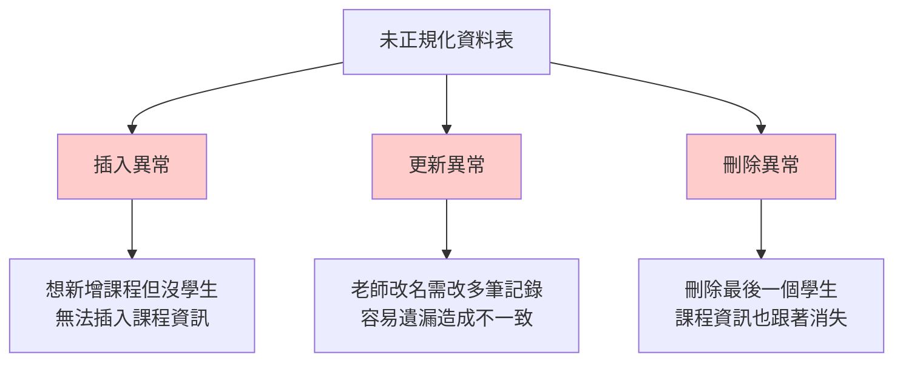
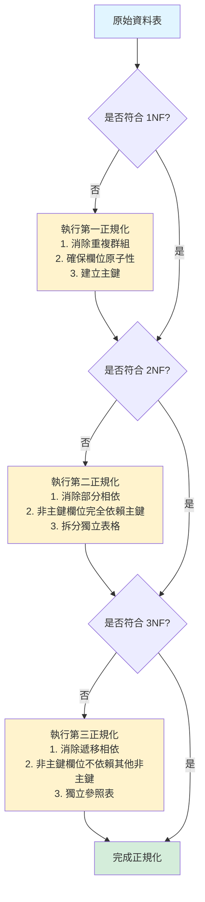

# 為什麼要資料庫正規化

> 📝 TL;DR：資料庫正規化透過 1NF、2NF、3NF 漸進式拆表，消除資料冗餘與插入/更新/刪除異常，提升資料完整性。OLTP 系統優先正規化，OLAP/報表系統可適度反正規化以提升查詢效能。

## 前置知識

在開始之前，建議你先了解以下概念：

- **關聯式資料庫基礎** - 理解資料表、主鍵、外鍵的基本概念
- **SQL 基本查詢** - 熟悉 SELECT、JOIN 等基礎語法
- **函數相依性** - 了解欄位間的相依關係（A → B 表示 B 依賴於 A）

## 什麼是資料庫正規化？

### 為什麼需要學習它？

資料庫正規化是關聯式資料庫設計中的核心方法論，透過一系列規則將資料表結構優化：

- **解決什麼問題？** 減少資料冗餘、避免資料異常、提升資料一致性
- **有什麼優勢？** 節省儲存空間、降低維護成本、確保資料正確性
- **什麼時候會用到？** 設計新系統、重構舊資料庫、優化資料結構時

### 核心概念

正規化（Normalization）是一種**系統化的方法**，將複雜的資料表分解成更小、更具邏輯性的表格，透過定義主鍵和外鍵來建立表格間的關聯。主要目的是**消除資料冗餘**和**避免資料異常**。

:::warning ⚠️ 注意
正規化並非越高階越好！過度正規化可能導致查詢複雜度提升，需根據實際場景權衡。一般系統達到 3NF 已足夠。
:::

## 資料庫正規化解決的核心問題

### 問題 1：資料冗餘（Data Redundancy）

**什麼是資料冗餘？** 相同的資料在多個地方重複儲存。

**範例：未正規化的訂單表**

| order_id | customer_name | customer_email    | product_name | price |
| -------- | ------------- | ----------------- | ------------ | ----- |
| 1        | 張三          | zhang@example.com | 筆記型電腦   | 30000 |
| 2        | 張三          | zhang@example.com | 滑鼠         | 500   |
| 3        | 李四          | li@example.com    | 鍵盤         | 1200  |

**問題：**
- 張三的姓名和 email 重複出現，浪費儲存空間
- 當張三改 email 時，需要更新多筆記錄

### 問題 2：資料異常（Data Anomalies）

#### 三種異常類型視覺化

#### 1. 插入異常（Insertion Anomaly）

**定義：** 無法在缺少其他相關資料的情況下插入新記錄。

**範例：** 想新增一門課程「資料庫設計」，但還沒有學生選修時，無法將課程資訊插入資料庫（因為需要學生資料才能建立記錄）。

#### 2. 更新異常（Update Anomaly）

**定義：** 更新某項資料時，必須同時更新多個記錄，否則造成資料不一致。

**範例：** 教師「王老師」改名為「王教授」，需要修改所有包含該教師的課程記錄，若遺漏某筆就會產生不一致。

#### 3. 刪除異常（Deletion Anomaly）

**定義：** 刪除某筆記錄時，意外遺失其他有用的資訊。

**範例：** 刪除最後一個選修「演算法」課程的學生時，該課程的資訊（課程名稱、教師等）也一併被刪除。

## 視覺化說明：正規化流程圖

### 正規化步驟流程

---

### 第一正規化（1NF）

第一正規化的主要目標是確保每個欄位都包含**原子值**（不可再分割的值）：

- **消除重複群組**：不允許在單一欄位中儲存多個值
- **建立主鍵**：每張表必須有唯一識別每筆記錄的主鍵
- **確保原子性**：每個欄位只能包含單一值

### 第二正規化（2NF）

第二正規化在1NF的基礎上，進一步**消除部分功能相依**：

- **符合1NF要求**：必須先滿足第一正規化的所有條件
- **消除部分相依**：所有非主鍵欄位必須完全依賴於整個主鍵
- **分離表格**：將部分相依的欄位分離到獨立的表格中

### 第三正規化（3NF）

第三正規化進一步**消除遞移功能相依**：

- **符合2NF要求**：必須先滿足第二正規化的所有條件
- **消除遞移相依**：非主鍵欄位之間不應該存在功能相依關係
- **獨立表格**：將遞移相依的欄位獨立成新的表格

## 正規化的優點與效益

### 主要優點

正規化帶來多項顯著的效益：

1. **減少資料冗餘**：每項資料只儲存一次，大幅節省儲存空間
2. **提高資料完整性**：透過消除冗餘，確保資料的一致性和正確性
3. **簡化維護工作**：資料更新只需在一個地方進行，降低維護複雜度
4. **防止資料異常**：有效避免插入、更新、刪除異常的發生
5. **增強擴展性**：結構化的設計使資料庫更容易適應未來的變更需求

### 效能考量

雖然正規化帶來許多好處，但也需要考慮一些效能影響：

- **查詢複雜性增加**：可能需要更多的JOIN操作來獲取完整資訊
- **查詢速度影響**：複雜的JOIN操作可能影響查詢效能
- **設計複雜度**：高度正規化的資料庫結構可能較難理解

## 何時考慮反正規化

在某些特定情況下，可能需要考慮反正規化來改善效能：

### 適合反正規化的場景

1. **讀取密集型系統**：當讀取頻率遠高於寫入頻率時
2. **複雜查詢優化**：當JOIN操作嚴重影響效能時
3. **報表與分析**：針對特定的報表需求進行優化
4. **資料倉儲環境**：使用星型或雪花模式架構
5. **歷史資料查詢**：保留歷史快照以提高查詢效率

### 反正規化的注意事項

實施反正規化時必須謹慎考慮以下因素：

- **資料一致性維護**：需要建立機制確保冗餘資料的一致性
- **維護成本評估**：評估效能改善是否值得增加的維護複雜度
- **同步機制設計**：建立適當的資料同步和更新策略

## 正規化與反正規化的比較

| 比較項目   | 正規化               | 反正規化             |
| ---------- | -------------------- | -------------------- |
| 資料冗餘   | 最小化，幾乎無冗餘   | 有冗餘，資料重複儲存 |
| 資料一致性 | 高，容易維持一致性   | 較低，需要額外維護   |
| 儲存空間   | 較少，節省空間       | 較多，增加儲存成本   |
| 查詢速度   | 可能較慢（需要JOIN） | 較快，減少JOIN操作   |
| 更新效能   | 快速，只需更新一處   | 較慢，需更新多處     |
| 維護複雜度 | 較低，邏輯清晰       | 較高，需考慮一致性   |
| JOIN操作   | 經常需要多表JOIN     | 較少或無JOIN         |
| 擴展性     | 佳，容易擴展         | 較差，變更影響範圍大 |
| 適用場景   | OLTP，頻繁更新的系統 | OLAP                 |

正規化和反正規化各有其適用場景。**OLTP系統**（線上交易處理）通常適合使用正規化設計，因為這類系統需要頻繁的資料更新和高度的資料一致性。而**OLAP系統**（線上分析處理）或資料倉儲環境則可能受益於適度的反正規化，以提高查詢效能。

## 實務應用建議

### 設計原則

1. **從正規化開始**：始終以正規化為設計起點，確保資料結構的邏輯性
2. **效能導向優化**：根據實際使用模式和效能需求進行選擇性調整
3. **平衡考量**：在資料一致性和查詢效能之間找到適當的平衡點
4. **階段性實施**：可以先實施完整正規化，再根據效能測試結果進行調整

### 最佳實踐

- **明確主鍵設計**：確保每張表都有適當的主鍵
- **建立外鍵關係**：透過外鍵維護表格間的參照完整性
- **遵循命名規範**：採用一致的命名慣例，提高可維護性
- **定期檢視優化**：隨著業務需求變化，定期檢視和優化資料庫結構

## 結論

資料庫正規化是確保資料品質和系統可靠性的基礎技術。通過系統性的正規化過程，我們可以建立結構清晰、邏輯合理的資料庫系統，有效避免資料冗餘和各種異常問題。雖然在某些特定場景下可能需要考慮反正規化來優化效能，但正規化仍然是資料庫設計的根本原則。

對於現代的資料庫設計師和開發人員而言，深入理解正規化的原理和實踐方法，並能靈活運用於不同的業務場景，是構建高品質資料系統的關鍵能力。無論是傳統的企業系統還是現代的雲端應用，正規化都為資料管理提供了堅實的理論基礎和實踐指導。
