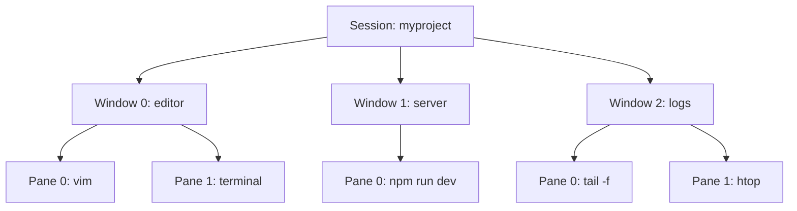

# Tmux 終端機多工器完全指南

> 📝 TL;DR：Tmux 讓你把終端機切成好幾塊，SSH 斷線也不怕任務被殺掉。會用 Tmux，遠端開發就跟在本機一樣順暢，不用每次重連都要重新開視窗。

## 這篇你會學到

1. Tmux 是什麼？為什麼要用它？
2. 安裝 Tmux（Linux / macOS）
3. Session、Window、Pane 三層架構
4. 常用快捷鍵速查表
5. 自定義設定檔 `~/.tmux.conf`
6. 進階：寫腳本自動化你的開發環境

## 前置知識

這篇要懂這些才不會卡住：

- 會用終端機（Terminal）的基本操作
- 知道什麼是 SSH（遠端連線）
- 如果用過 Vim，會發現很多操作邏輯很像

如果你連 `cd`、`ls` 都沒用過... 先去翻一下 Linux 入門，不然我講快捷鍵你會以為我在唸咒語 XD

## Tmux 是什麼？

Tmux 是一個終端機多工器（Terminal Multiplexer）。簡單說，它可以讓你：

- **一個視窗開多個終端** — 不用一直開新的 terminal 視窗
- **SSH 斷線任務不中斷** — 你跑的 npm build、docker build 不會因為網路斷掉就被殺掉
- **分屏操作** — 左邊跑 server，右邊看 log，同時監控

### 為什麼不用 Screen？

好問題，兩個都能做到類似的事。但 Tmux 有幾個優勢：

| 功能 | Tmux | Screen |
|------|------|--------|
| 分屏 | 原生支援 | 要開多個視窗 |
| 設定檔 | 有，可高度自定義 | 幾乎沒有 |
| 插件系統 | 有（TPM） | 沒有 |
| 視窗命名 | 自動/手動都行 | 只能手動 |

總之，Tmux 功能比較多，用了不會後悔。

## 三層架構：Session → Window → Pane

這是 Tmux 的核心概念，搞懂這個就懂了一半：



用生活比喻：
- **Session** = 一個專案的工作區（像瀏覽器的視窗）
- **Window** = 專案裡的不同任務（像瀏覽器的分頁）
- **Pane** = 一個分頁裡切分成多塊（像分割畫面）

## 安裝 Tmux

### Linux（Debian / Ubuntu）

```bash
sudo apt update
sudo apt install tmux -y
tmux -V  # 確認版本
```

### Linux（RHEL / Rocky / CentOS）

```bash
# RHEL / Rocky
sudo yum install epel-release -y
sudo yum install tmux

# Fedora
sudo dnf install tmux

# Arch Linux
sudo pacman -S tmux
```

### macOS

```bash
brew install tmux
tmux -V
```

### 從原始碼編譯（進階）

如果你想要最新版，可以從原始碼編譯：

```bash
sudo apt install libevent-dev ncurses-dev -y
git clone https://github.com/tmux/tmux.git
cd tmux
./autogen.sh
./configure
make
sudo make install
```

## 基本操作

### 啟動 Tmux

```bash
# 直接啟動，會建立一個叫 0 的 session
tmux

# 建立有名稱的 session（推薦）
tmux new -s myproject

# 在背景建立 session
tmux new -s background -d
```

### Session 管理

```bash
# 列出所有 session
tmux ls

# 進入指定的 session
tmux attach -t myproject
# 或簡寫
tmux a -t myproject

# 離開 session（不關閉）
# 在 tmux 內按：Prefix + d

# 刪除 session
tmux kill-session -t myproject

# 刪除所有 session
tmux kill-server
```

## 快捷鍵速查表

所有 Tmux 快捷鍵都要先按「前置鍵」（Prefix Key），預設是 `Ctrl + b`。

比如要建立新視窗，你要按 `Ctrl + b` 放開，再按 `c`。

### Session 相關

| 快捷鍵 | 說明 |
|--------|------|
| `Prefix + d` | 分離（Detach），把 session 丟到背景 |
| `Prefix + s` | 列出所有 session，可選擇切換 |
| `Prefix + $` | 重新命名目前 session |
| `Prefix + (` | 切換到上一個 session |
| `Prefix + )` | 切換到下一個 session |

### Window 相關

| 快捷鍵 | 說明 |
|--------|------|
| `Prefix + c` | 建立新 window |
| `Prefix + n` | 下一個 window |
| `Prefix + p` | 上一個 window |
| `Prefix + 0-9` | 切換到編號 0-9 的 window |
| `Prefix + w` | 列出所有 window |
| `Prefix + ,` | 重新命名目前 window |
| `Prefix + &` | 關閉目前 window（會確認） |

### Pane 相關

| 快捷鍵 | 說明 |
|--------|------|
| `Prefix + %` | 水平分割（左右切） |
| `Prefix + "` | 垂直分割（上下切） |
| `Prefix + ↑↓←→` | 切換 pane |
| `Prefix + x` | 關閉目前 pane |
| `Prefix + z` | 把目前 pane 放大/還原 |
| `Prefix + Space` | 循環切換 pane 佈局 |
| `Prefix + {` | 和上一個 pane 交換位置 |
| `Prefix + }` | 和下一個 pane 交換位置 |

### 複製模式

| 快捷鍵 | 說明 |
|--------|------|
| `Prefix + [` | 進入複製模式 |
| `Prefix + ]` | 貼上 |
| `q` | 退出複製模式 |

在複製模式裡可以用方向鍵或 Vim 的 `hjkl` 移動。

## 設定檔 ~/.tmux.conf

Tmux 的設定檔放在 `~/.tmux.conf`，可以自定義各種行為。下面是我的推薦設定，分為 10 個區塊，你可以直接複製貼上。

### 我的完整設定檔

```bash
# 創建設定檔
nano ~/.tmux.conf
```

貼上這些：

```ini
# ============================================
# 1. 前置鍵設定
# ============================================

# 把 Ctrl + b 改成 Ctrl + a（比較好按）
unbind C-b
set -g prefix C-a
bind C-a send-prefix

# ============================================
# 2. 基本顯示設定
# ============================================

# 設定預設終端類型
set -g default-terminal "screen-256color"

# 啟用滑鼠支援（2.1+ 版本）
set -g mouse on

# 狀態列更新間隔（毫秒），設為 1 即時更新
set -g status-interval 1

# 設定滾動歷史的行數
set -g history-limit 10000

# ============================================
# 3. 視窗與面板編號
# ============================================

# 視窗編號從 1 開始（而非 0）
set -g base-index 1

# Pane 編號也從 1 開始
setw -g pane-base-index 1

# ============================================
# 4. 分割快捷鍵（更直覺）
# ============================================

# 用 | 水平分割（原本是 %）
unbind %
bind | split-window -h

# 用 - 垂直分割（原本是 "）
unbind '"'
bind - split-window -v

# ============================================
# 5. Vim 風格切換 pane
# ============================================
bind h select-pane -L
bind j select-pane -D
bind k select-pane -U
bind l select-pane -R

# ============================================
# 6. 面板大小調整（Alt + 方向鍵）
# ============================================
bind -n M-Up resize-pane -U 5
bind -n M-Down resize-pane -D 5
bind -n M-Left resize-pane -L 5
bind -n M-Right resize-pane -R 5

# ============================================
# 7. 快速重新載入設定檔
# ============================================
bind r source-file ~/.tmux.conf \; display "Configuration reloaded!"

# ============================================
# 8. 複製模式用 Vim 風格
# ============================================
setw -g mode-keys vi
bind -T copy-mode-vi v send -X begin-selection
bind -T copy-mode-vi y send -X copy-selection-and-cancel
bind -T copy-mode-vi V send -X select-line
bind -T copy-mode-vi C-v send -X rectangle-toggle

# ============================================
# 9. 狀態列美化
# ============================================
set -g status-bg black
set -g status-fg white
set -g window-status-style "bg=colour234,fg=colour245"
set -g window-status-current-style "bg=colour235,fg=colour255"
set -g status-left "#[bg=green,fg=black] #S #[default] | "
set -g status-right "#[fg=cyan]%H:%M:%S "

# ============================================
# 10. 其他有用設定
# ============================================

# 自動重新命名視窗
setw -g automatic-rename on

# 在終端標題欄顯示 session 和視窗名稱
set -g set-titles on
set -g set-titles-string '#H - #S - #W'

# 視窗切換時延遲更短（毫秒）
set -s escape-time 1
```

改完後按 `Prefix + r`（或執行 `tmux source-file ~/.tmux.conf`）就會生效。

:::tip 為什麼要改前置鍵？
`Ctrl + b` 太遠了，`Ctrl + a` 就在小指旁邊。用久了你會感謝自己有改這個。
:::

### 進階：使用 TPM 插件

如果你想要更強的功能，可以裝 Tmux Plugin Manager（TPM）：

```bash
git clone https://github.com/tmux-plugins/tpm ~/.tmux/plugins/tpm
```

然後在 `~/.tmux.conf` 最下方加入：

```ini
# ============================================
# TPM 插件設定（放在設定檔最底部）
# ============================================

# 插件列表
set -g @plugin 'tmux-plugins/tpm'
set -g @plugin 'tmux-plugins/tmux-sensible'          # 智能預設設定
set -g @plugin 'tmux-plugins/tmux-prefix-highlight'  # 前置鍵高亮
set -g @plugin 'tmux-plugins/tmux-sessionist'        # 增強 session 管理
set -g @plugin 'tmux-plugins/tmux-resurrect'         # 儲存/恢復會話
set -g @plugin 'tmux-plugins/tmux-continuum'         # 自動儲存（每 15 分）
set -g @plugin 'tmux-plugins/tmux-yank'              # 增強複製功能
set -g @plugin 'tmux-plugins/tmux-open'              # 快速打開 URL

# 自動恢復（continuum）
set -g @continuum-save-interval '15'
set -g @continuum-restore 'on'

# 初始化 TPM（此行必須位於設定檔最後）
run '~/.tmux/plugins/tpm/tpm'
```

重新載入設定後，按 `Prefix + I`（大寫 I）安裝所有插件。

## 進階：自動化開發環境腳本

每次開專案都要開 server、開測試、開 log... 很煩對吧？

寫個腳本讓 Tmux 幫你搞定：

```bash
#!/bin/bash
# 檔名：dev-setup.sh
# 用法：./dev-setup.sh

SESSION="mydev"

# 如果 session 已存在，直接 attach
tmux has-session -t $SESSION 2>/dev/null
if [ $? -eq 0 ]; then
    tmux attach -t $SESSION
    exit 0
fi

# 建立新 session
tmux new-session -d -s $SESSION -c ~/projects/myapp

# Window 0: editor
tmux rename-window -t $SESSION:0 "editor"
tmux send-keys -t $SESSION:0 "vim ." Enter

# Window 1: server
tmux new-window -t $SESSION:1 -n "server"
tmux send-keys -t $SESSION:1 "npm run dev" Enter

# Window 2: 測試 + log（分割畫面）
tmux new-window -t $SESSION:2 -n "test"
tmux split-window -h -t $SESSION:2
tmux send-keys -t $SESSION:2.0 "npm test" Enter
tmux send-keys -t $SESSION:2.1 "tail -f logs/app.log" Enter

# 回到 editor
tmux select-window -t $SESSION:0
tmux attach -t $SESSION
```

```bash
chmod +x dev-setup.sh
./dev-setup.sh
```

以後只要執行這個腳本，你的開發環境就自動開好了。

## 使用插件（TPM）

Tmux 有插件管理器 TPM（Tmux Plugin Manager），可以裝一些好用的插件：

### 安裝 TPM

```bash
git clone https://github.com/tmux-plugins/tpm ~/.tmux/plugins/tpm
```

### 在 ~/.tmux.conf 加入

```ini
# 插件列表
set -g @plugin 'tmux-plugins/tpm'
set -g @plugin 'tmux-plugins/tmux-sensible'     # 智能預設
set -g @plugin 'tmux-plugins/tmux-resurrect'    # 儲存/恢復 session
set -g @plugin 'tmux-plugins/tmux-continuum'    # 自動儲存

# 初始化 TPM（放在最後）
run '~/.tmux/plugins/tpm/tpm'
```

### 安裝插件

1. 重新載入設定：`Prefix + r`
2. 按 `Prefix + I`（大寫 I）安裝插件

### 推薦插件

| 插件 | 功能 |
|------|------|
| `tmux-resurrect` | 手動儲存/恢復 session |
| `tmux-continuum` | 自動儲存（每 15 分鐘） |
| `tmux-yank` | 複製到系統剪貼簿 |
| `tmux-prefix-highlight` | 狀態列顯示是否按了 Prefix |

## 常見問題 FAQ

### Q: Prefix 是什麼？

A: 就是 `Ctrl + b`（或你改成 `Ctrl + a`）。Tmux 的快捷鍵都要先按這個才能觸發。

比如要水平分割，你要按：
1. `Ctrl + b`（放開）
2. 按 `%`

### Q: 怎麼用滑鼠選 pane？

A: 在 `~/.tmux.conf` 加：

```ini
set -g mouse on
```

然後就可以：
- 點 pane 切換
- 拖曳邊界調整大小
- 滾動查看歷史

### Q: SSH 斷線後怎麼恢復？

A: 重新連線後執行：

```bash
tmux ls               # 看有哪些 session
tmux attach -t 名稱    # 進去
```

就會回到你斷線前的狀態，任務還在跑。

### Q: 怎麼讓多個人同時看同一個 session？

A: 很簡單，大家都 attach 到同一個 session：

```bash
# 使用者 A
tmux new -s pair-programming

# 使用者 B（同一台機器）
tmux attach -t pair-programming
```

兩個人會看到同一個畫面，可以一起寫 code。

### Q: Windows 和 Linux 的 Tmux 一樣嗎？

A: Windows 本身不能直接裝 Tmux，但你可以在：

- **WSL**（Windows Subsystem for Linux）裡面用
- **Git Bash** — 有編譯好的版本
- **虛擬機** — 裝 Linux 再用

推薦用 WSL，跟原生 Linux 體驗差不多。

## 實戰練習

### 練習 1：基本操作（簡單）⭐

**任務：** 建立一個叫 `practice` 的 session，然後：

1. 建立新 window（總共 2 個）
2. 在第一個 window 分割成上下兩個 pane
3. 離開 session（detach）
4. 重新 attach 回去

:::details 參考答案

```bash
# 1. 建立 session
tmux new -s practice

# 2. 建立新 window：Prefix + c

# 3. 切回第一個 window：Prefix + 1
#    然後垂直分割：Prefix + "

# 4. 離開：Prefix + d

# 5. 重新 attach
tmux attach -t practice
```
:::

### 練習 2：分割畫面（簡單）⭐

**任務：** 做出一個「四分割」的畫面：

```
+-------+-------+
|       |       |
|   1   |   2   |
|       |       |
+-------+-------+
|   3   |   4   |
+-------+-------+
```

:::details 參考答案

```
1. Prefix + %     （先左右切）
2. Prefix + ↓     （切到右邊）
3. Prefix + "     （右邊上下切）
4. Prefix + ;     （回到左邊）
5. Prefix + "     （左邊上下切）
6. Prefix + ↑     （回到左上）
```

順序不重要，反正就是用 `%` 和 `"` 一直切就對了。
:::

### 練習 3：寫一個開發環境腳本（中等）⭐⭐

**任務：** 寫一個腳本 `dev.sh`，執行後會：

1. 建立 session 叫 `dev`
2. Window 0：分割成左右兩塊，左邊跑 `vim .`，右邊跑 `npm run dev`
3. Window 1：跑 `htop`
4. 最後進入 session 時停留在 Window 0

:::details 參考答案

```bash
#!/bin/bash
SESSION="dev"

# 建立 session
tmux new-session -d -s $SESSION -c ~/projects/myapp

# Window 0: editor + server
tmux split-window -h -t $SESSION:0
tmux send-keys -t $SESSION:0.0 "vim ." Enter
tmux send-keys -t $SESSION:0.1 "npm run dev" Enter

# Window 1: htop
tmux new-window -t $SESSION:1 -n "monitor"
tmux send-keys -t $SESSION:1 "htop" Enter

# 回到 Window 0
tmux select-window -t $SESSION:0
tmux attach -t $SESSION
```

```bash
chmod +x dev.sh
./dev.sh
```
:::

## 延伸閱讀

### 本站相關文章

- [Tmux 完整操作手冊](./tmux-reference-manual) — 完整版手冊含進階操作、大師腳本、WSL2 剪貼簿
- [資料庫索引基礎](/database/database-index-basic) — 優化查詢效能

### 外部資源

- [Tmux 官方 GitHub](https://github.com/tmux/tmux)
- [Tmux Plugin Manager (TPM)](https://github.com/tmux-plugins/tpm)
- [Tmux 使用指南（英文）](https://github.com/tmux/tmux/wiki)

---

現在你可以用 Tmux 把終端機玩得很順了。下次 SSH 斷線，你的 npm build 還是會在背景跑，不用再重來一遍。:D
