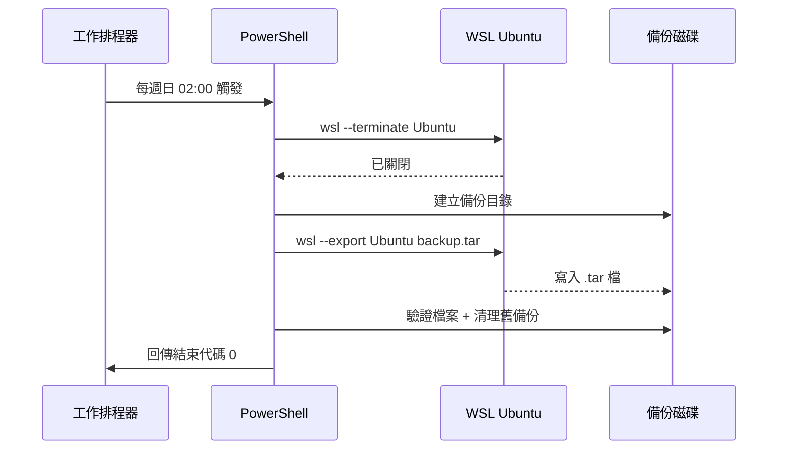

# WSL Ubuntu 自動備份腳本與工作排程器設定指南

> 📝 TL;DR 使用 `wsl --export` 將 Ubuntu 發行版匯出為 `.tar` 檔案，撰寫 PowerShell 腳本並透過 Windows 工作排程器設定自動定期執行。本文提供完整腳本範例（含資料夾自動建立、錯誤處理、進度顯示）、GUI 與 PowerShell 兩種排程建立方式、常見問題排解。

## 前置知識

在開始之前，建議你先了解以下概念：

- **WSL 基本操作** - [WSL 安裝與 VS Code 連線指南](/docs/devops/install-wsl.md) 了解如何安裝與管理 WSL
- **PowerShell 基礎** - 知道如何以系統管理員身分執行、基本語法與執行原則
- **工作排程器** - Windows 內建的自動化排程工具

## 為什麼需要 WSL 備份？

### 解決什麼問題？

| 情境 | 風險 | 備份解決 |
|------|------|----------|
| WSL 損壞/重置 | 所有環境、套件、設定遺失 | 還原 `.tar` 檔即可復原 |
| 系統重灌/換電腦 | 環境需從頭建立 | 匯入備份檔快速遷移 |
| 實驗新套件/設定 | 可能弄壞環境 | 先備份，失敗就還原 |
| 團隊環境統一 | 每人手動安裝不一致 | 匯出標準環境，成員匯入 |

### 核心原理

`wsl --export` 會將整個發行版（包含檔案系統、使用者、套件、設定）打包成單一 `.tar` 檔案。還原時用 `wsl --import` 即可完整重現環境。

:::warning ⚠️ 注意事項
- 匯出時該發行版**必須處於停止狀態**（腳本會自動處理）
- 備份檔較大（通常 2-10 GB），確保磁碟空間足夠
- 建議備份到**不同實體磁碟**（如 D 槽或外接硬碟），避免系統碟損壞連帶遺失
:::

## 💻 完整備份腳本

### 基礎版（兩行指令）

```powershell
# 最簡單版本 - 手動執行用
wsl --shutdown
wsl --export Ubuntu "D:\backup\ubuntu-$(Get-Date -Format 'yyyyMMdd').tar"
```

### 生產級版本（推薦用於排程）

儲存為 `C:\Scripts\backup-wsl.ps1`：

```powershell
<#
.SYNOPSIS
    WSL Ubuntu 發行版自動備份腳本
.DESCRIPTION
    使用 wsl --export 將 Ubuntu 完整匯出為 .tar 備份檔
    包含：資料夾自動建立、錯誤處理、進度顯示、舊備份清理
.NOTES
    作者: Lucas Hsu
    適用: Windows 10/11 + WSL2
#>

# ===== 設定區 ============================================================
$DistroName       = "Ubuntu"                    # 要備份的發行版名稱
$BackupRoot       = "D:\backup"                 # 備份根目錄
$MaxBackups       = 3                           # 保留幾份備份（輪替）
$LogFile          = "$BackupRoot\backup-wsl.log" # 記錄檔路徑
# ========================================================================

function Write-Log {
    param([string]$Message, [string]$Level = "INFO")
    $timestamp = Get-Date -Format "yyyy-MM-dd HH:mm:ss"
    $logEntry = "[$timestamp] [$Level] $Message"
    Write-Host $logEntry
    $logEntry | Out-File -FilePath $LogFile -Encoding utf8 -Append
}

function Get-DistroState {
    param([string]$Name)
    $result = wsl --list --verbose | Where-Object { $_ -match $Name }
    if ($result -match "Running") { return "Running" }
    if ($result -match "Stopped") { return "Stopped" }
    return "Unknown"
}

# ===== 主程式 ============================================================
try {
    Write-Log "=== 開始 WSL 備份作業 ==="
    Write-Log "目標發行版: $DistroName"
    Write-Log "備份目錄: $BackupRoot"

    # 1. 確保備份資料夾存在
    if (-not (Test-Path $BackupRoot)) {
        New-Item -ItemType Directory -Force -Path $BackupRoot | Out-Null
        Write-Log "建立備份目錄: $BackupRoot"
    }

    # 2. 確保發行版存在
    $distroList = wsl --list --quiet
    if ($distroList -notcontains $DistroName) {
        throw "找不到發行版 '$DistroName'。請執行 'wsl --list' 確認名稱。"
    }

    # 3. 關閉發行版（若正在執行）
    $state = Get-DistroState $DistroName
    if ($state -eq "Running") {
        Write-Log "發行版正在執行中，正在關閉..."
        wsl --terminate $DistroName
        Start-Sleep -Seconds 3
        $state = Get-DistroState $DistroName
        if ($state -eq "Running") {
            throw "無法關閉發行版，請手動執行 'wsl --shutdown' 後再試。"
        }
        Write-Log "發行版已關閉"
    }

    # 4. 產出檔名（含日期）
    $dateStr = Get-Date -Format "yyyyMMdd_HHmmss"
    $backupFile = Join-Path $BackupRoot "ubuntu-$dateStr.tar"
    Write-Log "備份檔案: $backupFile"

    # 5. 執行備份
    Write-Log "開始匯出（這可能需要幾分鐘）..."
    $startTime = Get-Date
    
    # 使用 Start-Process 等待完成，避免 PowerShell 逾時
    $process = Start-Process -FilePath "wsl.exe" `
        -ArgumentList "--export", $DistroName, $backupFile `
        -Wait -PassThru -NoNewWindow
    
    $elapsed = (Get-Date) - $startTime
    
    if ($process.ExitCode -ne 0) {
        throw "wsl --export 失敗，結束代碼: $($process.ExitCode)"
    }

    # 6. 驗證備份檔
    $fileSizeMB = [math]::Round((Get-Item $backupFile).Length / 1MB, 2)
    Write-Log "備份完成！耗時: $($elapsed.TotalMinutes.ToString('F1')) 分鐘，大小: $fileSizeMB MB"

    # 7. 清理舊備份（保留最新 $MaxBackups 份）
    $backups = Get-ChildItem -Path $BackupRoot -Filter "ubuntu-*.tar" |
               Sort-Object LastWriteTime -Descending
    
    if ($backups.Count -gt $MaxBackups) {
        $toDelete = $backups | Select-Object -Skip $MaxBackups
        foreach ($old in $toDelete) {
            Write-Log "刪除舊備份: $($old.Name)" "WARN"
            Remove-Item $old.FullName -Force
        }
    }

    Write-Log "=== 備份作業成功結束 ==="
    exit 0

}
catch {
    Write-Log "備份失敗: $($_.Exception.Message)" "ERROR"
    exit 1
}
```

### 參數說明

| 參數 | 預設值 | 說明 |
|------|--------|------|
| `$DistroName` | `Ubuntu` | 要備份的發行版名稱（用 `wsl --list` 確認） |
| `$BackupRoot` | `D:\backup` | 備份檔存放目錄 |
| `$MaxBackups` | `3` | 保留幾份備份，超過自動刪除最舊的 |
| `$LogFile` | `$BackupRoot\backup-wsl.log` | 執行記錄檔 |

### 執行前檢查

```powershell
# 1. 確認發行版名稱
wsl --list --verbose

# 2. 測試腳本（以系統管理員執行）
powershell -ExecutionPolicy Bypass -File "C:\Scripts\backup-wsl.ps1"

# 3. 檢查結果
ls D:\backup\ubuntu-*.tar
cat D:\backup\backup-wsl.log
```

## 視覺化說明

### 備份流程圖


### 工作排程器觸發流程



:::tip 視覺化工具
你可以使用 [Mermaid Live Editor](https://mermaid.live/) 來修改或預覽上述圖表。
:::

## 實戰練習

### 練習 1：手動執行備份腳本（簡單）⭐

**任務：** 將腳本儲存並手動執行一次完整備份

**步驟：**
1. 建立資料夾：`C:\Scripts`
2. 將上方「生產級版本」腳本存為 `C:\Scripts\backup-wsl.ps1`
3. 以系統管理員開啟 PowerShell
4. 執行：`powershell -ExecutionPolicy Bypass -File "C:\Scripts\backup-wsl.ps1"`
5. 觀察輸出與 `D:\backup\backup-wsl.log`

**提示：**
- 執行前先確認 `D:\backup` 磁碟有足夠空間（> 10 GB）
- 第一次執行時間較久，請耐心等待

:::details 參考輸出
```text
[2026-06-27 14:30:00] [INFO] === 開始 WSL 備份作業 ===
[2026-06-27 14:30:00] [INFO] 目標發行版: Ubuntu
[2026-06-27 14:30:00] [INFO] 備份目錄: D:\backup
[2026-06-27 14:30:00] [INFO] 發行版正在執行中，正在關閉...
[2026-06-27 14:30:03] [INFO] 發行版已關閉
[2026-06-27 14:30:03] [INFO] 備份檔案: D:\backup\ubuntu-20260627_143003.tar
[2026-06-27 14:30:03] [INFO] 開始匯出（這可能需要幾分鐘）...
[2026-06-27 14:35:12] [INFO] 備份完成！耗時: 5.2 分鐘，大小: 3842.50 MB
[2026-06-27 14:35:12] [INFO] === 備份作業成功結束 ===
```
**說明：**
- 匯出過程不會顯示進度條，請耐心等待
- 完成後會在備份目錄產生 `.tar` 檔與 `.log` 檔
:::

---

### 練習 2：設定工作排程器自動備份（中等）⭐⭐

**任務：** 使用 GUI 設定每週自動備份

**步驟：**
1. `Win + S` 搜尋「工作排程器」開啟
2. 右側點選「建立基本工作」
3. 名稱：`WSL Ubuntu 自動備份`，描述：`每週自動備份 WSL Ubuntu 發行版`
4. 觸發程序：**每週** → 選 **星期日** → 時間 **02:00**（離峰時段）
5. 動作：**啟動程式**
   - 程式：`powershell.exe`
   - 引數：`-ExecutionPolicy Bypass -File "C:\Scripts\backup-wsl.ps1"`
6. 完成前勾選「完成時，開啟此工作的內容對話方塊」
7. 在「一般」頁籤：
   - 選「無論使用者是否登入都要執行」
   - 勾選「使用最高權限執行」
8. 按確定，輸入 Windows 密碼

**驗證：**
- 在工作排程器庫中找到該工作，右鍵「執行」測試
- 查看歷程記錄與 `D:\backup\backup-wsl.log`

---

### 練習 3：用 PowerShell 一鍵建立排程（進階）⭐⭐

**任務：** 執行下列指令直接建立排程工作

```powershell
# 需以系統管理員身分執行
$action = New-ScheduledTaskAction `
    -Execute "powershell.exe" `
    -Argument '-ExecutionPolicy Bypass -File "C:\Scripts\backup-wsl.ps1"'

# 每週日 02:00
$trigger = New-ScheduledTaskTrigger `
    -Weekly -DaysOfWeek Sunday -At "02:00"

# 設定：最高權限、無論登入與否
$settings = New-ScheduledTaskSettingsSet `
    -RunOnlyIfNetworkAvailable `
    -StartWhenAvailable `
    -AllowStartIfOnBatteries `
    -DontStopIfGoingOnBatteries

$principal = New-ScheduledTaskPrincipal `
    -UserId "SYSTEM" `
    -LogonType ServiceAccount `
    -RunLevel Highest

Register-ScheduledTask `
    -TaskName "WSL Ubuntu Auto Backup" `
    -Action $action `
    -Trigger $trigger `
    -Settings $settings `
    -Principal $principal `
    -Description "每週自動備份 WSL Ubuntu 發行版"

Write-Host "排程建立完成！" -ForegroundColor Green
```

**驗證：**
```powershell
# 查看已建立的工作
Get-ScheduledTask -TaskName "WSL Ubuntu Auto Backup"

# 手動觸發測試
Start-ScheduledTask -TaskName "WSL Ubuntu Auto Backup"
```

---

### 練習 4：還原備份測試（重要）⭐⭐

**任務：** 驗證備份檔可以正常還原

**步驟：**
```powershell
# 1. 先備份現有 Ubuntu（若重要）
wsl --export Ubuntu "D:\backup\ubuntu-before-restore-$(Get-Date -Format 'yyyyMMdd').tar"

# 2. 移除現有 Ubuntu（模擬環境損壞）
wsl --unregister Ubuntu

# 3. 從備份還原（指定新名稱避免衝突）
wsl --import Ubuntu-Restored "D:\WSL\Ubuntu-Restored" "D:\backup\ubuntu-20260627_143003.tar" --version 2

# 4. 設為預設並啟動
wsl --set-default Ubuntu-Restored
wsl -d Ubuntu-Restored

# 5. 驗證環境完整性
# 在 WSL 內執行：
#   ls /home/你的使用者名稱/
#   code --version
#   node --version
#   docker --version  # 若有安裝
```

:::warning ⚠️ 重要
- **務必定期測試還原**！備份沒測試過等於沒備份
- 還原時可指定不同安裝路徑（第二個參數），不會覆蓋現有環境
- `--version 2` 確保還原為 WSL2 格式
:::

---

## 常見問題 FAQ

### Q1: `wsl --export` 失敗，顯示「The parameter is incorrect」？

**A:** 常見原因與解法：
| 原因 | 解決方式 |
|------|----------|
| 發行版仍在執行 | 執行 `wsl --terminate Ubuntu` 或 `wsl --shutdown` 後再試 |
| 磁碟空間不足 | 確保目標磁碟有 > 備份檔 2 倍的剩餘空間 |
| 路徑包含特殊字元 | 避免路徑含有中文、空格、特殊符號 |
| 防毒軟體攔截 | 暫時關閉即時掃描，或將備份目錄加入排除清單 |

---

### Q2: 排程工作執行但沒產生備份檔？

**A:** 排查步驟：
```powershell
# 1. 檢查工作歷程記錄
# 工作排程器 → 工作排程器程式庫 → 找到工作 → 歷程記錄

# 2. 檢查記錄檔
cat D:\backup\backup-wsl.log

# 3. 手動測試腳本
powershell -ExecutionPolicy Bypass -File "C:\Scripts\backup-wsl.ps1"

# 4. 常見原因：
#    - 未勾選「使用最高權限執行」→ WSL 指令需要管理員權限
#    - 選「僅在使用者登入時執行」但密碼錯誤/過期
#    - ExecutionPolicy 擋住 → 已在引數加 -ExecutionPolicy Bypass
```

---

### Q3: 備份檔太大，想壓縮怎麼辦？

**A:** 腳本修改版（需安裝 7-Zip）：

```powershell
# 匯出後壓縮
$zipFile = $backupFile -replace '\.tar$', '.tar.7z'
& "C:\Program Files\7-Zip\7z.exe" a -t7z -mx=5 $zipFile $backupFile
if (Test-Path $zipFile) { Remove-Item $backupFile }
```

或使用內建 `Compress-Archive`（較慢、壓縮率較低）：
```powershell
Compress-Archive -Path $backupFile -DestinationPath ($backupFile + '.zip') -CompressionLevel Optimal
```

---

### Q4: 如何備份非 Ubuntu 發行版（如 Debian、Kali）？

**A:** 修改腳本頂部的 `$DistroName`：
```powershell
$DistroName = "Debian"    # 或 "kali-linux", "Ubuntu-22.04" 等
```
先用 `wsl --list` 確認確切名稱。

---

### Q5: 可以備份到網路磁碟（NAS）嗎？

**A:** 可以，但注意：
1. 路徑用 UNC 格式：`\\NAS-IP\backup\wsl`
2. 排程工作需設定「使用者登入時才執行」並提供有網路存取權限的帳號
3. 網路不穩可能導致備份中斷，建議先備份到本機再同步到 NAS

---

### Q6: 還原後 VS Code 無法連線？

**A:** 
```bash
# 在 WSL 內重新安裝 VS Code Server
rm -rf ~/.vscode-server
# 然後在 Windows 端 VS Code 按 F1 → "Remote-WSL: New Window"
```

---

### Q7: 如何排除某些資料夾（如 node_modules、.git）減小備份體積？

**A:** `wsl --export` 是整機匯出，無法排除資料夾。替代方案：
1. **備份前清理**：腳本中先進 WSL 執行清理指令
2. **使用 tar 手動備份**：只打包需要的資料夾
3. **分層備份**：完整備份（月）+ 增量備份（週，用 rsync 同步重要資料）

```powershell
# 範例：備份前在 WSL 清理
wsl -d Ubuntu -u root bash -c "
  apt clean
  rm -rf /home/*/.cache /home/*/.npm /tmp/*
  find /home -name 'node_modules' -type d -prune -exec rm -rf {} + 2>/dev/null
"
```

---

## 最佳實踐

### ✅ 推薦做法

1. **3-2-1 備份原則**
   - 3 份資料（原始 + 2 備份）
   - 2 種媒體（本機 D 槽 + 外接硬碟/NAS）
   - 1 份異地（雲端或異地 NAS）

2. **分層備份策略**
   | 層級 | 頻率 | 保留 | 用途 |
   |------|------|------|------|
   | 完整備份 | 每週 | 3 份 | 環境完整復原 |
   | 重要資料同步 | 每日 | 7 份 | 專案代碼、設定檔 |
   | 異地同步 | 每週 | 4 份 | 災難復原 |

3. **定期測試還原** - 每季至少一次完整還原演練

4. **監控備份狀態** - 設定失敗通知（可加入腳本發送 Email/Teams/Webhook）

### ❌ 常見錯誤

| 錯誤 | 後果 | 如何避免 |
|------|------|----------|
| 只備份到 C 槽 | 系統碟壞掉備份也沒了 | **一定要備份到不同實體磁碟** |
| 從不測試還原 | 關鍵時刻發現備份壞掉 | 季度演練，記錄還原步驟與時間 |
| 不清理舊備份 | 磁碟塞滿導致新備份失敗 | 設定 `$MaxBackups` 自動輪替 |
| 用一般權限跑排程 | `wsl --export` 失敗 | 勾選「使用最高權限執行」 |
| 密碼過期沒更新 | 排程靜默失敗 | 使用 SYSTEM 帳號或定期更新密碼 |

---

## 延伸閱讀

### 相關文章

本站相關主題：
- [WSL 安裝與 VS Code 連線指南](/docs/devops/install-wsl.md) - WSL 完整安裝與設定教學
- [tmux 使用指南](/docs/devops/tmux-guide.md) - 終端機多工管理工具

### 推薦資源

外部優質資源：
- [Microsoft WSL 文檔：匯出/匯入](https://learn.microsoft.com/windows/wsl/basic-commands#export-and-import-a-distribution) - 官方指令參考
- [工作排程器官方文檔](https://learn.microsoft.com/windows/win32/taskschd/task-scheduler-start-page) - 進階排程設定
- [7-Zip 命令列參考](https://sevenzip.osdn.jp/chm/cmdline/) - 壓縮備份檔案

### 下一步學習

- 想要更完整的災難復原？研究 [WSL 磁碟壓縮與遷移](https://learn.microsoft.com/windows/wsl/vhd-size)
- 需要跨電腦同步環境？嘗試 [Dev Containers](https://containers.dev/) 或 [Nix](https://nixos.org/)
- 想要增量備份？研究 [rsync + ssh](https://rsync.samba.org/) 同步重要資料到遠端

---

## 總結

用 5 個重點總結這篇文章：

1. **核心指令** - `wsl --export Ubuntu backup.tar` 完整打包發行版，`wsl --import` 還原
2. **腳本關鍵** - 自動關閉發行版、建立目錄、日期命名、驗證檔案、輪替清理
3. **排程設定** - GUI 或 PowerShell 建立，務必「最高權限」+「無論登入與否」
4. **備份策略** - 異地磁碟、定期輪替、季度測試還原、3-2-1 原則
5. **常見坑** - C 槽備份、未測試還原、權限不足、磁碟空間不足、密碼過期

---

> 這篇文章幫助到你了嗎？如果有發現錯誤或想補充內容，歡迎提出 Issue 或 PR！ 🙌