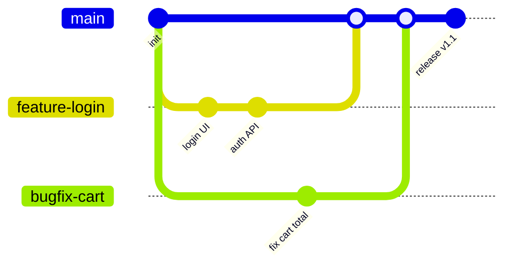
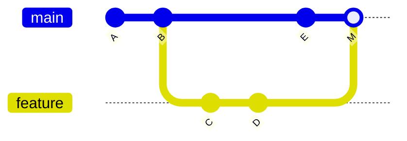
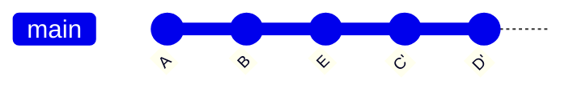
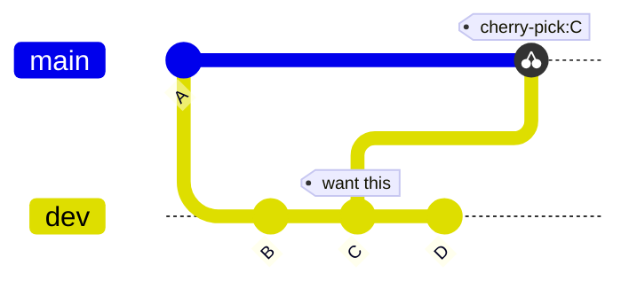

---
outline: deep
head:
  - - meta
    - name: author
      content: 許恩綸
  - - meta
    - name: keywords
      content: git,git branch,分支管理,merge,rebase,cherry-pick
  - - meta
    - property: og:title
      content: Git Branch 分支管理完全指南
  - - meta
    - property: og:description
      content: 從基礎到進階的 Git 分支操作,包含建立、切換、合併、rebase 互動式重寫等完整教學與視覺化流程圖
  - - meta
    - property: og:type
      content: article
  - - meta
    - property: og:image
      content: https://lucashsu95.github.io/LucasHsu.dev/images/git-cover.jpg
---

# Git Branch 分支管理 

>  📝 TL;DR：分支就像平行宇宙，讓多人可以各自開發不同功能不打架！基本套路：`git branch <name>` 創造分支  `git checkout <name>` 穿越過去  開發完成後 `merge` 或 `rebase` 合體回主線。遠端分支用 `git push origin <branch>` 發射出去 

##  前置知識
- 了解 Git 基本操作：add、commit、log
- 知道什麼是工作區、暫存區、本地倉庫

##  為什麼需要分支？

想像團隊同時開發三個功能：
- 開發者 A：新增登入功能
- 開發者 B：修復購物車 bug  
- 開發者 C：重構資料庫結構

若都在同一條主線上開發，程式碼會互相干擾（就像三個人同時在同一張紙上畫畫 ）。**分支**讓每個人在獨立的「平行宇宙」工作，完成後再合併回主線這樣大家都開心！



##  基本分支操作

### 查看分支
```shell
git branch           # 列出本地分支（看看你有幾個平行宇宙）
git branch -r        # 列出遠端分支（別人的平行宇宙）
git branch -a        # 全部都要！（本地+遠端）
```

### 建立與切換分支
```shell
# 建立新分支（但不切換過去，只是先開個門）
git branch feature-payment

# 切換到該分支（穿越！）
git checkout feature-payment

# 建立並立刻切換（常用！一步到位）
git checkout -b feature-payment

# 新版 Git（2.23+）推薦用 switch（語意更清楚）
git switch -c feature-payment
```

### 刪除分支
```shell
git branch -d feature-payment    # 溫柔刪除（已合併才刪，安全第一）
git branch -D feature-payment    # 狠心刪除（不管有沒有合併都刪掉！）
```

:::tip  小提示
用 `-d` 刪不掉時，Git 會提醒你「欸這個分支還沒合併喔」。確定要刪再用 `-D` 這個核彈按鈕！
:::

##  遠端分支管理

### 推送本地分支到遠端
```shell
# 首次推送並建立追蹤（像是在雲端開一個新的平行宇宙）
git push -u origin feature-payment

# 之後只需這樣就好（因為已經建立追蹤關係了）
git push
```

### 刪除遠端分支
```shell
git push origin --delete feature-payment  # 清楚明瞭
git push origin :feature-payment          # 舊語法（像是推送「空白」到遠端）
```

### 清理已刪除的遠端分支參照
```shell
git fetch origin --prune  # 大掃除！清理本地記錄中已經不存在的遠端分支
```

##  合併分支：Merge vs Rebase

### Merge（保留完整歷史）
```shell
git checkout main
git merge feature-login
```



**優點**：歷史完整、安全（就像保存完整的家族樹）  
**缺點**：歷史線圖複雜（家族關係複雜到看不懂 ）

### Rebase（線性歷史）
```shell
git checkout feature-login
git rebase main
```



**優點**：歷史簡潔（一條直線看起來超舒服）  
**缺點**：重寫歷史，已推送的分支勿用（會造成時空悖論！）

:::warning  Rebase 黃金法則
**絕不 rebase 已推送到遠端的公開分支！**  
只在本地私有分支使用，避免團隊衝突。不然就等著被隊友追殺吧 
:::

##  Cherry-pick：挑選特定提交

情境：想把 dev 分支的某個 commit 單獨套用到 main，但不想合併整個分支（就像只想吃蛋糕上的櫻桃 ）。

```shell
git checkout main
git cherry-pick <commit-id>
```



##  互動式 Rebase（進階）

:::danger  警告
只用於**尚未推送**的本地提交！這是在改寫歷史，已經公開的不要亂動！
:::

### 重寫最近 4 筆提交
```shell
git rebase -i HEAD~4
```

編輯器會打開：
```
pick a1b2c3d feat: add login
pick e4f5g6h fix: typo
pick i7j8k9l refactor: clean code
pick m0n1o2p docs: update readme
```

可用指令（像是時光機的操作面板）：
- `pick`：保留（這個提交沒問題）
- `reword`：修改訊息（改個錯字）
- `edit`：暫停以修改內容（要大改）
- `squash`：合併到前一筆（保留訊息）
- `fixup`：合併到前一筆（丟棄訊息，更乾淨）
- `drop`：刪除該提交（黑歷史不要了）

範例：合併中間兩筆
```
pick a1b2c3d feat: add login
squash e4f5g6h fix: typo
squash i7j8k9l refactor: clean code
pick m0n1o2p docs: update readme
```

##  實戰練習

### 練習 1（簡單）
建立分支 `feature-navbar`，新增一個檔案 `navbar.html`，提交後切回 main 並檢視分支差異。

:::details 參考答案
```shell
git checkout -b feature-navbar
echo "<nav>Menu</nav>" > navbar.html
git add navbar.html
git commit -m "feat: add navbar"
git checkout main
git log --oneline --graph --all
```
:::

### 練習 2（簡單）
刪除本地分支 `old-feature`，並清理已不存在的遠端分支參照。

:::details 參考答案
```shell
git branch -d old-feature           # 或 -D 強制刪除（狠心模式）
git fetch origin --prune            # 大掃除
git branch -r                       # 確認已清理乾淨
```
:::

### 練習 3（中等）
你在 `dev` 分支做了 3 個提交，但第 2 個提交訊息寫錯。請用互動式 rebase 修正訊息，但不改變程式碼。

:::details 參考答案與思路
```shell
# 1. 確認提交歷史
git log --oneline -5

# 2. 啟動互動式 rebase（假設要改最近 3 筆）
git rebase -i HEAD~3

# 3. 編輯器中，將第 2 筆的 pick 改為 reword
# pick abc1234 first commit
# reword def5678 second commit (錯誤訊息)
# pick ghi9012 third commit

# 4. 儲存後會跳出編輯器讓你修改第 2 筆訊息
# 5. 確認結果
git log --oneline -3
```
注意：若已推送到遠端，需用 `git push -f`（但會影響他人，小心被圍毆！）
:::

##  FAQ

### Q: merge 和 rebase 該用哪個？
- **公開分支合併**：用 merge（保留完整歷史，安全第一）
- **整理本地提交**：用 rebase（清理歷史再推送，讓線圖更美麗）

### Q: 切換分支時未提交的改動會怎樣？
會跟著你到新分支（像背包裡的東西）。建議先 commit 或用 `git stash` 暫存起來。

### Q: 刪除分支會丟失提交嗎？
若已合併到其他分支，提交仍保留；若未合併，用 `-d` 會警告你，`-D` 會直接刪除（不留情面）。

##  延伸閱讀
- [Git Merge vs Rebase 詳解](https://www.cnblogs.com/FraserYu/p/11192840.html)
- [git-commit.md](./git-commit.md) - Commit 訊息最佳實踐
- [git-push.md](./git-push.md) - 遠端推送與追蹤

##  總結
1. 分支讓團隊平行開發，互不干擾（各玩各的平行宇宙 ）。
2. 常用流程：`checkout -b`  開發  `merge` 回主線。
3. Merge 保留歷史，rebase 整理歷史（僅用於本地，別亂搞公開分支）。
4. 互動式 rebase 可合併/修改/刪除提交，但勿用於已推送的提交。
5. 遠端分支用 `-u` 建立追蹤，`--prune` 清理已刪除的參照。

掌握分支，你就是 Git 時空管理大師！