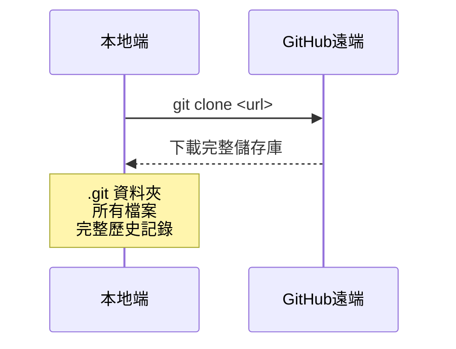
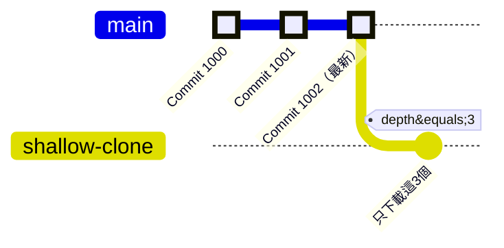

---
head:
  - - meta
    - name: author
      content: 許恩綸
  - - meta
    - name: keywords
      content: Git,git clone,HTTPS,SSH,depth,淺層克隆
  - - meta
    - property: og:title
      content: Git Clone 完全指南：HTTPS vs SSH、淺層克隆詳解
  - - meta
    - property: og:description
      content: 詳解 git clone 指令，包含 HTTPS 與 SSH 協議差異、淺層克隆（shallow clone）應用、實戰練習
  - - meta
    - property: og:type
      content: article
  - - meta
    - property: og:image
      content: https://lucashsu95.github.io/LucasHsu.dev/images/git-cover.jpg
---

# Git Clone

>  📝 TL;DR：`git clone` 就像用魔法複製別人的專案到你的電腦！HTTPS 簡單但要輸密碼（就像每次進門都要敲門），SSH 設定一次就永久免密碼（像有鑰匙直接開門）。`--depth` 可以只下載「最近幾次存檔」，超適合「我只想看最新版不想考古」的人！

##  前置知識
- 已安裝 Git（[安裝教學](./初次下載git.md)）
- 已有 GitHub 帳號
- 了解基本終端機/命令提示字元操作

##  Clone 基本概念



**Clone vs Download ZIP 差異：**

| 比較項目    | git clone            | Download ZIP   |
| ----------- | -------------------- | -------------- |
| Git 歷史    | 包含完整 commit 歷史 | 只有當前檔案   |
| .git 資料夾 | 有                   | 無             |
| 可推送變更  | 可 git push          | 無法推送       |
| 大小        | 較大（含歷史）       | 較小（僅檔案） |

 **小技巧**：如果你只是想「看看程式碼長怎樣」，下載 ZIP 就夠了。但如果要「參與開發、推送變更」，一定要用 `git clone`！

##  HTTPS vs SSH 協議

### HTTPS 克隆（簡單但麻煩）

```bash
git clone https://github.com/username/repo-name.git
```

**優點：**
-  設定簡單，無需額外配置
-  可在任何環境使用（防火牆友善）
-  適合公開儲存庫

**缺點：**
-  每次推送需輸入帳號密碼（或 token）
-  較不安全（密碼可能被攔截）

**解決重複輸入密碼：**
```bash
# Windows 儲存認證
git config --global credential.helper wincred

# Mac 儲存認證
git config --global credential.helper osxkeychain

# Linux 儲存認證
git config --global credential.helper store
```

 **踩雷警告**：儲存密碼雖然方便，但如果電腦被借走就 GG 了！還是推薦用 SSH。

---

### SSH 克隆（設定一次，終身受用）

```bash
git clone git@github.com:username/repo-name.git
```

**優點：**
-  無需每次輸入密碼
-  更安全（使用金鑰對認證）
-  適合頻繁推送的開發者

**缺點：**
-  需要先設定 SSH 金鑰
-  某些企業防火牆可能阻擋 SSH（Port 22）

**SSH 金鑰設定（快速版）：**

1. **生成金鑰：**
```bash
ssh-keygen -t ed25519 -C "your_email@example.com"
# 連按 3 次 Enter（使用預設路徑、無密碼）
```

2. **複製公鑰：**
```bash
# Windows
type %USERPROFILE%\.ssh\id_ed25519.pub | clip

# Mac/Linux
cat ~/.ssh/id_ed25519.pub | pbcopy
```

3. **加到 GitHub：**
   - 進入 GitHub  Settings  SSH and GPG keys  New SSH key
   - 貼上公鑰  Add SSH key

4. **測試連線：**
```bash
ssh -T git@github.com
# 成功會顯示：Hi username! You've successfully authenticated...
```

詳細教學：[初次下載 Git](./初次下載git.md#ssh-金鑰設定)

##  基本克隆指令

### 1. 標準克隆（最常用）

```bash
git clone https://github.com/lucashsu95/python-noob-drives.git
```

會建立與儲存庫同名的資料夾 `python-noob-drives/`。

---

### 2. 自訂資料夾名稱

```bash
git clone https://github.com/lucashsu95/python-noob-drives.git my-project
```

會建立 `my-project/` 資料夾。

 **使用時機**：當專案名稱太長或想要更語意化的名稱時超好用！

---

### 3. 克隆到當前目錄

```bash
git clone https://github.com/lucashsu95/python-noob-drives.git .
```

將內容直接克隆到當前目錄（需是空目錄）。

 **注意**：那個點 `.` 很重要，別漏了！

##  淺層克隆（Shallow Clone）

### 為什麼需要淺層克隆？

大型專案（如 Linux Kernel）完整克隆可能需要數 GB：
-  完整克隆：`git clone`  下載所有歷史記錄（可能數千 commits）
-  淺層克隆：`--depth=n`  只下載最近 n 次 commit

### 只下載最近 3 次 commit

```bash
git clone https://github.com/lucashsu95/python-noob-drives.git --depth=3
```

**效果比較：**


**適用情境：**
-  CI/CD 環境（只需最新程式碼）
-  快速預覽專案
-  網路頻寬有限
-  需要完整歷史記錄（考古、blame）

 **小技巧**：如果你只是想「快速試用專案」或「查看最新程式碼」，用 `--depth=1` 下載最快！

---

### 只下載單一分支

```bash
git clone --single-branch --branch main https://github.com/username/repo.git
```

只克隆 `main` 分支，其他分支不下載。

---

### 轉換為完整克隆

如果後來需要完整歷史：

```bash
# 取消淺層限制
git fetch --unshallow

# 下載其他分支
git config remote.origin.fetch "+refs/heads/*:refs/remotes/origin/*"
git fetch origin
```

 **使用時機**：一開始用淺層克隆快速下載，之後發現需要查歷史記錄時再「解封」！

##  實戰練習

### 練習 1（簡單）
克隆以下儲存庫，並指定資料夾名稱為 `my-notes`：
```
https://github.com/torvalds/linux.git
```

:::details 參考答案
```bash
git clone https://github.com/torvalds/linux.git my-notes
```

**驗證：**
```bash
cd my-notes
git status
# 應顯示：On branch master
```
:::

### 練習 2（簡單）
使用淺層克隆，只下載最近 5 次 commit：
```
https://github.com/microsoft/vscode.git
```

:::details 參考答案
```bash
git clone https://github.com/microsoft/vscode.git --depth=5
```

**驗證大小差異：**
```bash
# 淺層克隆（depth=5）
git clone --depth=5 https://github.com/microsoft/vscode.git vscode-shallow

# 完整克隆（比較用，會很久）
# git clone https://github.com/microsoft/vscode.git vscode-full

# 比較資料夾大小
du -sh vscode-shallow  # 約 200-300 MB
# du -sh vscode-full      # 約 3-4 GB
```

 **效果驚人**：淺層克隆可以省下 90% 以上的下載時間！
:::

### 練習 3（中等）
寫一個 Shell/Batch 腳本，自動克隆多個儲存庫到指定資料夾。

:::details 參考答案與思路

**Bash (Mac/Linux)：**
```bash
#!/bin/bash

# 儲存庫清單
repos=(
  "https://github.com/user1/repo1.git"
  "https://github.com/user2/repo2.git"
  "https://github.com/user3/repo3.git"
)

# 目標資料夾
target_dir="$HOME/projects"
mkdir -p "$target_dir"

# 批次克隆
for repo in "${repos[@]}"; do
  echo " 正在克隆：$repo"
  git clone "$repo" "$target_dir/$(basename $repo .git)"
done

echo " 所有儲存庫已克隆完成！"
```

**PowerShell (Windows)：**
```powershell
# 儲存庫清單
$repos = @(
    "https://github.com/user1/repo1.git",
    "https://github.com/user2/repo2.git",
    "https://github.com/user3/repo3.git"
)

# 目標資料夾
$targetDir = "$HOME\projects"
New-Item -Path $targetDir -ItemType Directory -Force | Out-Null

# 批次克隆
foreach ($repo in $repos) {
    Write-Host " 正在克隆：$repo" -ForegroundColor Cyan
    $repoName = ($repo -split '/')[-1] -replace '\.git$'
    git clone $repo "$targetDir\$repoName"
}

Write-Host " 所有儲存庫已克隆完成！" -ForegroundColor Green
```

**思路：**
1. 定義儲存庫 URL 陣列
2. 建立目標資料夾
3. 迴圈遍歷每個 URL，用 `basename` 取得儲存庫名稱
4. 克隆到 `目標資料夾/儲存庫名稱`

**進階：加入錯誤處理**
```bash
for repo in "${repos[@]}"; do
  if git clone "$repo" "$target_dir/$(basename $repo .git)"; then
    echo " 成功：$repo"
  else
    echo " 失敗：$repo"
  fi
done
```
:::

##  FAQ

### Q: HTTPS 與 SSH 可以互換嗎？
**可以**。克隆後可修改遠端 URL：

```bash
# 查看目前遠端
git remote -v

# 從 HTTPS 改為 SSH
git remote set-url origin git@github.com:username/repo.git

# 從 SSH 改為 HTTPS
git remote set-url origin https://github.com/username/repo.git
```

### Q: 淺層克隆會影響功能嗎？
**部分功能受限：**
-  可正常 commit、push、pull
-  無法查看完整歷史（`git log` 只顯示已下載的 commits）
-  `git blame` 可能不完整
-  某些 Git 指令（如 `git describe`）可能出錯

 **記住**：淺層克隆就像「只看最新章節的小說」，適合快速開發，但考古學家就不適用了！

### Q: GitHub Desktop 用的是哪種協議？
預設使用 **HTTPS**，但可在設定中切換為 SSH。

##  延伸閱讀
- [初次下載 Git](./初次下載git.md) - 安裝與初始設定
- [Git Push](./git-push.md) - 推送變更到遠端
- [Git Fork 後續操作](./git-fork-after.md) - Fork 專案的同步
- [GitHub Docs: Cloning a repository](https://docs.github.com/en/repositories/creating-and-managing-repositories/cloning-a-repository)

##  總結
1. `git clone` 複製遠端儲存庫到本地，包含完整歷史。
2. HTTPS 簡單但需密碼，SSH 安全但需設定金鑰（**強烈推薦 SSH**）。
3. `--depth=n` 做淺層克隆，適合大型專案或 CI/CD（速度快 10 倍以上）。
4. 可自訂資料夾名稱、只克隆單一分支。
5. 淺層克隆可轉為完整克隆（`git fetch --unshallow`），超彈性！

**最後一句話**：用 Git Clone 就像「一鍵複製整個專案的時空」，從此你也有自己的平行宇宙可以開發了！
