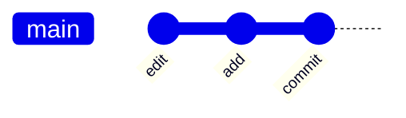

---
outline: deep
head:
  - - meta
    - name: author
      content: 許恩綸
  - - meta
    - name: keywords
      content: git,git commit,git reset,conventional commits
  - - meta
    - property: og:title
      content: git commit 提交與最佳實踐
  - - meta
    - property: og:description
      content: git commit 工作流程、訊息格式、reset vs revert、安全操作指引
  - - meta
    - property: og:type
      content: article
  - - meta
    - property: og:image
      content: ./imgs/git-cover.png
---

# git commit 提交與最佳實踐

>  TL;DR：`git commit` 就像把你的程式碼打包成快照存進 Git 的「時光寶盒」。記得先 `git status` 檢查、`git add` 選檔、再 `commit` 留言。切記：`--hard` 這個核彈按鈕不要亂按！要反悔時，先找溫柔的 `revert`，真的沒辦法再考慮狠心的 `reset`。

##  前置知識
- 知道 Git 的三個家：工作區（你的檔案夾）、暫存區（候車室）、本地倉庫（永久倉庫）
- 會用基本指令：`git status`（看看現在怎樣）、`git add`（選角色進暫存區）、`git log`（查歷史記錄）

##  標準工作流程（照著做就對了）

想像你在拍電影，每個 commit 就是一個鏡頭：

1) **檢查現場**：`git status`（看看現在亂成怎樣 ）
2) **選角**：`git add <file>`（別一次加所有人，挑重點！）
3) **彩排確認**：`git diff --cached`（確定沒穿幫）
4) **正式開拍**：`git commit -m "type(scope): summary"`（留個帥氣的場記）
5) **檢閱成果**：`git log --oneline --graph --decorate -5`（看看拍了啥）



##  commit 訊息格式（寫給未來的自己看）

推薦使用 **Conventional Commits**，別再寫「fix」、「update」這種謎樣訊息了 

```
type(scope): summary

body (可選，用來解釋「為什麼要這樣做」)

BREAKING CHANGE: (如果有破壞性變更，要大聲喊出來！)
```

### 常見 type（挑一個吧）：
- **feat**：新功能上線 （老闆最愛看到這個）
- **fix**：修 bug （救火隊日常）
- **docs**：改文件 （也是很重要的！）
- **style**：整理格式 （強迫症發作）
- **refactor**：重構程式碼 （讓它更優雅）
- **test**：補測試 （防止未來崩潰）
- **chore**：雜事 （例如更新套件）

### 範例（看起來是不是專業很多？）
```
feat(auth): add oauth token refresh
fix(api): handle 500 error fallback
docs(readme): update installation steps
```

##  基本與常用指令

### 建立提交（基本款）
```shell
git commit -m "feat: add navbar"
```
>  一句話講清楚你做了什麼，未來的自己會感謝你！

### 只提交特定檔案（我只要這幾個！）
```shell
git commit path/to/file1 path/to/file2 -m "fix: patch forms"
```
> 有時候你只想提交部分檔案，其他先放著

### 修改上一筆訊息（打錯字了啦）
```shell
git commit --amend -m "fix: correct typo"
```
>  警告：這招只能用在**還沒推送**的 commit！推送後再改會引發平行時空混亂 

##  Reset vs Revert：時光機的兩種模式

Git 給你兩種「反悔」的方法，但用錯會出人命 

```shell
# 溫柔派：產生一個新的「反向提交」（推薦）
git revert <commit_sha>

# 狠心派：直接抹除歷史（危險！謹慎使用！）
git reset --hard HEAD~1
```

### 決策表（選錯會被隊友打）

| 情境 | 推薦指令 | 原因 |
|------|-----------|------|
| 回退已推送的錯誤 | `git revert` | 保留歷史，大家都能看到你修正了啥  |
| 清除本地尚未推送的提交 | `git reset --hard` | 重寫歷史，反正還沒人知道  |
| 只想取消某個檔案的變更 | `git restore <file>` | 不動提交歷史，只改檔案 |

### 記住：
- **Revert** = 「抱歉我錯了，我用新的 commit 來修正」（光明正大）
- **Reset --hard** = 「當作這件事沒發生過」（瞞天過海）

##  檢視與排錯（不要盲目提交）

```shell
# 看看暫存區有什麼（提交前必看！）
git diff --cached

# 查看最近 5 筆歷史（圖形化）
git log --oneline --graph --decorate -5

# 查看某個檔案的修改歷史（誰改壞的？）
git log --oneline -- path/to/file
```

### 常見問題急救包 
- **不知道會 commit 哪些檔案？** 先跑 `git status` + `git diff --cached`，確認沒問題再送出
- **提交訊息寫錯，但已經推送了？** 用 `git revert` 產生一個更正的 commit（別用 amend，會被隊友揍）
- **不小心 add 了不該加的檔案？** 用 `git restore --staged <file>` 把它踢出暫存區

##  實戰練習（動手做才會記得）

### 練習 1：精準提交（簡單）
在一個檔案做小修正，只提交這個檔案，訊息用 Conventional Commits 格式。

:::details  參考答案
```shell
git status                    # 看看現在狀況
git add docs/readme.md        # 只加這個檔案
git diff --cached             # 確認暫存內容
git commit -m "docs: update intro"  # 專業提交
```
>  重點：**選擇性提交**，不要一次 add 所有檔案！
:::

### 練習 2：暫存區急救（簡單）
不小心把多個檔案都 add 了，但你只想提交其中一個，其他恢復成未暫存。

:::details  參考答案
```shell
git restore --staged .        # 清空整個暫存區
git add src/main.ts           # 只加你要的檔案
git commit -m "fix: guard null input"
```
>  `restore --staged` 是暫存區的橡皮擦，不會動到你的檔案內容！
:::

### 練習 3：安全回退（中等）
已經推送的上一筆 commit 內容有誤，請安全地回退並補上更正提交。

:::details  參考答案與思路
**思路：**
1. 已經推送了，不能用 `reset`（會搞砸遠端）
2. 用 `revert` 產生反向提交（安全又專業）

**步驟：**
```shell
git log --oneline -5          # 找到要回退的 commit SHA
git revert <sha>              # 產生反向提交
git log --oneline --graph -3  # 驗證結果
git push                      # 推送反向提交
```

>  如果還需要補充修正，直接再送一筆新的 commit 就好！
:::

##  FAQ（常見問題懶人包）

### Q: 可以直接用 `git commit -am` 嗎？
**A:** 可以，但這是懶人套餐 。`-a` 會自動 add **所有已追蹤的檔案**，容易漏看暫存內容。建議新手還是乖乖 `status`  `add`  `commit`，比較不會踩雷。

### Q: 到底什麼時候用 revert，什麼時候用 reset？
**A:** 簡單記：
- **已推送或多人協作**  用 `revert`（不要亂改歷史）
- **還沒推送且確定要重寫歷史**  才用 `reset`

### Q: Commit 訊息要寫多長？
**A:** Summary 建議 **50 字元內**（一行看完最舒服），詳細原因放 body。記住：寫給三個月後忘光的自己看！

##  總結（記住這幾點就夠用）

1. **標準流程**：`status`  `add`  `diff --cached`  `commit`  `log`（按部就班不會錯）
2. **訊息格式**：用 Conventional Commits，讓歷史記錄像寫故事一樣清楚
3. **回退策略**：優先用 `revert` 保留歷史，`reset --hard` 是最後手段
4. **提交前檢查**：養成習慣用 `diff --cached` 看一遍，避免把奇怪的東西帶進版本庫

記住：**好的 commit 習慣是團隊協作的基石**，也是救自己未來不用加班的關鍵 
