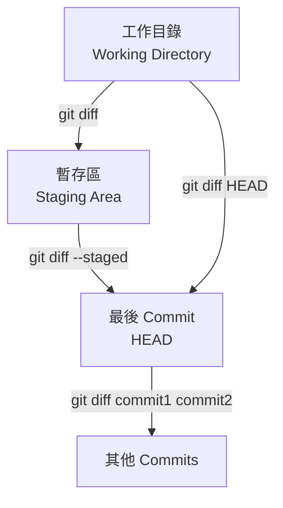
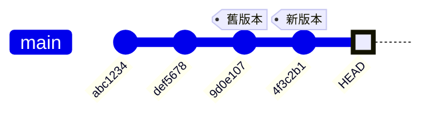

---
head:
  - - meta
    - name: author
      content: 許恩綸
  - - meta
    - name: keywords
      content: Git,git diff,比較差異,staged,working directory,commit
  - - meta
    - property: og:title
      content: Git Diff 完全指南：比較工作目錄、暫存區與 Commit
  - - meta
    - property: og:description
      content: 詳解 git diff 指令用法，包含工作目錄 vs 暫存區、比較 commits、檔案差異、word-diff 進階選項
  - - meta
    - property: og:type
      content: article
---

# Git Diff

>  **TL;DR**：`git diff` 是「程式碼找碴遊戲」的神器！無參數看「工作目錄 vs 暫存區」、`--staged` 看「暫存區 vs 最後存檔」、`commit1 commit2` 比較「兩個時空的差異」。可以指定檔案（`-- path/to/file`）、用 `--word-diff` 顯示「哪個字被偷改」。紅色 `-` 是刪除、綠色 `+` 是新增，就像偵探辦案一樣精彩！

##  前置知識
- 了解 Git 三大區域（工作目錄、暫存區、儲存庫）
- 知道基本 Git 指令（add、commit）
- 參考：[Git 暫存區](./git-staging.md)

##  Diff 比較對象



### 比較類型速查表

| 指令 | 比較對象 | 說明 |
|------|---------|------|
| `git diff` | 工作目錄 vs 暫存區 | 查看**未暫存**的變更 |
| `git diff --staged` | 暫存區 vs HEAD | 查看**即將提交**的變更 |
| `git diff HEAD` | 工作目錄 vs HEAD | 查看**所有未提交**的變更 |
| `git diff commit1 commit2` | 兩個 commits | 比較歷史版本 |
| `git diff branch1 branch2` | 兩個分支 | 比較分支差異 |

 **生活化比喻**：
- `git diff` = 「草稿 vs 即將交出去的作業」（還沒放進書包的改動）
- `git diff --staged` = 「書包裡的作業 vs 昨天交的作業」（準備交出去的）
- `git diff HEAD` = 「所有沒交的改動 vs 昨天交的」（全部差異）

##  基本用法

### 1. 工作目錄 vs 暫存區（預設）

```bash
git diff
```

**輸出範例：**
```diff
diff --git a/src/App.vue b/src/App.vue
index 1234abc..5678def 100644
--- a/src/App.vue
+++ b/src/App.vue
@@ -10,7 +10,7 @@ export default {
   data() {
     return {
-      message: 'Hello'
+      message: 'Hello World'
     }
   }
 }
```

**解讀：**
- `-`（紅色）：刪除的行（舊版本有，新版本沒有）
- `+`（綠色）：新增的行（舊版本沒有，新版本有）
- `@@` 後的數字：變更的行號範圍

 **偵探筆記**：紅色 = 證據被消滅、綠色 = 新線索出現！

---

### 2. 暫存區 vs 最後 Commit

```bash
git diff --staged
# 或
git diff --cached
```

**適用情境：**
-  提交前檢查即將提交的內容
-  確認暫存區的檔案是否正確

 **重要**：這是「送出作業前的最後檢查」，務必養成習慣！

---

### 3. 查看所有未提交變更

```bash
git diff HEAD
```

等同於：`git diff` + `git diff --staged` 的總和。

##  進階用法

### 1. 比較特定檔案

```bash
# 工作目錄 vs 暫存區（單一檔案）
git diff -- path/to/file.txt

# 暫存區 vs HEAD（單一檔案）
git diff --staged -- src/App.vue

# 比較整個資料夾
git diff -- src/components/
```

**實戰範例：**
```bash
# 只看 App.vue 的差異
git diff -- src/App.vue

# 看所有 .vue 檔案的差異
git diff -- '*.vue'
```

 **小技巧**：用 `--` 分隔指令選項和檔案路徑，避免 Git 誤判！

---

### 2. 比較兩個 Commits

```bash
# 比較特定 commit
git diff 9d0e107 HEAD

# 比較兩個 commit
git diff 9d0e107 4f3c2b1

# 比較某個 commit 的特定檔案
git diff 9d0e107 HEAD -- src/App.vue
```

**視覺化理解：**


```bash
# 比較舊版本  新版本的差異
git diff 9d0e107 4f3c2b1
```

 **使用時機**：像時光機一樣，看看「一個月前的程式碼」和「現在的程式碼」差了多少！

---

### 3. 比較分支

```bash
# 比較兩個分支
git diff main feature

# 比較當前分支與 main
git diff main

# 只看檔案名稱（不顯示內容）
git diff --name-only main feature
```

---

### 4. 統計變更

```bash
# 顯示統計資訊（變動幾行）
git diff --stat

# 輸出範例：
#  src/App.vue    | 10 +++++-----
#  src/utils.js   |  5 +++--
#  2 files changed, 8 insertions(+), 7 deletions(-)

# 只顯示變更的檔案名稱
git diff --name-only

# 顯示變更類型（新增/修改/刪除）
git diff --name-status
# 輸出：
# M    src/App.vue       (修改)
# A    src/new.js        (新增)
# D    src/old.js        (刪除)
```

 **小技巧**：用 `--stat` 快速掃描「哪些檔案被改了、改了幾行」，不用看密密麻麻的程式碼！

##  輸出格式選項

### 1. 單字差異（Word Diff）

```bash
# 顯示單字層級的差異（不是整行）
git diff --word-diff

# 範例輸出：
# return {
#   message: [-'Hello'-]{+'Hello World'+}
# }
```

**適用情境：**
-  文件編輯（Markdown、README）
-  單行程式碼的小修改

 **偵探筆記**：用這個找「誰改了哪個字」超精準，不會整行紅紅綠綠眼花撩亂！

---

### 2. 色彩強化

```bash
# 強制使用彩色輸出
git diff --color

# 關閉彩色（適合輸出到檔案）
git diff --no-color > diff.txt
```

---

### 3. 上下文行數

```bash
# 預設顯示 3 行上下文
git diff

# 增加到 5 行上下文
git diff -U5

# 只顯示變更行（無上下文）
git diff -U0
```

##  實戰情境

### 情境 1：提交前檢查

```bash
# 1. 修改檔案後查看差異
git diff

# 2. 暫存部分檔案
git add src/App.vue

# 3. 檢查即將提交的內容
git diff --staged

# 4. 確認無誤後提交
git commit -m "update: 修改訊息"
```

 **最佳實踐**：養成「commit 前一定先 `git diff --staged`」的好習慣，避免提交錯誤內容！

---

### 情境 2：比較特定 Commit 的單一檔案

```bash
# 查看某個 commit 對特定檔案做了什麼
git diff 9d0e107 4f3c2b1 -- src/views/Home.vue

# 加上單字差異
git diff --word-diff 9d0e107 4f3c2b1 -- README.md
```

---

### 情境 3：找出兩個分支的差異檔案

```bash
# 查看 feature 分支相對於 main 改了哪些檔案
git diff --name-status main feature

# 輸出：
# M    src/App.vue
# A    src/components/NewFeature.vue
# D    src/components/OldFeature.vue

# 只看 src/ 資料夾的差異
git diff main feature -- src/
```

##  實戰練習

### 練習 1（簡單）
建立一個儲存庫，修改檔案後使用 `git diff` 查看差異，然後暫存並用 `git diff --staged` 確認。

:::details 參考答案
```bash
# 1. 初始化儲存庫
mkdir git-diff-practice && cd git-diff-practice
git init

# 2. 建立檔案並提交
echo "Hello" > test.txt
git add test.txt
git commit -m "init: 初始提交"

# 3. 修改檔案
echo "World" >> test.txt

# 4. 查看工作目錄差異
git diff
# 應顯示：
# +World

# 5. 暫存檔案
git add test.txt

# 6. 查看暫存區差異
git diff --staged
# 應顯示相同的 +World

# 7. 確認工作目錄已無未暫存變更
git diff
# 應無輸出（空白）
```

 **重點**：成功體驗「工作目錄  暫存區  儲存庫」的三階段檢查流程！
:::

### 練習 2（簡單）
比較最近兩個 commits 的差異，只顯示變更的檔案名稱。

:::details 參考答案
```bash
# 方法一：使用 HEAD~1 表示上一個 commit
git diff --name-only HEAD~1 HEAD

# 方法二：使用 commit hash
git log --oneline -2
# 複製兩個 commit hash，例如：
# abc1234 最新
# def5678 上一個

git diff --name-only def5678 abc1234

# 方法三：顯示變更類型
git diff --name-status HEAD~1 HEAD
# 輸出：
# M    file1.txt  (修改)
# A    file2.txt  (新增)
```
:::

### 練習 3（中等）
寫一個 Shell 腳本，自動化「顯示所有未暫存變更  詢問是否查看詳細差異  選擇性暫存檔案」流程。

:::details 參考答案與思路

```bash
#!/bin/bash

echo " 檢查未暫存的變更..."

# 取得所有修改的檔案
modified_files=$(git diff --name-only)

if [[ -z $modified_files ]]; then
    echo " 無未暫存的變更"
    exit 0
fi

echo " 以下檔案已修改："
echo "$modified_files" | nl  # 加上行號

echo ""
read -p "是否查看詳細差異？(y/n): " show_diff

if [[ $show_diff == "y" ]]; then
    # 逐一顯示每個檔案的差異
    while IFS= read -r file; do
        echo ""
        echo "========== $file =========="
        git diff --color -- "$file"
        echo ""
        read -p "是否暫存此檔案？(y/n/q退出): " answer
        
        case $answer in
            y)
                git add "$file"
                echo " 已暫存：$file"
                ;;
            q)
                echo " 結束操作"
                exit 0
                ;;
            *)
                echo " 跳過：$file"
                ;;
        esac
    done <<< "$modified_files"
    
    echo ""
    echo " 暫存區狀態："
    git status --short
else
    echo " 已取消操作"
fi
```

**思路：**
1. 用 `git diff --name-only` 取得未暫存檔案清單
2. 顯示清單並詢問是否查看詳細差異
3. 逐一顯示每個檔案的 `git diff` 輸出
4. 詢問是否暫存該檔案（y/n/q）
5. 根據選擇執行 `git add` 或跳過
6. 最後顯示暫存區狀態

**進階：加入彩色輸出**
```bash
# 在腳本開頭定義顏色
GREEN='\033[0;32m'
RED='\033[0;31m'
NC='\033[0m'  # No Color

echo -e "${GREEN} 已暫存${NC}"
echo -e "${RED} 跳過${NC}"
```
:::

##  FAQ

### Q: `git diff` 無輸出代表什麼？
兩種可能：
1. **工作目錄乾淨**：無任何修改
2. **所有修改已暫存**：用 `git diff --staged` 查看

### Q: 如何忽略空白差異？
```bash
# 忽略所有空白變更
git diff -w

# 忽略行尾空白
git diff --ignore-space-at-eol

# 忽略空白行變更
git diff --ignore-blank-lines
```

 **使用時機**：當你只改了縮排或格式化程式碼時，這招可以過濾掉「無意義的差異」！

### Q: 如何將 diff 輸出存成檔案？
```bash
# 存成 patch 檔
git diff > changes.patch

# 稍後套用 patch
git apply changes.patch
```

### Q: 如何在 VS Code 中查看 Git Diff？
1. 點擊左側的**原始檔控制**圖示
2. 點擊檔案名稱右側的**開啟變更**圖示
3. 或使用指令：`code --diff file1 file2`


##  延伸閱讀
- [Git 暫存區](./git-staging.md) - 了解三大區域
- [Git Log](./git-log.md) - 查看 commit 歷史
- [Git Show](https://git-scm.com/docs/git-show) - 查看特定 commit 內容
- [Pro Git: 檢視提交的歷史記錄](https://git-scm.com/book/zh-tw/v2/Git-基礎-檢視提交的歷史記錄)

---

##  總結
1. `git diff` 預設比較工作目錄 vs 暫存區（找出還沒加入暫存的改動）。
2. `--staged` 比較暫存區 vs 最後 commit，提交前必用（避免交錯作業）！
3. 可指定檔案路徑（`-- path/to/file`）或比較特定 commits（時光機功能）。
4. `--word-diff` 顯示單字差異，適合文件編輯（精準找出改了哪個字）。
5. `--stat` 顯示統計資訊，快速了解變更範圍（不用看程式碼也知道改了什麼）。

**最後一句話**：`git diff` 就是程式設計師的「放大鏡」，紅色刪除、綠色新增，像偵探一樣找出每個變更的蛛絲馬跡！熟練使用它，就能掌握程式碼的所有秘密！
