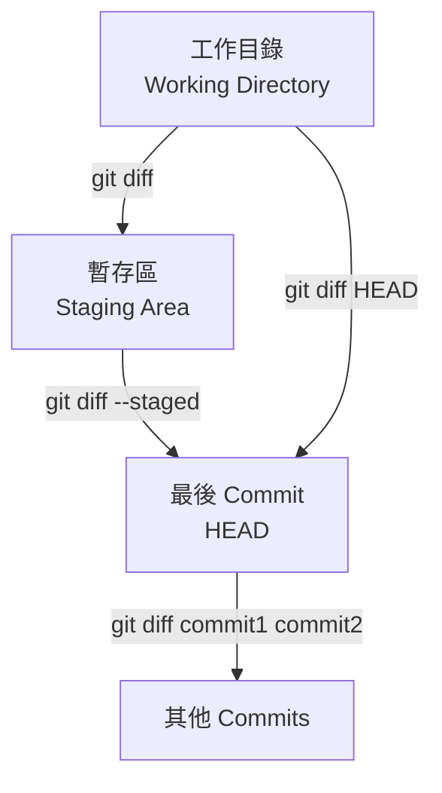
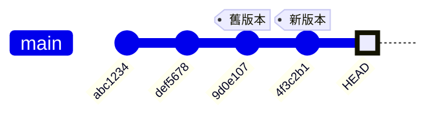

---
head:
  - - meta
    - name: author
      content: 許恩綸
  - - meta
    - name: keywords
      content: Git,git diff,比較差異,staged,working directory,commit
  - - meta
    - property: og:title
      content: Git Diff 完全指南：比較工作目錄、暫存區與 Commit
  - - meta
    - property: og:description
      content: 詳解 git diff 指令用法，包含工作目錄 vs 暫存區、比較 commits、檔案差異、word-diff 進階選項
  - - meta
    - property: og:type
      content: article
  - - meta
    - property: og:image
      content: https://lucashsu95.github.io/LucasHsu.dev/images/git-cover.jpg
---

# Git Diff

>  📝 TL;DR：`git diff` 是「程式碼找碴遊戲」的神器！無參數看「工作目錄 vs 暫存區」、`--staged` 看「暫存區 vs 最後存檔」、`commit1 commit2` 比較「兩個時空的差異」。可以指定檔案（`-- path/to/file`）、用 `--word-diff` 顯示「哪個字被偷改」。紅色 `-` 是刪除、綠色 `+` 是新增，就像偵探辦案一樣精彩！

## 開場情境：部署前的驚魂記

**情境：** 週五下午 5:50，你準備部署到正式環境。突然收到主管訊息：「等等！先確認你這次改了什麼，別像上次一樣把測試用的 `console.log` 也推上去。」

你心想：「我改了十幾個檔案，哪記得每個改了什麼...」

**這時 `git diff` 就是你的救命符！**

```bash
# 1. 先看看「還沒加入暫存區」的改動（可能有忘記的測試程式碼）
git diff
```

**輸出：**
```diff
diff --git a/src/utils.js b/src/utils.js
+   console.log('DEBUG: total =', total);  // ← 糟糕！忘記刪除
```

```bash
# 2. 刪除測試用程式碼後，暫存所有檔案
git add .

# 3. 最後檢查「即將提交」的內容（最重要的一步！）
git diff --staged
```

**輸出：**
```diff
diff --git a/src/api/payment.js b/src/api/payment.js
-  const API_KEY = 'test_1234567890';
+  const API_KEY = process.env.PAYMENT_API_KEY;  // ✓ 正確使用環境變數
```

**💾 確認無誤後才提交：**
```bash
git commit -m "feat: 整合金流系統"
```

**🎯 這個情境展示了：**
1. `git diff`（無參數）= 找出「忘記處理的改動」
2. `git diff --staged` = 「最後檢查即將提交的內容」（避免災難）

💡 **養成習慣：每次 commit 前一定先 `git diff --staged`，就像「送出作業前再檢查一遍」！**

---

##  前置知識
- 了解 Git 三大區域（工作目錄、暫存區、儲存庫）
- 知道基本 Git 指令（add、commit）
- 參考：[Git 暫存區](./git-staging.md)

##  Diff 比較對象



### 比較類型速查表

| 指令                       | 比較對象           | 說明                     |
| -------------------------- | ------------------ | ------------------------ |
| `git diff`                 | 工作目錄 vs 暫存區 | 查看**未暫存**的變更     |
| `git diff --staged`        | 暫存區 vs HEAD     | 查看**即將提交**的變更   |
| `git diff HEAD`            | 工作目錄 vs HEAD   | 查看**所有未提交**的變更 |
| `git diff commit1 commit2` | 兩個 commits       | 比較歷史版本             |
| `git diff branch1 branch2` | 兩個分支           | 比較分支差異             |

 **生活化比喻**：
- `git diff` = 「草稿 vs 即將交出去的作業」（還沒放進書包的改動）
- `git diff --staged` = 「書包裡的作業 vs 昨天交的作業」（準備交出去的）
- `git diff HEAD` = 「所有沒交的改動 vs 昨天交的」（全部差異）

##  基本用法

### 1. 工作目錄 vs 暫存區（預設）

```bash
git diff
```

**輸出範例：**
```diff
diff --git a/src/App.vue b/src/App.vue
index 1234abc..5678def 100644
--- a/src/App.vue
+++ b/src/App.vue
@@ -10,7 +10,7 @@ export default {
   data() {
     return {
-      message: 'Hello'
+      message: 'Hello World'
     }
   }
 }
```

**解讀：**
- `-`（紅色）：刪除的行（舊版本有，新版本沒有）
- `+`（綠色）：新增的行（舊版本沒有，新版本有）
- `@@` 後的數字：變更的行號範圍

 **偵探筆記**：紅色 = 證據被消滅、綠色 = 新線索出現！

---

### 2. 暫存區 vs 最後 Commit

```bash
git diff --staged
# 或
git diff --cached
```

**適用情境：**
-  提交前檢查即將提交的內容
-  確認暫存區的檔案是否正確

 **重要**：這是「送出作業前的最後檢查」，務必養成習慣！

---

### 3. 查看所有未提交變更

```bash
git diff HEAD
```

等同於：`git diff` + `git diff --staged` 的總和。

##  進階用法

### 1. 比較特定檔案

```bash
# 工作目錄 vs 暫存區（單一檔案）
git diff -- path/to/file.txt

# 暫存區 vs HEAD（單一檔案）
git diff --staged -- src/App.vue

# 比較整個資料夾
git diff -- src/components/
```

**實戰範例：**
```bash
# 只看 App.vue 的差異
git diff -- src/App.vue

# 看所有 .vue 檔案的差異
git diff -- '*.vue'
```

 **小技巧**：用 `--` 分隔指令選項和檔案路徑，避免 Git 誤判！

---

### 2. 比較兩個 Commits

```bash
# 比較特定 commit
git diff 9d0e107 HEAD

# 比較兩個 commit
git diff 9d0e107 4f3c2b1

# 比較某個 commit 的特定檔案
git diff 9d0e107 HEAD -- src/App.vue
```

**視覺化理解：**


```bash
# 比較舊版本  新版本的差異
git diff 9d0e107 4f3c2b1
```

 **使用時機**：像時光機一樣，看看「一個月前的程式碼」和「現在的程式碼」差了多少！

---

### 3. 比較分支

```bash
# 比較兩個分支
git diff main feature

# 比較當前分支與 main
git diff main

# 只看檔案名稱（不顯示內容）
git diff --name-only main feature
```

---

### 4. 統計變更

```bash
# 顯示統計資訊（變動幾行）
git diff --stat

# 輸出範例：
#  src/App.vue    | 10 +++++-----
#  src/utils.js   |  5 +++--
#  2 files changed, 8 insertions(+), 7 deletions(-)

# 只顯示變更的檔案名稱
git diff --name-only

# 顯示變更類型（新增/修改/刪除）
git diff --name-status
# 輸出：
# M    src/App.vue       (修改)
# A    src/new.js        (新增)
# D    src/old.js        (刪除)
```

 **小技巧**：用 `--stat` 快速掃描「哪些檔案被改了、改了幾行」，不用看密密麻麻的程式碼！

##  輸出格式選項

### 1. 單字差異（Word Diff）

```bash
# 顯示單字層級的差異（不是整行）
git diff --word-diff

# 範例輸出：
# return {
#   message: [-'Hello'-]{+'Hello World'+}
# }
```

**適用情境：**
-  文件編輯（Markdown、README）
-  單行程式碼的小修改

 **偵探筆記**：用這個找「誰改了哪個字」超精準，不會整行紅紅綠綠眼花撩亂！

---

### 2. 色彩強化

```bash
# 強制使用彩色輸出
git diff --color

# 關閉彩色（適合輸出到檔案）
git diff --no-color > diff.txt
```

---

### 3. 上下文行數

```bash
# 預設顯示 3 行上下文
git diff

# 增加到 5 行上下文
git diff -U5

# 只顯示變更行（無上下文）
git diff -U0
```

##  實戰情境

### 情境 1：提交前檢查

**情境：** 你剛完成一個功能，修改了 5 個檔案，但記不清每個檔案改了什麼。

```bash
# 1. 修改檔案後查看差異
git diff

# 2. 暫存部分檔案
git add src/App.vue

# 3. 檢查即將提交的內容
git diff --staged

# 4. 確認無誤後提交
git commit -m "update: 修改訊息"
```

 **最佳實踐**：養成「commit 前一定先 `git diff --staged`」的好習慣，避免提交錯誤內容！

---

### 情境 2：比較特定 Commit 的單一檔案

```bash
# 查看某個 commit 對特定檔案做了什麼
git diff 9d0e107 4f3c2b1 -- src/views/Home.vue

# 加上單字差異
git diff --word-diff 9d0e107 4f3c2b1 -- README.md
```

---

### 情境 3：找出兩個分支的差異檔案

```bash
# 查看 feature 分支相對於 main 改了哪些檔案
git diff --name-status main feature

# 輸出：
# M    src/App.vue
# A    src/components/NewFeature.vue
# D    src/components/OldFeature.vue

# 只看 src/ 資料夾的差異
git diff main feature -- src/
```

---

### 情境 4：Code Review 前的自我檢查（超實用！）

**情境：** 你要發 Pull Request 前，想先自己 review 一遍，確保：
- 沒有多餘的空行
- 沒有 debug 用的 `console.log`
- 程式碼符合規範

```bash
# 1. 比較你的分支與 main 的差異
git diff main...HEAD

# 2. 只看檔案清單（快速掃描）
git diff --name-status main...HEAD

# 3. 檢查是否有敏感資訊
git diff main...HEAD | grep -i -E '(password|secret|api_key|token)'

# 4. 檢查是否有 console.log
git diff main...HEAD | grep 'console\.log'
```

💡 **三個點 `...` 的意義：** `main...HEAD` 表示「HEAD 相對於『與 main 的共同祖先』的差異」，也就是「你在這個分支上做的所有改動」。

---

### 情境 5：衝突解決時比較版本

**情境：** Merge 時遇到衝突，你想看「我的版本」和「別人的版本」分別是什麼。

```bash
# 假設正在解決 src/config.js 的衝突

# 查看「我的版本」（當前分支）
git show :2:src/config.js

# 查看「別人的版本」（要合併進來的分支）
git show :3:src/config.js

# 比較兩個版本
git diff :2:src/config.js :3:src/config.js
```

**衝突標記解釋：**
```javascript
<<<<<<< HEAD (我的版本)
const API_URL = 'https://api-dev.example.com';
=======
const API_URL = 'https://api-staging.example.com';
>>>>>>> feature-branch (別人的版本)
```

---

### 情境 6：檢查「是否只改了空白或格式」

**情境：** 你用 Prettier 格式化了程式碼，想確認「是否有實際的邏輯變更」。

```bash
# 忽略所有空白差異
git diff -w

# 如果輸出是空的，代表「只改了格式，沒改邏輯」
```

**實戰範例：**
```bash
# 格式化前後比較
git diff HEAD  # 顯示一大堆縮排變更

git diff -w HEAD  # 顯示空白 → 只是格式化，沒有邏輯變更
```

💡 **使用時機：** 當你執行 `npm run format` 後，用這招確認「Prettier 有沒有改壞邏輯」。

---

### 情境 7：追蹤「誰改了這個設定檔」

**情境：** `package.json` 突然多了一個奇怪的套件，你想知道是哪個 commit 加的。

```bash
# 1. 查看 package.json 的歷史
git log --oneline -- package.json

# 2. 逐一比較每個 commit
git diff abc123 def456 -- package.json

# 3. 搜尋特定套件
git log -p -- package.json | grep -A 5 -B 5 "weird-package"
```

---

### 情境 8：製作「變更說明文件」

**情境：** 你要寫「本次更新說明」，需要列出所有變更的檔案和簡要說明。

```bash
# 產生變更清單
git diff --name-status main...HEAD > changes.txt

# 產生詳細變更（包含行數統計）
git diff --stat main...HEAD > changes_detail.txt

# 只看新增的檔案
git diff --name-status --diff-filter=A main...HEAD

# 只看刪除的檔案
git diff --name-status --diff-filter=D main...HEAD
```

**產生 Markdown 格式：**
```bash
#!/bin/bash

echo "# 本次更新內容" > CHANGELOG.md
echo "" >> CHANGELOG.md
echo "## 變更檔案" >> CHANGELOG.md
echo "" >> CHANGELOG.md

git diff --name-status main...HEAD | while read status file; do
  case $status in
    A) echo "- ✨ 新增：$file" >> CHANGELOG.md ;;
    M) echo "- 📝 修改：$file" >> CHANGELOG.md ;;
    D) echo "- 🗑️ 刪除：$file" >> CHANGELOG.md ;;
  esac
done

echo "" >> CHANGELOG.md
echo "## 詳細統計" >> CHANGELOG.md
echo "" >> CHANGELOG.md
echo '```' >> CHANGELOG.md
git diff --stat main...HEAD >> CHANGELOG.md
echo '```' >> CHANGELOG.md
```

---

##  實戰練習

### 練習 1（簡單）
建立一個儲存庫，修改檔案後使用 `git diff` 查看差異，然後暫存並用 `git diff --staged` 確認。

:::details 參考答案
```bash
# 1. 初始化儲存庫
mkdir git-diff-practice && cd git-diff-practice
git init

# 2. 建立檔案並提交
echo "Hello" > test.txt
git add test.txt
git commit -m "init: 初始提交"

# 3. 修改檔案
echo "World" >> test.txt

# 4. 查看工作目錄差異
git diff
# 應顯示：
# +World

# 5. 暫存檔案
git add test.txt

# 6. 查看暫存區差異
git diff --staged
# 應顯示相同的 +World

# 7. 確認工作目錄已無未暫存變更
git diff
# 應無輸出（空白）
```

 **重點**：成功體驗「工作目錄  暫存區  儲存庫」的三階段檢查流程！
:::

### 練習 2（簡單）
比較最近兩個 commits 的差異，只顯示變更的檔案名稱。

:::details 參考答案
```bash
# 方法一：使用 HEAD~1 表示上一個 commit
git diff --name-only HEAD~1 HEAD

# 方法二：使用 commit hash
git log --oneline -2
# 複製兩個 commit hash，例如：
# abc1234 最新
# def5678 上一個

git diff --name-only def5678 abc1234

# 方法三：顯示變更類型
git diff --name-status HEAD~1 HEAD
# 輸出：
# M    file1.txt  (修改)
# A    file2.txt  (新增)
```
:::

### 練習 3（中等）
寫一個 Shell 腳本，自動化「顯示所有未暫存變更 → 詢問是否查看詳細差異 → 選擇性暫存檔案」流程。

:::details 參考答案與思路

```bash
#!/bin/bash

echo "🔍 檢查未暫存的變更..."

# 取得所有修改的檔案
modified_files=$(git diff --name-only)

if [[ -z $modified_files ]]; then
    echo "✅ 無未暫存的變更"
    exit 0
fi

echo "📝 以下檔案已修改："
echo "$modified_files" | nl  # 加上行號

echo ""
read -p "是否查看詳細差異？(y/n): " show_diff

if [[ $show_diff == "y" ]]; then
    # 逐一顯示每個檔案的差異
    while IFS= read -r file; do
        echo ""
        echo "========== $file =========="
        git diff --color -- "$file"
        echo ""
        read -p "是否暫存此檔案？(y/n/q退出): " answer
        
        case $answer in
            y)
                git add "$file"
                echo "✅ 已暫存：$file"
                ;;
            q)
                echo "👋 結束操作"
                exit 0
                ;;
            *)
                echo "⏭️ 跳過：$file"
                ;;
        esac
    done <<< "$modified_files"
    
    echo ""
    echo "📊 暫存區狀態："
    git status --short
else
    echo "❌ 已取消操作"
fi
```

**思路：**
1. 用 `git diff --name-only` 取得未暫存檔案清單
2. 顯示清單並詢問是否查看詳細差異
3. 逐一顯示每個檔案的 `git diff` 輸出
4. 詢問是否暫存該檔案（y/n/q）
5. 根據選擇執行 `git add` 或跳過
6. 最後顯示暫存區狀態

**進階：加入彩色輸出**
```bash
# 在腳本開頭定義顏色
GREEN='\033[0;32m'
RED='\033[0;31m'
YELLOW='\033[0;33m'
NC='\033[0m'  # No Color

echo -e "${GREEN}✅ 已暫存${NC}"
echo -e "${RED}❌ 跳過${NC}"
echo -e "${YELLOW}⚠️ 警告${NC}"
```

**更進階：加入智慧型檢查**
```bash
# 檢查是否有敏感資訊
check_sensitive() {
    local file=$1
    if git diff -- "$file" | grep -i -E '(password|secret|api_key|token)'; then
        echo -e "${RED}⚠️ 警告：發現可能的敏感資訊！${NC}"
        read -p "確定要暫存嗎？(y/n): " confirm
        if [[ $confirm != "y" ]]; then
            return 1
        fi
    fi
    return 0
}

# 使用：
if check_sensitive "$file"; then
    git add "$file"
fi
```
:::

---

### 練習 4（進階）：製作「差異分析報告」

寫一個腳本，分析兩個分支的差異，產生包含以下資訊的報告：
- 新增/修改/刪除的檔案數量
- 程式碼行數變化
- 是否有修改到關鍵檔案（config、package.json 等）
- 是否有新增依賴套件

:::details 參考答案與思路

```bash
#!/bin/bash

# 使用方式：./analyze_diff.sh main feature-branch

BASE_BRANCH=${1:-main}
COMPARE_BRANCH=${2:-HEAD}

echo "# 差異分析報告"
echo "> 比較：$BASE_BRANCH...$COMPARE_BRANCH"
echo "> 產生時間：$(date '+%Y-%m-%d %H:%M:%S')"
echo ""

# 1. 檔案變更統計
echo "## 📊 檔案變更統計"
echo ""

added=$(git diff --name-status $BASE_BRANCH...$COMPARE_BRANCH | grep '^A' | wc -l)
modified=$(git diff --name-status $BASE_BRANCH...$COMPARE_BRANCH | grep '^M' | wc -l)
deleted=$(git diff --name-status $BASE_BRANCH...$COMPARE_BRANCH | grep '^D' | wc -l)

echo "- ✨ 新增：$added 個檔案"
echo "- 📝 修改：$modified 個檔案"
echo "- 🗑️ 刪除：$deleted 個檔案"
echo "- 📈 總計：$((added + modified + deleted)) 個檔案"
echo ""

# 2. 程式碼行數統計
echo "## 📈 程式碼行數統計"
echo ""
echo '```'
git diff --shortstat $BASE_BRANCH...$COMPARE_BRANCH
echo '```'
echo ""

# 3. 關鍵檔案檢查
echo "## ⚠️ 關鍵檔案變更"
echo ""

critical_files=(
    "package.json"
    "package-lock.json"
    "pnpm-lock.yaml"
    ".env"
    ".env.example"
    "docker-compose.yml"
    "Dockerfile"
    "tsconfig.json"
    "vite.config.js"
    ".gitignore"
)

has_critical=false
for file in "${critical_files[@]}"; do
    if git diff --name-only $BASE_BRANCH...$COMPARE_BRANCH | grep -q "^$file$"; then
        echo "- ⚠️ $file"
        has_critical=true
    fi
done

if ! $has_critical; then
    echo "- ✅ 無關鍵檔案變更"
fi
echo ""

# 4. 依賴套件變更
if git diff --name-only $BASE_BRANCH...$COMPARE_BRANCH | grep -q "package.json"; then
    echo "## 📦 依賴套件變更"
    echo ""
    
    echo "### 新增的套件"
    echo '```'
    git diff $BASE_BRANCH...$COMPARE_BRANCH -- package.json | grep '^+' | grep -v '+++' | grep '"'
    echo '```'
    echo ""
    
    echo "### 刪除的套件"
    echo '```'
    git diff $BASE_BRANCH...$COMPARE_BRANCH -- package.json | grep '^-' | grep -v '---' | grep '"'
    echo '```'
    echo ""
fi

# 5. 變更的檔案清單
echo "## 📋 變更檔案清單"
echo ""

echo "### 新增的檔案"
echo '```'
git diff --name-status $BASE_BRANCH...$COMPARE_BRANCH | grep '^A' | cut -f2
echo '```'
echo ""

echo "### 修改的檔案"
echo '```'
git diff --name-status $BASE_BRANCH...$COMPARE_BRANCH | grep '^M' | cut -f2
echo '```'
echo ""

echo "### 刪除的檔案"
echo '```'
git diff --name-status $BASE_BRANCH...$COMPARE_BRANCH | grep '^D' | cut -f2
echo '```'
echo ""

# 6. 風險評估
echo "## 🎯 風險評估"
echo ""

risk_level="低"
risk_reasons=()

# 檢查是否有大量變更
total_changes=$((added + modified + deleted))
if [ $total_changes -gt 50 ]; then
    risk_level="高"
    risk_reasons+=("- 變更檔案數量過多（$total_changes 個）")
fi

# 檢查是否修改關鍵檔案
if $has_critical; then
    risk_level="中"
    risk_reasons+=("- 修改了關鍵設定檔")
fi

# 檢查行數變更
lines_changed=$(git diff --shortstat $BASE_BRANCH...$COMPARE_BRANCH | grep -oE '[0-9]+ insertion' | grep -oE '[0-9]+')
if [ ! -z "$lines_changed" ] && [ $lines_changed -gt 500 ]; then
    risk_level="高"
    risk_reasons+=("- 程式碼變更行數過多（$lines_changed 行）")
fi

echo "**風險等級：** $risk_level"
echo ""

if [ ${#risk_reasons[@]} -gt 0 ]; then
    echo "**原因：**"
    printf '%s\n' "${risk_reasons[@]}"
else
    echo "✅ 無明顯風險"
fi

echo ""
echo "---"
echo ""
echo "**建議：**"
if [ "$risk_level" == "高" ]; then
    echo "- 🔴 建議進行詳細的 Code Review"
    echo "- 🧪 確保有完整的測試覆蓋"
    echo "- 📝 考慮分拆成多個較小的 PR"
elif [ "$risk_level" == "中" ]; then
    echo "- 🟡 需要仔細檢查關鍵檔案的變更"
    echo "- ✅ 確認測試通過後再合併"
else
    echo "- 🟢 可以正常進行 Code Review"
fi
```

**思路：**
1. 使用 `git diff --name-status` 統計檔案變更
2. 使用 `git diff --shortstat` 取得行數統計
3. 檢查關鍵檔案清單
4. 分析 package.json 的差異（套件變更）
5. 根據變更規模評估風險等級
6. 產生 Markdown 格式報告

**使用範例：**
```bash
# 比較 main 和 feature 分支
./analyze_diff.sh main feature-branch > diff_report.md

# 比較 main 和當前分支
./analyze_diff.sh main

# 查看報告
cat diff_report.md
```

**輸出範例：**
```markdown
# 差異分析報告
> 比較：main...feature-branch
> 產生時間：2026-01-07 10:30:00

## 📊 檔案變更統計

- ✨ 新增：5 個檔案
- 📝 修改：12 個檔案
- 🗑️ 刪除：2 個檔案
- 📈 總計：19 個檔案

## ⚠️ 關鍵檔案變更

- ⚠️ package.json
- ⚠️ .env.example

## 🎯 風險評估

**風險等級：** 中

**原因：**
- 修改了關鍵設定檔

**建議：**
- 🟡 需要仔細檢查關鍵檔案的變更
- ✅ 確認測試通過後再合併
```

:::

---

## FAQ

### Q: `git diff` 無輸出代表什麼？
兩種可能：
1. **工作目錄乾淨**：無任何修改
2. **所有修改已暫存**：用 `git diff --staged` 查看

**驗證方法：**
```bash
# 檢查狀態
git status

# 如果顯示 "nothing to commit, working tree clean"
# → 真的沒有任何修改

# 如果顯示 "Changes to be committed:"
# → 有暫存的檔案，用 git diff --staged 查看
```

---

### Q: 如何忽略空白差異？
```bash
# 忽略所有空白變更
git diff -w

# 忽略行尾空白
git diff --ignore-space-at-eol

# 忽略空白行變更
git diff --ignore-blank-lines
```

 **使用時機**：當你只改了縮排或格式化程式碼時，這招可以過濾掉「無意義的差異」！

**實戰範例：**
```bash
# 情境：執行 Prettier 後想確認邏輯是否改變
git diff  # 顯示一堆縮排變更，看不出重點

git diff -w  # 只顯示邏輯變更，清爽多了！
```

---

### Q: 如何將 diff 輸出存成檔案？
```bash
# 存成 patch 檔
git diff > changes.patch

# 稍後套用 patch
git apply changes.patch

# 或使用 git format-patch（更完整）
git format-patch HEAD~1  # 產生最近一個 commit 的 patch
```

**實戰情境：**
```bash
# 在無法直接 push 的環境（如斷網、沒權限）
# 可以把變更打包成 patch 檔，透過其他方式傳送

# 1. 產生 patch
git diff > my_changes.patch

# 2. 傳給同事

# 3. 同事套用 patch
git apply my_changes.patch
```

---

### Q: 如何在 VS Code 中查看 Git Diff？
1. 點擊左側的**原始檔控制**圖示
2. 點擊檔案名稱右側的**開啟變更**圖示
3. 或使用指令：`code --diff file1 file2`

**快捷鍵：**
- `Ctrl+Shift+G`：開啟原始檔控制面板
- 點擊檔案：自動顯示 diff

**進階技巧：**
```bash
# 在終端機用 VS Code 開啟 diff
git difftool --tool=code --no-prompt
```

---

### Q: 如何比較「兩個月前」和「現在」的差異？

```bash
# 方法一：使用時間範圍
git diff "@{2 months ago}" HEAD

# 方法二：找到兩個月前的 commit hash
git log --since="2 months ago" --reverse --oneline | head -1
# 假設得到 abc123

git diff abc123 HEAD

# 方法三：只看統計資訊
git diff --stat "@{2 months ago}" HEAD
```

**實戰情境：**
```bash
# 產生「兩個月來的變更報告」
git diff --stat "@{2 months ago}" HEAD > changes_2months.txt

# 或用腳本產生 Markdown
echo "# 兩個月變更報告" > report.md
git diff --stat "@{2 months ago}" HEAD >> report.md
```

---

### Q: `git diff` 顯示的內容太長，如何只看重點？

```bash
# 方法一：只看統計資訊
git diff --stat

# 方法二：只看檔案名稱
git diff --name-only

# 方法三：只看特定檔案類型
git diff -- '*.js' '*.vue'

# 方法四：排除特定資料夾
git diff -- . ':(exclude)node_modules/*'

# 方法五：使用分頁器
git diff | less
```

**進階：自訂 Git 設定**
```bash
# 設定預設分頁器
git config --global core.pager 'less -R'

# 設定 diff 工具為 VS Code
git config --global diff.tool vscode
git config --global difftool.vscode.cmd 'code --wait --diff $LOCAL $REMOTE'
```

---

### Q: 如何在 diff 中搜尋特定關鍵字？

```bash
# 方法一：用 grep 過濾
git diff | grep -A 5 -B 5 "function login"

# 方法二：只顯示包含關鍵字的檔案
git diff --name-only | xargs grep "TODO"

# 方法三：在 diff 輸出中搜尋
git diff | grep -E '\+.*console\.log'  # 找出新增的 console.log
```

**實戰範例：**
```bash
# 檢查是否不小心加入了 debug 程式碼
git diff --staged | grep -E '\+.*(console\.|debugger|TODO|FIXME)'

# 如果有輸出，代表暫存區有 debug 程式碼，記得移除！
```

---

 **使用時機**：當你只改了縮排或格式化程式碼時，這招可以過濾掉「無意義的差異」！

### Q: 如何將 diff 輸出存成檔案？
```bash
# 存成 patch 檔
git diff > changes.patch

# 稍後套用 patch
git apply changes.patch
```

### Q: 如何在 VS Code 中查看 Git Diff？
1. 點擊左側的**原始檔控制**圖示
2. 點擊檔案名稱右側的**開啟變更**圖示
3. 或使用指令：`code --diff file1 file2`


##  延伸閱讀
- [Git 暫存區](./git-staging.md) - 了解三大區域
- [Git Log](./git-log.md) - 查看 commit 歷史
- [Git Show](https://git-scm.com/docs/git-show) - 查看特定 commit 內容
- [Pro Git: 檢視提交的歷史記錄](https://git-scm.com/book/zh-tw/v2/Git-基礎-檢視提交的歷史記錄)

---

##  總結
1. `git diff` 預設比較工作目錄 vs 暫存區（找出還沒加入暫存的改動）。
2. `--staged` 比較暫存區 vs 最後 commit，提交前必用（避免交錯作業）！
3. 可指定檔案路徑（`-- path/to/file`）或比較特定 commits（時光機功能）。
4. `--word-diff` 顯示單字差異，適合文件編輯（精準找出改了哪個字）。
5. `--stat` 顯示統計資訊，快速了解變更範圍（不用看程式碼也知道改了什麼）。

**最後一句話**：`git diff` 就是程式設計師的「放大鏡」，紅色刪除、綠色新增，像偵探一樣找出每個變更的蛛絲馬跡！熟練使用它，就能掌握程式碼的所有秘密！
