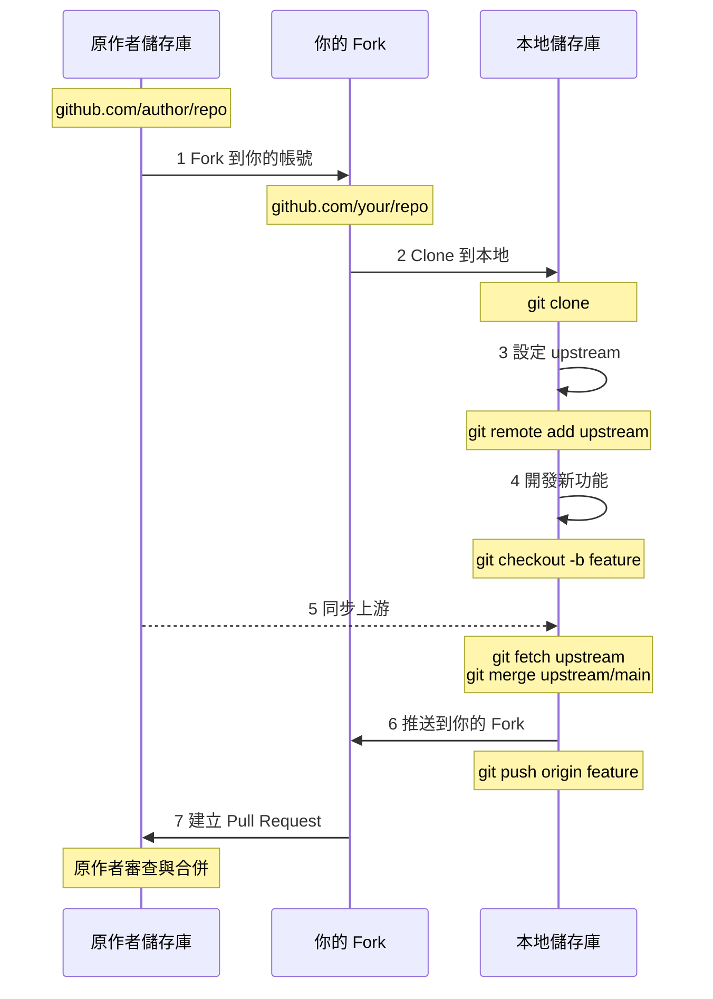

---
head:
  - - meta
    - name: author
      content: 許恩綸
  - - meta
    - name: keywords
      content: Git,fork,upstream,同步分支,pull request,開源貢獻
  - - meta
    - property: og:title
      content: Git Fork 完全指南：同步上游、Pull Request 實戰流程
  - - meta
    - property: og:description
      content: 詳解 GitHub Fork 後續操作，包含設定 upstream、同步原作者更新、Pull Request 流程、開源專案貢獻指南
  - - meta
    - property: og:type
      content: article
  - - meta
    - property: og:image
      content: https://lucashsu95.github.io/LucasHsu.dev/images/git-cover.jpg
---

# Git Fork

>  📝 TL;DR：Fork 就像「開分店」或「創建平行世界」，把別人的專案複製一份到你的 GitHub。流程：Fork  Clone  設定 upstream  開發  同步上游  Push  Pull Request。關鍵咒語：`git remote add upstream <原作者 URL>` + `git fetch upstream` + `git merge upstream/main`。記住：Origin 是你的分店、Upstream 是總公司！

##  前置知識
- 了解 Git 基本指令（clone、push、pull）
- 有 GitHub 帳號
- 參考：[Git Clone](./git-clone.md)、[Git Branch](./git-branch.md)

##  Fork 工作流程圖



 **生活化比喻**：
- **Fork** = 加盟開分店（複製總公司的作法）
- **Upstream** = 總公司（定期要去學習新菜色）
- **Origin** = 你的分店（你有完全控制權）
- **Pull Request** = 向總公司提案「我研發了新菜色，要不要加入菜單？」

##  完整操作步驟

### 第一步：Fork 專案

1. 進入原作者的 GitHub 儲存庫
2. 點擊右上角的 **Fork** 按鈕
3. 選擇你的帳號（會複製到 `github.com/你的帳號/專案名稱`）

 **小技巧**：Fork 是「一鍵複製整個專案」，包含所有歷史記錄！

---

### 第二步：Clone 到本地

```bash
# Clone 你的 Fork（不是原作者的）
git clone https://github.com/你的帳號/專案.git
cd 專案
```

 **常見錯誤**：很多人會 Clone 原作者的，這樣就無法推送變更！一定要 Clone 自己的 Fork。

---

### 第三步：設定 upstream（重要！）

```bash
# 新增原作者的遠端（命名為 upstream）
git remote add upstream https://github.com/原作者帳號/專案.git

# 驗證遠端設定
git remote -v
```

**輸出：**
```
origin    https://github.com/你的帳號/專案.git (fetch)
origin    https://github.com/你的帳號/專案.git (push)
upstream  https://github.com/原作者帳號/專案.git (fetch)
upstream  https://github.com/原作者帳號/專案.git (push)
```

**名詞解釋：**
- `origin`：你的 Fork（你的分店）
- `upstream`：原作者的儲存庫（總公司）

 **記憶口訣**：Origin 我能推、Upstream 只能拉！

---

### 第四步：開發新功能

```bash
# 確保在最新的 main 分支
git checkout main
git pull origin main

# 建立功能分支
git checkout -b feature/add-login

# 開發與提交
# ... 編輯檔案 ...
git add .
git commit -m "feat: 新增使用者登入功能"
```

 **最佳實踐**：一定要開新分支！別在 main 上直接改，否則 main 會很亂。

---

### 第五步：同步上游更新（關鍵！）

```bash
# 1. 取得原作者的最新變更
git fetch upstream

# 2. 切換到 main 分支
git checkout main

# 3. 合併上游的 main 到本地 main
git merge upstream/main

# 4. 推送更新到你的 Fork
git push origin main

# 5. 更新你的功能分支
git checkout feature/add-login
git merge main
```

 **踩雷警告**：定期同步可避免衝突！建議每次開發前都執行一次，否則你的程式碼可能會「太舊」導致 PR 無法合併。

 **比喻**：就像分店要定期去總公司學習新菜色，否則菜單會過時！

---

### 第六步：推送到你的 Fork

```bash
# 推送功能分支到你的 Fork
git push origin feature/add-login
```

---

### 第七步：建立 Pull Request

1. 進入你的 Fork（`github.com/你的帳號/專案`）
2. GitHub 會自動偵測新分支，顯示 **Compare & pull request** 按鈕
3. 填寫 PR 標題與說明：
   ```
   標題：feat: 新增使用者登入功能
   
   說明：
   ## 變更內容
   - 實作 JWT 認證
   - 新增登入表單驗證
   - 單元測試覆蓋率 85%
   
   ## 測試方式
   1. 執行 `npm test`
   2. 手動測試登入流程
   
   ## 相關 Issue
   Closes #123
   ```
4. 點擊 **Create pull request**

 **小技巧**：好的 PR 描述就像「求職信」，要讓原作者一眼看懂你做了什麼、為什麼這麼做！

##  同步策略對比

### 策略一：Merge（預設）

```bash
git fetch upstream
git merge upstream/main
```

**優點：** 保留完整歷史  
**缺點：** 會產生合併 commit

---

### 策略二：Rebase（進階）

```bash
git fetch upstream
git rebase upstream/main
```

**優點：** 線性歷史，更乾淨  
**缺點：** 重寫歷史，衝突處理較複雜

**何時用 Rebase？**
-  功能分支尚未推送
-  想要保持線性歷史
-  了解 rebase 風險

 **新手建議**：先用 Merge，等熟悉後再學 Rebase！

##  Pull Request 最佳實踐

### 1. 好的 PR 標題

```
 好：feat: 新增使用者登入功能
 好：fix: 修復購物車計算錯誤
 好：docs: 更新 API 文件

 壞：更新
 壞：修改檔案
 壞：fix bug
```

**遵循 [Conventional Commits](https://www.conventionalcommits.org/)：**
- `feat:`：新功能
- `fix:`：錯誤修復
- `docs:`：文件更新
- `refactor:`：重構
- `test:`：測試
- `chore:`：雜項

---

### 2. 好的 PR 描述

```markdown
## 變更內容
簡述做了什麼改動

## 為什麼需要這個變更？
說明動機與背景

## 如何測試？
1. 執行測試指令
2. 手動測試步驟

## 截圖（如適用）


## 相關 Issue
Closes #123
Related to #456
```

 **記住**：好的 PR 描述 = 節省審查者的時間 = 更快被合併！

---

### 3. Code Review 回應

當原作者要求修改時：

```bash
# 1. 在你的功能分支修改
git checkout feature/add-login
# ... 編輯檔案 ...
git add .
git commit -m "fix: 修正 code review 意見"

# 2. 推送到 Fork
git push origin feature/add-login
```

GitHub 會自動更新 PR，無需重新建立。

 **小技巧**：回應 Code Review 時要保持禮貌和耐心，就算對方說你的 code 很爛也要笑著改（？）

##  實戰練習

### 練習 1（簡單）
Fork 任意 GitHub 專案，Clone 到本地，設定 upstream 並驗證。

:::details 參考答案
```bash
# 1. 在 GitHub 上 Fork 專案（例如 facebook/react）
# 點擊 Fork 按鈕

# 2. Clone 你的 Fork
git clone https://github.com/你的帳號/react.git
cd react

# 3. 設定 upstream
git remote add upstream https://github.com/facebook/react.git

# 4. 驗證遠端設定
git remote -v

# 應顯示：
# origin    https://github.com/你的帳號/react.git (fetch)
# origin    https://github.com/你的帳號/react.git (push)
# upstream  https://github.com/facebook/react.git (fetch)
# upstream  https://github.com/facebook/react.git (push)

# 5. 取得上游最新狀態
git fetch upstream
git branch -a
# 應顯示 upstream/main 等分支
```
:::

### 練習 2（簡單）
同步上游的 main 分支到你的本地與 Fork。

:::details 參考答案
```bash
# 1. 確保在 main 分支
git checkout main

# 2. 取得上游更新
git fetch upstream

# 3. 合併上游 main 到本地 main
git merge upstream/main

# 4. 推送到你的 Fork
git push origin main

# 驗證：查看 log
git log --oneline -5
# 應包含上游最新的 commits
```
:::

### 練習 3（中等）
建立一個功能分支，同步上游後推送，並模擬建立 PR 的流程（不實際建立）。

:::details 參考答案與思路
```bash
# 1. 確保 main 是最新的
git checkout main
git fetch upstream
git merge upstream/main
git push origin main

# 2. 建立功能分支
git checkout -b feature/improve-readme

# 3. 修改 README.md
echo "\n## 新增章節\n這是我的貢獻" >> README.md
git add README.md
git commit -m "docs: 改進 README 說明"

# 4. 同步上游（避免衝突）
git fetch upstream
git merge upstream/main

# 5. 解決衝突（如有）
# ... 編輯衝突檔案 ...
# git add .
# git commit -m "merge: 解決衝突"

# 6. 推送到你的 Fork
git push origin feature/improve-readme

# 7. 模擬建立 PR
echo "========== PR 資訊 =========="
echo "標題：docs: 改進 README 說明"
echo ""
echo "描述："
echo "## 變更內容"
echo "- 新增使用指南章節"
echo "- 修正錯字"
echo ""
echo "## 測試方式"
echo "檢查 README.md 格式是否正確"
echo "============================="

# 實際操作：
# 1. 進入 GitHub 你的 Fork
# 2. 會看到 "Compare & pull request" 按鈕
# 3. 填寫上述資訊後建立 PR
```

**思路：**
1. 先同步 main 到最新狀態
2. 建立功能分支
3. 開發與提交
4. 再次同步（避免推送時衝突）
5. 推送到 Fork
6. 在 GitHub 上建立 PR

 **重點**：開發前後都要同步，確保你的程式碼是基於「最新版本」！

**進階：自動化腳本**
```bash
#!/bin/bash

branch_name=$1
commit_msg=$2

if [[ -z $branch_name || -z $commit_msg ]]; then
    echo "用法：$0 <分支名稱> <commit 訊息>"
    exit 1
fi

# 同步上游
git fetch upstream
git checkout main
git merge upstream/main
git push origin main

# 建立功能分支
git checkout -b "$branch_name"
echo " 已建立分支：$branch_name"
echo "請修改檔案後執行 git add 和 git commit"
```
:::

##  FAQ

### Q: Fork 後原作者更新了，如何同步？
```bash
git fetch upstream
git checkout main
git merge upstream/main
git push origin main
```

 **建議**：每週至少同步一次，避免「版本差太多」導致衝突！

### Q: 我的 PR 被拒絕了怎麼辦？
1. **閱讀原作者的回饋**：了解拒絕原因
2. **修改程式碼**：在原分支修改並推送
3. **回應評論**：說明修改內容
4. **保持禮貌**：尊重維護者的決定

 **心態調整**：PR 被拒不代表你的 code 爛，可能只是「不符合專案方向」！

### Q: 可以在 main 分支直接開發嗎？
**不建議**。原因：
-  main 用於同步上游，保持乾淨
-  功能分支便於管理多個 PR
-  若 PR 被拒，main 分支會混亂

**正確流程：** 永遠在功能分支開發。

### Q: Upstream 與 Origin 的差異？
- **Origin（你的 Fork）**：你有寫入權限，可 push
- **Upstream（原作者）**：只有讀取權限，只能 fetch

 **記憶口訣**：Origin 我家、Upstream 別人家（只能參觀不能亂動）！

##  延伸閱讀
- [GitHub Docs: Fork 專案](https://docs.github.com/en/get-started/quickstart/fork-a-repo)
- [GitHub Docs: 建立 Pull Request](https://docs.github.com/en/pull-requests/collaborating-with-pull-requests/proposing-changes-to-your-work-with-pull-requests/creating-a-pull-request-from-a-fork)
- [Conventional Commits](https://www.conventionalcommits.org/) - commit 訊息規範
- [如何貢獻開源專案](https://opensource.guide/how-to-contribute/)

##  總結
1. Fork 複製專案到你的 GitHub，Clone 到本地開發（開分店概念）。
2. 設定 upstream（`git remote add upstream <URL>`）追蹤原作者（總公司）。
3. 定期同步上游（`git fetch upstream` + `git merge upstream/main`），避免版本過時。
4. 在功能分支開發，推送後建立 Pull Request（向總公司提案）。
5. 遵循 Conventional Commits 與專案貢獻指南（尊重原作者的規則）。

**最後一句話**：Fork 就是「在開源世界開分店」，你可以自由改造，但別忘了定期向總公司學習新技術，最後還能把你的創新成果分享回去！這就是開源社群的美好循環！
