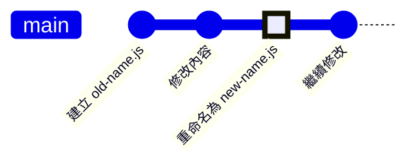

---
outline: "deep"
head:
  - - meta
    - name: author
      content: 許恩綸
  - - meta
    - name: keywords
      content: Git,git log,commit歷史,git blame,git show,格式化輸出
  - - meta
    - property: og:title
      content: Git Log 完全指南：查詢 Commit 歷史與檔案追蹤
  - - meta
    - property: og:description
      content: 詳解 git log 進階用法，包含格式化輸出、圖形化顯示、檔案歷史追蹤、git blame 與 git show 實戰應用
  - - meta
    - property: og:type
      content: article
  - - meta
    - property: og:image
      content: https://lucashsu95.github.io/LucasHsu.dev/images/git-cover.jpg
---

# Git Log

>  📝 TL;DR：`git log` 是「時光相簿」，紀錄所有 commit 歷史（或說是犯罪紀錄？）。常用選項：`--oneline`（一行簡潔版）、`--graph`（畫出家譜圖）、`--follow`（追蹤改名檔案）。查看特定檔案用 `git log -- <file>`、查看「誰寫的這行爛 code」用 `git blame`、查看「某次 commit 改了什麼」用 `git show`。考古必備神器！

## 開場情境：追查神秘 Bug 的起源

**情境：** 週一早上，PM 說「登入頁面的 Logo 怎麼消失了？」你檢查程式碼，發現 `` 變成了 ``。

**你想知道：**
1. 是誰改的？
2. 什麼時候改的？
3. 為什麼要這樣改？

**這時 `git log` 就是你的時光機！**

```bash
# 1. 查看這個檔案的修改歷史
git log --oneline -- src/components/Header.vue
```

**輸出：**
```
a1b2c3d fix: 修復 RWD 問題
e4f5g6h feat: 新增深色模式
i7j8k9l refactor: 重構 Header 組件  ← 可疑！
```

```bash
# 2. 查看「重構 Header」這個 commit 的詳細內容
git show i7j8k9l
```

**輸出：**
```diff
-  
+    ← 找到兇手了！
```

```bash
# 3. 查看是誰 commit 的
git show -s --format="%an <%ae>" i7j8k9l
```

**輸出：**
```
實習生小明 <ming@example.com>
```

**🎯 真相大白！** 小明在重構時不小心把 `logoUrl` 刪掉了。

💡 **這個情境展示了：**
- `git log -- <file>` 找出「哪些 commits 改了這個檔案」
- `git show <hash>` 查看「這個 commit 到底改了什麼」
- `git show -s --format` 查看「是誰 commit 的」

##  前置知識
- 了解 Git commit 概念
- 知道基本 Git 指令（add、commit）
- 參考：[Git Commit](./git-commit.md)

##  基本用法

### 1. 標準輸出

```bash
git log
```

**輸出範例：**
```
commit 1234abc5678def (HEAD -> main, origin/main)
Author: Lucas Hsu <lucas@example.com>
Date:   Tue Dec 25 14:30:00 2023 +0800

    feat: 新增使用者登入功能
    
    - 實作 JWT 認證
    - 新增登入表單驗證
    - 單元測試覆蓋率 85%

commit 9876fed5432cba
Author: Mary Chen <mary@example.com>
Date:   Mon Dec 24 10:15:22 2023 +0800

    fix: 修復購物車計算錯誤
```

 **生活化比喻**：就像「畢業紀念冊」，記錄著每個人（commit）的大頭照、自我介紹和幹過的事！

---

### 2. 簡潔模式（最常用）

```bash
git log --oneline
```

**輸出範例：**
```
1234abc (HEAD -> main) feat: 新增使用者登入功能
9876fed fix: 修復購物車計算錯誤
5555aaa docs: 更新 README
3333bbb refactor: 重構資料庫連線邏輯
```

**一行顯示：前 7 碼 hash + 訊息標題**

 **重點**：99% 的情況用 `--oneline` 就夠了，清爽又快速！

---

### 3. 圖形化顯示分支 

```bash
git log --oneline --graph --all
```

**輸出範例：**
```
* 1234abc (HEAD -> main) feat: 新增登入功能
| * 5678def (feature/cart) feat: 購物車功能
|/  
* 9876fed fix: 修復計算錯誤
* 5555aaa docs: 更新文件
```

 **比喻**：就像「家譜圖」，可以看出誰是主線、誰是分支、哪裡合併了！

---

##  限制輸出範圍

### 1. 顯示最近 N 筆

```bash
# 最近 3 筆
git log -3
# 或
git log -n 3

# 最近 10 筆，簡潔模式
git log --oneline -10
```

---

### 2. 時間範圍 

```bash
# 最近 2 週
git log --since="2 weeks ago"

# 特定日期後
git log --since="2023-12-01"

# 特定日期區間
git log --since="2023-12-01" --until="2023-12-25"

# 最近 3 天
git log --since="3 days ago"
```

 **使用時機**：月底要寫「工作日誌」時超好用，一行指令就能生成這個月的所有 commits！

---

### 3. 作者篩選 

```bash
# 特定作者
git log --author="Lucas"

# 多個作者（正則表達式）
git log --author="Lucas\|Mary"

# 排除特定作者
git log --author="^(?!.*bot).*$"
```

 **小技巧**：用這個找出「某個實習生到底 commit 了什麼東西」超方便（誤）！

---

### 4. 訊息關鍵字 

```bash
# 包含特定關鍵字
git log --grep="fix"

# 多個關鍵字（OR）
git log --grep="fix\|feat"

# 多個關鍵字（AND）
git log --grep="fix" --grep="login" --all-match
```

---

##  查詢特定檔案歷史

### 方法一：基本檔案歷史

```bash
# 查看特定檔案的所有 commit
git log -- path/to/file.txt

# 簡潔模式
git log --oneline -- src/App.vue
```

---

### 方法二：追蹤重命名/移動（重要！）

```bash
# 使用 --follow 追蹤檔案改名
git log --follow -- path/to/file.txt
```

**為什麼需要 `--follow`？**



-  `git log -- new-name.js`：只顯示重命名後的 commits
-  `git log --follow -- new-name.js`：顯示完整歷史（含改名前）

 **重點**：檔案改名不代表歷史消失！用 `--follow` 就能「穿越時空」追蹤完整身世！

---

### 方法三：查看變更內容

```bash
# 顯示每個 commit 的 diff
git log -p -- path/to/file.txt

# 簡化 diff（只顯示變更統計）
git log --stat -- src/utils.js
```

**輸出範例：**
```
commit 1234abc
Author: Lucas Hsu
Date:   Tue Dec 25 14:30:00 2023

    feat: 新增工具函式

 src/utils.js | 15 ++++++++++++---
 1 file changed, 12 insertions(+), 3 deletions(-)
```

---

### 方法四：單字層級差異

```bash
# 顯示單字差異（適合文件）
git log -p --word-diff -- README.md
```

---

##  進階功能

### 1. git show - 查看特定 Commit 內容

```bash
# 查看特定 commit 的完整資訊
git show 1234abc

# 只查看某個 commit 中特定檔案的內容
git show 1234abc:path/to/file.txt

# 查看上一個 commit
git show HEAD~1
```

 **比喻**：就像「翻開某一頁日記」，看看那天寫了什麼！

---

### 2. git blame - 查看每行作者（追兇神器）

```bash
# 顯示檔案每行的作者、日期、commit
git blame path/to/file.txt
```

**輸出範例：**
```
1234abc5 (Lucas Hsu 2023-12-25 14:30:00 +0800  1) function calculateTotal() {
9876fed4 (Mary Chen  2023-12-24 10:15:22 +0800  2)   return items.reduce((sum, item) =>
1234abc5 (Lucas Hsu 2023-12-25 14:30:00 +0800  3)     sum + item.price, 0
9876fed4 (Mary Chen  2023-12-24 10:15:22 +0800  4)   );
1234abc5 (Lucas Hsu 2023-12-25 14:30:00 +0800  5) }
```

**進階選項：**
```bash
# 顯示特定行範圍
git blame -L 10,20 file.txt

# 忽略空白變更
git blame -w file.txt

# 顯示 email
git blame -e file.txt
```

 **警告**：`git blame` 直譯是「追究責任」，但請別真的拿來「抓戰犯」XD 用來追蹤程式碼來源才是正途！

---

### 3. 格式化輸出 

```bash
# 自訂格式（hash + 作者 + 訊息）
git log --pretty=format:"%h - %an: %s"
# 輸出：
# 1234abc - Lucas Hsu: feat: 新增登入功能
# 9876fed - Mary Chen: fix: 修復計算錯誤

# 常用格式變數：
# %h  - 簡短 hash
# %H  - 完整 hash
# %an - 作者名稱
# %ae - 作者 email
# %ad - 作者日期
# %s  - commit 訊息標題
# %b  - commit 訊息內容
```

**實用範例：產生 Changelog**
```bash
git log --pretty=format:"- %s (%an, %ad)" --date=short --since="1 month ago"
```

輸出：
```
- feat: 新增登入功能 (Lucas Hsu, 2023-12-25)
- fix: 修復計算錯誤 (Mary Chen, 2023-12-24)
- docs: 更新文件 (John Doe, 2023-12-20)
```

 **超實用**：自動產生「本月工作成果」或「專案更新日誌」，老闆看了都說讚！

---

### 4. 統計資訊 

```bash
# 顯示變更統計
git log --stat

# 簡短統計
git log --shortstat

# 每個作者的 commit 數量
git shortlog -sn
```

---

##  實用指令組合

### 組合 1：美化的分支圖

```bash
git log --oneline --graph --all --decorate --abbrev-commit
```

**可設定為別名：**
```bash
git config --global alias.lg "log --oneline --graph --all --decorate"
# 使用：git lg
```

 **小技巧**：把常用的長指令設成別名，打字省時又省力！

**更多實用別名：**
```bash
# 最近 10 筆 commits 的精美圖
git config --global alias.l10 "log --oneline --graph --decorate -10"

# 查看今天的 commits
git config --global alias.today "log --since='00:00:00' --all --oneline"

# 查看我的 commits
git config --global alias.my "log --author='你的名字' --oneline"
```

---

### 組合 2：查看昨天的 commits

```bash
git log --since="yesterday" --oneline
```

**更多時間範圍：**
```bash
# 今天
git log --since="00:00:00" --oneline

# 這週
git log --since="last monday" --oneline

# 最近 7 天
git log --since="7 days ago" --oneline

# 12 月的 commits
git log --since="2023-12-01" --until="2023-12-31" --oneline
```

---

### 組合 3：找出誰刪除了某行程式碼

```bash
# 先用 blame 找出行號，假設是第 15 行被刪除
git log -p -S"function oldFunction()" -- file.js
```

`-S` 搜尋新增/刪除特定文字的 commits。

 **使用時機**：當你發現「某個函式不見了」，用這招找出「誰刪的、為什麼刪」！

**實戰範例：**
```bash
# 情境：找出「誰刪了 calculateTotal 函式」
git log -p -S"function calculateTotal" -- src/utils.js

# 輸出會顯示所有「新增或刪除這段文字」的 commits
# 找到紅色 - 的那個 commit，就是刪除它的兇手！
```

---

### 組合 4：製作「本週工作報告」（超實用！）

**情境：** 週五下班前，主管要你寫「本週做了什麼」。

```bash
#!/bin/bash

echo "# 本週工作報告"
echo "> $(date -d 'last monday' +%Y-%m-%d) ~ $(date +%Y-%m-%d)"
echo ""

# 你的 commits
git log --author="$(git config user.name)" \
        --since="last monday" \
        --pretty=format:"- %ad：%s" \
        --date=short

echo ""
echo ""
echo "## 統計"

# Commit 數量
commits=$(git log --author="$(git config user.name)" --since="last monday" --oneline | wc -l)
echo "- 總 Commits：$commits"

# 變更行數
git log --author="$(git config user.name)" \
        --since="last monday" \
        --shortstat | grep "files changed" | \
        awk '{files+=$1; inserted+=$4; deleted+=$6} END {print "- 變更檔案："files"\\n- 新增行數："inserted"\\n- 刪除行數："deleted}'
```

**輸出範例：**
```markdown
# 本週工作報告
> 2026-01-06 ~ 2026-01-10

- 2026-01-10：feat: 新增使用者登入功能
- 2026-01-09：fix: 修復購物車計算錯誤
- 2026-01-08：docs: 更新 API 文件
- 2026-01-07：refactor: 重構資料庫連線
- 2026-01-06：test: 新增單元測試

## 統計
- 總 Commits：5
- 變更檔案：23
- 新增行數：456
- 刪除行數：123
```

 **超實用**：每週五下班前跑一次，自動產生給主管看！

---

### 組合 5：查看「某個功能」的完整開發歷史

**情境：** 你想回顧「登入功能」是怎麼一步步做出來的。

```bash
# 搜尋 commit 訊息包含「login」或「登入」
git log --grep="login\|登入" --oneline

# 加上變更內容
git log --grep="login\|登入" -p

# 只看統計
git log --grep="login\|登入" --stat
```

---

### 組合 6：找出「大改動」的 commits

**情境：** 專案突然變慢，你懷疑有人做了大規模重構。

```bash
# 找出變更超過 100 行的 commits
git log --all --oneline --shortstat | \
  awk '/^[a-f0-9]+ / {commit=$0} /files changed/ {if ($4+$6 > 100) print commit}'

# 或用腳本
git log --all --oneline --numstat | \
  awk 'NF==3 {plus+=$1; minus+=$2} NF==1 {if (plus+minus>100) print; plus=0; minus=0}'
```

---

### 組合 7：產生「Changelog」（發布前必做！）

**情境：** 要發 v2.0.0，需要產生「這個版本的更新內容」。

```bash
#!/bin/bash

# 從上一個 tag 到現在的所有 commits
last_tag=$(git describe --tags --abbrev=0)

echo "# Changelog"
echo ""
echo "## [$last_tag...HEAD]"
echo ""

# 依類型分組
echo "### ✨ 新功能"
git log $last_tag..HEAD --grep="^feat" --pretty=format:"- %s (%h)" --no-merges
echo ""

echo "### 🐛 Bug 修復"
git log $last_tag..HEAD --grep="^fix" --pretty=format:"- %s (%h)" --no-merges
echo ""

echo "### 📝 文件"
git log $last_tag..HEAD --grep="^docs" --pretty=format:"- %s (%h)" --no-merges
echo ""

echo "### ♻️ 重構"
git log $last_tag..HEAD --grep="^refactor" --pretty=format:"- %s (%h)" --no-merges
echo ""

# 貢獻者
echo "### 👥 貢獻者"
git log $last_tag..HEAD --format='%aN' | sort -u
```

**輸出範例：**
```markdown
# Changelog

## [v1.5.0...HEAD]

### ✨ 新功能
- feat: 新增使用者登入功能 (a1b2c3d)
- feat: 新增深色模式 (e4f5g6h)

### 🐛 Bug 修復
- fix: 修復購物車計算錯誤 (i7j8k9l)
- fix: 修正 RWD 問題 (m1n2o3p)

### 📝 文件
- docs: 更新 API 文件 (q4r5s6t)

### 👥 貢獻者
Lucas Hsu
Mary Chen
John Doe
```

---

### 組合 8：追蹤「效能問題」的引入時間

**情境：** 網站突然變慢，你想知道是哪個 commit 造成的。

```bash
# 找出修改關鍵檔案的 commits
git log --oneline -- src/api/*.js

# 或搜尋「效能相關」的 commits
git log --grep="perf\|slow\|optimize" --oneline

# 查看這些 commits 的詳細內容
git log --grep="perf" -p
```

**進階：用 git bisect 自動化（二分搜尋）**
```bash
# 1. 開始 bisect
git bisect start

# 2. 標記「現在很慢」（bad）
git bisect bad

# 3. 標記「一週前還很快」（good）
git bisect good HEAD~50

# 4. Git 會自動切換到中間的 commit，測試效能
# 如果慢：git bisect bad
# 如果快：git bisect good

# 5. 重複直到找到「第一個變慢的 commit」
# 6. 結束
git bisect reset
```

---

##  實戰練習

### 練習 1（簡單）
查看最近 5 筆 commits 的簡潔歷史，並顯示分支圖。

:::details 參考答案
```bash
git log --oneline --graph -5

# 或包含所有分支
git log --oneline --graph --all -5

# 設定別名方便使用
git config --global alias.l5 "log --oneline --graph -5"
# 之後用：git l5
```

**驗證：**
```bash
# 應該看到類似這樣的輸出：
# * a1b2c3d (HEAD -> main) feat: 最新功能
# * e4f5g6h fix: 修復 bug
# * i7j8k9l docs: 更新文件
# * m1n2o3p refactor: 重構
# * q4r5s6t test: 新增測試
```
:::

---

### 練習 2（簡單）
找出特定檔案 `README.md` 最近一個月的所有修改記錄，包含作者和日期。

:::details 參考答案
```bash
# 方法一：標準格式
git log --since="1 month ago" -- README.md

# 方法二：自訂格式
git log --pretty=format:"%h - %an (%ad): %s" --date=short --since="1 month ago" -- README.md

# 方法三：顯示差異
git log -p --since="1 month ago" -- README.md

# 驗證：顯示 commit 數量
git log --oneline --since="1 month ago" -- README.md | wc -l
```

**實戰技巧：**
```bash
# 只看標題（第一行）
git log --since="1 month ago" --format="%s" -- README.md

# 依作者分組
git log --since="1 month ago" --format="%an" -- README.md | sort | uniq -c
```
:::

---

### 練習 3（中等）
寫一個 Shell 腳本，產生「本週 Changelog」，格式為：`日期 | 作者 | 訊息`。

:::details 參考答案與思路

```bash
#!/bin/bash

echo "📋 本週 Changelog（$(date -d 'last monday' +%Y-%m-%d) ~ $(date +%Y-%m-%d)）"
echo "========================================"
echo ""

# 取得本週的 commits
git log --pretty=format:"%ad | %an | %s" --date=short --since="last monday" --until="now"

echo ""
echo ""
echo "📊 統計資訊："

# 統計本週 commit 數量
commit_count=$(git log --oneline --since="last monday" | wc -l)
echo "總 Commits: $commit_count"

# 統計各類型 commit
echo ""
echo "類型分布："
git log --pretty=format:"%s" --since="last monday" | grep -oE "^(feat|fix|docs|style|refactor|test|chore)" | sort | uniq -c

echo ""
echo "👥 作者貢獻："
git shortlog -sn --since="last monday"
```

**輸出範例：**
```
📋 本週 Changelog（2026-01-06 ~ 2026-01-10）
========================================

2026-01-10 | Lucas Hsu | feat: 新增登入功能
2026-01-09 | Mary Chen | fix: 修復計算錯誤
2026-01-08 | John Doe | docs: 更新 API 文件
2026-01-07 | Lucas Hsu | refactor: 重構資料庫連線
2026-01-06 | Mary Chen | test: 新增單元測試

📊 統計資訊：
總 Commits: 5

類型分布：
      1 docs
      1 feat
      1 fix
      1 refactor
      1 test

👥 作者貢獻：
     2  Lucas Hsu
     2  Mary Chen
     1  John Doe
```

**思路：**
1. 用 `--since="last monday"` 取得本週 commits
2. 用 `--pretty=format` 自訂輸出格式
3. 用 `grep` 提取 commit 類型前綴
4. 用 `shortlog -sn` 統計作者貢獻

 **超實用**：每週五下班前跑一次，自動產生「本週工作成果」給主管看！

**進階：輸出為 Markdown**
```bash
#!/bin/bash

output_file="CHANGELOG_WEEK_$(date +%Y%m%d).md"

cat > "$output_file" << EOF
# Weekly Changelog

> Generated on $(date +"%Y-%m-%d %H:%M:%S")

## Commits

| Date | Author | Message |
| ---- | ------ | ------- |
EOF

git log --pretty=format:"| %ad | %an | %s |" --date=short --since="last monday" >> "$output_file"

echo ""
echo "✅ Changelog 已儲存至：$output_file"

# 自動開啟檔案
code "$output_file"  # 用 VS Code 開啟
```
:::

---

### 練習 4（進階）：製作「貢獻者排行榜」

寫一個腳本，分析整個專案的貢獻者，包含：
- Commits 數量排行
- 程式碼行數貢獻
- 最活躍的時間段
- 最常修改的檔案

:::details 參考答案與思路

```bash
#!/bin/bash

echo "# 🏆 專案貢獻者排行榜"
echo "> 產生時間：$(date '+%Y-%m-%d %H:%M:%S')"
echo ""

# 1. Commits 數量排行
echo "## 📊 Commits 數量排行"
echo ""
echo "| 排名 | 貢獻者 | Commits | 百分比 |"
echo "|------|--------|---------|--------|"

total_commits=$(git log --all --format="%H" | wc -l)
rank=1

git shortlog -sn --all | head -10 | while read count author; do
    percentage=$(echo "scale=1; $count * 100 / $total_commits" | bc)
    echo "| $rank | $author | $count | ${percentage}% |"
    ((rank++))
done

echo ""

# 2. 程式碼行數貢獻
echo "## 📈 程式碼行數貢獻（最近 100 commits）"
echo ""
echo "| 貢獻者 | 新增行數 | 刪除行數 | 淨增長 |"
echo "|--------|----------|----------|--------|"

git log --all --format='%aN' --numstat -100 | \
awk '
  NF==1 {author=$0; next}
  NF==3 {
    added[author]+=$1
    deleted[author]+=$2
  }
  END {
    for (a in added) {
      printf "| %s | %d | %d | %d |\n", a, added[a], deleted[a], added[a]-deleted[a]
    }
  }
' | sort -t'|' -k5 -nr | head -10

echo ""

# 3. 最活躍的時間段
echo "## ⏰ 最活躍的時間段"
echo ""
echo "### 每月 Commits"
echo ""
git log --all --format="%ad" --date=format:"%Y-%m" | sort | uniq -c | tail -12 | \
  awk '{printf "- %s: %d commits\n", $2, $1}'

echo ""
echo "### 每週的哪一天最活躍"
echo ""
git log --all --format="%ad" --date=format:"%u - %A" | sort | uniq -c | sort -nr | \
  awk '{printf "- %s: %d commits\n", $2" "$3, $1}'

echo ""
echo "### 每天的哪個時段最活躍"
echo ""
git log --all --format="%ad" --date=format:"%H" | sort | uniq -c | \
  awk '{
    hour=$2
    count=$1
    if (hour >= 0 && hour < 6) period="深夜 (00-06)"
    else if (hour >= 6 && hour < 12) period="早上 (06-12)"
    else if (hour >= 12 && hour < 18) period="下午 (12-18)"
    else period="晚上 (18-24)"
    
    commits[period]+=$1
  }
  END {
    for (p in commits) print "- "p": "commits[p]" commits"
  }
' | sort -t: -k2 -nr

echo ""

# 4. 最常修改的檔案（熱點檔案）
echo "## 🔥 最常修改的檔案（熱點檔案）"
echo ""
echo "| 排名 | 檔案 | 修改次數 |"
echo "|------|------|----------|"

rank=1
git log --all --format= --name-only | \
  grep -v '^$' | sort | uniq -c | sort -rn | head -20 | \
  while read count file; do
    echo "| $rank | \`$file\` | $count |"
    ((rank++))
  done

echo ""

# 5. 最大的 commits（可能需要拆分）
echo "## ⚠️ 最大的 Commits（建議拆分）"
echo ""
echo "| Hash | 作者 | 日期 | 變更行數 | 訊息 |"
echo "|------|------|------|----------|------|"

git log --all --format="%H|%an|%ad|%s" --date=short --shortstat | \
  awk '
    /^\|/ {
      split($0, a, "|")
      hash=a[1]
      author=a[2]
      date=a[3]
      msg=a[4]
    }
    /files changed/ {
      changes=$4+$6
      if (changes > 200) {
        printf "| %s | %s | %s | %d | %s |\n", 
               substr(hash,1,7), author, date, changes, msg
      }
    }
  ' | head -10

echo ""
echo "---"
echo ""
echo "**產生此報告的指令：**"
echo '```bash'
echo "$0"
echo '```'
```

**輸出範例：**
```markdown
# 🏆 專案貢獻者排行榜
> 產生時間：2026-01-07 15:30:00

## 📊 Commits 數量排行

| 排名 | 貢獻者    | Commits | 百分比 |
| ---- | --------- | ------- | ------ |
| 1    | Lucas Hsu | 145     | 42.5%  |
| 2    | Mary Chen | 98      | 28.7%  |
| 3    | John Doe  | 67      | 19.6%  |

## ⏰ 最活躍的時間段

### 每週的哪一天最活躍
- 3 - Wednesday: 87 commits
- 2 - Tuesday: 76 commits
- 4 - Thursday: 65 commits

### 每天的哪個時段最活躍
- 下午 (12-18): 123 commits
- 早上 (06-12): 98 commits
- 晚上 (18-24): 87 commits
- 深夜 (00-06): 23 commits

## 🔥 最常修改的檔案（熱點檔案）

| 排名 | 檔案           | 修改次數 |
| ---- | -------------- | -------- |
| 1    | `src/App.vue`  | 47       |
| 2    | `package.json` | 32       |
| 3    | `README.md`    | 28       |
```

**思路：**
1. 用 `git shortlog -sn` 統計 commits 數量
2. 用 `git log --numstat` 取得行數統計
3. 用 `--date=format` 格式化日期，統計時間分布
4. 用 `git log --name-only` 找出最常修改的檔案
5. 用 `--shortstat` 找出「大改動」的 commits

**使用範例：**
```bash
chmod +x contributors_report.sh
./contributors_report.sh > CONTRIBUTORS.md

# 查看報告
cat CONTRIBUTORS.md

# 或用 VS Code 開啟
code CONTRIBUTORS.md
```

**進階：產生圖表**
```bash
# 安裝 gnuplot
# 產生 commits 趨勢圖
git log --all --format="%ad" --date=short | sort | uniq -c | \
  awk '{print $2,$1}' > commits_trend.dat

gnuplot << EOF
set terminal png size 800,400
set output 'commits_trend.png'
set xlabel 'Date'
set ylabel 'Commits'
set title 'Commits Trend'
set xdata time
set timefmt "%Y-%m-%d"
set format x "%m/%d"
plot 'commits_trend.dat' using 1:2 with lines title 'Commits'
EOF

echo "✅ 圖表已產生：commits_trend.png"
```

:::

---

##  FAQ

### Q: `git log` 輸出太多怎麼辦？
**方法一：限制數量**
```bash
git log -10  # 只顯示 10 筆
```

**方法二：分頁查看**
```bash
git log | less
# 按 Space 下一頁，q 離開
```

**方法三：簡潔模式**
```bash
git log --oneline
```

---

### Q: 如何找出刪除特定檔案的 commit？
```bash
# 找出刪除 old-file.txt 的 commit
git log --diff-filter=D --summary | grep old-file.txt
```

 **使用時機**：當你發現「某個檔案不見了」，用這招找出「誰刪的、什麼時候刪的」！

---

### Q: `git blame` 顯示的都是同一個人？
可能是大規模重構或格式化（如 Prettier）。使用 `--ignore-rev` 忽略特定 commit：

```bash
# 建立 .git-blame-ignore-revs 檔案
echo "1234abc5678def" > .git-blame-ignore-revs

# 設定 Git 使用此檔案
git config blame.ignoreRevsFile .git-blame-ignore-revs

# 執行 blame
git blame file.txt
```

---

### Q: 如何搜尋程式碼歷史（類似 grep）？
```bash
# 搜尋新增/刪除特定文字的 commits
git log -S"function calculateTotal()" --source --all

# 搜尋變更符合正則的 commits
git log -G"function.*calculate.*" --source --all
```

---

##  延伸閱讀
- [Git Commit](./git-commit.md) - 提交變更指南
- [Git Diff](./git-diff.md) - 比較變更差異
- [Pro Git: 檢視提交的歷史記錄](https://git-scm.com/book/zh-tw/v2/Git-基礎-檢視提交的歷史記錄)
- [Git Pretty Formats](https://git-scm.com/docs/pretty-formats)

---

##  總結
1. `git log` 顯示 commit 歷史，`--oneline` 最常用（簡潔清爽）。
2. `--follow` 追蹤檔案重命名，查詢完整歷史（考古必備）。
3. `git blame` 查看每行作者，適合追蹤程式碼來源（但別拿來抓戰犯）。
4. `git show` 查看特定 commit 內容（翻開某一頁日記）。
5. 善用格式化輸出（`--pretty=format`）產生 Changelog（自動化工作日誌）。

**最後一句話**：`git log` 就是專案的「時光相簿」，記錄著每個 commit 的故事。熟練使用它，就能像福爾摩斯一樣追蹤程式碼的前世今生，找出每個 bug 的「犯罪現場」！
