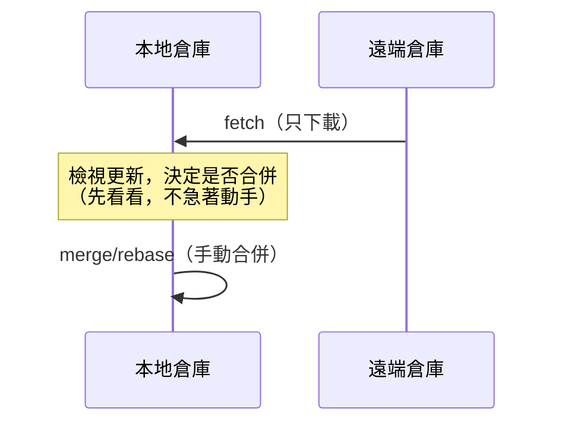
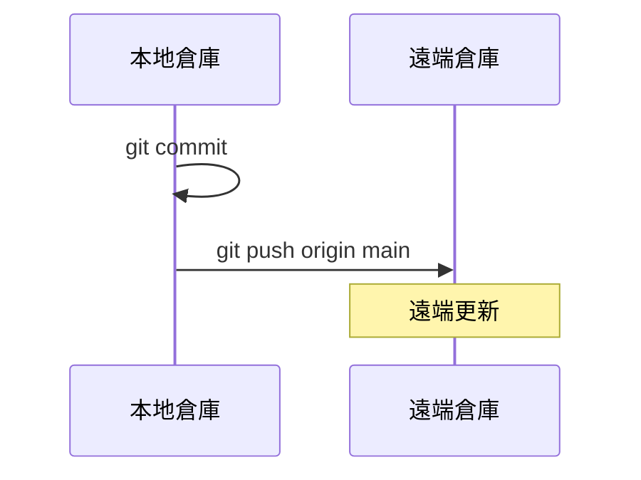

---
outline: deep
head:
  - - meta
    - name: author
      content: 許恩綸
  - - meta
    - name: keywords
      content: git push,git fetch,遠端倉庫,強制推送,分支追蹤,git pull
  - - meta
    - property: og:title
      content: Git Push 與 Fetch 完整教學
  - - meta
    - property: og:description
      content: Git push 推送與 fetch 下載的完整指南,包含遠端設定、強制推送、分支追蹤與常見問題排解
  - - meta
    - property: og:type
      content: article
  - - meta
    - property: og:image
      content: https://lucashsu95.github.io/LucasHsu.dev/images/git-cover.jpg
---

# Git Push 與 Fetch

>  📝 TL;DR：`git fetch` 像是去郵局領包裹但不拆封（下載遠端更新但不合併）；`git push` 是把你的作品寄出去（上傳本地提交到遠端）。首次推送用 `-u` 建立追蹤，之後直接 `push` 就行。Push 失敗通常是遠端有新提交，先 `pull` 再推。強制推送 `-f` 會覆蓋遠端，慎用！

##  前置知識
- 了解本地與遠端倉庫的差異
- 會使用 git add、commit 基本操作
- 知道什麼是分支（branch）

##  Fetch：安全地下載遠端更新

### 為什麼需要 Fetch？

想像你和同事同時在開發：
1. 你在本地寫程式碼
2. 同事推送了新功能到遠端
3. 你想知道他改了什麼，但**還不想立刻合併**（怕爆炸 ）

這時用 `git fetch` 就對了！它像是先把郵件下載到信箱，你可以慢慢看再決定要不要打開。



### 基本用法

```shell
# 下載所有遠端分支的更新（全部都要！）
git fetch origin

# 只下載特定分支（挑食模式）
git fetch origin main

# 下載並清理已刪除的遠端分支（大掃除）
git fetch origin --prune
```

### 檢視剛下載的更新

```shell
# 查看遠端最新提交（偷看一下）
git log origin/main --oneline -5

# 比較本地與遠端差異（看看差多少）
git diff main origin/main

# 查看所有遠端分支（遠端有哪些平行宇宙）
git branch -r
```

##  Push：上傳本地提交到遠端

### 基本語法

```shell
git push <遠端名稱> <本地分支>:<遠端分支>
```

若本地與遠端分支同名，可簡化（懶人模式）：
```shell
git push <遠端名稱> <分支名稱>
```

### 常用範例

```shell
# 推送 main 分支（最常用）
git push origin main

# 推送當前分支（已設定追蹤時，超懶模式）
git push

# 首次推送新分支並建立追蹤（一次搞定）
git push -u origin feature-login
```



##  遠端設定與追蹤

### 查看遠端倉庫

```shell
git remote -v
```

輸出範例：
```
origin  https://github.com/user/repo.git (fetch)
origin  https://github.com/user/repo.git (push)
```

### 新增/刪除遠端倉庫

```shell
# 新增遠端（通常在 git clone 時自動完成，不用管）
git remote add origin https://github.com/user/repo.git

# 修改遠端網址（搬家時用）
git remote set-url origin git@github.com:user/repo.git

# 刪除遠端（分手時用）
git remote remove origin
```

### 設定上游追蹤

首次推送時加上 `-u`（像是設定快速撥號）：
```shell
git push -u origin feature-navbar
```

之後就能直接用（一鍵搞定）：
```shell
git push
git pull
```

##  強制推送（危險操作）

### 何時需要強制推送？

- 用 `git rebase` 或 `git commit --amend` 重寫了歷史
- 本地與遠端歷史分歧，且確定要用本地覆蓋遠端

```shell
# 強制推送（核彈模式，會覆蓋遠端）
git push -f origin main

# 更安全的強制推送（若遠端有新提交會拒絕，救命符）
git push --force-with-lease origin main
```

:::danger  危險！核彈按鈕！
強制推送會**覆蓋遠端歷史**，可能導致：
- 團隊成員的提交消失（被你不小心刪掉）
- 引發合併衝突（大家都來打架）
- 破壞協作（成為全公司公敵）

**只在以下情況使用：**
1. 個人私有分支（只有你在用）
2. 確定無人在使用該分支（確認過了）
3. 已和團隊溝通（通知過大家了）

不然就等著被追殺吧 
:::

##  Fetch vs Pull 的差異

| 指令        | 動作      | 安全性         | 適用情境               |
| ----------- | --------- | -------------- | ---------------------- |
| `git fetch` | 只下載    | 高（安全第一） | 先看看遠端有什麼更新   |
| `git pull`  | 下載+合併 | 中（一次到位） | 確定要立刻合併遠端更新 |

`git pull` 等同於（組合技）：
```shell
git fetch origin
git merge origin/main
```

##  實戰練習

### 練習 1（簡單）
在本地建立 `feature-header` 分支，新增一個檔案，提交後推送到遠端並建立追蹤。

:::details 參考答案
```shell
git checkout -b feature-header
echo "header content" > header.html
git add header.html
git commit -m "feat: add header"
git push -u origin feature-header  # 一次搞定！
```
:::

### 練習 2（簡單）
遠端有新提交，你想先查看內容再決定是否合併。請用 fetch 下載並檢視差異。

:::details 參考答案
```shell
git fetch origin  # 先下載（偷看）
git log origin/main --oneline -5  # 看看有什麼新東西
git diff main origin/main  # 比較差異
# 確認後再合併
git merge origin/main  # OK，可以合併
```
:::

### 練習 3（中等）
你在 `dev` 分支用 `rebase` 整理了提交，但已推送過。現在需要強制推送，但要確保不會覆蓋別人的更新。

:::details 參考答案與思路
```shell
# 1. 先 fetch 確認遠端狀態
git fetch origin

# 2. 檢查遠端是否有新提交
git log dev..origin/dev

# 3. 若無新提交，用 --force-with-lease 推送（救命符）
git push --force-with-lease origin dev

# 4. 若有新提交，先和團隊確認再操作（別當壞人）
```

**思路：**
- `--force-with-lease` 會檢查遠端是否有新提交
- 若有，會拒絕推送（比 `-f` 安全多了）
- 適合個人分支的強制推送
:::

##  FAQ

### Q: Push 失敗顯示「rejected」怎麼辦？
通常是遠端有新提交（別人先推了）。解決方式：
```shell
git pull origin main  # 或 git fetch + git merge
git push origin main  # 再推一次就成功了
```

### Q: Fetch 和 Pull 該用哪個？
- 不確定遠端更新內容：用 `fetch` 先看（安全牌）
- 確定要立刻合併：用 `pull`（快速牌）
- 建議養成先 `fetch` 再 `merge` 的習慣（穩穩的）

### Q: 如何撤銷錯誤的 Push？
若尚未被他人拉取：
```shell
git revert <commit-id>  # 推薦：生成反向提交（溫柔模式）
git push origin main
```

若已被他人拉取，避免用 `reset + push -f`，會影響團隊（變公敵）。

### Q: 推送時要輸入密碼很麻煩？
使用 SSH 金鑰（一勞永逸）：
```shell
# 生成金鑰（若未有）
ssh-keygen -t ed25519 -C "your_email@example.com"

# 將公鑰 (~/.ssh/id_ed25519.pub) 加到 GitHub/GitLab
# 改用 SSH 網址
git remote set-url origin git@github.com:user/repo.git
```

##  延伸閱讀
- [git-branch.md](./git-branch.md) - 分支管理
- [git-commit.md](./git-commit.md) - 提交訊息規範
- [GitHub SSH 設定](https://docs.github.com/en/authentication/connecting-to-github-with-ssh)

##  總結
1. `fetch` 只下載不合併，安全檢視遠端更新（先看再說）。
2. `push` 上傳本地提交，首次用 `-u` 建立追蹤（設定快速撥號）。
3. Push 失敗通常因遠端有新提交，先 `pull` 再推（別急）。
4. 強制推送 `-f` 會覆蓋遠端，`--force-with-lease` 較安全（救命符）。
5. 推薦流程：`fetch`  檢視差異  `merge`  `push`（穩穩的）。

掌握 Push 與 Fetch，你就是遠端同步大師！