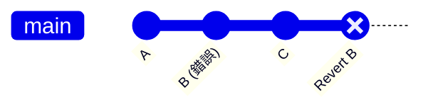
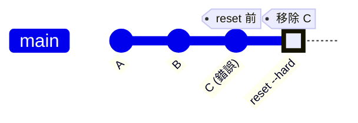
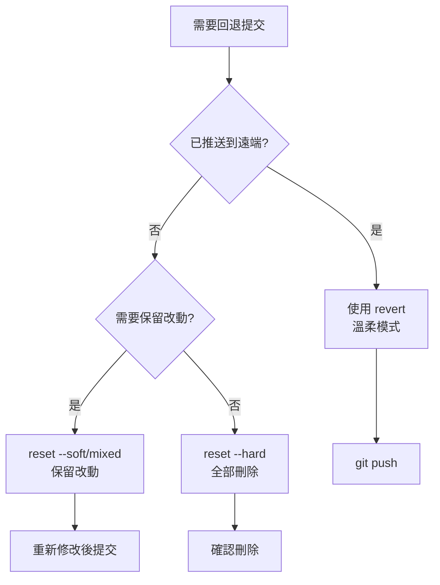

---
outline: deep
head:
  - - meta
    - name: author
      content: 許恩綸
  - - meta
    - name: keywords
      content: git revert,git reset,撤銷提交,回退版本,安全回退
  - - meta
    - property: og:title
      content: Git Revert vs Reset 安全回退指南
  - - meta
    - property: og:description
      content: 詳解 git revert 與 reset 差異,包含使用情境、安全性比較、批量回退與常見問題排解
  - - meta
    - property: og:type
      content: article
  - - meta
    - property: og:image
      content: https://lucashsu95.github.io/LucasHsu.dev/images/git-cover.jpg
---

# Git Revert vs Reset

>  📝 TL;DR：`git revert` 生成反向提交，保留歷史，適合已推送的提交（溫柔模式）；`git reset` 重寫歷史，適合本地未推送的提交（狠心模式）。批量回退用 `revert <old>..<new>`。回退後記得 `push`。要反悔時，先找溫柔的 revert，真的沒辦法再考慮狠心的 reset！

##  前置知識
- 了解 Git 提交歷史的概念
- 會使用 git log 查看提交記錄
- 知道什麼是 commit、HEAD

##  為什麼需要回退？

常見情境（都是血淚史）：
- 錯誤的功能已推送到遠端（糟糕！）
- 某個提交導致 bug（誰寫的！...是我）
- 想暫時移除某些改動以便測試（先拿掉看看）

**錯誤做法**：直接刪除程式碼再提交（無法追溯，跳進火坑）  
**正確做法**：用 Git 工具安全回退（優雅地後退 ）

##  Revert：生成反向提交

### 運作原理

`revert` 會建立一個**新的提交**，內容是「撤銷」指定提交的改動。就像拍電影的倒帶鏡頭，但原片還在 



歷史記錄：`A  B  C  Revert B`（B 仍存在，只是被反向了）

### 基本用法

```shell
# 回退單個提交（取消這個錯誤）
git revert <commit-id>

# 回退最近一次提交（剛剛那個不要了）
git revert HEAD

# 回退但不自動提交（我想自己寫訊息）
git revert --no-commit <commit-id>
```

### 批量回退

```shell
# 回退從 old_commit 到 new_commit 之間的所有提交
git revert --no-commit <old_commit>..<new_commit>
git commit -m "Revert changes from X to Y"
git push origin main
```

範例：
```shell
# 假設有提交 A  B  C  D  E
# 想回退 C、D、E（這三個都有問題）

git log --oneline -5
# e5f6g7h (HEAD) E
# d4e5f6g D
# c3d4e5f C
# b2c3d4e B
# a1b2c3d A

git revert --no-commit b2c3d4e..e5f6g7h
git commit -m "Revert changes C to E"
```

##  Reset：重寫歷史

### 運作原理

`reset` 會**移動 HEAD 指針**，改變提交歷史。就像用橡皮擦把歷史擦掉（危險！）



歷史記錄：`A  B`（C 被完全移除，消失了）

### 三種模式

| 模式              | 影響範圍               | 使用情境                     |
| ----------------- | ---------------------- | ---------------------------- |
| `--soft`          | 只移動 HEAD            | 保留改動在暫存區，可重新提交 |
| `--mixed`（預設） | HEAD + 暫存區          | 保留改動在工作區，需重新 add |
| `--hard`          | HEAD + 暫存區 + 工作區 | **完全刪除改動**，謹慎使用！ |

### 基本用法

```shell
# 回退到上一個提交（保留改動在暫存區，溫柔模式）
git reset --soft HEAD~1

# 回退到上一個提交（保留改動在工作區，普通模式）
git reset --mixed HEAD~1

# 回退並完全刪除改動（核彈模式！）
git reset --hard HEAD~1

# 回退到指定提交
git reset --hard <commit-id>
```

:::danger  危險！核彈按鈕！
`--hard` 會**永久刪除**未提交的改動！  
使用前請確認：
1. 已備份重要程式碼（存好了嗎？）
2. 確定不需要這些改動（真的不要了？）
3. 該分支無人使用（只有我在用吧？）

不然就等著後悔莫及 
:::

##  Revert vs Reset 比較

| 特性         | Revert               | Reset            |
| ------------ | -------------------- | ---------------- |
| 歷史記錄     | 保留（新增反向提交） | 重寫（刪除提交） |
| 安全性       | 高（溫柔模式）       | 低（狠心模式）   |
| 已推送的提交 | 推薦                 | 避免             |
| 團隊協作     | 安全                 | 危險             |
| 追蹤性       | 可追溯               | 無法追溯         |

### 決策樹



##  實戰練習

### 練習 1（簡單）
你在本地做了一個錯誤提交（未推送），想回退但保留程式碼以便修改。

:::details 參考答案
```shell
# 查看提交歷史
git log --oneline -3

# 回退到上一個提交，改動保留在工作區（還能改）
git reset --mixed HEAD~1

# 或用 --soft 保留在暫存區（已經 add 好了）
git reset --soft HEAD~1

# 修改後重新提交
git add .
git commit -m "fix: correct implementation"
```
:::

### 練習 2（簡單）
已推送的提交有問題，需要安全回退。

:::details 參考答案
```shell
# 查看要回退的提交
git log --oneline -5

# 假設要回退 abc1234
git revert abc1234

# 編輯器會打開，填寫回退原因
# 儲存後自動建立反向提交

# 推送到遠端
git push origin main
```
:::

### 練習 3（中等）
需要回退最近 3 個提交（已推送），但想合併成一個 revert 提交。

:::details 參考答案與思路
```shell
# 1. 查看提交歷史
git log --oneline -5
# e5f6g7h (HEAD) third commit
# d4e5f6g second commit
# c3d4e5f first commit
# b2c3d4e good commit

# 2. 批量回退（不自動提交）
git revert --no-commit b2c3d4e..e5f6g7h

# 3. 檢視暫存區
git status

# 4. 統一提交
git commit -m "Revert: rollback last 3 commits due to bug"

# 5. 推送
git push origin main
```

**思路：**
- `--no-commit` 讓多個 revert 合併成一個提交
- 範圍用 `<old>..<new>` 指定（不包含 old）
- 統一的提交訊息更清楚（一目了然）
:::

---

##  FAQ

### Q: 誤用 reset --hard 刪除了改動，能救回嗎？
可能可以！Git 有垃圾回收機制，短時間內可用 `reflog` 找回（救命符）：
```shell
git reflog  # 找到刪除前的 commit-id
git reset --hard <commit-id>  # 穿越回去
```

### Q: Revert 一個 merge commit 怎麼做？
需要指定父提交：
```shell
git revert -m 1 <merge-commit-id>
```
`-m 1` 表示保留主線（通常是 main），刪除合併進來的分支。

### Q: Reset 後能再 Push 嗎？
- 若**尚未推送**：直接 push（沒問題）
- 若**已推送**：需 `push -f`（危險！會影響他人，小心被追殺）

### Q: 多人協作時不小心 reset 了公開分支？
立即通知團隊，請大家：
```shell
git fetch origin
git reset --hard origin/main  # 同步到遠端狀態
```
未來避免在公開分支用 reset（別再犯了）。

##  延伸閱讀
- [git-commit.md](./git-commit.md) - Commit 訊息規範
- [git-branch.md](./git-branch.md) - 分支管理
- [Pro Git: Undoing Things](https://git-scm.com/book/en/v2/Git-Basics-Undoing-Things)

##  總結
1. **Revert**：生成反向提交，保留歷史，適合已推送的提交（溫柔模式 ）。
2. **Reset**：重寫歷史，適合本地未推送的提交（狠心模式 ）。
3. 批量回退用 `revert --no-commit <old>..<new>`（一次處理多個）。
4. `--hard` 會永久刪除改動，謹慎使用（核彈按鈕不要亂按）。
5. 多人協作優先用 revert，避免破壞他人歷史（當個好隊友）。

掌握 Revert 和 Reset，你就是時光機駕駛員！