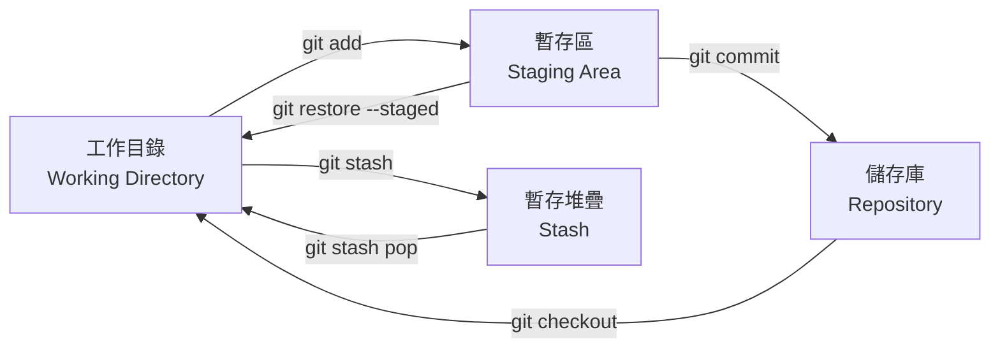
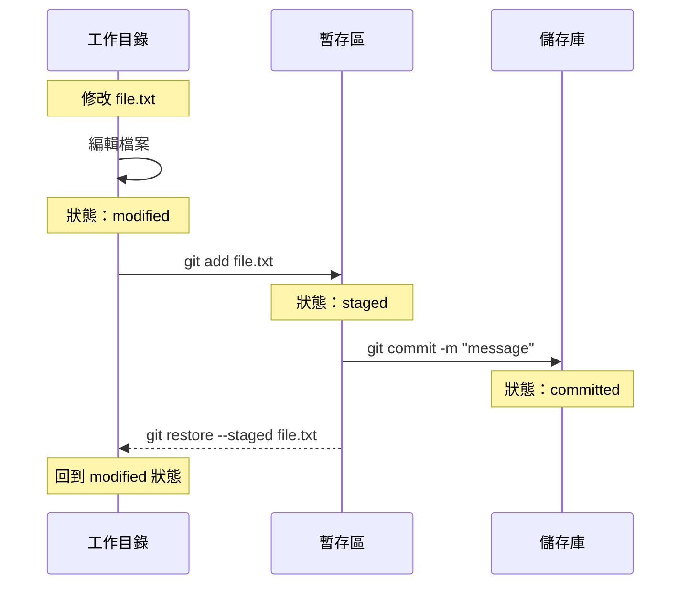

---
head:
  - - meta
    - name: author
      content: 許恩綸
  - - meta
    - name: keywords
      content: Git,staging area,git add,git restore,git stash,暫存區
  - - meta
    - property: og:title
      content: Git 暫存區完全指南：工作流程、指令與實戰
  - - meta
    - property: og:description
      content: 深入理解 Git 暫存區（Staging Area）與工作目錄，詳解 git add、restore、stash 指令，附流程圖與練習題
  - - meta
    - property: og:type
      content: article
---

# Git 暫存區

>  **TL;DR**：Git 有三個區域：工作目錄（你改檔案的地方）、暫存區（準備上台表演的後台）、儲存庫（正式演出的舞台）。`git add` 把演員送到後台、`git restore --staged` 叫演員回休息室、`git stash` 是「先把道具藏起來」的緊急按鈕。理解暫存區 = 掌握 Git 的靈魂！

##  前置知識
- 已安裝 Git 並初始化儲存庫（`git init`）
- 了解基本 Git 概念（commit、branch）
- 會使用 `git status` 查看狀態

##  Git 三大區域



### 區域說明

| 區域 | 英文名稱 | 狀態 | 指令 |
|------|---------|------|------|
| **工作目錄** | Working Directory | 修改檔案的地方 | 編輯器操作 |
| **暫存區** | Staging Area / Index | 準備提交的檔案 | `git add` |
| **儲存庫** | Repository | 已提交的歷史記錄 | `git commit` |
| **暫存堆疊** | Stash | 臨時儲存的變更 | `git stash` |

 **生活化比喻**：
- **工作目錄** = 排練室（你在這裡練習、修改）
- **暫存區** = 後台化妝間（準備上台的演員在這裡）
- **儲存庫** = 正式舞台（演出已經被觀眾看到，無法反悔）
- **Stash** = 道具室（臨時藏東西的地方）

##  工作流程圖



##  核心指令詳解

### 1. git add - 加入暫存區（送演員進後台）

#### 基本用法

```bash
# 加入單一檔案
git add file1.txt

# 加入多個檔案
git add file1.txt file2.txt

# 加入整個目錄（含子目錄）
git add src/

# 加入當前目錄所有變更
git add .

# 互動式加入（逐一選擇）
git add -p file.txt
```

#### 實戰範例：部分加入

```bash
# 假設你修改了 3 個檔案
# 修改：src/App.vue（功能A）
# 修改：src/utils.js（功能B）
# 修改：README.md（文件更新）

# 只提交功能A
git add src/App.vue
git commit -m "feat: 新增功能A"

# 稍後再提交功能B
git add src/utils.js
git commit -m "feat: 新增功能B"

# 最後提交文件
git add README.md
git commit -m "docs: 更新README"
```

**為什麼分批提交？**
-  每個 commit 只做一件事（原子性）
-  易於追蹤與回退
-  Code Review 更清晰

 **小技巧**：把 commit 想像成「拍照留念」，每張照片只拍一個主題比較好找！

---

### 2. git restore - 取消變更（演員不想演了）

#### 移出暫存區（不刪除修改）

```bash
# 將檔案從暫存區移出，但保留工作目錄的修改
git restore --staged file.txt

# 移出所有暫存檔案
git restore --staged .
```

**效果：**
```
Before: file.txt (modified + staged)
After:  file.txt (modified only)
```

#### 捨棄工作目錄的修改

```bash
# 捨棄檔案的所有修改（危險！）
git restore file.txt

# 捨棄所有修改
git restore .
```

 **踩雷警告**：`git restore file.txt`（無 `--staged`）會**永久刪除**工作目錄的修改！就像演員直接忘詞回家，無法復原！

---

### 3. git status - 查看狀態（檢查後台人員）

```bash
git status
```

**輸出範例：**
```
On branch main
Changes to be committed:
  (use "git restore --staged <file>..." to unstage)
        modified:   src/App.vue          # 已暫存（在後台準備中）

Changes not staged for commit:
  (use "git add <file>..." to update what will be committed)
  (use "git restore <file>..." to discard changes in working directory)
        modified:   README.md             # 未暫存（還在排練室）

Untracked files:
  (use "git add <file>..." to include in what will be committed)
        config.json                       # 未追蹤（新人還沒報到）
```

---

### 4. git stash - 暫存變更（緊急藏道具）

#### 基本用法

```bash
# 暫存所有未提交的變更（含暫存區）
git stash

# 暫存並加上訊息
git stash save "WIP: 功能開發到一半"

# 包含未追蹤檔案
git stash -u

# 包含忽略檔案
git stash -a
```

#### Stash 管理

```bash
# 查看 stash 清單
git stash list
# 輸出：
# stash@{0}: WIP on main: 1234abc 功能A
# stash@{1}: WIP on feature: 5678def 功能B

# 恢復最新的 stash（並刪除）
git stash pop

# 恢復特定 stash（並刪除）
git stash pop stash@{1}

# 恢復 stash（不刪除）
git stash apply stash@{0}

# 刪除特定 stash
git stash drop stash@{0}

# 清空所有 stash
git stash clear
```

#### 實戰情境：緊急切換分支

```bash
# 情境：你在 feature 分支開發到一半，突然要切到 main 修 bug

# 1. 暫存當前工作
git stash save "WIP: 功能X開發到一半"

# 2. 切換到 main 分支
git checkout main

# 3. 修復 bug 並提交
git add bugfix.js
git commit -m "fix: 修復XXX問題"

# 4. 回到 feature 分支
git checkout feature

# 5. 恢復之前的工作
git stash pop
```

 **生活化比喻**：`git stash` 就像「把桌上的文件先收進抽屜」，等等回來再拿出來繼續做！

##  git diff - 查看差異（檢查演員改了什麼妝）

```bash
# 工作目錄 vs 暫存區
git diff

# 暫存區 vs 最後一次 commit
git diff --staged
# 或
git diff --cached

# 工作目錄 vs 最後一次 commit
git diff HEAD
```

**視覺化對比：**


##  實戰練習

### 練習 1（簡單）
建立一個 Git 儲存庫，修改 3 個檔案，只將其中 2 個加入暫存區並提交。

:::details 參考答案
```bash
# 1. 初始化儲存庫
mkdir git-practice && cd git-practice
git init

# 2. 建立 3 個檔案
echo "內容1" > file1.txt
echo "內容2" > file2.txt
echo "內容3" > file3.txt

# 3. 首次提交
git add .
git commit -m "init: 初始提交"

# 4. 修改 3 個檔案
echo "修改1" >> file1.txt
echo "修改2" >> file2.txt
echo "修改3" >> file3.txt

# 5. 只暫存 2 個檔案
git add file1.txt file2.txt

# 6. 查看狀態
git status
# 應看到 file1.txt、file2.txt 在 staged
# file3.txt 在 not staged

# 7. 提交
git commit -m "update: 更新檔案1和2"

# 8. 驗證
git log --oneline
git status  # file3.txt 仍是 modified
```

 **重點**：成功做到「選擇性提交」，file3.txt 還在排練室等待下次演出！
:::

### 練習 2（簡單）
使用 `git stash` 暫存變更，切換分支後再恢復。

:::details 參考答案
```bash
# 1. 在 main 分支修改檔案
echo "新功能" >> feature.txt
git status  # 應顯示 modified

# 2. 暫存變更
git stash save "WIP: 新功能開發"

# 3. 驗證工作目錄乾淨
git status  # 應顯示 nothing to commit

# 4. 切換到其他分支
git checkout -b test-branch

# 5. 回到 main
git checkout main

# 6. 恢復變更
git stash pop

# 7. 驗證
git status  # feature.txt 應顯示 modified
cat feature.txt  # 應包含 "新功能"
```

 **小技巧**：stash 就像「暫停鍵」，隨時按下、隨時繼續！
:::

### 練習 3（中等）
寫一個 Shell 腳本，自動化「檢查未暫存變更  提示使用者  加入暫存區  提交」流程。

:::details 參考答案與思路

```bash
#!/bin/bash

echo " 檢查 Git 狀態..."

# 檢查是否有未暫存的變更
if [[ -n $(git status --porcelain) ]]; then
    echo " 偵測到以下變更："
    git status --short
    
    echo ""
    read -p "是否要暫存所有變更？(y/n): " answer
    
    if [[ $answer == "y" ]]; then
        # 顯示變更內容
        git diff
        
        echo ""
        read -p "確認後請輸入 commit 訊息: " message
        
        if [[ -n $message ]]; then
            git add .
            git commit -m "$message"
            echo " 提交成功！"
            git log -1 --oneline
        else
            echo " Commit 訊息不可為空"
            exit 1
        fi
    else
        echo " 已取消操作"
    fi
else
    echo " 工作目錄乾淨，無需提交"
fi
```

**思路：**
1. 用 `git status --porcelain` 檢查是否有變更（輸出為空表示乾淨）
2. 顯示變更摘要（`git status --short`）
3. 詢問使用者是否繼續
4. 顯示詳細差異（`git diff`）
5. 輸入 commit 訊息後執行 `git add` + `git commit`
6. 驗證訊息非空，避免空白 commit

**進階：加入分支檢查**
```bash
current_branch=$(git branch --show-current)
if [[ $current_branch == "main" ]]; then
    read -p " 你在 main 分支，確定要提交嗎？(y/n): " confirm
    [[ $confirm != "y" ]] && exit 0
fi
```
:::

##  FAQ

### Q: `git add .` 和 `git add -A` 的差異？
- `git add .`：加入當前目錄的新增/修改/刪除檔案
- `git add -A`：加入整個儲存庫的所有變更（包含上層目錄）

**建議：**在專案根目錄用 `git add .` 即可。

### Q: 不小心 `git add` 錯檔案怎麼辦？
```bash
# 移出特定檔案
git restore --staged wrong-file.txt

# 移出所有暫存檔案
git restore --staged .
```

 **記住**：`--staged` 就是「從後台叫回排練室」的魔法咒語！

### Q: `git stash` 會暫存未追蹤檔案嗎？
預設**不會**。需加上 `-u` 參數：
```bash
git stash -u
```

### Q: 如何查看 stash 的內容？
```bash
# 查看最新 stash 的差異
git stash show -p

# 查看特定 stash
git stash show -p stash@{1}
```

##  延伸閱讀
- [Git Commit](./git-commit.md) - 提交變更到儲存庫
- [Git Diff](./git-diff.md) - 比較變更差異
- [Pro Git: 記錄變更](https://git-scm.com/book/zh-tw/v2/Git-基礎-記錄變更到版本庫)

##  總結
1. Git 有三大區域：工作目錄、暫存區、儲存庫（還有一個 stash 道具室）。
2. `git add` 加入暫存區，可選擇性暫存部分檔案（超彈性）。
3. `git restore --staged` 移出暫存區（保留修改），小心別漏掉 `--staged`！
4. `git stash` 臨時儲存變更，適合緊急切換分支（程式設計師的暫停鍵）。
5. 理解暫存區是掌握 Git 工作流程的關鍵（就像理解舞台劇的後台運作）。

**最後一句話**：暫存區就是 Git 的「化妝間」，演員（檔案）上台前一定要先在這裡準備好，才能有完美的演出（commit）！
