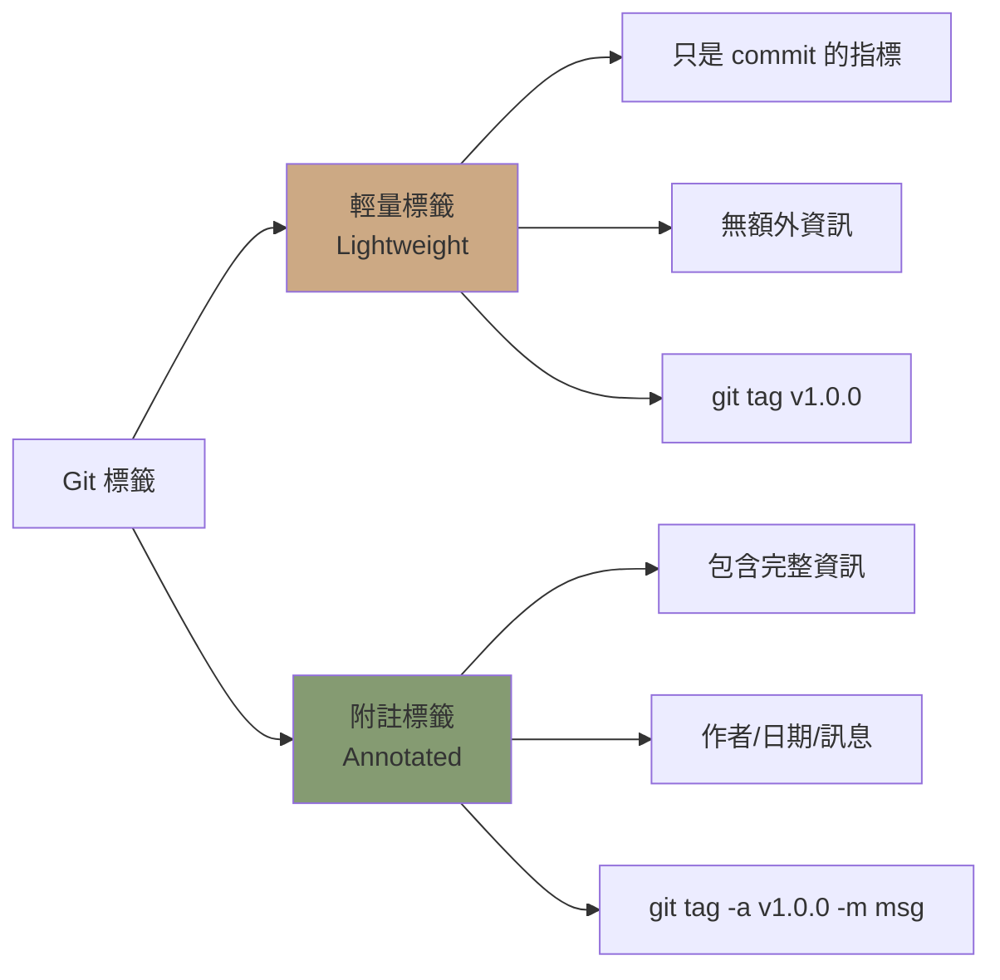
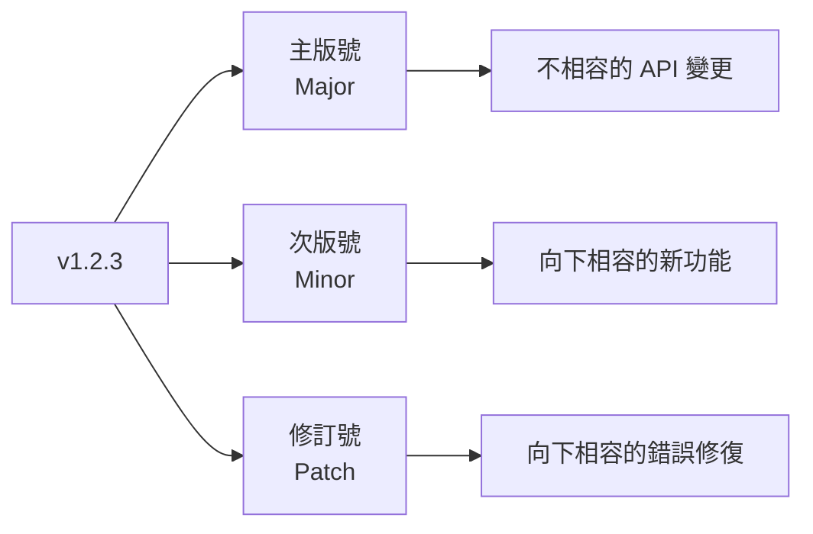

---
head:
  - - meta
    - name: author
      content: 許恩綸
  - - meta
    - name: keywords
      content: Git,git tag,版本標籤,輕量標籤,附註標籤,語意化版本
  - - meta
    - property: og:title
      content: Git Tag 完全指南：版本標籤管理與語意化版本
  - - meta
    - property: og:description
      content: 詳解 git tag 指令，包含輕量標籤 vs 附註標籤差異、語意化版本規範、標籤推送與刪除實戰
  - - meta
    - property: og:type
      content: article
  - - meta
    - property: og:image
      content: https://lucashsu95.github.io/LucasHsu.dev/images/git-cover.jpg
---

# Git Tag 

> 📝 TL;DR：Git 標籤（Tag）就像「遊戲存檔點」或「里程碑」，用來標記重要版本（如 v1.0.0）。兩種類型：輕量標籤（lightweight）只是便利貼、附註標籤（annotated）是正式紀念碑（含作者/日期/訊息）。建議發布版本用附註標籤（`git tag -a v1.0.0 -m "message"`）。標籤需單獨推送（`git push origin <tag-name>`），不會跟著 commit 自動上傳！

##  前置知識
- 了解 Git commit 與分支
- 知道基本 Git 指令（push、pull）
- 參考：[Git Push](./git-push.md)

##  標籤類型比較



### 比較表

| 特性     | 輕量標籤（Lightweight） | 附註標籤（Annotated）         |
| -------- | ----------------------- | ----------------------------- |
| 建立指令 | `git tag v1.0.0`        | `git tag -a v1.0.0 -m "訊息"` |
| 包含資訊 | 只有 commit hash        | 作者、日期、訊息、GPG 簽名    |
| 適用情境 | 臨時標記、本地測試      | **正式發布版本**（推薦）      |
| 可否修改 | 只能刪除重建            | 只能刪除重建                  |
| 大小     | 小（幾 bytes）          | 大（完整物件）                |

 **生活化比喻**：
- **輕量標籤** = 便利貼（隨手貼、隨手撕）
- **附註標籤** = 正式紀念碑（刻上名字、日期、事蹟）

**最佳實踐：** 正式發布用附註標籤，可追蹤發布者與時間。

##  建立標籤

### 1. 輕量標籤（Lightweight Tag）

```bash
# 在當前 commit 建立標籤
git tag v1.0.0

# 在特定 commit 建立標籤
git tag v0.9.0 1234abc
```

 **注意**：輕量標籤只是「便利貼」，適合臨時標記，不適合正式發布！

### 2. 附註標籤（Annotated Tag）- 推薦 

```bash
# 建立附註標籤（會開啟編輯器）
git tag -a v1.0.0

# 建立附註標籤（直接指定訊息）
git tag -a v1.0.0 -m "正式發布 1.0.0 版本"

# 在特定 commit 建立附註標籤
git tag -a v0.9.0 1234abc -m "Beta 測試版"
```

**附註標籤範例：**
```
tag v1.0.0
Tagger: Lucas Hsu <lucas@example.com>
Date:   Tue Dec 25 14:30:00 2023 +0800

正式發布 1.0.0 版本

新功能：
- 使用者認證系統
- 購物車功能
- 訂單管理

已知問題：
- 無
```

 **小技巧**：附註標籤就像「產品發布會新聞稿」，詳細記錄這個版本的所有資訊！
 
##  查看標籤

### 1. 列出所有標籤

```bash
# 列出所有標籤（按字母排序）
git tag

# 輸出：
# v0.1.0
# v0.2.0
# v1.0.0
```

---

### 2. 篩選標籤 

```bash
# 搜尋符合模式的標籤
git tag -l "v1.*"
# 輸出：
# v1.0.0
# v1.0.1
# v1.1.0

# 搜尋 beta 版本
git tag -l "*beta*"
```

---

### 3. 查看標籤詳細資訊

```bash
# 查看輕量標籤（只顯示 commit）
git show v1.0.0

# 查看附註標籤（顯示標籤資訊 + commit）
git show v1.0.0
```

##  推送標籤到遠端

 **踩雷警告**：**標籤不會自動推送！** `git push` 預設不包含標籤。

### 1. 推送單一標籤

```bash
# 推送特定標籤
git push origin v1.0.0
```

---

### 2. 推送所有標籤

```bash
# 推送所有本地標籤到遠端
git push origin --tags

# 或使用 --follow-tags（只推送附註標籤）
git push --follow-tags
```

 **最佳實踐**：用 `--follow-tags` 只推送附註標籤，避免把臨時標記也推上去！

---

### 3. 自動推送標籤（設定）

```bash
# 設定 push 時自動推送附註標籤
git config --global push.followTags true
```

 **重點**：設定一次，終身受用！之後 `git push` 就會自動推送附註標籤。

##  刪除標籤

### 1. 刪除本地標籤

```bash
# 刪除本地標籤
git tag -d v1.0.0

# 刪除多個標籤
git tag -d v1.0.0 v1.0.1
```

---

### 2. 刪除遠端標籤

```bash
# 方法一：刪除遠端標籤
git push origin --delete v1.0.0

# 方法二：推送空白到遠端標籤
git push origin :refs/tags/v1.0.0
```

 **警告**：刪除遠端標籤要小心，可能會影響其他人的工作！

---

### 3. 批量刪除

```bash
# 刪除本地所有 v1.* 標籤
git tag -l "v1.*" | xargs git tag -d

# 刪除遠端所有 beta 標籤
git tag -l "*beta*" | xargs -n 1 git push origin --delete
```

##  語意化版本規範（SemVer）



### 版本號規則

**格式：`主版號.次版號.修訂號`（`MAJOR.MINOR.PATCH`）**

| 版本號              | 何時增加           | 範例         |
| ------------------- | ------------------ | ------------ |
| **主版號（Major）** | 不相容的 API 變更  | 1.x.x  2.0.0 |
| **次版號（Minor）** | 向下相容的新功能   | 1.2.x  1.3.0 |
| **修訂號（Patch）** | 向下相容的錯誤修復 | 1.2.3  1.2.4 |

**前置版本：**
- `v1.0.0-alpha`：內部測試版
- `v1.0.0-beta`：公開測試版
- `v1.0.0-rc.1`：發布候選版（Release Candidate）

 **記憶口訣**：
- **Major**：大改版（可能要重寫程式）
- **Minor**：新功能（不影響舊程式）
- **Patch**：修 bug（趕快更新）

**範例：**
```bash
git tag -a v1.0.0-beta.1 -m "第一個 Beta 測試版"
git tag -a v1.0.0-rc.1 -m "發布候選版本"
git tag -a v1.0.0 -m "正式發布"
```

##  標籤與分支結合

### 1. 從標籤建立分支

```bash
# 從 v1.0.0 標籤建立 hotfix 分支
git checkout -b hotfix-1.0.1 v1.0.0

# 修復 bug 後
git add .
git commit -m "fix: 修復登入問題"

# 打上新標籤
git tag -a v1.0.1 -m "Hotfix: 修復登入問題"
git push origin hotfix-1.0.1
git push origin v1.0.1
```

 **使用時機**：當 v1.0.0 發布後發現重大 bug，用這招快速發布 v1.0.1 修復版！

---

### 2. 查看標籤對應的 commit

```bash
# 查看標籤指向的 commit hash
git rev-list -n 1 v1.0.0

# 查看標籤所在分支
git branch --contains v1.0.0
```

##  實戰練習

### 練習 1（簡單）
建立一個儲存庫，提交3個 commits，分別打上 `v0.1.0`、`v0.2.0`、`v1.0.0` 附註標籤。

:::details 參考答案
```bash
# 1. 初始化儲存庫
mkdir tag-practice && cd tag-practice
git init

# 2. 第一次提交
echo "版本 0.1" > version.txt
git add version.txt
git commit -m "feat: 初始版本"
git tag -a v0.1.0 -m "初始版本發布"

# 3. 第二次提交
echo "版本 0.2" > version.txt
git add version.txt
git commit -m "feat: 新增功能A"
git tag -a v0.2.0 -m "新增功能A"

# 4. 第三次提交
echo "版本 1.0" > version.txt
git add version.txt
git commit -m "feat: 正式版本"
git tag -a v1.0.0 -m "正式發布 1.0.0"

# 5. 查看所有標籤
git tag

# 6. 查看標籤詳細資訊
git show v1.0.0
```
:::

### 練習 2（簡單）
刪除本地標籤 `v0.1.0`，並確認已刪除。

:::details 參考答案
```bash
# 1. 查看目前標籤
git tag

# 2. 刪除本地標籤
git tag -d v0.1.0

# 3. 確認已刪除
git tag
# 應不再顯示 v0.1.0

# 4. 嘗試查看已刪除的標籤
git show v0.1.0
# 錯誤：fatal: ambiguous argument 'v0.1.0': unknown revision
```
:::

### 練習 3（中等）
寫一個 Shell 腳本，自動化「檢查當前版本  詢問版本類型  產生新版本號  建立標籤」流程。

:::details 參考答案與思路

```bash
#!/bin/bash

# 取得最新標籤
latest_tag=$(git describe --tags --abbrev=0 2>/dev/null || echo "v0.0.0")
echo " 當前版本：$latest_tag"

# 解析版本號（去掉 v 前綴）
version=${latest_tag#v}
IFS='.' read -r major minor patch <<< "$version"

echo ""
echo "請選擇版本類型："
echo "1) Patch (修訂號 +1)：$major.$minor.$((patch+1))"
echo "2) Minor (次版號 +1)：$major.$((minor+1)).0"
echo "3) Major (主版號 +1)：$((major+1)).0.0"
read -p "請輸入選項 (1-3): " choice

case $choice in
    1)
        new_version="$major.$minor.$((patch+1))"
        ;;
    2)
        new_version="$major.$((minor+1)).0"
        ;;
    3)
        new_version="$((major+1)).0.0"
        ;;
    *)
        echo " 無效選項"
        exit 1
        ;;
esac

new_tag="v$new_version"
echo ""
echo " 新版本：$new_tag"
read -p "請輸入標籤訊息: " message

if [[ -z $message ]]; then
    echo " 訊息不可為空"
    exit 1
fi

# 建立附註標籤
git tag -a "$new_tag" -m "$message"

echo " 標籤已建立：$new_tag"
echo ""
read -p "是否推送到遠端？(y/n): " push_remote

if [[ $push_remote == "y" ]]; then
    git push origin "$new_tag"
    echo " 已推送到遠端"
else
    echo " 標籤僅存在本地，請手動推送：git push origin $new_tag"
fi
```

**思路：**
1. 用 `git describe --tags --abbrev=0` 取得最新標籤
2. 解析版本號（用 `IFS='.'` 分割）
3. 根據選擇計算新版本號（patch+1、minor+1、major+1）
4. 建立附註標籤
5. 詢問是否推送到遠端

 **超實用**：自動化版本號管理，再也不用擔心「這次該升哪個號」！

**進階：支援預發布版本**
```bash
read -p "是否為預發布版本？(alpha/beta/rc/n): " prerelease

if [[ $prerelease != "n" ]]; then
    new_tag="v$new_version-$prerelease.1"
fi
```
:::

##  FAQ

### Q: 標籤可以修改嗎？
**不行**。標籤建立後無法修改，只能刪除重建：

```bash
# 刪除舊標籤
git tag -d v1.0.0
git push origin --delete v1.0.0

# 重新建立
git tag -a v1.0.0 -m "新訊息"
git push origin v1.0.0
```

### Q: 如何在 GitHub 上建立 Release？
1. 推送標籤到 GitHub：`git push origin v1.0.0`
2. 進入 GitHub  Releases  Draft a new release
3. 選擇標籤 `v1.0.0`
4. 填寫標題與說明
5. 上傳附件（如編譯好的執行檔）
6. Publish release

### Q: 輕量標籤 vs 附註標籤如何選擇？
- **輕量標籤：** 臨時標記、本地測試、快速實驗
- **附註標籤：** 正式發布、需要追蹤發布者與時間

**建議：** 所有對外發布都用附註標籤。

### Q: 標籤與分支的差異？
- **分支：** 可移動的指標，隨著 commit 前進（活的）
- **標籤：** 固定的指標，永遠指向同一個 commit（死的）

 **比喻**：分支像「行駛中的火車」、標籤像「路邊的里程碑」！

##  延伸閱讀
- [語意化版本規範（SemVer）](https://semver.org/lang/zh-TW/)
- [Git Push](./git-push.md) - 推送標籤到遠端
- [GitHub Docs: 管理 Releases](https://docs.github.com/en/repositories/releasing-projects-on-github)
- [Conventional Commits](https://www.conventionalcommits.org/) - 規範化 commit 訊息

##  總結
1. 標籤用於標記重要版本，分為輕量標籤與附註標籤（正式發布用附註）。
2. 正式發布用附註標籤（`git tag -a v1.0.0 -m "訊息"`），含作者/日期/訊息。
3. 標籤需單獨推送（`git push origin <tag-name>`），不會跟 commit 自動上傳！
4. 遵循語意化版本規範（SemVer）：MAJOR.MINOR.PATCH（大改.新功能.修bug）。
5. 標籤不可修改，只能刪除重建（所以打標籤前要三思）。

**最後一句話**：標籤就是專案的「里程碑」，每個重要版本都該留下紀念！用附註標籤記錄發布時的心情和成果，未來回顧時會很有成就感！
