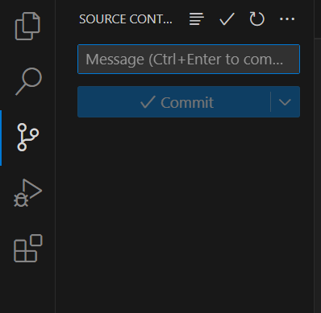

# 初次下載Git

概述: 電腦第一次裝git要做的事

## 檢查電腦有無GIT

官網：https://git-scm.com/

`win + r`然後`cmd` →打git

## 新增USER 和EMAIL

```bash
git config --global user.name 
git config --global user.name "shiwenc85"
git config --global user.email
git config --global user.email "shiwenc85@gmail.com"
```

[https://git-scm.com/book/zh-tw/v2/開始-初次設定-Git](https://git-scm.com/book/zh-tw/v2/%E9%96%8B%E5%A7%8B-%E5%88%9D%E6%AC%A1%E8%A8%AD%E5%AE%9A-Git)

## 檢查有沒有上一個使用者

到認證管理員

找到windows認證

找到 git 看是不是自己

## NEW新增

按綠色按鈕

## 取名字輸入檔名


## 複製(上傳)

### 在要上傳的資料夾上打cmd 進到終端


### 貼上下面這些

```bash
git init
git add .
git commit -m "first commit"
git branch -M main
git remote add origin https://github.com/shiwenc85/your-repo.git
git push -u origin main
```


### 然後在cmd 中 code . 開啟到vsocde/



## 發布網站

