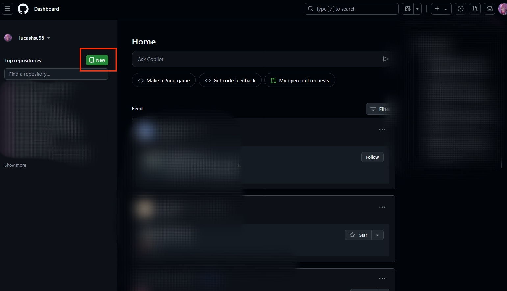
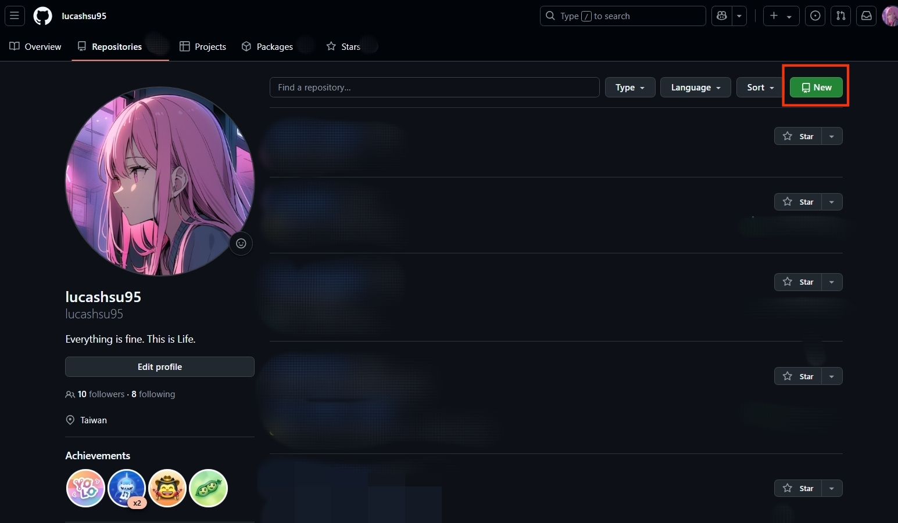
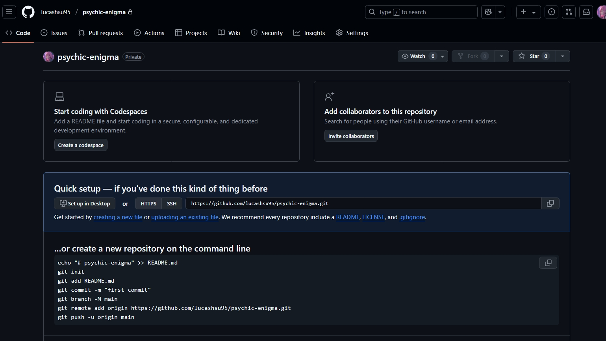
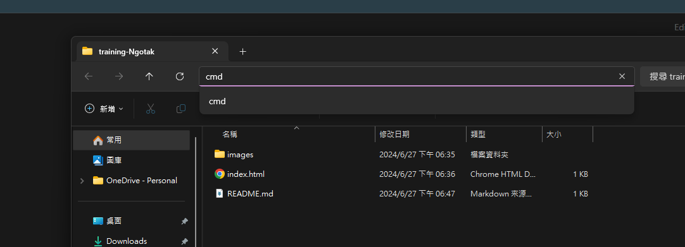
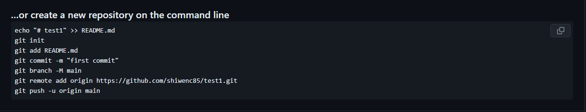
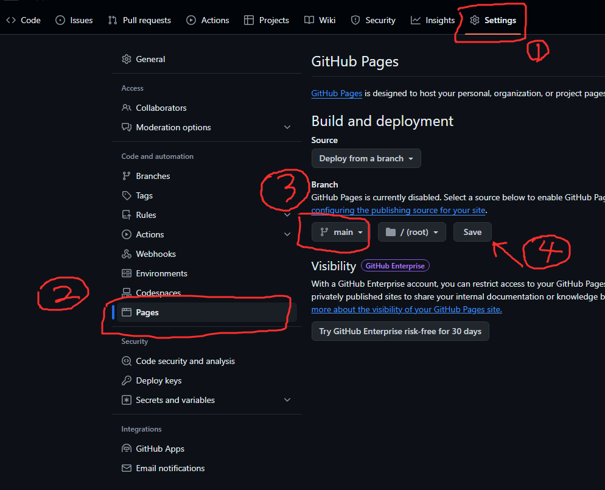

# 初次下載 Git

## 檢查電腦有無GIT

去官網下載：https://git-scm.com/

檢查方法：`win + r`然後`cmd` →打git，如果有跳出很多指令就是已安裝

## 檢查有沒有上一個使用者

到認證管理員

找到windows認證

找到 git 看是不是自己

## 先建立github帳號

- 去[github.com](https://github.com/signup?ref_cta=Sign+up&ref_loc=header+logged+out&ref_page=%2F&source=header-home)官網創建新帳號(如果沒有的話)

## 新增USER 和EMAIL

新增好github帳號之後回到桌面按`win + r`然後`cmd` → 下指令

`<username>`、`<useremail>` 要改成自己github的喔
```bash
git config --global user.name <username>
git config --global user.email <useremail>
```

## 新增repo

回到github 找到綠色按鈕，新增一個儲存庫(repo)



或是找到



### 取名字輸入檔名


### 創件成功

創件成功後會看到這個畫面

可以撰擇 uploading an existing file 上傳現有的檔案

也可以繼續往下做



## 上傳檔案/資料夾

### 在要上傳的資料夾上打cmd 進到終端



### 貼上下面這些

`<username>`、`<your-repo>`要記得改成自己的username和repo名稱
```bash
git init
git add .
git commit -m "first commit"
git branch -M main
git remote add origin https://github.com/<username>/<your-repo>.git
git push -u origin main
```


## 發布網站

