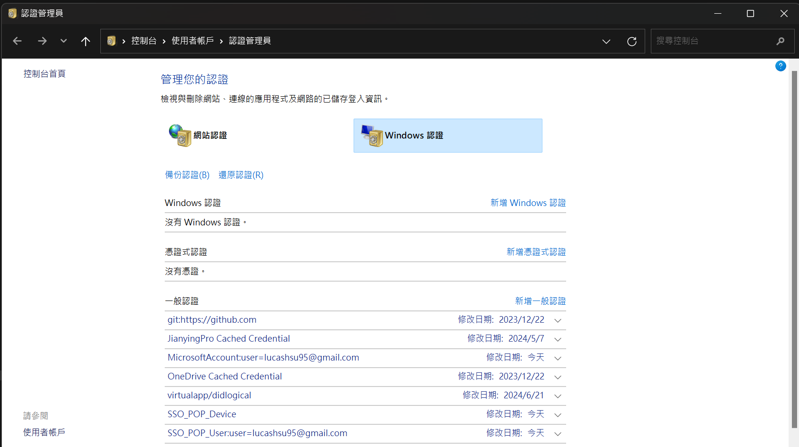

---
head:
  - - meta
    - name: author
      content: 許恩綸
  - - meta
    - name: keywords
      content: git,移除git,刪除git
  - - meta
    - property: og:title
      content: 電腦上移除git
  - - meta
    - property: og:description
      content: 電腦上移除git
  - - meta
    - property: og:type
      content: article
  - - meta
    - property: og:image
      content: ./imgs/git-cover.png
---

# 電腦上移除git

概述: 認證管理員

## **認證管理員**

控制台\使用者帳戶\認證管理員

或

在搜尋列裡直接打**認證管理員**

## Windows認證

找到`git:https://github.com`刪掉它

