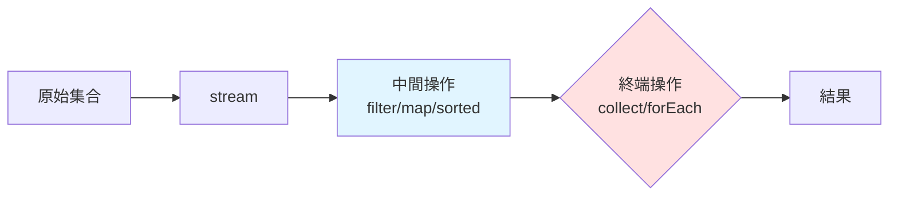

---
head:
  - - meta
    - name: keywords
      content: java stream, stream api, filter, map, collect, reduce, java 8, 函數式程式設計, lambda, 集合操作
  - - meta
    - property: og:title
      content: Java Stream 常見操作完整指南 | LucasHsu.dev
  - - meta
    - property: og:description
      content: 完整解析 Java Stream API filter、map、collect、reduce、sorted 等操作,附流程圖、練習題與常見陷阱。
  - - meta
    - property: og:type
      content: article
  - - meta
    - property: og:image
      content: https://lucashsu95.github.io/LucasHsu.dev/images/java-cover.jpg
  - - meta
    - property: title
      content: Java Stream 常見操作完整指南 | LucasHsu.dev
  - - meta
    - property: description
      content: 完整解析 Java Stream API - filter、map、collect、reduce、sorted 等操作,附流程圖、練習題與常見陷阱。
---

# Java Stream 常見操作完整指南

> 📝 TL;DR Stream 讓集合操作像水管串接: `list.stream().filter().map().collect()`。注意 Stream 只能用一次,終端操作後即失效。

## 前置知識

- 熟悉 Java 集合(List、Set、Map)
- 了解 Lambda 表達式基本語法(`x -> x * 2`)
- 知道何謂函數式程式設計

:::tip 新手友善
不熟 Lambda?先想成「匿名函式」,`x -> x * 2` 等同定義一個「輸入 x,回傳 x*2」的函式。
:::

## 什麼是 Stream?

Stream 是 Java 8 引入的強大工具,讓集合操作更簡潔,類似 Python 的列表推導式。

## 🔹 基本結構

```java
List<Integer> list = Arrays.asList(1, 2, 3, 4, 5);
list.stream()
    .filter(x -> x % 2 == 0)
    .map(x -> x * 10)
    .forEach(System.out::println);
```


## ✅ 常見操作總表（分類 + 範例）

### 🔸 1. 建立 Stream

```java
Stream.of(1, 2, 3);
Arrays.asList(1, 2, 3).stream();
IntStream.range(1, 5);  // 1, 2, 3, 4
```

---

### 🔸 2. `filter`：過濾元素

```java
list.stream().filter(x -> x > 3);
```

---

### 🔸 3. `map`：轉換元素

```java
list.stream().map(x -> x * 2);
```

---

### 🔸 4. `forEach`：對每個元素做事（終端操作）

```java
list.stream().forEach(System.out::println);
```

---

### 🔸 5. `collect`：收集成 List / Set / Map

`collect()` 是 終端操作，用於把 `Stream` 的元素彙整成集合、字串或其他結果。它搭配 `Collectors` 工具類使用，能做各種聚合。以下整理常見且實用的模式。

**基礎收集**
| 用法                           | 說明                | 範例                                                              |
| ------------------------------ | ------------------- | ----------------------------------------------------------------- |
| `Collectors.toList()`          | 收集到 `List`       | `list.stream().collect(Collectors.toList())`                      |
| `Collectors.toSet()`           | 收集到 `Set` (去重) | `list.stream().collect(Collectors.toSet())`                       |
| `Collectors.toCollection(...)` | 自訂集合型別        | `list.stream().collect(Collectors.toCollection(LinkedList::new))` |


::: details 更多計巧
**字串連接**
| 用法                               | 說明                 |
| ---------------------------------- | -------------------- |
| Collectors.joining()               | 直接連接所有元素字串 |
| Collectors.joining(", ")           | 以分隔符連接         |
| Collectors.joining(", ", "[", "]") | 加前後綴             |

```java
List<String> names = Arrays.asList("A","B","C");
String s = names.stream().collect(Collectors.joining(", ", "[", "]"));
// 輸出 [A, B, C]
```

這些都是 `Collectors` 裡面專門做**統計運算**的收集器，用於 `stream.collect(...)` 來一次得到數量、總和、平均等結果。以下逐一解釋並附範例：

---

**統計**

1. `Collectors.summingInt(x -> x)`

計算整數總和。`x -> x` 代表取元素本身，如果是物件可改成 `p -> p.getAge()`。

```java
List<Integer> list = new ArrayList<>(List.of(3, 5 ,7));
int sum = list.stream().collect(Collectors.summingInt(x -> x));
System.out.println(sum);     // 15 (3+5+7)
```

1. `Collectors.averagingInt(x -> x)`

計算平均值，結果型別為 `Double`。

```java
double avg = list.stream().collect(Collectors.averagingInt(x -> x));
System.out.println(avg);     // 5.0
```

3. `Collectors.summarizingInt(x -> x)`

一次取得所有統計資訊，結果型別為 `IntSummaryStatistics`。

```java
IntSummaryStatistics stats =
    list.stream().collect(Collectors.summarizingInt(x -> x));
System.out.println(stats.getCount());   // 3
System.out.println(stats.getSum());     // 15
System.out.println(stats.getMin());     // 3
System.out.println(stats.getAverage()); // 5.0
System.out.println(stats.getMax());     // 7
```

**分組**

| 用法                                                      | 說明                         |
| --------------------------------------------------------- | ---------------------------- |
| `Collectors.groupingBy(keyFn)`                            | 依 key 分組，value 是 `List` |
| `Collectors.groupingBy(keyFn, counting())`                | 分組後計數                   |
| `Collectors.groupingBy(keyFn, mapping(valueFn, toSet()))` | 分組後轉換並收集             |

```java
Map<Integer, List<String>> byLength =
    names.stream().collect(Collectors.groupingBy(String::length));

Map<Integer, Long> countByLength =
    names.stream().collect(Collectors.groupingBy(String::length, Collectors.counting()));
```

**分區 (二分法)**

`partitioningBy(predicate)`
將元素分為 `true` 與 `false` 兩群：
```java
Map<Boolean, List<Integer>> partition =
    list.stream().collect(Collectors.partitioningBy(x -> x % 2 == 0));
```

結果例：
```
true  -> [偶數...]
false -> [奇數...]
```

**轉換成 Map**
| 用法                                          | 說明                   |
| --------------------------------------------- | ---------------------- |
| `toMap(keyFn, valueFn)`                       | 轉成 Map               |
| `toMap(keyFn, valueFn, mergeFn)`              | key 重複時自訂合併規則 |
| `toMap(keyFn, valueFn, mergeFn, mapSupplier)` | 指定 Map 類型          |
```java
Map<String, Integer> map =
    list.stream().collect(Collectors.toMap(Object::toString, x -> x));

Map<String, Integer> map = list.stream()
    .collect(Collectors.toMap(
        x -> "key" + x,
        x -> x * x
    ));
```

**連鎖操作**

`collectingAndThen(downstream, finisher)`
收集後再做一次轉換：
```java
List<String> unmodifiable =
    list.stream().collect(Collectors.collectingAndThen(Collectors.toList(),
                                                       Collections::unmodifiableList));
```

**自訂歸納邏輯**

可傳入三參數版本 `collect(supplier, accumulator, combiner)`
不靠 `Collectors`，完全自訂收集過程：

```java
Set<Integer> set = list.stream()
    .collect(HashSet::new, Set::add, Set::addAll);
```

- supplier：建立容器
- accumulator：累積單個元素
- combiner：合併部分結果（平行流時用）

**記憶法**

- 集合 → `toList`, `toSet`, `toCollection`
- 字串 → `joining`
- 統計 → `counting`, `summingInt`, `averagingInt`, `summarizingInt`
- 分組/分區 → `groupingBy`, `partitio心ningBy`
- Map → `toMap`
- 後處理 → `collectingAndThen`

:::

### 🔸 6. `reduce`：歸納（加總、乘積、累積）

a(累積值)
b(當前元素)
```java
int sum = list.stream().reduce(0, (a, b) -> a + b);
```

### 🔸 7. `sorted`：排序（可加比較器）

**對List做排序**

```java
list.stream().sorted();
list.stream().sorted(Comparator.reverseOrder());
```

**對Map做排序**

```java
map.entrySet().stream()
   .sorted(Map.Entry.comparingByKey())
   .forEach(System.out::println);

// 反排序
map.entrySet().stream()
   .sorted(Map.Entry.comparingByKey(Comparator.reverseOrder()))
   .forEach(System.out::println);

// key 主排序，value 同時相同時才比
map.entrySet().stream()
   .sorted(
       Comparator.comparing(Map.Entry::getKey)      // 先比 key
                 .thenComparing(Map.Entry::getValue) // tie-break 比 value
   )
   .forEach(System.out::println);

// value 主排序，value 相同時才比 key
map.entrySet().stream()
   .sorted(
       Comparator.comparing(Map.Entry::getValue)    // 先比 value
                 .thenComparing(Map.Entry::getKey)  // tie-break 比 key
   )
   .forEach(System.out::println);

// 若要降序，可在主排序加 .reversed()：
Comparator.comparing(Map.Entry::getValue, Comparator.reverseOrder())
          .thenComparing(Map.Entry::getKey)
```


---

### 🔸 8. `distinct`：去重

```java
list.stream().distinct();
```

---

### 🔸 9. `limit` / `skip`：取前幾個 / 跳過前幾個

```java
list.stream().limit(3); // 取前三個
list.stream().skip(2);  // 跳過前兩個
```

---

### 🔸 10. `anyMatch` / `allMatch` / `noneMatch`：條件判斷

```java
list.stream().anyMatch(x -> x > 3);    // 是否有任何一個 > 3 回傳 true
list.stream().allMatch(x -> x > 0);    // 是否全部都 > 0 回傳 true
list.stream().noneMatch(x -> x < 0);   // 是否沒有 < 0 的 回傳 true
```

---

### 🔸 11. `findFirst` / `findAny`：取得第一個 / 任意一個

```java
Optional<Integer> first = list.stream().findFirst();
Optional<Integer> any = list.stream().findAny();
```

---

### 🔸 12. `count`：統計數量

```java
long count = list.stream().filter(x -> x % 2 == 0).count();
```

## 📌 小提醒

* Stream 只能使用一次（終端操作後就不能再用）
* Stream 不會改變原本的集合（除非你手動處理）

## Stream 操作流程圖



## 實戰練習

### 練習 1: 過濾與收集(簡單)⭐

從 `[1,2,3,4,5]` 中篩選偶數並轉成 List。

:::details 💡 參考答案
```java
List<Integer> list = Arrays.asList(1, 2, 3, 4, 5);
List<Integer> evens = list.stream()
    .filter(x -> x % 2 == 0)
    .collect(Collectors.toList());
// 結果: [2, 4]
```
:::

### 練習 2: 轉換與統計(簡單)⭐

將 `["apple","banana","cherry"]` 轉成長度列表,計算總和。

:::details 💡 參考答案
```java
List<String> words = Arrays.asList("apple", "banana", "cherry");
int totalLength = words.stream()
    .mapToInt(String::length)
    .sum();
// 結果: 17 (5+6+6)
```
:::

### 練習 3: 分組與計數(中等)⭐⭐

有一個學生成績列表,依成績分組並計算各組人數:

```java
class Student {
    String name;
    int score;
}
List<Student> students = Arrays.asList(
    new Student("Alice", 85),
    new Student("Bob", 72),
    new Student("Carol", 95)
);
```

要求: 90分以上為 A,70-89為 B,70以下為 C。

:::details 💡 參考答案
```java
Map<String, Long> gradeCount = students.stream()
    .collect(Collectors.groupingBy(
        s -> s.score >= 90 ? "A" : s.score >= 70 ? "B" : "C",
        Collectors.counting()
    ));
// 結果: {A=1, B=2}
```
:::

## FAQ

**Q: Stream 和 for 迴圈哪個快?**  
A: 小數據集差異不大,大數據可用 `parallelStream()` 平行化加速。但可讀性 Stream 更佳。

**Q: 為什麼 Stream 只能用一次?**  
A: 設計理念是「消耗性管道」,終端操作後資源釋放。需多次操作請重新建立 stream。

**Q: collect() 一定要用嗎?**  
A: 終端操作有多種:`collect`(收集)、`forEach`(遍歷)、`reduce`(歸納)等,依需求選擇。

## 延伸閱讀

- [Optional 使用指南](#) - 處理 findFirst/findAny 回傳值
- [平行流性能優化](#) - parallelStream 實戰技巧

## 總結

1. Stream 採用流水線模式:建立→中間操作→終端操作
2. 常用操作:filter(過濾)、map(轉換)、collect(收集)
3. 終端操作後 Stream 失效,需重新建立
4. 善用方法參考(如 `String::length`)提升可讀性