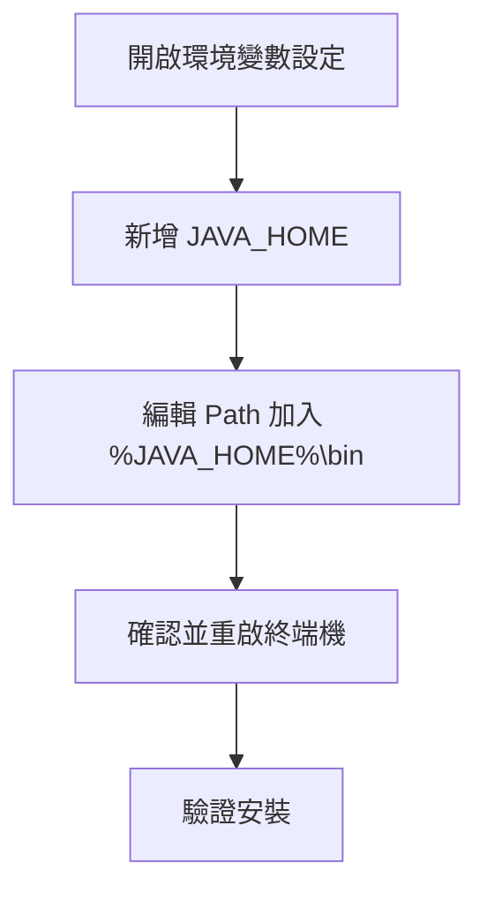

# Java 安裝與環境設定完整指南

> 📝 TL;DR 下載 JDK、設定 JAVA_HOME、驗證 `java -version` 與 `javac -version`、編譯執行 HelloWorld.java。Windows 可用 Chocolatey 快速安裝，Mac 用 Homebrew。

## 前置知識

- 了解命令列（cmd / PowerShell / Terminal）基本操作
- 知道如何設定系統環境變數（或願意跟著步驟學習）

## 什麼是 JDK 和 JRE？

- **JRE（Java Runtime Environment）**：只能執行 Java 程式，一般使用者安裝即可。
- **JDK（Java Development Kit）**：開發者工具包，包含編譯器（`javac`）、除錯工具、JRE 等，開發必裝。

:::warning 重點
要寫 Java 程式必須安裝 JDK，只裝 JRE 無法編譯。
:::

## 安裝 JDK（Windows）

### 方法 1：手動下載安裝

1. 前往 [Oracle JDK 下載頁](https://www.oracle.com/java/technologies/downloads/) 或 [Adoptium（OpenJDK）](https://adoptium.net/)
2. 選擇適合你的版本（推薦 LTS：JDK 11、17、21）
3. 執行安裝檔，建議用預設路徑如 `C:\Program Files\Java\jdk-17`

### 方法 2：用 Chocolatey 快速安裝

```powershell
choco install openjdk17 -y
```

此方式會自動設定環境變數，適合熟悉命令列的使用者。

### 方法 3：Mac/Linux 安裝

**Mac（Homebrew）**：
```bash
brew install openjdk@17
```

**Linux（Ubuntu/Debian）**：
```bash
sudo apt update
sudo apt install openjdk-17-jdk -y
```

## 設定環境變數（Windows 手動安裝適用）

1. 按 `Win + R` → 輸入 `sysdm.cpl` → 進階 → 環境變數
2. 新增系統變數 `JAVA_HOME`，值為 JDK 路徑（例如 `C:\Program Files\Java\jdk-17`）
3. 編輯 `Path` 變數，新增 `%JAVA_HOME%\bin`
4. 確認後重啟命令提示字元



## 驗證安裝

```powershell
java -version
javac -version
```

若顯示版本號表示成功。若提示找不到指令，檢查環境變數設定。

## 第一個 Java 程式：HelloWorld

1. 新增 `HelloWorld.java`：

```java
public class HelloWorld {
    public static void main(String[] args) {
        System.out.println("Hello, Java!");
    }
}
```

2. 編譯與執行：

```bash
javac HelloWorld.java  # 編譯產生 HelloWorld.class
java HelloWorld        # 執行（不需加 .class）
```

## 基礎程式範例

### 輸出

```java
System.out.println("Hello, World!");
System.out.print("不換行");
```

### 輸入

需要 `Scanner` 類別：

```java
import java.util.Scanner;

public class InputExample {
    public static void main(String[] args) {
        Scanner scanner = new Scanner(System.in);
        System.out.print("請輸入你的名字: ");
        String name = scanner.nextLine();
        System.out.println("你好, " + name);
        scanner.close();
    }
}
```

## 實戰練習

### 練習 1：驗證安裝（簡單）

執行 `java -version` 和 `javac -version`，截圖兩者輸出結果。

:::details 答案
確認兩者都顯示版本號且無錯誤訊息即可。
:::

### 練習 2：執行 HelloWorld（簡單）

建立並執行 `HelloWorld.java`，輸出「Hello, Java!」。

:::details 答案
```java
public class HelloWorld {
    public static void main(String[] args) {
        System.out.println("Hello, Java!");
    }
}
```

編譯與執行步驟：
```bash
javac HelloWorld.java
java HelloWorld
```
:::

### 練習 3：輸入與計算（中等）

撰寫程式讀取使用者輸入的兩個整數，輸出它們的和。

:::details 參考答案
```java
import java.util.Scanner;

public class AddNumbers {
    public static void main(String[] args) {
        Scanner sc = new Scanner(System.in);
        System.out.print("輸入第一個數字: ");
        int a = sc.nextInt();
        System.out.print("輸入第二個數字: ");
        int b = sc.nextInt();
        System.out.println("總和: " + (a + b));
        sc.close();
    }
}
```
:::

## FAQ

**Q: JAVA_HOME 與 Path 有什麼差別？**  
A: `JAVA_HOME` 指向 JDK 根目錄，供其他工具查找；`Path` 中的 `%JAVA_HOME%\bin` 讓系統找到 `java` 和 `javac` 指令。

**Q: 為什麼執行 HelloWorld 不用加 .class？**  
A: `java` 命令執行的是類別名稱，而非檔案名稱。編譯器已產生 `HelloWorld.class`，JVM 會自動找到。

**Q: Chocolatey 與手動安裝有何差異？**  
A: Chocolatey 會自動處理環境變數，適合熟悉命令列者；手動安裝需自行設定但更直觀。

## 延伸閱讀

- [什麼是固定簽名](./什麼是固定簽名) - 理解 main 方法格式
- [Java 基本型別與變數](./Integer和int的差別) - 深入型別系統

## 總結

1. 安裝 JDK 後務必設定 `JAVA_HOME` 與 `Path`
2. 用 `javac` 編譯 `.java`，用 `java` 執行類別
3. HelloWorld 是驗證環境的最佳方式
4. Windows 可用 Chocolatey、Mac 用 Homebrew 簡化安裝

:::tip 下一步
環境設定完成後，建議學習 [Java 介面](./java-interface) 與 [Stream 操作](./JavaStream常見的操作)。
:::