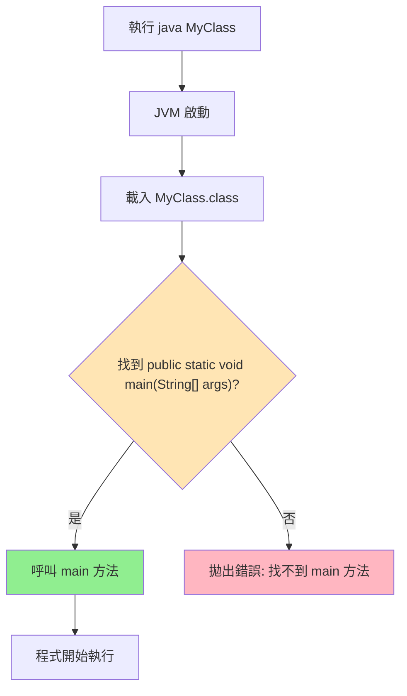

# Java main 方法固定簽名完整解析

> 📝 TL;DR Java 程式入口必須是 `public static void main(String[] args)`，JVM 只認這個簽名，任一部分錯誤都會導致「找不到 main 方法」錯誤。

## 前置知識

- 了解 Java 方法基本結構(修飾符、回傳型別、參數)
- 知道什麼是 JVM(Java 虛擬機)

:::tip 新手友善
不熟方法?沒關係,本文會逐一解釋每個關鍵字的用途。
:::

## 什麼是固定簽名?

**簽名(Signature)** 指方法的完整定義,包括:
- 方法名
- 參數類型與數量
- 回傳型別
- 存取修飾符

## Java main 方法的固定簽名

Java 規定程序的入口點必須是這個**完全相同**的格式：

````java
public static void main(String[] args)
````

## 為什麼是固定的？

**1. JVM 的要求**
- Java 虛擬機（JVM）在啟動程序時會尋找這個**確切的**方法簽名
- 如果簽名不匹配，JVM 就找不到入口點

**2. 錯誤示例**
````java
// ❌ 這些都不會被 JVM 識別為程序入口
public void main(String[] args)          // 缺少 static
public static void main(String args)     // 參數類型錯誤
public static int main(String[] args)    // 返回類型錯誤
public static void Main(String[] args)   // 方法名大小寫錯誤
````

**3. 正確示例**
````java
// ✅ 這些都是有效的 main 方法簽名
public static void main(String[] args)
public static void main(String args[])   // 陣列語法的另一種寫法
public static void main(String... args)  // 可變參數語法
````

## 類比
就像電話號碼格式一樣：
- 電話系統要求特定格式才能撥通
- JVM 要求特定的方法簽名才能啟動程序
- 即使你不使用 `args` 參數，也必須保持這個格式

這就是為什麼即使不使用 `args` 參數，`String[] args` 也必須存在的原因！

## JVM 啟動流程



## 實戰練習

### 練習 1: 找出錯誤簽名（簡單）⭐

以下哪些簽名會導致 JVM 無法啟動？

```java
A. public static void main(String[] args)
B. public void main(String[] args)
C. public static int main(String[] args)
D. public static void Main(String[] args)
E. static public void main(String[] args)
F. public static void main(String args[])
```

:::details 💡 參考答案
**錯誤的：** B、C、D
- B 缺少 `static` - JVM 無法在沒有實例的情況下呼叫
- C 回傳型別錯誤（應為 `void`）- JVM 規定必須是 void
- D 方法名大寫錯誤（必須是 `main`）- Java 區分大小寫

**正確的：** A、E、F
- A 標準寫法 ✅
- E 修飾符順序可調換（`static public` = `public static`）✅
- F 陣列符號位置不同但等價 ✅
:::

### 練習 2: 理解 static 的作用（簡單）⭐

**問題 1：** 為什麼 main 必須是 static？

**問題 2：** 如果去掉 static 會發生什麼？

:::details 💡 參考答案

**答案 1：**
因為 JVM 啟動時尚未建立任何物件實例，`static` 方法可直接透過類別名稱呼叫，無需 `new` 建立物件。

**流程比較：**
```java
// ✅ static 方法 - JVM 可以直接呼叫
public class App {
    public static void main(String[] args) {
        // JVM: App.main(args) - 不需要 new
    }
}

// ❌ 非 static 方法 - JVM 無法呼叫
public class App {
    public void main(String[] args) {
        // JVM 需要: new App().main(args)
        // 但 JVM 啟動時還沒有任何物件！
    }
}
```

**答案 2：**
會拋出錯誤：
```
錯誤: 在類別 App 中找不到 main 方法, 請將 main 方法定義為:
   public static void main(String[] args)
```
:::

### 練習 3: 命令列參數應用（中等）⭐⭐

撰寫程式讀取命令列參數，實作以下功能：
1. 若無參數，輸出「請提供名字作為參數」
2. 若有 1 個參數，輸出「Hello, [名字]」
3. 若有 2 個以上參數，輸出「Hello, [名字 1] 和 [名字 2] 還有其他 N 人」

:::details 💡 參考答案
```java
public class Greeting {
    public static void main(String[] args) {
        if (args.length == 0) {
            System.out.println("請提供名字作為參數");
            System.out.println("使用方式: java Greeting <名字1> <名字2> ...");
        } else if (args.length == 1) {
            System.out.println("Hello, " + args[0] + "!");
        } else {
            int others = args.length - 2;
            System.out.println("Hello, " + args[0] + " 和 " + args[1] 
                + (others > 0 ? " 還有其他 " + others + " 人!" : "!"));
        }
        
        // 顯示所有參數（除錯用）
        System.out.println("\n收到的參數總數: " + args.length);
        for (int i = 0; i < args.length; i++) {
            System.out.println("args[" + i + "] = " + args[i]);
        }
    }
}
```

**執行範例：**
```bash
# 編譯
javac Greeting.java

# 測試 1: 無參數
java Greeting
# 輸出: 請提供名字作為參數
#       使用方式: java Greeting <名字1> <名字2> ...

# 測試 2: 1 個參數
java Greeting Alice
# 輸出: Hello, Alice!
#       收到的參數總數: 1
#       args[0] = Alice

# 測試 3: 3 個參數
java Greeting Alice Bob Charlie
# 輸出: Hello, Alice 和 Bob 還有其他 1 人!
#       收到的參數總數: 3
#       args[0] = Alice
#       args[1] = Bob
#       args[2] = Charlie
```

**進階練習：**
1. 加入參數驗證（檢查是否包含數字或特殊字元）
2. 實作「反向顯示」參數的功能
3. 計算所有名字的總字數
:::

### 練習 4: 除錯挑戰（中等）⭐⭐

以下程式碼有什麼問題？請找出並修正。

```java
public class Calculator {
    public static int main(String[] args) {
        int a = 10;
        int b = 20;
        return a + b;
    }
}
```

:::details 💡 參考答案與解析

**問題：**
1. ❌ 回傳型別是 `int`，應該是 `void`
2. ❌ 有 `return` 語句，但 main 方法不應該回傳值

**原因：**
- JVM 規定 main 方法的簽名必須是 `void` 回傳型別
- main 方法的目的是程式入口，不是計算函數

**修正版本：**
```java
public class Calculator {
    public static void main(String[] args) {
        int a = 10;
        int b = 20;
        int result = a + b;
        System.out.println("計算結果: " + result);
    }
}
```

**執行錯誤訊息：**
```
錯誤: 在類別 Calculator 中找不到 main 方法, 請將 main 方法定義為:
   public static void main(String[] args)
```

**學習重點：**
- main 方法必須是 `void`，即使邏輯上需要回傳值
- 若需要回傳狀態碼，使用 `System.exit(code)`
- 計算邏輯應該寫在其他方法中，main 只負責啟動
:::

### 練習 5: 簽名錯誤診斷（困難）⭐⭐⭐

以下每個程式都無法正常執行，請找出問題並說明為什麼。

```java
// 程式 A
public class TestA {
    private static void main(String[] args) {
        System.out.println("Test A");
    }
}

// 程式 B
public class TestB {
    public static void Main(String[] args) {
        System.out.println("Test B");
    }
}

// 程式 C
public class TestC {
    public static void main(String args) {
        System.out.println("Test C");
    }
}

// 程式 D
public class TestD {
    public void main(String[] args) {
        System.out.println("Test D");
    }
}
```

:::details 💡 完整解析

**程式 A：** `private static void main(String[] args)`
- ❌ **錯誤：** 使用 `private` 修飾符
- **原因：** JVM 需要從外部呼叫 main，只有 `public` 能允許跨套件存取
- **錯誤訊息：** `錯誤: 在類別 TestA 中找不到 main 方法`
- **修正：** 改為 `public static void main(String[] args)`

**程式 B：** `public static void Main(String[] args)`
- ❌ **錯誤：** 方法名是 `Main`（大寫 M）
- **原因：** Java 區分大小寫，JVM 只認 `main`（小寫）
- **錯誤訊息：** `錯誤: 在類別 TestB 中找不到 main 方法`
- **修正：** 改為 `main`（小寫 m）

**程式 C：** `public static void main(String args)`
- ❌ **錯誤：** 參數型別是 `String` 而非 `String[]`
- **原因：** JVM 需要傳遞陣列型態的命令列參數
- **錯誤訊息：** `錯誤: 在類別 TestC 中找不到 main 方法`
- **修正：** 改為 `String[] args` 或 `String args[]`

**程式 D：** `public void main(String[] args)`
- ❌ **錯誤：** 缺少 `static` 關鍵字
- **原因：** JVM 啟動時沒有建立物件實例，無法呼叫非 static 方法
- **錯誤訊息：** `錯誤: 在類別 TestD 中找不到 main 方法`
- **修正：** 加上 `static`

**完整修正版本：**
```java
// 全部修正後
public class Test {
    public static void main(String[] args) {
        System.out.println("Test Success");
    }
}
```

**記憶口訣：**
```
Public（公開的）
Static（靜態的）
Void（無回傳）
main（方法名小寫）
String[]（陣列參數）
args（參數名可變）
```
:::

## FAQ

**Q: 可以用其他名稱當入口嗎(如 start)?**  
A: 不行,JVM 硬編碼只認 `main`。若要自訂入口,需透過框架(如 Spring Boot 的 `@SpringBootApplication`)包裝。

**Q: String[] args 可以改成 String... args 嗎?**  
A: 可以!兩者在編譯層面等價,JVM 都能識別。

**Q: 為什麼不能用 protected 或 private?**  
A: JVM 需從外部呼叫 main,只有 `public` 能允許跨套件存取。

## 延伸閱讀

- [Scanner 與 String[] args 差異](./Scanner) - 理解兩種輸入方式
- [Java 安裝教學](./install-java) - 環境設定完整指南

## 總結

1. `public static void main(String[] args)` 是 JVM 硬性要求
2. 任一部分錯誤都會導致啟動失敗
3. `static` 讓 JVM 無需建立物件即可呼叫
4. 即使不用參數,`String[] args` 也不能省略