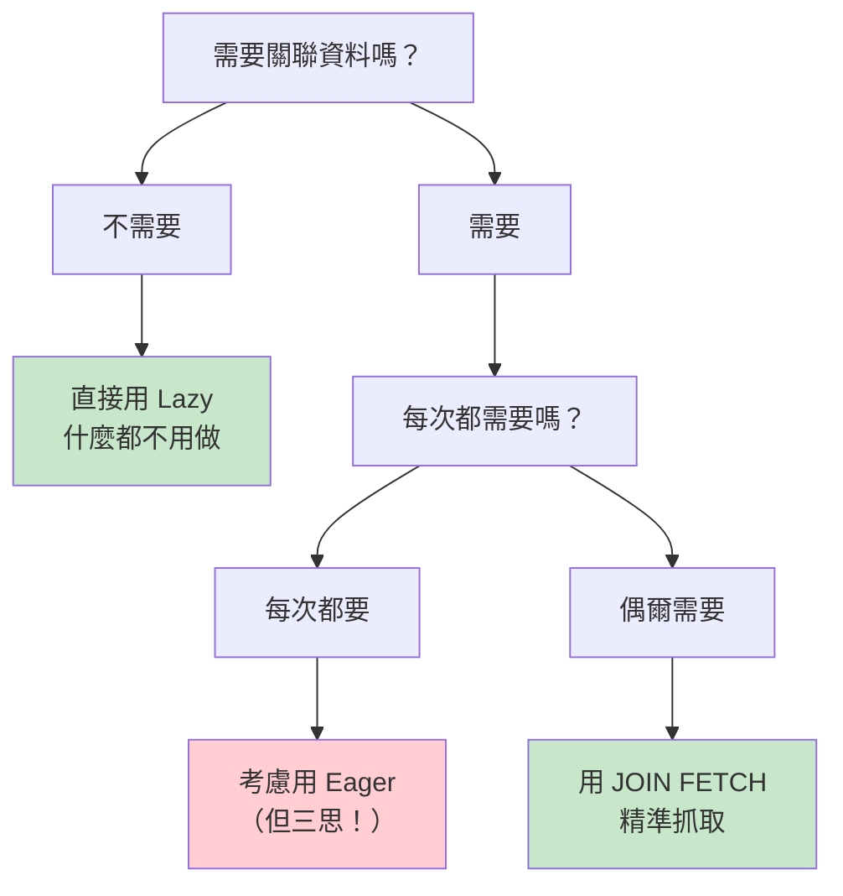

# Lazy vs Eager：載入時機的對決

> 📝 TL;DR：**Lazy = 拖延症患者**（用到才載入）、**Eager = 強迫症患者**（一次全拿）。實務上建議「全 Lazy 策略」+ 需要時用 `JOIN FETCH` 精準抓取。記住：Lazy 是你的朋友，N+1 問題才是魔王！

## 前置知識

- **JPA 基礎** - Entity 與關聯映射（`@OneToMany`、`@ManyToOne`）
- **持久化上下文** - [先讀這篇](./persistence-context)

## 什麼是 Lazy / Eager Loading？

想像你去吃到飽餐廳：

| 策略      | 比喻                     | 行為                                               |
| --------- | ------------------------ | -------------------------------------------------- |
| **Eager** | 一進門就把所有菜都端上桌 | 查主表時，**立刻** 把關聯資料一起載入              |
| **Lazy**  | 想吃什麼再去夾           | 查主表時 **不載入** 關聯資料，等你真的存取時才去抓 |

### JPA 預設行為

```java
@ManyToOne   // 預設 Eager 😱
@OneToOne    // 預設 Eager 😱
@OneToMany   // 預設 Lazy ✅
@ManyToMany  // 預設 Lazy ✅
```

:::danger 🚨 預設陷阱
`@ManyToOne` 和 `@OneToOne` 預設是 **Eager**！這代表每次查詢都會順便把關聯資料一起撈出來，即使你根本不需要它們。
:::

## 問題來了：N+1 大魔王

### 什麼是 N+1 問題？

假設你有一個部落格系統：

```java
@Entity
public class Post {
    @ManyToOne  // 預設 Eager！
    private Author author;
}
```

當你查詢 10 篇文章時：

```java
List<Post> posts = postRepository.findAll();
```

**實際發出的 SQL：**
```sql
-- 第 1 次：查所有文章
SELECT * FROM post;

-- 接下來 10 次：每篇文章各查一次作者（因為 Eager）
SELECT * FROM author WHERE id = 1;
SELECT * FROM author WHERE id = 2;
SELECT * FROM author WHERE id = 3;
...
SELECT * FROM author WHERE id = 10;
```

**總共 11 次查詢！** 這就是 N+1 問題（1 次主查詢 + N 次關聯查詢）。

如果有 1000 筆資料呢？恭喜你，1001 次查詢，~~資料庫表示：「我先去休息一下...」~~

### N+1 的可怕之處

| 文章數量 | 查詢次數 | 效能影響         |
| -------- | -------- | ---------------- |
| 10       | 11       | 還行             |
| 100      | 101      | 開始卡了         |
| 1000     | 1001     | 資料庫：「告辭」 |

## 解決方法

### 1. 全 Lazy 策略

**手動把所有關聯都改成 Lazy：**

```java
@Entity
public class Post {
    
    @ManyToOne(fetch = FetchType.LAZY)  // 覆蓋預設的 Eager
    @JoinColumn(name = "author_id")
    private Author author;
    
    @OneToOne(fetch = FetchType.LAZY)   // 覆蓋預設的 Eager
    private PostDetail detail;
}
```

:::tip 💡 專業心法
在專業的 Spring Boot 開發中，我們通常採取「**全 Lazy 策略**」：
- 所有 `@ManyToOne` 和 `@OneToOne` 都加上 `fetch = FetchType.LAZY`
- 需要關聯資料時，再用 `JOIN FETCH` 精準抓取
:::

### 2. JOIN FETCH：精準抓取

當確定需要關聯資料時，用 `JOIN FETCH` 一次撈完：

```java
@Query("SELECT p FROM Post p JOIN FETCH p.author WHERE p.id = :id")
Optional<Post> findByIdWithAuthor(@Param("id") Long id);
```

**只發出 1 次 SQL：**
```sql
SELECT p.*, a.* 
FROM post p 
JOIN author a ON p.author_id = a.id 
WHERE p.id = ?;
```

### 3. EntityGraph（進階技巧）

```java
@EntityGraph(attributePaths = {"author", "comments"})
@Query("SELECT p FROM Post p WHERE p.id = :id")
Optional<Post> findByIdWithDetails(@Param("id") Long id);
```

## Lazy 載入的陷阱：LazyInitializationException

### 什麼時候會發生？

當你在 **持久化上下文關閉後** 嘗試存取 Lazy 屬性：

```java
@GetMapping("/posts/{id}")
public PostDTO getPost(@PathVariable Long id) {
    Post post = postService.findById(id);  // 事務在這裡結束
    
    // LazyInitializationException！
    // 因為 Session 已經關閉，無法再去資料庫抓 author
    String authorName = post.getAuthor().getName();
    
    return new PostDTO(post);
}
```

### 解決方案

**方案 1：在 Service 層就把需要的資料抓好**
```java
@Service
public class PostService {
    
    public Post findByIdWithAuthor(Long id) {
        // 在事務內用 JOIN FETCH 抓好
        return postRepository.findByIdWithAuthor(id);
    }
}
```

**方案 2：使用 DTO 投影**
```java
@Query("SELECT new com.example.dto.PostDTO(p.id, p.title, a.name) " +
       "FROM Post p JOIN p.author a WHERE p.id = :id")
PostDTO findPostDTOById(@Param("id") Long id);
```

**方案 3：開啟 OSIV（不推薦）**
```yaml
spring:
  jpa:
    open-in-view: true  # 讓 Session 活到 Controller 結束
```

:::warning ⚠️ OSIV 的問題
雖然 OSIV 可以解決 `LazyInitializationException`，但它會讓資料庫連線持有更久，在高併發情況下可能造成連線池耗盡。**專業建議：關掉它，乖乖用 JOIN FETCH。**
:::

## 實際範例

### 範例 1：部落格文章系統

```java
@Entity
public class Post {
    @Id
    @GeneratedValue(strategy = GenerationType.IDENTITY)
    private Long id;
    
    private String title;
    
    @ManyToOne(fetch = FetchType.LAZY)  // ✅ 手動 Lazy
    @JoinColumn(name = "author_id")
    private Author author;
    
    @OneToMany(mappedBy = "post", fetch = FetchType.LAZY)  // 預設就是 Lazy
    private List<Comment> comments;
}
```

```java
@Repository
public interface PostRepository extends JpaRepository<Post, Long> {
    
    // 只要文章本身
    Optional<Post> findById(Long id);
    
    // 文章 + 作者
    @Query("SELECT p FROM Post p JOIN FETCH p.author WHERE p.id = :id")
    Optional<Post> findByIdWithAuthor(@Param("id") Long id);
    
    // 文章 + 作者 + 留言（注意：集合要用 LEFT JOIN FETCH）
    @Query("SELECT DISTINCT p FROM Post p " +
           "JOIN FETCH p.author " +
           "LEFT JOIN FETCH p.comments " +
           "WHERE p.id = :id")
    Optional<Post> findByIdWithAllDetails(@Param("id") Long id);
}
```

### 範例 2：判斷何時該用什麼



## 常見問題 FAQ

### Q1：什麼時候該用 Eager？

**幾乎不用。** 除非這個關聯資料 **100% 每次都會用到**，否則 Lazy + JOIN FETCH 是更好的選擇。

### Q2：Lazy 會讓查詢變多嗎？

如果你沒處理好，會。但用 `JOIN FETCH` 就能一次搞定，反而比 Eager 更有彈性。

### Q3：集合用 JOIN FETCH 會有什麼問題？

會有 **笛卡爾積問題**。如果一篇文章有 10 則留言，結果集會變成 10 行（重複的文章資料）。所以要加 `DISTINCT`，但記得這會在記憶體中做去重，大資料量要小心。

## 最佳實踐

### ✅ 推薦做法

1. **全部預設 Lazy** - 所有 `@XxxToOne` 都加 `fetch = FetchType.LAZY`
2. **按需 Fetch** - 需要時用 `JOIN FETCH` 或 `EntityGraph`
3. **用 DTO 投影** - 只查需要的欄位，省記憶體又快

### ❌ 常見錯誤

1. **相信預設值** - `@ManyToOne` 預設 Eager 是個陷阱
2. **在迴圈裡觸發 Lazy** - 經典 N+1 問題
3. **開 OSIV 來逃避問題** - 治標不治本

## 總結

1. **Lazy 是你的朋友** - 預設 Lazy，需要時再抓
2. **N+1 是你的敵人** - 用 `JOIN FETCH` 消滅它
3. **全 Lazy 策略** - 所有 `@XxxToOne` 都設 `LAZY`
4. **精準抓取** - 根據使用場景決定要不要 `JOIN FETCH`
5. **不要依賴 OSIV** - 乖乖在 Service 層處理好資料