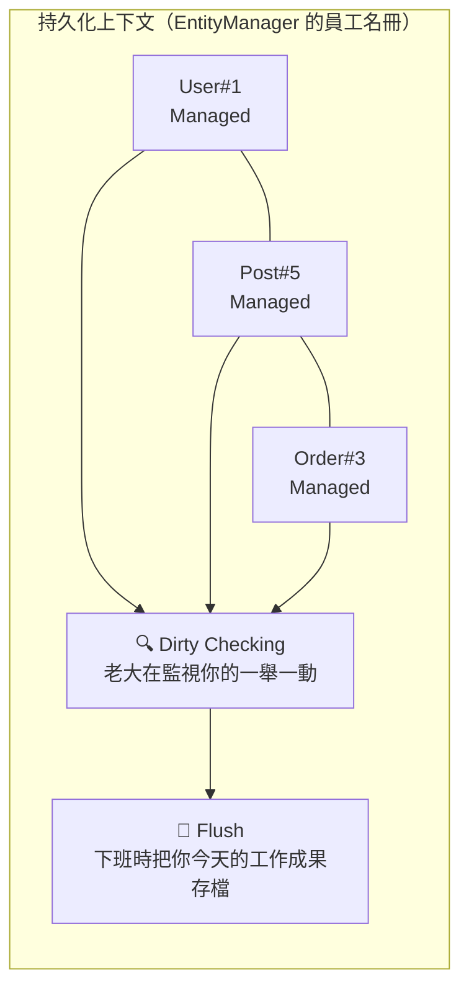
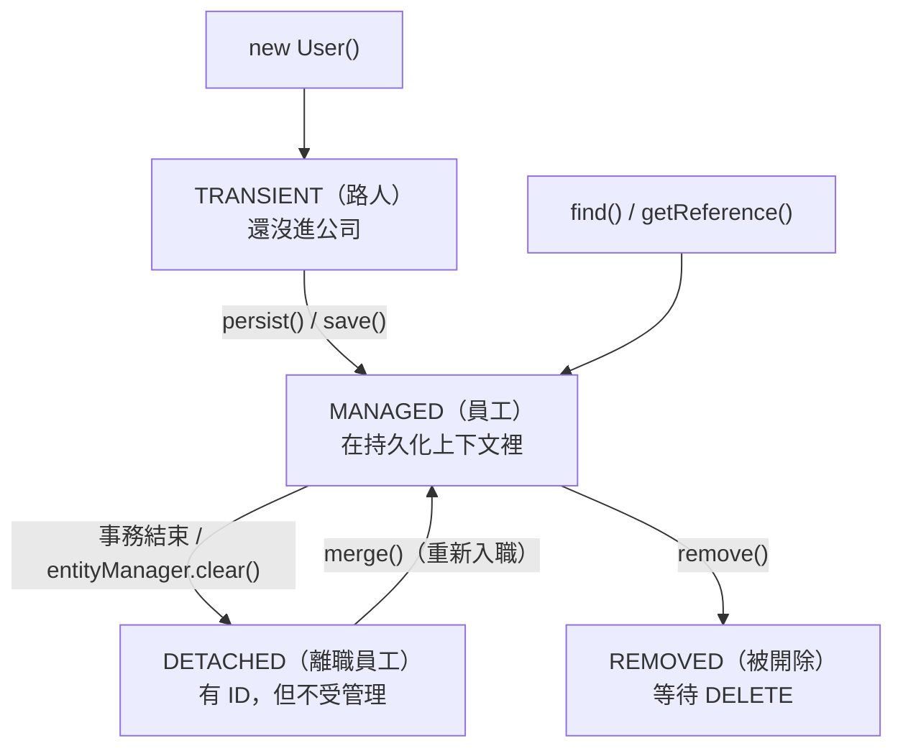

# JPA 持久化上下文：Entity 的人生四階段

> 📝 TL;DR：持久化上下文就像是**資料庫的草稿匣**——Entity 進去後會被監控，你改了什麼它都知道，事務結束時自動幫你存。記住四種狀態：**Transient（路人）→ Managed（員工）→ Detached（離職）→ Removed（被炒）**。

## 前置知識

- **JPA 基礎** - 知道 Entity 是什麼
- **資料庫基礎** - 了解 CRUD 操作

## 什麼是持久化上下文？

想像你在公司工作：

- **公司** = 持久化上下文（Persistence Context）
- **你** = Entity
- **HR 系統** = 資料庫

持久化上下文就像是**員工管理系統**——它知道誰進來了、誰的資料被改了、誰要離開了。

### 核心概念圖



## 實體的生命週期：Entity 的人生四階段

### 1. Transient（瞬時態）：路人甲

```java
User user = new User();  // 剛 new 出來
user.setName("小明");    // 還沒進公司（資料庫）
```

**特徵：**
- 剛 `new` 出來的物件
- 沒有 ID
- 跟資料庫毫無關係
- 就像還沒投履歷的求職者

### 2. Managed（持久化態）：正式員工 👔

```java
userRepository.save(user);  // 進入公司名冊
// 或者
User user = userRepository.findById(1L);  // 從公司系統撈出來
```

**特徵：**
- 在持久化上下文的「員工名冊」裡
- 有 ID
- **重點：你改什麼，HR 系統都知道（Dirty Checking）**
- 事務結束時，自動同步回資料庫

:::tip 💡 Dirty Checking 魔法
```java
@Transactional
public void updateUserName(Long id, String newName) {
    User user = userRepository.findById(id).get();  // Managed 狀態
    user.setName(newName);  // 直接改
    // 不用呼叫 save()！事務結束時會自動存
}
```

這就像是：你在公司改了自己的聯絡資料，下班時 HR 系統會自動更新，不用特別跟 HR 說。
:::

### 3. Detached（游離態）：離職員工 📦

```java
// 事務結束後...
// user 離開持久化上下文，變成 Detached
```

**特徵：**
- 曾經是員工（有 ID）
- 但已經離職（不在持久化上下文裡）
- 改了也不會自動存——你已經不是我們的人了

```java
// 離職後又想回來？
@Transactional
public void rehire(User user) {
    userRepository.save(user);  // merge 操作：重新入職
}
```

### 4. Removed（移除態）：被開除

```java
@Transactional
public void fireUser(Long id) {
    User user = userRepository.findById(id).get();
    userRepository.delete(user);  // 標記為 Removed
    // 事務結束時，從資料庫刪除
}
```

**特徵：**
- 被標記為「待刪除」
- 事務結束後，資料庫會執行 DELETE

### 生命週期轉換圖



## 開啟持久化上下文：三種方式

持久化上下文需要被「開啟」才能運作。有三種方式：

### 1. `@Transactional` 註解（最常用）

```java
@Service
public class UserService {
    
    @Transactional  // 進入這個方法就開啟持久化上下文
    public void updateUser(Long id, String name) {
        User user = userRepository.findById(id).get();
        user.setName(name);  // Dirty Checking 生效
    }  // 方法結束 → flush → commit → 上下文關閉
}
```

### 2. OSIV（Open Session In View）

```yaml
spring:
  jpa:
    open-in-view: true  # 讓 Session 活到 HTTP 請求結束
```

**優點：** Controller 也能存取 Lazy 屬性
**缺點：** 資料庫連線持有太久，高併發會炸

:::warning ⚠️ 專業建議
生產環境建議關掉 OSIV，在 Service 層用 `JOIN FETCH` 把需要的資料抓好。
:::

### 3. 全域攔截器（進階用法）

可以在 `Config.java` 裡設定 `TransactionInterceptor`，根據方法名自動決定事務行為。詳見 [@Transactional 章節](./transactional)。

## 實際範例

### 範例 1：Dirty Checking 自動更新

```java
@Service
@RequiredArgsConstructor
public class ProductService {
    
    private final ProductRepository productRepository;
    
    @Transactional
    public void applyDiscount(Long productId, int discountPercent) {
        // 1. 從資料庫撈出來 → Managed 狀態
        Product product = productRepository.findById(productId)
            .orElseThrow(() -> new EntityNotFoundException());
        
        // 2. 直接修改屬性
        BigDecimal originalPrice = product.getPrice();
        BigDecimal discount = originalPrice.multiply(
            BigDecimal.valueOf(discountPercent / 100.0)
        );
        product.setPrice(originalPrice.subtract(discount));
        
        // 3. 不用呼叫 save()！
        // 事務結束時，JPA 會自動檢測到 price 被改了
        // 發出 UPDATE product SET price = ? WHERE id = ?
    }
}
```

### 範例 2：Detached 狀態的處理

```java
@RestController
@RequiredArgsConstructor
public class UserController {
    
    private final UserService userService;
    
    @PutMapping("/users/{id}")
    public UserDTO updateUser(@PathVariable Long id, @RequestBody UserDTO dto) {
        // dto 從 JSON 反序列化來的，是 Transient 狀態
        // 但如果 dto 有 id，我們要把它當成 Detached 來處理
        return userService.updateUser(id, dto);
    }
}

@Service
@RequiredArgsConstructor
public class UserService {
    
    @Transactional
    public UserDTO updateUser(Long id, UserDTO dto) {
        // 方法 1：先查再改（推薦）
        User user = userRepository.findById(id)
            .orElseThrow(() -> new EntityNotFoundException());
        user.setName(dto.getName());
        user.setEmail(dto.getEmail());
        // Dirty Checking 自動處理
        
        return UserDTO.from(user);
    }
    
    @Transactional
    public UserDTO updateUserV2(Long id, UserDTO dto) {
        // 方法 2：直接 merge（不太推薦）
        User user = new User();
        user.setId(id);
        user.setName(dto.getName());
        user.setEmail(dto.getEmail());
        
        User merged = userRepository.save(user);  // merge 操作
        // 注意：如果 dto 沒給某個欄位，那個欄位會變成 null！
        
        return UserDTO.from(merged);
    }
}
```

## 常見問題 FAQ

### Q1：為什麼我改了 Entity 卻沒存進資料庫？

**可能原因：**
1. 沒有 `@Transactional` → 沒有持久化上下文
2. Entity 是 Detached 狀態（事務已結束）
3. 方法拋出 Exception → 事務回滾

### Q2：什麼時候會觸發 Flush？

1. 事務 `commit` 前
2. 手動呼叫 `entityManager.flush()`
3. 執行 JPQL 查詢前（確保查到最新資料）

### Q3：Detached Entity 可以直接存嗎？

可以，用 `save()` 會觸發 `merge` 操作。但要小心：如果某些欄位沒設值，會被存成 `null`！

## 最佳實踐

### ✅ 推薦做法

1. **善用 Dirty Checking** - 不用每次都呼叫 `save()`
2. **事務邊界要清楚** - 在 Service 層使用 `@Transactional`
3. **先查再改** - 避免 merge 覆蓋問題

### ❌ 常見錯誤

1. **忘了加 @Transactional** - Entity 變 Detached
2. **在 Controller 改 Entity** - 事務已結束，改了也沒用
3. **混用 find + merge** - 可能產生重複資料

## 總結

1. **持久化上下文 = 員工名冊** - 管理 Entity 的生命週期
2. **四種狀態** - Transient → Managed → Detached → Removed
3. **Dirty Checking 是魔法** - Managed 狀態的 Entity 會自動同步
4. **事務 = 上下文的邊界** - 進入事務開啟，離開事務關閉
5. **Detached 要小心處理** - 用 merge 或先查再改