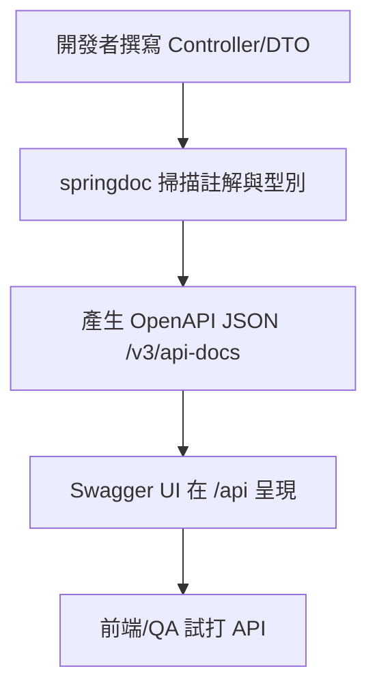
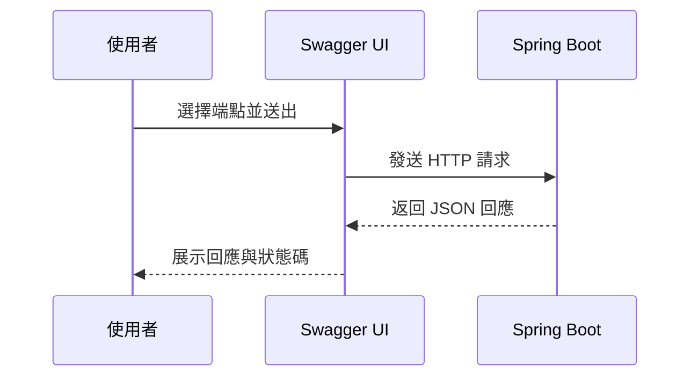

# Swagger 教學：在 Spring Boot 打造可閱讀 API 文件

> 📝 TL;DR springdoc-openapi 讓 Spring Boot 自動產生 OpenAPI 文件並提供 Swagger UI；設定 `springdoc.swagger-ui.path` 後即可於 `/api` 查看文件，搭配 DTO 驗證、`@Operation`/`@Tag` 註解與環境切換，可快速交付乾淨的 API 說明。

## 前置知識

在開始之前，建議你先了解以下概念：

- **RESTful API 基礎** - 路由設計、HTTP 動詞與狀態碼
- **Spring Boot 基本專案結構** - Controller/Service/DTO 分層
- **Maven 或 Gradle 依賴管理** - 會加入 `springdoc-openapi-starter-webmvc-ui`
- **Bean 驗證註解** - 如 `@NotBlank`, `@Positive` 讓文件顯示欄位限制

## 什麼是 Swagger/OpenAPI？

### 為什麼需要學習它？

用開發日常來比喻：
- **避免口頭對 API**：後端少打一個欄位、前端就跑錯；文件自動生成讓雙方一致。
- **減少手寫文件負擔**：程式碼與文件同源，更新控制器即可同步更新 UI。
- **方便 QA/利害關係人預覽**：Swagger UI 內建試打 API，提早發現問題。

### 核心概念

- **OpenAPI 規格**：描述 API 的標準 JSON/YAML 格式。
- **Swagger UI**：把規格渲染成可互動的網頁。
- **springdoc-openapi**：自動掃描 Spring MVC Controller 產生 OpenAPI 文件，預設路徑 `/v3/api-docs`，UI 路徑可自訂。

:::warning ⚠️ 注意
Swagger 只應在內網、測試或受保護的環境開啟；正式環境記得關閉或加上驗證。
:::

## 💻 基本設定

### 依賴與 application.yml 範例

Maven/Gradle 加入 `springdoc-openapi-starter-webmvc-ui` 後，在 `application.yml` 指定 UI 路徑：

```yaml
springdoc:
  swagger-ui:
    path: /api          # UI 訪問路徑
    operations-sorter: method
    tags-sorter: alpha
    disable-swagger-default-url: true
    display-request-duration: true
  api-docs:
    enabled: true       # 若要關閉可設 false
```

### 啟動與訪問

- 啟動 Spring Boot，瀏覽 `/api` 即可看到 Swagger UI。
- 原始 OpenAPI JSON 在 `/v3/api-docs`，可供前端或 Gateway 匯入。

## 實際範例

### 範例 1：最小可用 API（書籍 CRUD）

**情境說明：** 建立書籍 CRUD，並讓欄位限制在 Swagger UI 清晰呈現。

```java
// 建立請求 DTO：驗證註解會同步出現在文件欄位說明
public class CreateBookRequest {
    @NotBlank
    private String title;

    @NotBlank
    private String author;

    @Positive
    private int year;
    // getters/setters
}

// 回應 DTO
public class BookResponse {
    private Long id;
    private String title;
    private String author;
    private int year;
    private Instant createdAt;
    // getters/setters
}

@RestController
@RequestMapping("/books")
@Tag(name = "書籍管理", description = "書籍的 CRUD 操作")
public class BookController {

    @PostMapping
    @Operation(summary = "新增書籍", description = "建立一本新書並返回詳細資訊")
    public BookResponse create(@Valid @RequestBody CreateBookRequest request) {
        // 省略：呼叫 service 儲存並回傳
        return new BookResponse();
    }

    @GetMapping("/{id}")
    @Operation(summary = "查詢書籍")
    public BookResponse get(@PathVariable Long id) {
        return new BookResponse();
    }

    @GetMapping
    @Operation(summary = "列表書籍", description = "取得所有書籍列表")
    public List<BookResponse> list() {
        return List.of();
    }
}
```

**程式碼說明：**
1. DTO 使用驗證註解，Swagger UI 會顯示欄位必填與型別。
2. `@Tag` 為 Controller 分組，`@Operation` 提供摘要與描述，排序可用 `operationId` 控制。
3. 不加註解也會生成文件，但適度補充能提升可讀性。

### 範例 2：加入全域 OpenAPI 設定與 JWT 安全性

```java
@Configuration
public class OpenApiConfig {
    @Bean
    public OpenAPI customOpenAPI() {
        return new OpenAPI()
            .info(new Info()
                .title("圖書管理系統 API")
                .version("1.0.0")
                .description("完整的圖書與作者管理 RESTful API")
                .contact(new Contact().name("開發團隊").email("dev@example.com")))
            .addSecurityItem(new SecurityRequirement().addList("Bearer Authentication"))
            .components(new Components().addSecuritySchemes(
                "Bearer Authentication",
                new SecurityScheme()
                    .type(SecurityScheme.Type.HTTP)
                    .scheme("bearer")
                    .bearerFormat("JWT")));
    }
}
```

**重點：**
- `info` 提供標題、版本、描述與聯絡資訊。
- `components` 定義 JWT 安全方案；若前端在 UI 上勾選 Authorize，會自動帶入 Header。

## 視覺化說明

### 文件產生流程



### 請求展示流程



:::tip 視覺化工具
想快速驗證圖表語法，可用 Mermaid Live Editor 或 VS Code Mermaid 外掛預覽。
:::

## 實戰練習

### 練習 1：設定 UI 路徑（簡單）⭐

**任務：** 將 Swagger UI 路徑改為 `/docs/api` 並啟用請求耗時顯示。

**提示：** 修改 `springdoc.swagger-ui.path` 與 `display-request-duration`。

:::details 參考答案
```yaml
springdoc:
  swagger-ui:
    path: /docs/api
    display-request-duration: true
```
:::

### 練習 2：補充欄位描述（簡單）⭐

**任務：** 在 `CreateBookRequest` 中為 `year` 欄位加入描述與範例，使 Swagger UI 顯示清楚。

**思考方向：** 使用 `@Schema(description = "出版年份", example = "2024")`。

:::details 參考答案
```java
public class CreateBookRequest {
    @Schema(description = "書名", example = "Clean Code")
    @NotBlank
    private String title;

    @Schema(description = "作者", example = "Robert C. Martin")
    @NotBlank
    private String author;

    @Schema(description = "出版年份", example = "2024")
    @Positive
    private int year;
}
```
:::

### 練習 3：分組與環境切換（中等）⭐⭐

**任務：**
1. 依據路徑將公開 API `/api/public/**` 與後台 `/api/admin/**` 分成兩組。
2. 在生產環境關閉 Swagger。

**提示：** 使用 `springdoc.group-configs`，並在 `application-prod.yml` 關閉 `swagger-ui` 與 `api-docs`。

:::details 參考答案與解題思路

**解題思路：**
- 利用 group-configs 產生多份文件，方便權限控管。
- 透過 profile 覆寫設定，避免正式環境曝光。

**參考設定：**
```yaml
# application.yml
springdoc:
  group-configs:
    - group: public
      paths-to-match: /api/public/**
    - group: admin
      paths-to-match: /api/admin/**
  swagger-ui:
    path: /api

# application-prod.yml
springdoc:
  swagger-ui:
    enabled: false
  api-docs:
    enabled: false
```
:::

## 常見問題 FAQ

### Q1: Swagger UI 404？
**A:** 確認 `springdoc.swagger-ui.path` 是否與實際訪問路徑一致，若有設定 `server.servlet.context-path`，路徑需附加上去。

### Q2: DTO 欄位沒顯示？
**A:** 檢查 getter/setter 是否存在，或是否被 `@JsonIgnore` 隱藏；同時確認 class 未被視為內部類（可改為 public static）。

### Q3: 想隱藏特定端點？
**A:** 在方法或類別上加 `@Hidden`，或使用路徑分組避免公開。

### Q4: 需要排序端點？
**A:** 在 `@Operation` 設定 `operationId`，或在 `application.yml` 使用 `operations-sorter` 與 `tags-sorter`。

### Q5: 如何支援多語系文件？
**A:** 以多份 `group-configs` 搭配不同描述，或在 CI 產生多份 spec 檔交給前端切換；springdoc 本身不處理 UI i18n，需要自訂 Swagger UI。

## 最佳實踐

### ✅ 推薦做法

1. **加上摘要與描述** - `@Operation(summary, description)` 讓讀者不用猜端點用途。
2. **善用驗證註解** - 必填、格式限制會自動出現在文件，降低溝通成本。
3. **分組管理** - 公開/後台路由分組，避免把後台端點暴露給不該看的使用者。
4. **環境保護** - 生產環境關閉 Swagger UI 或加上 IP/認證保護。

### ❌ 常見錯誤

1. **開放 Swagger 於公網** - 可能洩露內部端點；務必關閉或加權限。
2. **忽略 DTO 驗證** - 文件缺欄位限制，前後端易出現格式錯誤。
3. **缺乏版本資訊** - 忘記更新 `info.version`，難以追蹤 API 變動。

## 延伸閱讀

### 相關文章

本站相關主題：
- [java/basic/install-java.md](../basic/install-java.md) - 快速建立 Java 開發環境
- [java/basic/HashSetTreeSet.md](../basic/HashSetTreeSet.md) - 資料結構入門

### 推薦資源

外部優質資源：
- [springdoc 官方文件](https://springdoc.org/) - 設定與註解完整說明
- [OpenAPI Specification](https://swagger.io/specification/) - 了解規格本身
- [Swagger UI Options](https://swagger.io/docs/open-source-tools/swagger-ui/usage/configuration/) - UI 客製化參數

### 下一步學習

- 若需要自動產生 TypeScript 型別，可研究 swagger-codegen 或 openapi-generator。
- 想把文件部署到 API Gateway，可將 `/v3/api-docs` 匯入並啟用 Mock/驗證。
- 需要 GraphQL 文件化？探索 GraphQL Playground 或 Voyager。

## 總結

1. **快速啟用** - 安裝 `springdoc-openapi-starter-webmvc-ui`，設定 UI 路徑即可使用。
2. **文件即程式** - DTO 驗證與註解自動反映到 Swagger UI，保持同步。
3. **安全控管** - 以 profile 關閉/啟用 Swagger，並設定 JWT 安全方案。
4. **提升協作** - 透過分組、排序與可互動的 UI，讓前端與 QA 更快理解 API。