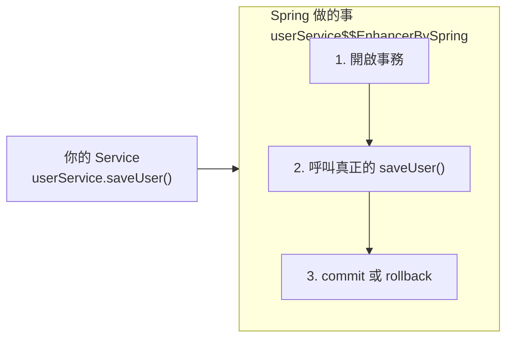

# @Transactional 事務管理

> 📝 TL;DR：`@Transactional` 就像是資料庫界的「婚禮主持人」——它宣布開始、見證過程、確保雙方（程式與資料庫）要嘛一起幸福，要嘛一起回到單身狀態。記住：**方法命名決定你的命運**！

## 前置知識

- **JPA 基礎** - 了解 Entity 與 EntityManager
- **Spring AOP** - 知道什麼是代理模式
- **持久化上下文** - [先讀這篇](./persistence-context)

## @Transactional 是什麼？

想像你去銀行轉帳：

1. 銀行開門（開啟事務）
2. 從 A 帳戶扣錢
3. 往 B 帳戶加錢
4. 銀行說「OK，交易完成！」（Commit）

但如果第 3 步驟失敗了呢？總不能錢憑空消失吧！這時候銀行會說：「當作沒發生過」（Rollback），把錢還給 A。

**`@Transactional` 就是那個確保「要嘛全做，要嘛全不做」的銀行經理。**

### 它的三大職責

| 職責     | 說明                             | 比喻                        |
| -------- | -------------------------------- | --------------------------- |
| 開啟合約 | 方法開始時確保有 `EntityManager` | 婚禮開場白                  |
| 定義行為 | 告訴資料庫「這是不可分割的業務」 | 「你願意嗎？」              |
| 觸發回滾 | 出錯時通知資料庫回滾             | 「我反對！」→ 婚禮取消      |
| 強制同步 | 方法正常結束時觸發 `flush()`     | 「我宣布你們...」→ 蓋章生效 |

:::warning ⚠️ 最重要的一點
當 `@Transactional` 方法正常結束時，Spring 會執行 `commit`，**強制觸發一次 `flush()`**。這就是為什麼你改了 Entity 卻沒呼叫 `save()`，資料還是會存進去的原因！
:::

## 事務全域攔截器：命名即命運

在 `modules/.../databaseconfig/Config.java` 的 `transactionInterceptor` 裡，定義了兩套「合約」：

### 第一種：寫入合約 `requiredAttribute`

```java
// 這些方法名開頭會自動獲得事務保護
add*, save*, create*, update*, delete*
```

| 設定     | 值                         | 白話文                                 |
| -------- | -------------------------- | -------------------------------------- |
| 行為     | `PROPAGATION_REQUIRED`     | 「必須有事務！沒有就開一個，有就加入」 |
| 錯誤處理 | 遇 `RuntimeException` 回滾 | 「出事了？當作沒發生過」               |

### 第二種：唯讀合約 `readOnlyTransactionAttributes`

```java
// 這些方法名開頭只能讀不能寫
find*, get*, search*, getCount*, *（其他所有）
```

| 設定 | 值                          | 白話文                       |
| ---- | --------------------------- | ---------------------------- |
| 行為 | `PROPAGATION_NOT_SUPPORTED` | 「不需要事務，我只是來看看」 |
| 唯讀 | `setReadOnly(true)`         | 「我發誓只看不摸」           |

:::tip 💡 為什麼要這樣設計？

**為什麼 `readOnly`？** 
效能優化！唯讀模式讓資料庫不做鎖定，Hibernate 也省去 Dirty Checking 的功夫。就像圖書館的「僅供閱覽」區——不用擔心書被偷走，管理輕鬆很多。

**為什麼 `NOT_SUPPORTED`？**
避免查詢操作意外開啟不必要的事務，節省資料庫資源。畢竟只是來翻翻書，何必簽借書證呢？
:::

:::danger 🚨 命名陷阱
方法命名 **決定** 你有沒有事務保護！

```java
// ✅ 有事務保護
public void saveUser() { ... }
public void updateOrder() { ... }

// ❌ 沒有事務保護（即使你加了 @Transactional）
public void processUser() { ... }  // 不符合命名規則
public void handleOrder() { ... }  // 會被 * 攔截成唯讀
```

就算你在方法上手動打 `@Transactional`，攔截器的優先級更高，還是會被當成唯讀處理！
:::

## AOP 代理：幕後功臣 🎬

Spring 不是直接在你的程式碼裡插入交易邏輯，而是透過 **AOP（Aspect Oriented Programming）** 建立一個「替身演員」——代理物件。



### 代理的工作流程

1. **開門營業** - 透過 `TransactionManager` 開啟資料庫連線
2. **請君入甕** - 呼叫你原本的方法內容
3. **結帳走人** - 方法結束後決定要 `commit`（觸發 Flush）還是 `rollback`

## 實際範例

### 範例 1：基礎事務

```java
@Service
public class OrderService {
    
    @Autowired
    private OrderRepository orderRepository;
    
    // ✅ 方法名以 save 開頭，自動有事務
    public void saveOrder(Order order) {
        orderRepository.save(order);
        // 如果這裡拋出 RuntimeException
        // 整個操作會回滾，order 不會存進資料庫
    }
}
```

### 範例 2：事務傳播的陷阱

```java
@Service
public class UserService {
    
    // 🚨 這個方法不會有獨立事務！
    public void processAndSave(User user) {
        validateUser(user);     // 驗證
        saveUser(user);         // 你以為這裡有事務...
    }
    
    // 即使這裡有事務，從同一個類別內部呼叫也不會生效
    public void saveUser(User user) {
        userRepository.save(user);
    }
}
```

:::warning ⚠️ 自我呼叫陷阱
同一個類別內的方法互相呼叫，**不會觸發 AOP 代理**！因為你呼叫的是 `this.saveUser()`，不是代理物件的方法。

**解法：**
1. 把方法拆到不同的 Service
2. 注入自己 `@Autowired private UserService self;` 然後用 `self.saveUser()`
:::

## 常見問題 FAQ

### Q1：為什麼我的 @Transactional 沒生效？

**可能原因：**
1. 方法命名不符合攔截器規則
2. 從同一個類別內部呼叫（自我呼叫陷阱）
3. 方法不是 `public` 的
4. 拋出的是 Checked Exception（預設只回滾 RuntimeException）

### Q2：@Transactional 可以加在 private 方法上嗎？

不行！AOP 代理只能攔截 `public` 方法。private 方法就像是你的內心戲，外界（代理）看不到也管不著。

### Q3：事務內的查詢會鎖表嗎？

看你的隔離級別和資料庫設定。但如果用 `readOnly=true`，資料庫通常會用更輕量的鎖或根本不鎖。

## 最佳實踐

### ✅ 推薦做法

1. **遵守命名規則** - `save*`、`update*`、`delete*` 開頭
2. **保持方法簡短** - 事務持有時間越短越好
3. **只在 Service 層使用** - Controller 和 Repository 不要加

### ❌ 常見錯誤

1. **事務方法太長** - 鎖住資源太久，其他請求會排隊
2. **在迴圈裡開事務** - 每次迭代都開關事務，效能爆炸
3. **混用不同資料源** - 跨資料庫事務需要分散式事務（那是另一個故事了...）

## 總結

1. **`@Transactional` 是事務的生命週期管理者** - 開啟、監控、提交或回滾
2. **命名決定命運** - 攔截器會根據方法名決定事務行為
3. **小心自我呼叫陷阱** - 同類別內部呼叫不會觸發代理
4. **唯讀優化很重要** - 查詢方法記得用 `find*`、`get*` 開頭
5. **AOP 代理是幕後功臣** - 理解它才能避免踩坑