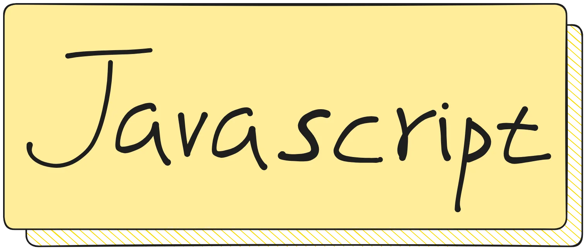

# Javascript Day7 函數 Function

## 什麼是函數？

函數（Function）是一段**可以重複使用的程式碼區塊**。把它想像成一台機器：放進原料（參數），經過處理，產出成品（回傳值）。

```javascript
// 定義一個函數
function greet() {
    console.log('你好！')
}

// 呼叫函數
greet()  // 你好！
```

## 宣告函數

### 函數宣告（Function Declaration）

```javascript
function add(a, b) {
    return a + b
}

console.log(add(3, 5))  // 8
```

### 函數表達式（Function Expression）

```javascript
const subtract = function(a, b) {
    return a - b
}

console.log(subtract(10, 4))  // 6
```

### 箭頭函數（Arrow Function）

```javascript
const multiply = (a, b) => a * b

console.log(multiply(3, 5))  // 15
```

## 參數

### 基本參數

```javascript
function introduce(name, age) {
    console.log(`我叫 ${name}，今年 ${age} 歲`)
}

introduce('Lucas', 20)  // '我叫 Lucas，今年 20 歲'
```

### 預設參數

```javascript
function greet(name = '訪客') {
    console.log(`你好，${name}！`)
}

greet('Lucas')  // '你好，Lucas！'
greet()         // '你好，訪客！'
```

### 不定參數（Rest Parameters）

```javascript
function sum(...numbers) {
    return numbers.reduce((acc, cur) => acc + cur, 0)
}

console.log(sum(1, 2, 3))       // 6
console.log(sum(1, 2, 3, 4, 5)) // 15
```

## 回傳值

### 基本回傳

```javascript
function add(a, b) {
    return a + b  // 使用 return 回傳值
}

let result = add(3, 5)
console.log(result)  // 8
```

### 提前回傳

```javascript
function checkAge(age) {
    if (age < 0) {
        return '年齡不能為負數'  // 提前回傳
    }
    if (age < 18) {
        return '未成年'
    }
    return '成年'
}

console.log(checkAge(-5))  // '年齡不能為負數'
console.log(checkAge(15))  // '未成年'
console.log(checkAge(25))  // '成年'
```

:::warning ⚠️ 注意
`return` 會**結束函數執行**。`return` 後面的程式碼不會被執行。
:::

## 箭頭函數

箭頭函數是 ES6 引入的簡寫語法。

```javascript
// 傳統寫法
function double(n) {
    return n * 2
}

// 箭頭函數
const double = (n) => n * 2

// 只有一個參數時，括號可以省略
const double = n => n * 2

// 多行函數，需要大括號和 return
const calculate = (a, b) => {
    let sum = a + b
    let product = a * b
    return { sum, product }
}
```

### 箭頭函數 vs 傳統函數

| 特性 | 傳統函數 | 箭頭函數 |
| --- | --- | --- |
| `this` 綁定 | 有自己的 `this` | 繼承外層的 `this` |
| 用於物件方法 | ✅ 推薦 | ❌ 不建議 |
| 用於陣列方法 | ✅ 可以 | ✅ 推薦 |
| 建構函式 | ✅ 可以 | ❌ 不可以 |

```javascript
// 箭頭函數的 this 是詞法綁定
let person = {
    name: 'Lucas',
    // ❌ 不要用箭頭函數
    greetWrong: () => {
        console.log(this.name)  // undefined（this 指向外層）
    },
    // ✅ 用傳統函數
    greetRight() {
        console.log(this.name)  // 'Lucas'
    }
}
```

## 作用域（Scope）

作用域決定了變數可以在哪裡被存取。

### 全域作用域

```javascript
let globalVar = '我是全域變數'

function test() {
    console.log(globalVar)  // 可以存取
}

test()
console.log(globalVar)  // 可以存取
```

### 區域作用域（函數作用域）

```javascript
function test() {
    let localVar = '我是區域變數'
    console.log(localVar)  // 可以存取
}

test()
console.log(localVar)  // ❌ 錯誤！localVar is not defined
```

### 區塊作用域（let / const）

```javascript
if (true) {
    let blockVar = '我是區塊變數'
    const blockConst = '我是區塊常數'
}

console.log(blockVar)   // ❌ 錯誤！
console.log(blockConst) // ❌ 錯誤！
```

:::tip 建議
全部使用 `let` 和 `const`，避免使用 `var`。`var` 的作用域規則較混亂，容易出錯。
:::

## 函數作為參數（Callback）

函數可以當作另一個函數的參數傳入。

```javascript
function doMath(a, b, operation) {
    return operation(a, b)
}

function add(x, y) { return x + y }
function subtract(x, y) { return x - y }

console.log(doMath(5, 3, add))       // 8
console.log(doMath(5, 3, subtract))  // 2
```

### 常見的 Callback 用法

```javascript
let numbers = [1, 2, 3, 4, 5]

// map 接收一個函數
let doubled = numbers.map(n => n * 2)

// filter 接收一個函數
let evens = numbers.filter(n => n % 2 === 0)

// forEach 接收一個函數
numbers.forEach(n => console.log(n))
```

## 立即執行函數（IIFE）

定義後**立即執行**的函數，不需要呼叫。

```javascript
(function() {
    console.log('我會立即執行！')
})()

// 帶參數的 IIFE
(function(name) {
    console.log(`你好，${name}！`)
})('Lucas')
```

## 閉包（Closure）基礎

函數可以**記住**它被建立時的環境。

```javascript
function createCounter() {
    let count = 0  // 這個變數被「關」在函數裡

    return {
        increment() { count++ },
        decrement() { count-- },
        getCount() { return count }
    }
}

let counter = createCounter()
counter.increment()
counter.increment()
console.log(counter.getCount())  // 2
```

## 牛刀小試

1. 寫一個函數 `isEven(n)`，回傳 `true` 如果 n 是偶數，否則回傳 `false`

2. 寫一個函數 `factorial(n)`，計算 n 的階乘（n!）

3. 寫一個函數 `capitalize(str)`，將字串的第一個字母轉成大寫

4. 用箭頭函數寫一個函數 `max(arr)`，回傳陣列中的最大值

5. 解釋以下程式碼的輸出結果，為什麼？
```javascript
for (var i = 0; i < 3; i++) {
    setTimeout(() => console.log(i), 100)
}
```

:::details 看答案

**Q1**
```javascript
function isEven(n) {
    return n % 2 === 0
}

console.log(isEven(4))  // true
console.log(isEven(7))  // false
```

**Q2**
```javascript
function factorial(n) {
    if (n <= 1) return 1
    return n * factorial(n - 1)
}

console.log(factorial(5))  // 120
console.log(factorial(0))  // 1
```

**Q3**
```javascript
function capitalize(str) {
    if (str.length === 0) return str
    return str[0].toUpperCase() + str.slice(1)
}

console.log(capitalize('hello'))  // 'Hello'
console.log(capitalize(''))       // ''
```

**Q4**
```javascript
const max = (arr) => Math.max(...arr)

console.log(max([1, 5, 3, 9, 2]))  // 9
```

**Q5**
輸出 `3, 3, 3`。因為 `var` 是函數作用域，迴圈結束後 `i` 變成 3，而 `setTimeout` 的回呼函數在迴圈結束後才執行，此時 `i` 已經是 3。

如果改成 `let`，就會輸出 `0, 1, 2`，因為 `let` 是區塊作用域，每次迴圈都會建立新的 `i`。
:::
