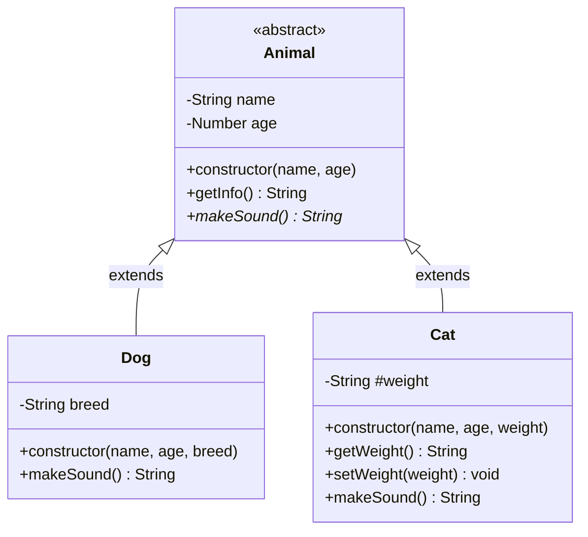

# 物件導向 OOP 以 JavaScript 為例

## TL;DR
- OOP 四大支柱：封裝（隱藏實作）、繼承（extends）、多型（同名方法不同行為）、抽象（模板類別）。
- JavaScript 實作：class + constructor + private fields (#) + super() + extends。
- 實務：Animal 抽象類 → Dog/Cat 繼承 → makeSound() 多型 → #weight 封裝。

## 前置知識
- class 語法與 constructor
- this 關鍵字綁定
- 繼承與原型鏈基礎

## 創建 Class

```js:line-numbers
// 宣告類別
class Animal {
  constructor(name, age) {
    this.name = name;
    this.age = age;
  }

  getInfo() {
    return `Name: ${this.name}, Age: ${this.age}`;
  }
}
```

## 使用 Class

使用`new`關鍵字並傳入建立的動物對象的給定名稱和年齡。有一個 getInfo 方法，用於傳回有關物件的信息

```js:line-numbers
// 使用類別
const firstAnimal = new Animal("Rex", 2);
console.log(firstAnimal);               // Animal { name: 'Rex', age: 2 }
console.log(firstAnimal.getInfo());     // Name: Rex, Age: 2

const secondAnimal = new Animal("Barney", 5);
console.log(secondAnimal);              // Animal { name: 'Barney', age: 5 }
console.log(secondAnimal.getInfo());    // Name: Barney, Age: 5
```

## 繼承

繼承是類別的一種功能，它使一些類別能夠獲取另一個類別(父類別)的所有方法和屬性，並可以透過添加更多內容來擴展父類。

```js:line-numbers{2,13,20,24}
// 宣告類別
class Dog extends Animal {
  constructor(name, age, breed) {
    super(name, age);
    this.breed = breed;
  }

  bark() {
    return "woof";
  }
}

class Cat extends Animal {
  constructor(name, age, weight) {
    super(name, age);
    this.weight = weight
  }
}

// 使用類別
const myDog = new Dog("Buddy", 2, "Golden Retriever");
console.log(myDog.getInfo());         // Name: Buddy, Age: 2
console.log(myDog.bark());            // woof

const myCat = new Cat("Fluffy", 3, "5kg");
console.log(myCat.getInfo());         // Name: Fluffy, Age: 3
```

## 封裝

封裝是一種限制機制，使得訪問不使用特殊方法不可能獲得的數據致力於此。在下面的例子中我們標記了權重作為私有財產，為了獲取和設定一個值，我們需要使用 getter 和 setter 方法

```js:line-numbers{3,6,9,13}
// 宣告類別
class Cat extends Animal {
  #weight;                  // ------------> 創造私有值 // [!code ++]
  constructor(name, age, weight) {
    super(name, age);
    this.#weight = weight;// [!code ++]
    this.weight = weight;// [!code --]
  }

  getWeight() {             // ------------> getter // [!code ++]
    return this.#weight;// [!code ++]
  }// [!code ++]

  setWeight(weight) {       // ------------> setter// [!code ++]
    this.#weight = weight;// [!code ++]
  }// [!code ++]
}

// 使用類別
const myCat = new Cat("Fluffy", 3, "5kg");
console.log(myCat.getWeight());         // 5kg
myCat.setWeight("6kg");
console.log(myCat.getWeight());         // 6kg
```

## 多型

多型性是利用繼承來重複使用的概念，根據類別的不同，多次使用不同行為的方法類型。

為了理解這一點，讓我們來看看我們的例子——在狗類中我們將刪除`bark()`方法，並在動物類中添加一個`makeSound`方法將被貓和狗類覆蓋

```js:line-numbers
// 宣告類別
class Animal {
  constructor(name, age) {
    this.name = name;
    this.age = age;
  }

  makeSound() {// [!code ++]
    return "Some nice sound made";// [!code ++]
  }// [!code ++]
}

class Dog extends Animal {
  constructor(name, age, breed) {
    super(name, age);
    this.breed = breed;
  }

  makeSound() {// [!code ++]
    return "woof";// [!code ++]
  }// [!code ++]
}

class Cat extends Animal {
  constructor(name, age, weight) {
    super(name, age);
    this.weight = weight;
  }

  makeSound() {// [!code ++]
    return "meow";// [!code ++]
  }// [!code ++]
}

// 使用類別
const myDog = new Dog("Buddy", 2, "Golden Retriever");
console.log(myDog.makeSound());         // woof // [!code ++]

const myCat = new Cat("Fluffy", 3, "5kg");
console.log(myCat.makeSound());         // meow // [!code ++]
```

## 抽象類別

抽象類別是不能被實例化的類，需要從特定繼承的子類，抽象類別提供實作。

我們將`Animal`類別變更為抽象類別。它不會可以再建立此類別的實例將`makeSound`標記為抽象方法 - 為了使用它，子類別必須聲明該方法自己的實現

簡單來說，變成抽象後就不能`new Animal`了，要用`Cat`去繼承`Animal`。

```js:line-numbers
class Animal {
  constructor(name, age) {
    this.name = name;
    this.age = age;
    if (this.constructor === Animal) { // [!code ++]
      throw new Error("無法建立抽象類別的實例"); // [!code ++]
    } // [!code ++]
  }

  makeSound() {
    throw new Error("必須實作 makeSound 方法"); // [!code ++]
    return "Some nice sound made";// [!code --]
  }
}

class Dog extends Animal {
  constructor(name, age, breed) {
    super(name, age);
    this.breed = breed;
  }

  makeSound() {
    return "woof";
  }
}

class Cat extends Animal {
  constructor(name, age, weight) {
    super(name, age);
    this.weight = weight;
  }

  //   makeSound() { // [!code ++]
  //     return "meow"; // [!code ++]
  //   } // [!code ++]
  makeSound() { // [!code --]
    return "meow"; // [!code --]
  } // [!code --]
}

// const firstAnimal = new Animal("Rex", 2); // Error: 無法建立抽象類別的實例 // [!code error]
const myDog = new Dog("Buddy", 2, "Golden Retriever");
const myCat = new Cat("Fluffy", 3, "5kg");
// console.log(myCat.makeSound()); // Error: 必須實作 makeSound 方法 // [!code error]
```

## 類別圖



## 實戰練習

### 練習 1：創建 Vehicle 類別（簡單）⭐
> 建立 Vehicle 類別（brand, model）與 getDetails() 方法，再建立 Car 子類別（doors）。

:::details 💡 參考答案
```javascript
class Vehicle {
  constructor(brand, model) {
    this.brand = brand
    this.model = model
  }
  getDetails() {
    return `${this.brand} ${this.model}`
  }
}

class Car extends Vehicle {
  constructor(brand, model, doors) {
    super(brand, model)
    this.doors = doors
  }
}

const myCar = new Car('Toyota', 'Corolla', 4)
console.log(myCar.getDetails()) // Toyota Corolla
```
:::

### 練習 2：Private field 封裝（簡單）⭐
> 為 BankAccount 類別建立私有的 #balance，用 deposit() 和 getBalance() 操作。

:::details 💡 參考答案
```javascript
class BankAccount {
  #balance = 0
  
  deposit(amount) {
    this.#balance += amount
  }
  
  getBalance() {
    return this.#balance
  }
}

const account = new BankAccount()
account.deposit(1000)
console.log(account.getBalance()) // 1000
```
:::

### 練習 3：多型與抽象（中等）⭐⭐
> 建立 Shape 抽象類別（calculateArea），再實作 Circle 與 Rectangle 子類別。

:::details 💡 參考答案與提示
```javascript
class Shape {
  constructor() {
    if (this.constructor === Shape) {
      throw new Error('無法實例化抽象類別')
    }
  }
  calculateArea() {
    throw new Error('必須實作 calculateArea')
  }
}

class Circle extends Shape {
  constructor(radius) {
    super()
    this.radius = radius
  }
  calculateArea() {
    return Math.PI * this.radius ** 2
  }
}

class Rectangle extends Shape {
  constructor(width, height) {
    super()
    this.width = width
    this.height = height
  }
  calculateArea() {
    return this.width * this.height
  }
}

const circle = new Circle(5)
const rect = new Rectangle(4, 6)
console.log(circle.calculateArea())  // 78.54
console.log(rect.calculateArea())    // 24
```
:::

## 延伸閱讀
- [MDN: Classes](https://developer.mozilla.org/en-US/docs/Web/JavaScript/Reference/Classes)
- [JavaScript.info: Class patterns](https://javascript.info/class-patterns)
- [SOLID principles in JavaScript](https://blog.bitsrc.io/solid-principles-in-javascript-276c72421805)

## FAQ
- Q: private field (#) 與 closure 差在哪？
  - A: # 是語言級別的私有，closure 是作用域封閉；# 可在類別方法間共享，closure 不行。
- Q: 為何要抽象類別？
  - A: 強制子類別實作特定方法，確保介面一致性；避免實例化模板類別。
- Q: 多型的實際用途？
  - A: 統一介面、不同實作；如 Array/NodeList 都有 forEach，但內部行為不同。
